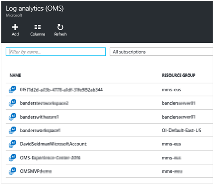
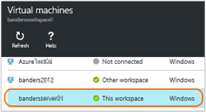

<properties
	pageTitle="Connect Azure virtual machines to Log Analytics  | Microsoft Azure"
	description="For Windows and Linux virtual machines running in Azure, the recommended way of collected logs and metrics is by installing the Log Analytics Azure VM extension. You can use the Azure portal or PowerShell to install the Log Analytics virtual machine extension onto Azure VMs."
	services="log-analytics"
	documentationCenter=""
	authors="richrundmsft"
	manager="jochan"
	editor=""/>

<tags
	ms.service="log-analytics"
	ms.workload="na"
	ms.tgt_pltfrm="na"
	ms.devlang="na"
	ms.topic="article"
	ms.date="05/24/2016"
	ms.author="richrund"/>

# Connect Azure virtual machines to Log Analytics

For Windows and Linux computers, the recommended way to collect logs and metrics is by installing the Log Analytics agent.

You can easily install the Log Analytics agent for Azure virtual machines by enabling the Microsoft Monitoring Agent virtual machine extension. When you use a virtual machine extension, it simplifies the installation process and automatically configures the agent to send data to the Log Analytics workspace that you specify. The agent will also be upgraded automatically, ensuring that you have the latest features and fixes.

The Microsoft Monitoring Agent is available as an [Azure virtual machine extension](../virtual-machines/virtual-machines-windows-extensions-features.md) for both Windows and Linux computers.

>[AZURE.NOTE] The [Azure VM agent](../virtual-machines/virtual-machines-windows-extensions-features.md) must be installed before you can install the agent for Log Analytics.

When you agent-based collection for log data, you must configure [data sources in Log Analytics](log-analytics-data-sources.md) to specify the logs and metrics that you want to collect.

>[AZURE.IMPORTANT] If you’ve configured Log Analytics to index log data by using [Azure diagnostics](log-analytics-azure-storage.md), and you configure the agent to collect the same logs, then the logs will be collected twice. You will be charged normal data rates for both data sources. If you have the agent installed, then you should collect log data by using the agent alone. Don't collect log data by using Azure diagnostics.

There are three easy ways to enable the Log Analytics virtual machine extension:

+ By using the Microsoft Azure management portal
+ By using Azure PowerShell
+ By using an Azure Resource Manager template

## Use the Azure portal to enable the Log Analytics VM extension

You can install the agent for Log Analytics and connect the Azure virtual machine that it runs on by using the [Azure portal](https://portal.azure.com).

### To install the Log Analytics agent and connect the virtual machine to a Log Analytics workspace

1.	Sign into the [Azure portal](http://portal.azure.com).
2.	Go to **Log Analytics (OMS)** and then select it.
3.	In your list of Log Analytics workspaces, select the one to which you want to connect the Azure VM.  
    
4.	Under **Log analytics management**, select **Virtual machines**.  
    
5.	In the list of **Virtual machines**, select the virtual machine on which you want to install the agent. The **OMS connection status** for the VM will indicate that it is **Not connected**.  
    
6.	In the details for your virtual machine, select **Connect**. The agent is automatically installed and configured for your Log Analytics workspace, but it might take a few minutes for the process to finish.  
    
7.	After the agent has been installed and connected, the **OMS connection** status will be updated to show **This workspace**.  
    


## Use Azure PowerShell to enable the Log Analytics VM extension

You will need to use slightly different commands depending on whether your virtual machine is a classic virtual machine or a Resource Manager virtual machine. Following are examples for both classic and Resource Manager virtual machines.

For classic Azure virtual machines, use the following PowerShell example:

```
Add-AzureAccount

$workspaceId="enter workspace here"
$workspaceKey="enter workspace key here"
$hostedService="enter hosted service here"

$vm = Get-AzureVM –ServiceName $hostedService
Set-AzureVMExtension -VM $vm -Publisher 'Microsoft.EnterpriseCloud.Monitoring' -ExtensionName 'MicrosoftMonitoringAgent' -Version '1.*' -PublicConfiguration "{'workspaceId':  '$workspaceId'}" -PrivateConfiguration "{'workspaceKey': '$workspaceKey' }" | Update-AzureVM -Verbose
```


For Azure Resource Manager virtual machines, use the following PowerShell example:

```
Login-AzureRMAccount
Select-AzureSubscription -SubscriptionId "**"

$workspaceName = "your workspace name"
$VMresourcegroup = "**"
$VMresourcename = "**"

$workspace = (Get-AzureRmOperationalInsightsWorkspace).Where({$_.Name -eq $workspaceName})

if ($workspace.Name -ne $workspaceName)
{
    Write-Error "Unable to find OMS Workspace $workspaceName. Do you need to run Select-AzureRMSubscription?"
}

$workspaceId = $workspace.CustomerId
$workspaceKey = (Get-AzureRmOperationalInsightsWorkspaceSharedKeys -ResourceGroupName $workspace.ResourceGroupName -Name $workspace.Name).PrimarySharedKey

$vm = Get-AzureRMVM -ResourceGroupName $VMresourcegroup -Name $VMresourcename
$location = $vm.Location

Set-AzureRMVMExtension -ResourceGroupName $VMresourcegroup -VMName $VMresourcename -Name 'MicrosoftMonitoringAgent' -Publisher 'Microsoft.EnterpriseCloud.Monitoring' -ExtensionType 'MicrosoftMonitoringAgent' -TypeHandlerVersion '1.0' -Location $location -SettingString "{'workspaceId':  '$workspaceId'}" -ProtectedSettingString "{'workspaceKey': '$workspaceKey' }"


```
When you configure your virtual machine by using PowerShell, you need to provide the Workspace ID and Primary Key. You can find your Workspace ID and Primary Key on the **Settings** page of the OMS portal, or by using PowerShell as shown in the preceding example.


## Use an Azure Resource Manager template to deploy the Log Analytics virtual machine extension

By using Azure Resource Manager, you can create a simple template (in JSON format) that defines the deployment and configuration of your application. This template is known as a Resource Manager template and provides a declarative way to define deployment. By using a template, you can repeatedly deploy your application throughout the app lifecycle and have confidence that your resources are being deployed in a consistent state.

By including the Log Analytics agent as part of your Resource Manager template, you can ensure that each virtual machine is deployed in a consistent way. You can also ensure that it's pre-configured to report to your Log Analytics workspace.

For more information about Resource Manager templates, see [Authoring Azure Resource Manager templates](../resource-group-authoring-templates.md).

Following is an example of a Resource Manager template that's used for deploying a virtual machine that's running Windows with the MMA extension installed. This is a typical virtual machine template, with the following additions:

+ workspaceId and workspaceName parameters
+ Microsoft.EnterpriseCloud.Monitoring resource extension section
+ Outputs to look up the workspaceId and workspaceSharedKey


```
{
  "$schema": "https://schema.management.azure.com/schemas/2015-01-01/deploymentTemplate.json#",
  "contentVersion": "1.0.0.0",
  "parameters": {
    "adminUsername": {
      "type": "string",
      "metadata": {
        "description": "Username for the Virtual Machine."
      }
    },
    "adminPassword": {
      "type": "securestring",
      "metadata": {
        "description": "Password for the Virtual Machine."
      }
    },
	"dnsLabelPrefix": {
	   "type": "string",
	   "metadata": {
		  "description": "DNS Label for the Public IP. Must be lowercase. It should match with the following regular expression: ^[a-z][a-z0-9-]{1,61}[a-z0-9]$ or it will raise an error."
	   }
	},
    "workspaceId": {
      "type": "string",
      "metadata": {
        "description": "workspace id"
      }
    },
    "workspaceName": {
      "type": "string",
      "metadata": {
         "description": "workspaceName"
      }
    },
    "windowsOSVersion": {
      "type": "string",
      "defaultValue": "2012-R2-Datacenter",
      "allowedValues": [
        "2008-R2-SP1",
        "2012-Datacenter",
        "2012-R2-Datacenter",
        "Windows-Server-Technical-Preview"
      ],
      "metadata": {
        "description": "The Windows version for the VM. This will pick a fully patched image of this given Windows version. Allowed values: 2008-R2-SP1, 2012-Datacenter, 2012-R2-Datacenter, Windows-Server-Technical-Preview."
      }
    }
  },
  "variables": {
	"storageAccountName": "[concat(uniquestring(resourceGroup().id), 'standardsa')]",
	"apiVersion": "2015-06-15",
    "imagePublisher": "MicrosoftWindowsServer",
    "imageOffer": "WindowsServer",
    "OSDiskName": "osdiskforwindowssimple",
    "nicName": "myVMNic",
    "addressPrefix": "10.0.0.0/16",
    "subnetName": "Subnet",
    "subnetPrefix": "10.0.0.0/24",
    "storageAccountType": "Standard_GRS",
    "publicIPAddressName": "myPublicIP",
    "publicIPAddressType": "Dynamic",
    "vmStorageAccountContainerName": "vhds",
    "vmName": "MyWindowsVM",
    "vmSize": "Standard_DS1",
    "virtualNetworkName": "MyVNET",
    "resourceId": "[resourceGroup().id]",
    "vnetID": "[resourceId('Microsoft.Network/virtualNetworks',variables('virtualNetworkName'))]",
    "subnetRef": "[concat(variables('vnetID'),'/subnets/',variables('subnetName'))]"
  },
  "resources": [
    {
      "type": "Microsoft.Storage/storageAccounts",
      "name": "[variables('storageAccountName')]",
      "apiVersion": "[variables('apiVersion')]",
      "location": "[resourceGroup().location]",
      "properties": {
        "accountType": "[variables('storageAccountType')]"
      }
    },
    {
      "apiVersion": "[variables('apiVersion')]",
      "type": "Microsoft.Network/publicIPAddresses",
      "name": "[variables('publicIPAddressName')]",
      "location": "[resourceGroup().location]",
      "properties": {
        "publicIPAllocationMethod": "[variables('publicIPAddressType')]",
        "dnsSettings": {
          "domainNameLabel": "[parameters('dnsLabelPrefix')]"
        }
      }
    },
    {
      "apiVersion": "[variables('apiVersion')]",
      "type": "Microsoft.Network/virtualNetworks",
      "name": "[variables('virtualNetworkName')]",
      "location": "[resourceGroup().location]",
      "properties": {
        "addressSpace": {
          "addressPrefixes": [
            "[variables('addressPrefix')]"
          ]
        },
        "subnets": [
          {
            "name": "[variables('subnetName')]",
            "properties": {
              "addressPrefix": "[variables('subnetPrefix')]"
            }
          }
        ]
      }
    },
    {
      "apiVersion": "[variables('apiVersion')]",
      "type": "Microsoft.Network/networkInterfaces",
      "name": "[variables('nicName')]",
      "location": "[resourceGroup().location]",
      "dependsOn": [
        "[concat('Microsoft.Network/publicIPAddresses/', variables('publicIPAddressName'))]",
        "[concat('Microsoft.Network/virtualNetworks/', variables('virtualNetworkName'))]"
      ],
      "properties": {
        "ipConfigurations": [
          {
            "name": "ipconfig1",
            "properties": {
              "privateIPAllocationMethod": "Dynamic",
              "publicIPAddress": {
                "id": "[resourceId('Microsoft.Network/publicIPAddresses',variables('publicIPAddressName'))]"
              },
              "subnet": {
                "id": "[variables('subnetRef')]"
              }
            }
          }
        ]
      }
    },
    {
      "apiVersion": "2015-06-15",
      "type": "Microsoft.Compute/virtualMachines",
      "name": "[variables('vmName')]",
      "location": "[resourceGroup().location]",
      "dependsOn": [
        "[concat('Microsoft.Storage/storageAccounts/', variables('storageAccountName'))]",
        "[concat('Microsoft.Network/networkInterfaces/', variables('nicName'))]"
      ],
      "properties": {
        "hardwareProfile": {
          "vmSize": "[variables('vmSize')]"
        },
        "osProfile": {
          "computername": "[variables('vmName')]",
          "adminUsername": "[parameters('adminUsername')]",
          "adminPassword": "[parameters('adminPassword')]"
        },
        "storageProfile": {
          "imageReference": {
            "publisher": "[variables('imagePublisher')]",
            "offer": "[variables('imageOffer')]",
            "sku": "[parameters('windowsOSVersion')]",
            "version": "latest"
          },
          "osDisk": {
            "name": "osdisk",
            "vhd": {
              "uri": "[concat('http://',variables('storageAccountName'),'.blob.core.windows.net/',variables('vmStorageAccountContainerName'),'/',variables('OSDiskName'),'.vhd')]"
            },
            "caching": "ReadWrite",
            "createOption": "FromImage"
          }
        },
        "networkProfile": {
          "networkInterfaces": [
            {
              "id": "[resourceId('Microsoft.Network/networkInterfaces',variables('nicName'))]"
            }
          ]
        },
        "diagnosticsProfile": {
          "bootDiagnostics": {
             "enabled": "true",
             "storageUri": "[concat('http://',variables('storageAccountName'),'.blob.core.windows.net')]"
          }
        }
      },
      "resources": [
        {
          "type": "extensions",
          "name": "Microsoft.EnterpriseCloud.Monitoring",
          "apiVersion": "[variables('apiVersion')]",
          "location": "[resourceGroup().location]",
          "dependsOn": [
            "[concat('Microsoft.Compute/virtualMachines/', variables('vmName'))]"
          ],
          "properties": {
            "publisher": "Microsoft.EnterpriseCloud.Monitoring",
            "type": "MicrosoftMonitoringAgent",
            "typeHandlerVersion": "1.0",
            "autoUpgradeMinorVersion": true,
            "settings": {
			  "workspaceId": "[parameters('workspaceId')]"
            },
            "protectedSettings": {
			  "workspaceKey": "[listKeys(resourceId('Microsoft.OperationalInsights/workspaces', parameters('workspaceName')), '2015-03-20').primarySharedKey]"
            }
          }
        }
      ]
    }
  ],
  "outputs": {
      "sharedKeyOutput": {
         "value": "[listKeys(resourceId('Microsoft.OperationalInsights/workspaces/', parameters('workspaceName')), '2015-03-20').primarySharedKey]",
         "type": "string"
      },
      "workspaceIdOutput": {
         "value": "[reference(concat('Microsoft.OperationalInsights/workspaces/', parameters('workspaceName')), '2015-03-20').customerId]",
        "type" : "string"
      }
  }
}
```

You can deploy a template by using the following PowerShell example:

```
New-AzureRmResourceGroupDeployment -ResourceGroupName $resourceGroupName -TemplateFile $templateFilePath
```

## Next steps

+ Configure [data sources in Log Analytics](log-analytics-data-sources.md) to specify the logs and metrics to collect.
+ [Add Log Analytics solutions from the Solutions Gallery](log-analytics-add-solutions.md) to gather data from virtual machines.
+ [Collect data by using Azure diagnostics](log-analytics-azure-storage.md) for other resources that are running in Azure.

For computers that are not in Azure, you can install the Log Analytics agent by using the methods that are described in the following articles:

+ [Connect Windows computers to Log Analytics](log-analytics-windows-agents.md)
+ [Connect Linux computers to Log Analytics](log-analytics-linux-agents.md)
