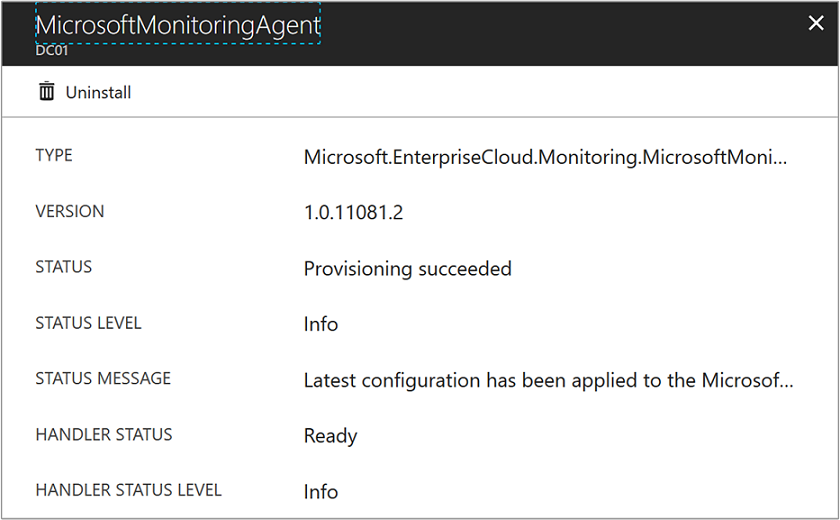

# Troubleshooting the Log Analytics VM extension
This article provides help troubleshooting errors you might experience with the Log Analytics VM extension for Windows and Linux virtual machines running on Microsoft Azure, and suggests possible solutions to resolve them.

To verify the status of the extension, perform the following steps from the Azure portal.

1. Sign into the [Azure portal](http://portal.azure.com).
2. In the Azure portal, click **All services**. In the list of resources, type **virtual machines**. As you begin typing, the list filters based on your input. Select **Virtual machines**.
3. In your list of virtual machines, find and select it.
3. On the virtual machine, click **Extensions**.
4. From the list, check to see if the Log Analytics extension is enabled or not.  For Linux, the agent is listed as **OMSAgentforLinux** and for Windows, the agent is listed as **MicrosoftMonitoringAgent**.

   

4. Click on the extension to view details. 

   

## Troubleshooting Azure Windows VM extension

If the *Microsoft Monitoring Agent* VM extension is not installing or reporting, you can perform the following steps to troubleshoot the issue.

1. Check if the Azure VM agent is installed and working correctly by using the steps in [KB 2965986](https://support.microsoft.com/kb/2965986#mt1).
   * You can also review the VM agent log file `C:\WindowsAzure\logs\WaAppAgent.log`
   * If the log does not exist, the VM agent is not installed.
   * [Install the Azure VM Agent](log-analytics-quick-collect-azurevm.md#enable-the-log-analytics-vm-extension)
2. Confirm the Microsoft Monitoring Agent extension heartbeat task is running using the following steps:
   * Log in to the virtual machine
   * Open task scheduler and find the `update_azureoperationalinsight_agent_heartbeat` task
   * Confirm the task is enabled and is running every one minute
   * Check the heartbeat logfile in `C:\WindowsAzure\Logs\Plugins\Microsoft.EnterpriseCloud.Monitoring.MicrosoftMonitoringAgent\heartbeat.log`
3. Review the Microsoft Monitoring Agent VM extension log files in `C:\Packages\Plugins\Microsoft.EnterpriseCloud.Monitoring.MicrosoftMonitoringAgent`
4. Ensure the virtual machine can run PowerShell scripts
5. Ensure permissions on C:\Windows\temp haven’t been changed
6. View the status of the Microsoft Monitoring Agent by typing the following in an elevated PowerShell window on the virtual machine `  (New-Object -ComObject 'AgentConfigManager.MgmtSvcCfg').GetCloudWorkspaces() | Format-List`
7. Review the Microsoft Monitoring Agent setup log files in `C:\Windows\System32\config\systemprofile\AppData\Local\SCOM\Logs`

For more information, see [troubleshooting Windows extensions](../virtual-machines/windows/extensions-oms.md).

## Troubleshooting Linux VM extension
If the *OMS Agent for Linux* VM extension is not installing or reporting, you can perform the following steps to troubleshoot the issue.

1. If the extension status is *Unknown* check if the Azure VM agent is installed and working correctly by reviewing the VM agent log file `/var/log/waagent.log`
   * If the log does not exist, the VM agent is not installed.
   * [Install the Azure VM Agent on Linux VMs](log-analytics-quick-collect-azurevm.md#enable-the-log-analytics-vm-extension)
2. For other unhealthy statuses, review the OMS Agent for Linux VM extension logs files in `/var/log/azure/Microsoft.EnterpriseCloud.Monitoring.OmsAgentForLinux/*/extension.log` and `/var/log/azure/Microsoft.EnterpriseCloud.Monitoring.OmsAgentForLinux/*/CommandExecution.log`
3. If the extension status is healthy, but data is not being uploaded review the OMS Agent for Linux log files in `/var/opt/microsoft/omsagent/log/omsagent.log`

For more information, see [troubleshooting Linux extensions](../virtual-machines/linux/extensions-oms.md).

## Next steps

For additional troubleshooting guidance related to the OMS Agent for Linux hosted on computers outside of Azure, see [Troubleshoot Azure Log Analytics Linux Agent](log-analytics-agent-linux-support.md).  
