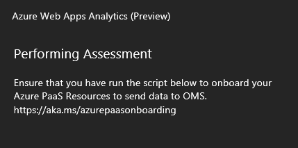

# View analytic data for metrics across all your Azure Web App resources

  
The Azure Web Apps Analytics (Preview) solution provides insights into your [Azure Web Apps](../app-service-web/app-service-web-overview.md) by collecting different metrics across all your Azure Web App resources. With the solution, you can analyze and search for web app resource metric data.

Using the solution, you can view the:

- Top Web Apps with the highest response time
- Number of requests across your Web Apps, including successful and failed requests
- Top Web Apps with highest incoming and outgoing traffic
- Top service plans with high CPU and memory utilization
- Azure Web Apps activity log operations

## Connected sources

Unlike most other Log Analytics solutions, data isn't collected for Azure Web Apps by agents. All data used by the solution comes directly from Azure.

| Connected Source | Supported | Description |
| --- | --- | --- |
| [Windows agents](log-analytics-windows-agents.md) | No | The solution does not collect information from Windows agents. |
| [Linux agents](log-analytics-linux-agents.md) | No | The solution does not collect information from Linux agents. |
| [SCOM management group](log-analytics-om-agents.md) | No | The solution does not collect information from agents in a connected SCOM management group. |
| [Azure storage account](log-analytics-azure-storage.md) | No | The solution does not collection information from Azure storage. |

## Prerequisites

- To access Azure Web App resource metric information, you must have an Azure subscription.

## Configuration

Perform the following steps to configure the Azure Web Apps Analytics solution for your workspaces.

1. Enable the Azure Web Apps Analytics solution from [Azure marketplace](https://azuremarketplace.microsoft.com/marketplace/apps/Microsoft.AzureWebAppsAnalyticsOMS?tab=Overview) or by using the process described in [Add Log Analytics solutions from the Solutions Gallery](log-analytics-add-solutions.md).
2. [Enable Azure resource metrics logging to OMS using PowerShell](https://blogs.technet.microsoft.com/msoms/2017/01/17/enable-azure-resource-metrics-logging-using-powershell).

The Azure Web Apps Analytics solution collects two set of metrics from Azure:

- Azure Web Apps metrics
  - Average Memory Working Set
  - Average Response Time
  - Bytes Received/Sent
  - CPU Time
  - Requests
  - Memory Working Set
  - Httpxxx
- App Service Plan metrics
  - Bytes Received/Sent
  - CPU Percentage
  - Disk Queue Length
  - Http Queue Length
  - Memory Percentage

App Service Plan metrics are only collected if you are using a dedicated service plan. This doesn't apply to free or shared App Service plans.

If you add the solution using the OMS portal, you'll see the following tile. You need to [enable Azure resource metrics logging to OMS using PowerShell](https://blogs.technet.microsoft.com/msoms/2017/01/17/enable-azure-resource-metrics-logging-using-powershell).

After you configure the solution, data should start flowing to your workspace within 15 minutes.

## Using the solution

When you add the Azure Web Apps Analytics solution to your workspace, the **Azure Web Apps Analytics** tile is added to your Overview dashboard. This tile displays a count of the number of Azure Web Apps that the solution has access to in your Azure subscription.

### View Azure Web Apps Analytics information

Click the **Azure Web Apps Analytics** tile to open the **Azure Web Apps Analytics** dashboard. The dashboard includes the blades in the following table. Each blade lists up to ten items matching that blade's criteria for the specified scope and time range. You can run a log search that returns all records by clicking **See all** at the bottom of the blade or by clicking the blade header.

| Column | Description |
| --- | --- |
| Azure Webapps |   |
| Web Apps Request Trends | Shows a line chart of the Web Apps request trend for the date range that you have selected and shows a list of the top ten web requests. Click the line chart to run a log search for <code>Type=AzureMetrics ResourceId=*"/MICROSOFT.WEB/SITES/"* (MetricName=Requests OR MetricName=Http*) &#124; measure avg(Average) by MetricName interval 1HOUR</code>  Click a web request item to run a log search for the web request metric trend that request. |
| Web Apps Response Time | Shows a line chart of the Web Apps response time for the date range that you have selected. Also shows a list a list of the top ten Web Apps response times. Click the chart to run a log search for <code>Type:AzureMetrics ResourceId=*"/MICROSOFT.WEB/SITES/"* MetricName="AverageResponseTime" &#124; measure avg(Average) by Resource interval 1HOUR</code>  Click on a Web App to run a log search returning response times for the Web App. |
| Web Apps Traffic | Shows a line chart for Web Apps traffic, in MB and lists the top Web Apps traffic. Click the chart to run a log search for <code>Type:AzureMetrics ResourceId=*"/MICROSOFT.WEB/SITES/"*  MetricName=BytesSent OR BytesReceived &#124; measure sum(Average) by Resource interval 1HOUR</code>  It shows all Web Apps with traffic for the last minute. Click a Web App to run a log search showing bytes received and sent for the Web App. |
| Azure App Service Plans |   |
| App Service Plans with CPU utilization &gt; 80% | Shows the total number of App Service Plans that have CPU utilization greater than 80% and lists the top 10 App Service Plans by CPU utilization. Click the total area to run a log search for <code>Type=AzureMetrics ResourceId=*"/MICROSOFT.WEB/SERVERFARMS/"* MetricName=CpuPercentage &#124; measure Avg(Average) by Resource</code>  It shows a list of your App Service Plans and their average CPU utilization. Click an App Service Plan to run a log search showing its average CPU utilization. |
| App Service Plans with memory utilization &gt; 80% | Shows the total number of App Service Plans that have memory utilization greater than 80% and lists the top 10 App Service Plans by memory utilization. Click the total area to run a log search for <code>Type=AzureMetrics ResourceId=*"/MICROSOFT.WEB/SERVERFARMS/"* MetricName=MemoryPercentage &#124; measure Avg(Average) by Resource</code>  It shows a list of your App Service Plans and their average memory utilization. Click an App Service Plan to run a log search showing its average memory utilization. |
| Azure Web Apps Activity Logs |   |
| Azure Web Apps Activity Audit | Shows the total number of Web Apps with [activity logs](log-analytics-activity.md) and lists the top 10 activity log operations. Click the total area to run a log search for <code>Type=AzureActivity ResourceProvider= "Azure Web Sites" &#124; measure count() by OperationName</code>  It shows a list of the activity log operations. Click an activity log operation to run a log search that lists the records for the operation. |

### Azure Web Apps

In the dashboard, you can drill down to get more insight into your Web Apps metrics. This first set of blades show the trend of the Web Apps requests, number of errors (for example, HTTP404), traffic, and average response time over time. It also shows a breakdown of those metrics for different Web Apps.

A primary reason for showing you that data is so that you can identify a Web App with high response time and investigate to find the root cause. A threshold limit is also applied to help you more easily identify the ones with issues.

- Web Apps shown in red have response time higher than 1 second.
- Web Apps shown in orange have a response time higher than 0.7 second and less than 1 second.
- Web Apps shown in green have a response time less than 0.7 second.

In the following log search example image, you can see that the *anugup3* web app had a much higher response time than the other web apps.

### App Service Plans

If you are using dedicated Service Plans, you can also collect metrics for your App Service Plans. In this view, you see your App Service Plans with high CPU or Memory utilization (&gt; 80%). It also shows you the top App services with high Memory or CPU utilization. Similarly, a threshold limit is applied to help you more easily identify the ones with issues.

- App Service Plans shown in red have a CPU/Memory utilization higher than 80%.
- App Service Plans shown in orange have a CPU/Memory utilization higher than 60% and lower than 80%.
- App Service Plans shown in green have a CPU/Memory utilization lower than 60%.

## Azure Web Apps log searches

The **List of Popular Azure Web Apps Search queries** shows you all the related activity logs for Web Apps, which provides insights into the operations that were performed on your Web Apps resources. It also lists all the related operations and the number of times they have occurred.

Using any of the log search queries as a starting point, you can easily create an alert. For example, you might want to create an alert when a metric's average response time is greater than every 1 second.

## Next steps

- Create an [alert](log-analytics-alerts-creating.md) for a specific metric.
- Use [Log Search](log-analytics-log-searches.md) to view detailed information from your activity logs.
