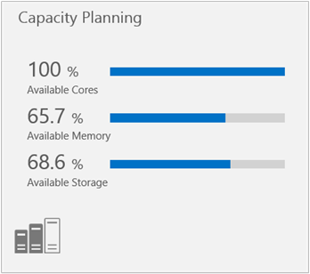
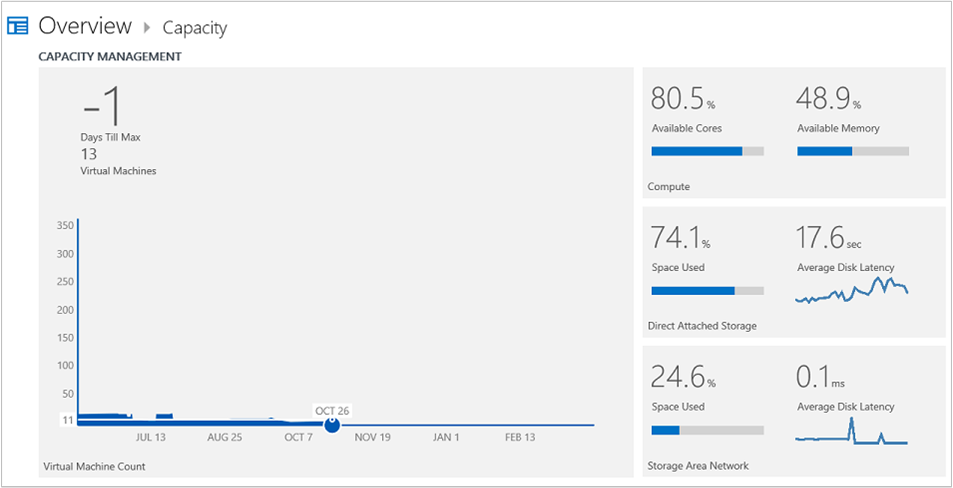
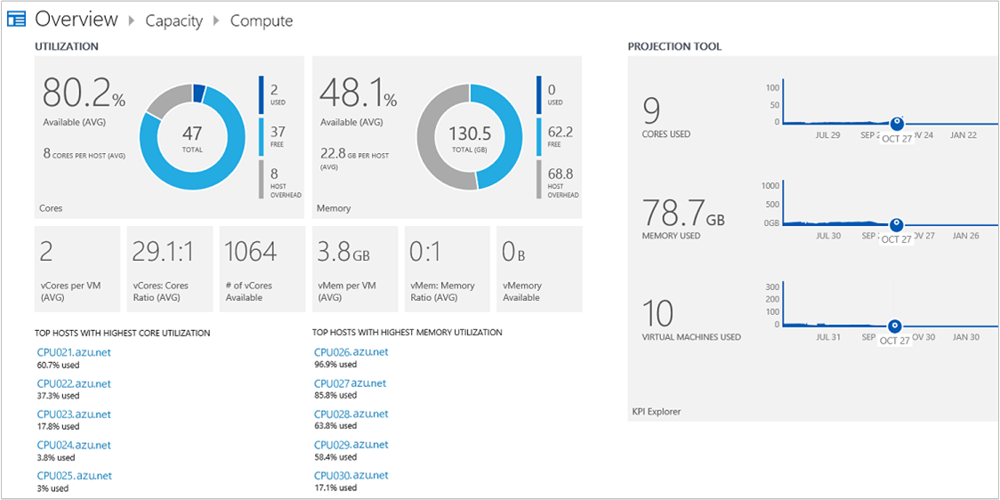
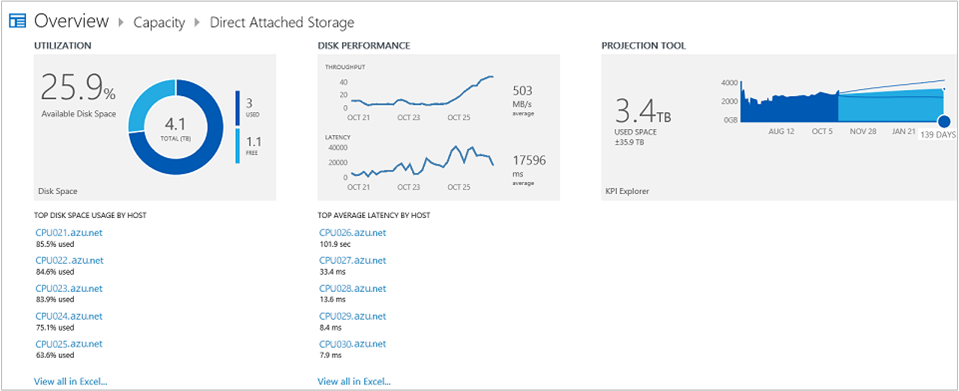

<properties
	pageTitle="Capacity Management solution in Log Analytics | Microsoft Azure"
	description="You can use the Capacity Planning solution in Log Analytics to help you understand the capacity of your Hyper-V  servers managed by System Center Virtual Machine Manager"
	services="log-analytics"
	documentationCenter=""
	authors="bandersmsft"
	manager="jwhit"
	editor=""/>

<tags
	ms.service="log-analytics"
	ms.workload="na"
	ms.tgt_pltfrm="na"
	ms.devlang="na"
	ms.topic="article"
	ms.date="08/08/2016"
	ms.author="banders"/>

# Capacity Management solution in Log Analytics

You can use the Capacity Planning solution in Log Analytics to help you understand the capacity of your Hyper-V servers managed by System Center Virtual Machine Manager. This solution requires both System Center Operations Manager and System Center Virtual Machine Manager. Capacity Planning isn’t available if you only use directly-connected agents. You install the solution to update the Operations Manager agent. The solution reads performance counters on the monitored server and sends usage data to the OMS service in the cloud for processing. Logic is applied to the usage data, and the cloud service records the data. Over time, usage patterns are identified and capacity is projected, based on current consumption.

For example, a projection might identify when additional processor cores or additional memory will be needed for an individual server. In this example, the projection might indicate that in 30 days the server will need additional memory. This can help you plan for a memory upgrade during the server’s next maintenance window, which might occur once every two weeks.

>[AZURE.NOTE] The Capacity Management solution is not available to be added to workspaces. Customers who have the capacity management solution installed can continue to use the solution.  

The capacity planning solution is in the process of being updated to address the following customer reported challenges:

- Requirement to use Virtual Machine Manager and Operations Manager
- Inability to customize/filter based on groups
- Hourly data aggregation not frequent enough
- No VM level insights
- Data reliability

Benefits of the new capacity solution:

- Support granular data collection with improved reliability and accuracy
- Support for Hyper-V without requiring VMM
- Visualization of metrics in PowerBI
- Insights on VM level utilization

## Installing and configuring the solution
Use the following information to install and configure the solution.

- Operations Manager is required for the Capacity Management solution.
- Virtual Machine Manager is required for the Capacity Management solution.
- Operations Manager connectivity with Virtual Machine Manager (VMM) is required. For additional information about connecting the systems, see [How to connect VMM with Operations Manager](http://technet.microsoft.com/library/hh882396.aspx).
- Operations Manager must be connected to Log Analytics.
- Add the Capacity Management solution to your OMS workspace using the process described in [Add Log Analytics solutions from the Solutions Gallery](log-analytics-add-solutions.md).  There is no further configuration required.

## Capacity Management data collection details

Capacity Management collects performance data, metadata, and state data using the agents that you have enabled.

The following table shows data collection methods and other details about how data is collected for capacity management.

| platform | Direct Agent | SCOM agent | Azure Storage | SCOM required? | SCOM agent data sent via management group | collection frequency |
|---|---|---|---|---|---|---|
|Windows||||            || hourly|

The following table shows examples of data types collected by Capacity Management:

|**Data type**|**Fields**|
|---|---|
|Metadata|BaseManagedEntityId, ObjectStatus, OrganizationalUnit, ActiveDirectoryObjectSid, PhysicalProcessors, NetworkName, IPAddress, ForestDNSName, NetbiosComputerName, VirtualMachineName, LastInventoryDate, HostServerNameIsVirtualMachine, IP Address, NetbiosDomainName, LogicalProcessors, DNSName, DisplayName, DomainDnsName, ActiveDirectorySite, PrincipalName, OffsetInMinuteFromGreenwichTime|
|Performance|ObjectName, CounterName, PerfmonInstanceName, PerformanceDataId, PerformanceSourceInternalID, SampleValue, TimeSampled, TimeAdded|
|State|StateChangeEventId, StateId, NewHealthState, OldHealthState, Context, TimeGenerated, TimeAdded, StateId2, BaseManagedEntityId, MonitorId, HealthState, LastModified, LastGreenAlertGenerated, DatabaseTimeModified|

## Capacity Management page

 After the Capacity Planning solution is installed, you can view the capacity of your monitored servers by using the **Capacity Planning** tile on the **Overview** page in OMS.

The tile opens the **Capacity Management** dashboard where you can view a summary of your server capacity. The page displays the following tiles that you can click:

- *Virtual machine count*: Shows the number of days remaining for the capacity of virtual machines
- *Compute*: Shows processor cores and available memory
- *Storage*: Shows the disk space used and average disk latency
- *Search*: The data explorer that you can use to Search for any data in the OMS system

### To view a capacity page

- On the **Overview** page, click **Capacity Management**, and then click **Compute** or **Storage**.

## Compute page

You can use the **Compute** dashboard in Microsoft Azure OMS to view capacity information about utilization, projected days of capacity, and efficiency related to your infrastructure. You use the **Utilization** area to view CPU core and memory utilization in your virtual machine hosts. You can use the projection tool to estimate how much capacity is expected to be available for a given date range. You can use the **Efficiency** area to see how efficient your virtual machine hosts are. You can view details about linked items by clicking them.

You can generate an Excel workbook for the following categories:

- Top hosts with highest core utilization
- Top hosts with highest memory utilization
- Top hosts with inefficient virtual machines
- Top hosts by utilization
- Bottom hosts by utilization

The following areas are shown on the **Compute** dashboard:

**Utilization**: View CPU core and memory utilization in your virtual machine hosts.

- *Used Cores*: Sum for all hosts (% of the CPU utilized multiplied by the number of physical cores on host).
- *Free Cores*: Total physical cores minus used cores.
- *Percentage Cores Available*: Free physical cores divided by total number of physical cores.
- *Virtual Cores per VM*: Total virtual cores in the system divided by the total number of virtual machines in the system.
- *Virtual Cores to Physical Cores Ratio*: Ratio of total physical cores to physical cores that are used by virtual machines in the system.
- *Number of virtual Cores Available*: Virtual core to physical cores ratio multiplied by the available physical cores.
- *Used Memory*: Sum of memory that is utilized by all hosts.
- *Free Memory*: Total physical memory minus used memory.
- *Percentage Memory Available*: Free physical memory divided by total physical memory.
- *Virtual Memory per VM*: Total virtual memory in the system divided by the total number of virtual machines in the system.
- *Virtual Memory to Physical Memory Ratio*: Total virtual memory in the system divided by the total physical memory in the system.
- *Virtual Memory Available*: Virtual memory to physical memory ratio multiplied by the available physical memory.

**Projection tool**

By using the projection tool, you can view historical trends for your resource utilization. This includes the usage trends for virtual machines, memory, core, and storage. The projection capability uses a projection algorithm to help you know when you are running out of each of the resources. This helps you calculate proper capacity planning so that you can know when you need to purchase more capacity (such as memory, cores, or storage).

**Efficiency**

- *Idle VM*: Using less than 10% of the CPU and 10% memory for the specified time period.
- *Overutilized VM*: Using more than 90% of the CPU and 90% memory for the specified time period.
- *Idle Host*: Using less than 10% of the CPU and 10% memory for the specified time period.
- *Overutilized Host*: Using more than 90% of the CPU and 90% memory for the specified time period.

### To work with items on the Compute page

1. On the **Compute** dashboard, in the **Utilization** area, view capacity information about the CPU cores and memory in use.
2. Click an item to open it in the **Search** page and view detailed information about it.
3. In the **Projection** tool, move the date slider to display a projection of the capacity that will be used on the date you choose.
4. In the **Efficiency** area, view capacity efficiency information about virtual machines and virtual machine hosts.

## Direct Attached Storage page

You can use the **Direct Attached Storage** dashboard in OMS to view capacity information about storage utilization, disk performance, and projected days of disk capacity. You use the **Utilization** area to view disk space usage in your virtual machine hosts. You can use the **Disk Performance** area to view disk throughput and latency in your virtual machine hosts. You can also use the projection tool to estimate how much capacity is expected to be available for a given date range. You can view details about linked items by clicking them.

You can generate an Excel workbook from this capacity information for the following categories:

- Top disk space usage by host
- Top average latency by host

The following areas are shown on the **Storage** page:

- *Utilization*: View disk space usage in your virtual machine hosts.
- *Total Disk Space*: Sum (logical disk space) for all hosts
- *Used Disk Space*: Sum (used logical disk space) for all hosts
- *Available Disk Space*: Total disk space minus used disk space
- *Percentage Disk Used*: Used disk space divided by total disk space
- *Percentage Disk Available*: Available disk space divided by total disk space

**Disk Performance**

By using OMS, you can view the historical usage trend of your disk space. The projection capability uses an algorithm to project future usage. For space usage in particular, the projection capability enables you to project when you might run out of disk space. This will help you plan proper storage and know when you need to purchase more storage.

**Projection Tool**

By using the projection tool, you can view historical trends for your disk space utilization. The projection capability also lets you project when you are running out of disk space. This will help you plan proper capacity and know when you need to purchase more storage capacity.

### To work with items on the Direct Attached Storage page

1. On the **Direct Attached Storage** dashboard, in the **Utilization** area, you can view the disk utilization information.
2. Click a linked item to open it in the **Search** page and view detailed information about it.
3. In the **Disk Performance** area, you can view disk throughput and latency information.
4. In the **Projection tool**, move the date slider to display a projection of the capacity that will be used on the date you choose.

## Next steps

- Use [Log searches in Log Analytics](log-analytics-log-searches.md) to view detailed capacity management data.
