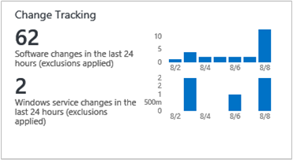
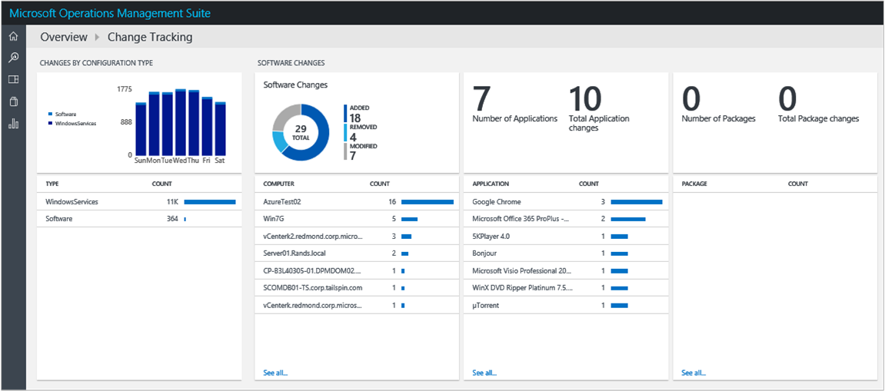
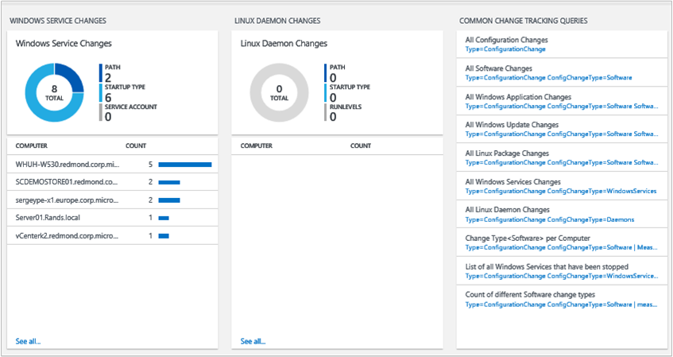

---
title: Change Tracking solution in Log Analytics | Microsoft Docs
description: You can use the Configuration Change Tracking solution in Log Analytics to help you easily identify software and Windows Services changes that occur in your environment — identifying these configuration changes can help you pinpoint operational issues.
services: operations-management-suite
documentationcenter: ''
author: bandersmsft
manager: jwhit
editor: ''

ms.assetid: f8040d5d-3c89-4f0c-8520-751c00251cb7
ms.service: operations-management-suite
ms.workload: na
ms.tgt_pltfrm: na
ms.devlang: na
ms.topic: article
ms.date: 10/31/2016
ms.author: banders

---
# Change Tracking solution in Log Analytics
This article helps you use the Configuration Change Tracking solution in Log Analytics to easily identify changes in your environment. The solution tracks changes to software, Windows Services, Linux daemons, and Linux packages. Identifying configuration changes can help you pinpoint operational issues. You can also configure the solution to track changes to specific Windows files.

You install the solution to update the type of agent that you have installed. Changes to installed software, Windows services, and Linux daemons on the monitored servers are read and then the data is sent to the Log Analytics service in the cloud for processing. Logic is applied to the received data and the cloud service records the data. When changes are found, servers with changes are shown in the Change Tracking dashboard. By using the information on the Change Tracking dashboard, you can easily see the changes that were made in your server infrastructure.

## Installing and configuring the solution
Use the following information to install and configure the solution.

* You must have a [Windows](log-analytics-windows-agents.md), [Operations Manager](log-analytics-om-agents.md), or [Linux](log-analytics-linux-agents.md) agent on each computer where you want to monitor changes.
* Add the Change Tracking solution to your OMS workspace using the process described in [Add Log Analytics solutions from the Solutions Gallery](log-analytics-add-solutions.md).  There is no further configuration required.

### Configure Windows files to track
Use the following steps to configure files to track on Windows computers.

1. In the OMS portal, click **Settings** (the gear symbol).
2. On the **Settings** page, click **Data**, and then click **Windows File Tracking**.
3. Under Windows File Change Tracking, type the entire path, including the file name of the file that you want to track and then click the **Add** symbol. For example: C:\Program Files (x86)\Internet Explorer\iexplore.exe or C:\Windows\System32\drivers\etc\hosts.
4. Click **Save**.  
   

### Limitations
The Change Tracking solution does not currently support the following:

* folders (directories)
* recursion
* wild cards
* path variables
* network file systems

Other limitations:

* The **Max File Size** column and values are unused in the current implementation.
* If you collect more than 2500 files in the 30-minute collection cycle, solution performance might be degraded.
* When network traffic is high, change records may take up to a maximum of six hours to display.
* If you modify the configuration while a computer is shut down, the computer might post file changes that belonged to the previous configuration.

## Change Tracking data collection details
Change Tracking collects software inventory and Windows Service metadata using the agents that you have enabled.

The following table shows data collection methods and other details about how data is collected for Change Tracking.

| platform | Direct Agent | SCOM agent | Linux agent | Azure Storage | SCOM required? | SCOM agent data sent via management group | collection frequency |
| --- | --- | --- | --- | --- | --- | --- | --- |
| Windows and Linux | | | | | | |hourly |

## Use Change Tracking
After the solution is installed, you can view the summary of changes for your monitored servers by using the **Change Tracking** tile on the **Overview** page in OMS.

You can view changes to your infrastructure and then drill-into details for the following categories:

* Changes by configuration type for software and Windows services
* Software changes to applications and updates for individual servers
* Total number of software changes for each application
* Linux packages
* Windows service changes for individual servers
* Linux daemon changes

### To view changes for any change type
1. On the **Overview** page, click the **Change Tracking** tile.
2. On the **Change Tracking** dashboard, review the summary information in one of the change type blades and then click one to view detailed information about it in the **log search** page.
3. On any of the log search pages, you can view results by time, detailed results, and your log search history. You can also filter by facets to narrow the results.

## Next steps
* Use [Log searches in Log Analytics](log-analytics-log-searches.md) to view detailed change tracking data.

