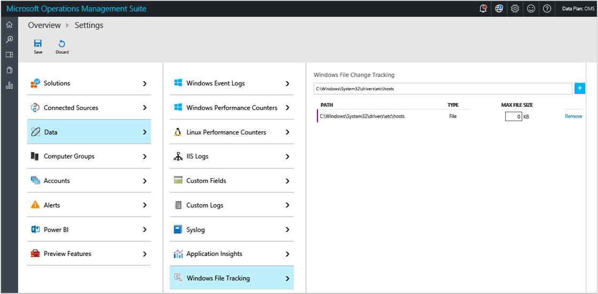
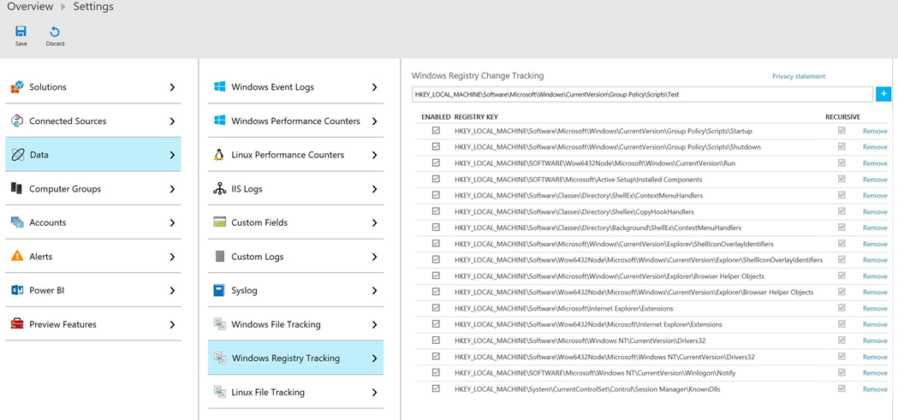
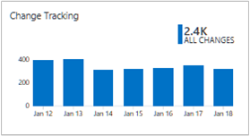
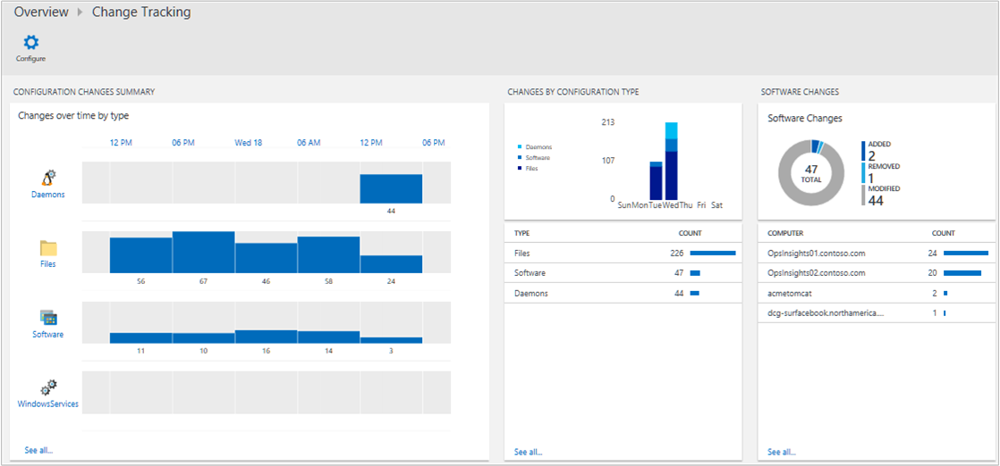
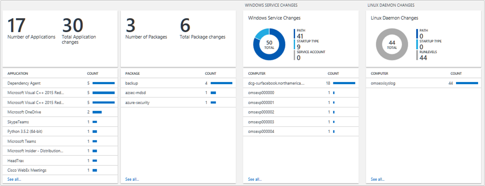

# Track software changes in your environment with the Change Tracking solution

This article helps you use the Change Tracking solution in Log Analytics to easily identify changes in your environment. The solution tracks changes to Windows and Linux software, Windows files and registry keys, Windows services, and Linux daemons. Identifying configuration changes can help you pinpoint operational issues.

You install the solution to update the type of agent that you have installed. Changes to installed software, Windows services, and Linux daemons on the monitored servers are read and then the data is sent to the Log Analytics service in the cloud for processing. Logic is applied to the received data and the cloud service records the data. By using the information on the Change Tracking dashboard, you can easily see the changes that were made in your server infrastructure.

## Installing and configuring the solution
Use the following information to install and configure the solution.

* You must have a [Windows](log-analytics-windows-agents.md), [Operations Manager](log-analytics-om-agents.md), or [Linux](log-analytics-linux-agents.md) agent on each computer where you want to monitor changes.
* Add the Change Tracking solution to your OMS workspace from the [Azure marketplace](https://azuremarketplace.microsoft.com/marketplace/apps/Microsoft.ChangeTrackingOMS?tab=Overview) or by using the process described in [Add Log Analytics solutions from the Solutions Gallery](log-analytics-add-solutions.md).  There is no further configuration required.

### Configure Windows files to track
Use the following steps to configure files to track on Windows computers.

1. In the OMS portal, click **Settings** (the gear symbol).
2. On the **Settings** page, click **Data**, and then click **Windows File Tracking**.
3. Under Windows File Change Tracking, type the entire path, including the file name of the file that you want to track and then click the **Add** symbol. For example: C:\Program Files (x86)\Internet Explorer\iexplore.exe or C:\Windows\System32\drivers\etc\hosts.
4. Click **Save**.  
   

### Configure Windows registry keys to track
Use the following steps to configure registry keys to track on Windows computers.

1. In the OMS portal, click **Settings** (the gear symbol).
2. On the **Settings** page, click **Data**, and then click **Windows Registry Tracking**.
3. Under Windows Registry Change Tracking, type the entire key that you want to track and then click the **Add** symbol.
4. Click **Save**.  
   

### Limitations
The Change Tracking solution does not currently support the following:

* Folders (directories)
* Recursion
* Wild cards
* Path variables
* Network file systems

Other limitations:

* The **Max File Size** column and values are unused in the current implementation.
* If you collect more than 2500 files in the 30-minute collection cycle, solution performance might be degraded.
* When network traffic is high, change records may take up to a maximum of six hours to display.
* If you modify the configuration while a computer is shut down, the computer might post file changes that belonged to the previous configuration.

## Change Tracking data collection details
Change Tracking collects software inventory and Windows Service metadata using the agents that you have enabled.

The following table shows data collection methods and other details about how data is collected for Change Tracking.

| platform | Direct Agent | SCOM agent | Linux agent | Azure Storage | SCOM required? | SCOM agent data sent via management group | collection frequency |
| --- | --- | --- | --- | --- | --- | --- | --- |
| Windows and Linux | | | | | | | 5 minutes to 50 minutes, depending on the change type. See below for more information. |

The following table shows the data collection frequency for the types of changes.

| **change type** | **frequency** | **Does**  **agent**  **send differences when found?** |
| --- | --- | --- |
| Windows registry | 50 minutes | No |
| Windows file | 30 minutes | Yes. If there is no change in 24 hours, a snapshot is sent. |
| Linux file | 15 minutes | Yes. If there is no change in 24 hours, a snapshot is sent. |
| Windows services | 30 minutes | Yes, every 30 minutes when changes are found. Every 24 hours a snapshot is sent, regardless of change. So, the snapshot is sent even where there are no changes. |
| Linux daemons | 5 minutes | Yes. If there is no change in 24 hours, a snapshot is sent. |
| Windows software | 30 minutes | Yes, every 30 minutes when changes are found. Every 24 hours a snapshot is sent, regardless of change. So, the snapshot is sent even where there are no changes. |
| Linux software | 5 minutes | Yes. If there is no change in 24 hours, a snapshot is sent. |

### Registry key change tracking

Log Analytics performs Windows registry monitoring and tracking with the Change Tracking solution. The purpose of monitoring changes to registry keys is to pinpoint extensibility points where third-party code and malware can activate. The following list shows the default registry keys that are tracked by the solution and why each is tracked.

- HKEY\_LOCAL\_MACHINE\Software\Microsoft\Windows\CurrentVersion\Group Policy\Scripts\Startup
    - Monitors scripts that run at startup.
- HKEY\_LOCAL\_MACHINE\Software\Microsoft\Windows\CurrentVersion\Group Policy\Scripts\Shutdown
    - Monitors scripts that run at shutdown.
- HKEY\_LOCAL\_MACHINE\SOFTWARE\Wow6432Node\Microsoft\Windows\CurrentVersion\Run
    - Monitors keys that are loaded before the user signs in their Windows account for 32-bit programs running on 64-bit computers.
- HKEY\_LOCAL\_MACHINE\SOFTWARE\Microsoft\Active Setup\Installed Components
    - Monitors changes to application settings.
- HKEY\_LOCAL\_MACHINE\Software\Classes\Directory\ShellEx\ContextMenuHandlers
    - Monitors common autostart entries that hook directly into Windows Explorer and usually run in-process with Explorer.exe.
- HKEY\_LOCAL\_MACHINE\Software\Classes\Directory\Shellex\CopyHookHandlers
    - Monitors common autostart entries that hook directly into Windows Explorer and usually run in-process with Explorer.exe.
- HKEY\_LOCAL\_MACHINE\Software\Classes\Directory\Background\ShellEx\ContextMenuHandlers
    - Monitors common autostart entries that hook directly into Windows Explorer and usually run in-process with Explorer.exe.
- HKEY\_LOCAL\_MACHINE\Software\Microsoft\Windows\CurrentVersion\Explorer\ShellIconOverlayIdentifiers
    - Monitors for icon overlay handler registration.
- HKEY\_LOCAL\_MACHINE\Software\Wow6432Node\Microsoft\Windows\CurrentVersion\Explorer\ShellIconOverlayIdentifiers
    - Monitors for icon overlay handler registration for 32-bit programs running on 64-bit computers.
- HKEY\_LOCAL\_MACHINE\Software\Microsoft\Windows\CurrentVersion\Explorer\Browser Helper Objects
    - Monitors for new browser helper object plugins for Internet Explorer, which can be used to access the Document Object Model (DOM) of the current page and to control navigation.
- HKEY\_LOCAL\_MACHINE\Software\Wow6432Node\Microsoft\Windows\CurrentVersion\Explorer\Browser Helper Objects
    - Monitors for new browser helper object plugins for Internet Explorer, which can be used to access the Document Object Model (DOM) of the current page and to control navigation for 32-bit programs running on 64-bit computers.
- HKEY\_LOCAL\_MACHINE\Software\Microsoft\Internet Explorer\Extensions
    - Monitors for new Internet Explorer extensions, such as custom tool menus and custom toolbar buttons.
- HKEY\_LOCAL\_MACHINE\Software\Wow6432Node\Microsoft\Internet Explorer\Extensions
    - Monitors for new Internet Explorer extensions, such as custom tool menus and custom toolbar buttons for 32-bit programs running on 64-bit computers.
- HKEY\_LOCAL\_MACHINE\Software\Microsoft\Windows NT\CurrentVersion\Drivers32
    - Monitors the 32-bit drivers associated with wavemapper, wave1 and wave2, msacm.imaadpcm, .msadpcm, .msgsm610, and vidc. Similar to the [drivers] section in the SYSTEM.INI file.
- HKEY\_LOCAL\_MACHINE\Software\Wow6432Node\Microsoft\Windows NT\CurrentVersion\Drivers32
    - Monitors the 32-bit drivers associated with wavemapper, wave1 and wave2, msacm.imaadpcm, .msadpcm, .msgsm610, and vidc for 32-bit programs running on 64-bit computers. Similar to the [drivers] section in the SYSTEM.INI file.
- HKEY\_LOCAL\_MACHINE\System\CurrentControlSet\Control\Session Manager\KnownDlls
    - Monitors the list of known or commonly used system DLLs; this system prevents people from exploiting weak application directory permissions by dropping in Trojan horse versions of system DLLs.
- HKEY\_LOCAL\_MACHINE\SOFTWARE\Microsoft\Windows NT\CurrentVersion\Winlogon\Notify
    - Monitors the list of packages able to receive event notifications from Winlogon, the interactive logon support model for the Windows operating system.

## Use Change Tracking
After the solution is installed, you can view the summary of changes for your monitored servers by using the **Change Tracking** tile on the **Overview** page in OMS.

You can view changes to your infrastructure and then drill-into details for the following categories:

* Changes by configuration type for software and Windows services
* Software changes to applications and updates for individual servers
* Total number of software changes for each application
* Linux packages
* Windows service changes for individual servers
* Linux daemon changes

### To view changes for any change type
1. On the **Overview** page, click the **Change Tracking** tile.
2. On the **Change Tracking** dashboard, review the summary information in one of the change type blades and then click one to view detailed information about it in the **log search** page.
3. On any of the log search pages, you can view results by time, detailed results, and your log search history. You can also filter by facets to narrow the results.

## Next steps
* Use [Log searches in Log Analytics](log-analytics-log-searches.md) to view detailed change tracking data.
