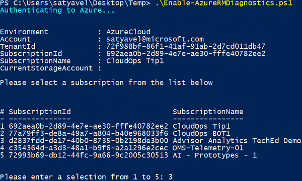
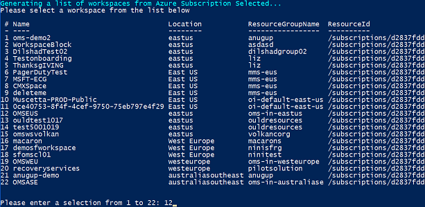

# Configure collection of Azure PaaS resource metrics with Log Analytics

Azure Platform as a Service (PaaS) resources, like Azure SQL and Web Sites (Web Apps), can emit performance metrics data natively to Log Analytics. This script allows users to enable metrics logging for PaaS resources already deployed in a specific resource group or across an entire subscription. 

Today, there is no way to enable metrics logging for PaaS resources through the Azure portal. Therefore, you need to use a PowerShell script. This native metrics logging capability along with Log Analytics monitoring, enable you to monitor Azure resources at scale. 

## Prerequisites
Verify you have the following Azure Resource Manager modules installed on your computer before proceeding:

- AzureRM.Insights
- AzureRM.OperationalInsights
- AzureRM.Resources
- AzureRM.profile

>[!NOTE]
>We recommend that all your Azure Resource Manager modules are the same version to ensure compatibility when you run Azure Resource Manager commands from PowerShell.
>
To install the latest version of the Azure Resource Manager modules on your computer, see [Install and configure Azure PowerShell](https://docs.microsoft.com/powershell/azure/install-azurerm-ps?view=azurermps-4.4.1#update-azps).  

## Enable Azure Diagnostics  
Configuring Azure Diagnostics for PaaS resources is accomplished by executing the script, **Enable-AzureRMDiagnostics.ps1**, which is available from the [PowerShell Gallery](https://www.powershellgallery.com/packages/Enable-AzureRMDiagnostics/2.52/DisplayScript).  The script supports the following scenarios:
  
* Specifying a resource related to one or more resource groups in a subscription  
* Specifying a resource related to a specific resource group in a subscription  
* Reconfigure a resource to forward to a different workspace

Only resources that support collecting metrics with Azure diagnostics and send directly to Log Analytics are supported.  For a detailed list, review [Collect Azure service logs and metrics for use in Log Analytics](log-analytics-azure-storage.md) 

Perform the following steps to download and execute the script.

1.  From the Windows start screen, type **PowerShell** and right-click PowerShell from the search results.  Select from the menu **Run As Administrator**.   
2. Save the **Enable-AzureRMDiagnostics.ps1** script file locally by running the following command and providing a path to store the script.    

    ```
    PS C:\> save-script -Name Enable-AzureRMDiagnostics -Path "C:\users\<username>\desktop\temp"
    ```

3. Run `Connect-AzureRmAccount` to create a connection with Azure.   
4. Run the following script `.\Enable-AzureRmDiagnostics.ps1` without any parameters to enable data collection from a specific resource in your subscription or with the parameter `-ResourceGroup <myResourceGroup>` to specify a resource in a specific resource group.   
5. Select the appropriate subscription from the list if you have more than one, by entering the correct value.<br><br> <br> Otherwise, it automatically selects the single subscription available.
6. Next, the script returns a list of Log Analytics workspaces registered in the subscription.  Select the appropriate one from the list.<br><br> <br> 
7. Select the Azure resource that you would like to enable collection from. For example, if you type 5, you enable data collection for SQL Azure Databases.<br><br> <br>
   You can only select resources that support collecting metrics with Azure Diagnostics and sending directly to a Log Analytics.  The script will show a value of **True** under the **Metrics** column for the list of resources it discovers in your subscription or specified resource group.    
8. You are prompted to confirm your selection.  Enter **Y** to enable metrics logging for all selected resources for the scope defined, which in our example are all SQL databases in the subscription.  

The script will run against each and every resource matching selected criteria and enable metrics collection for them. After it’s finished, you will see a message indicating configuration is complete.  

Shortly after completion, you will start to see data from the Azure PaaS resource in your Log Analytics repository.  A record with type `AzureMetrics` is created and analyzing these records are supported by the [Azure SQL Analytics](log-analytics-azure-sql.md) and [Azure Web Apps Analytics](log-analytics-azure-web-apps-analytics.md) management solutions.   

## Update a resource to send data to another workspace
If you have a resource that is already sending data to a Log Analytics workspace and you later decide to reconfigure it to reference another workspace, you can run the script with the `-Update` parameter.  

**Example:** 
`PS C:\users\<username>\Desktop\temp> .\Enable-AzureRMDiagnostics.ps1 -Update`

You will be prompted to answer the same information as when you ran the script to perform the initial configuration.  

## Next steps

* Learn about [log searches](log-analytics-log-searches.md) to analyze the data collected from data sources and solutions. 

* Use [Custom Fields](log-analytics-custom-fields.md)( to parse the event records into individual fields.

* Review [Create a custom dashboard for use in Log Analytics](log-analytics-dashboards.md) to understand how to visualize your log searches in meaningful ways for the organization.
