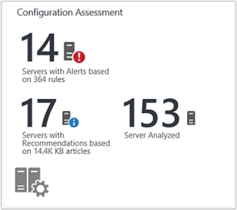
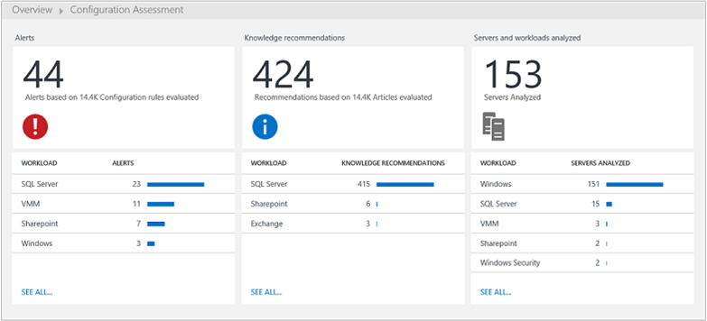
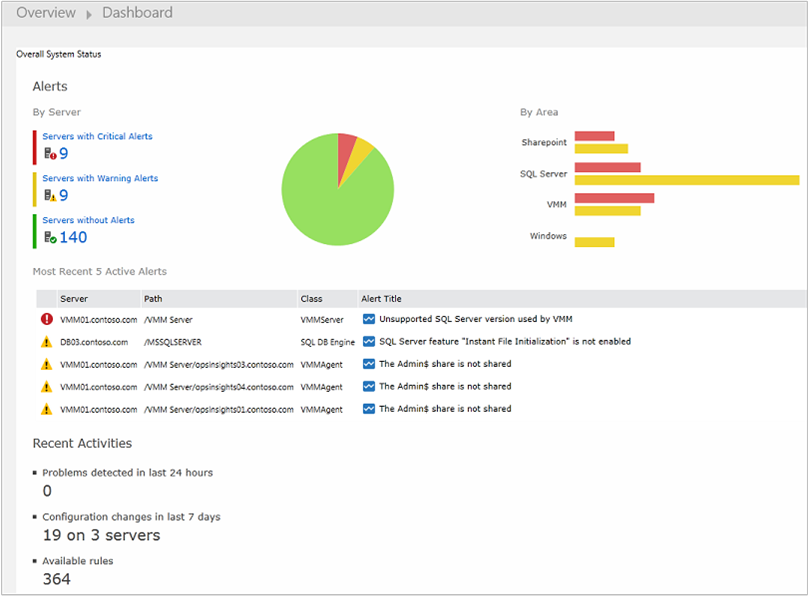
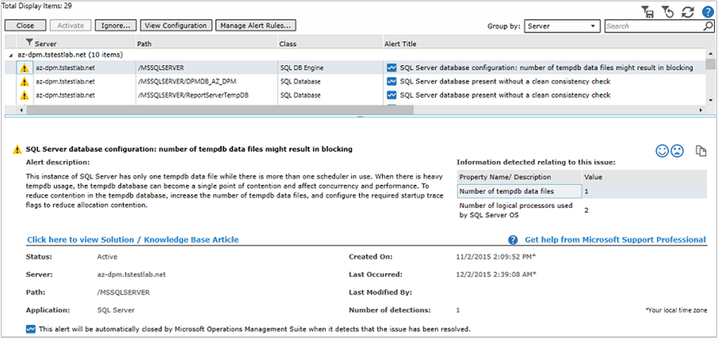
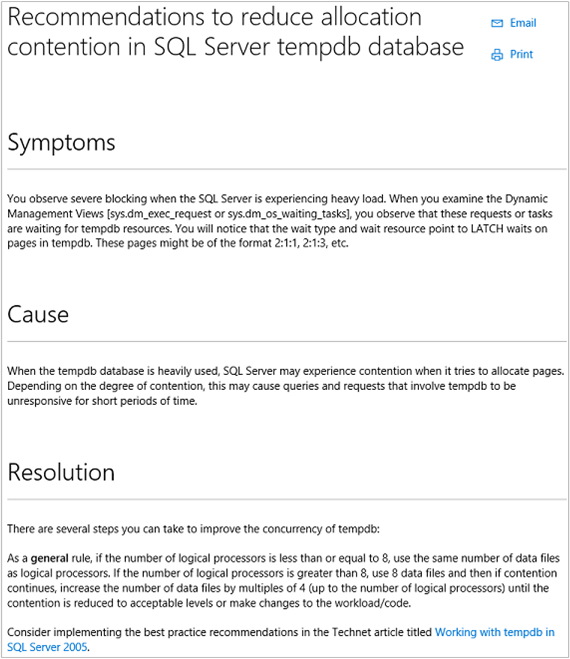
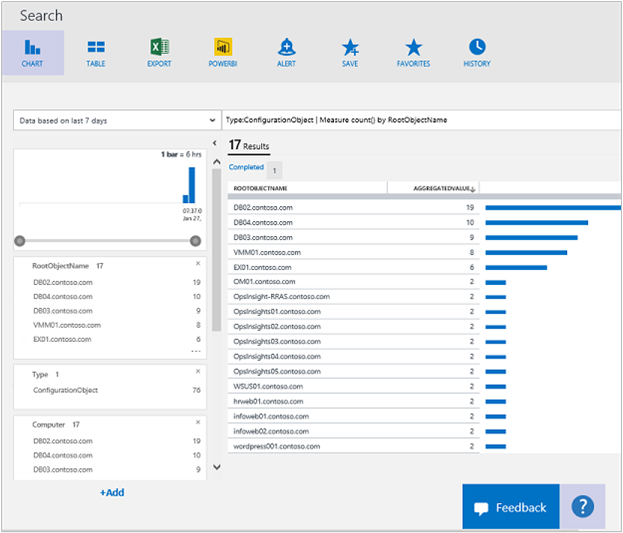

<properties
	pageTitle="Configuration Assessment solution in Log Analytics | Microsoft Azure"
	description="The Configuration Assessment solution in Log Analytics provides you with detailed information about the current state of your System Center Operations Manager server infrastructure when using Operations Manager agents or an Operations Manager management group."
	services="log-analytics"
	documentationCenter=""
	authors="bandersmsft"
	manager="jwhit"
	editor=""/>

<tags
	ms.service="log-analytics"
	ms.workload="na"
	ms.tgt_pltfrm="na"
	ms.devlang="na"
	ms.topic="article"
	ms.date="08/08/2016"
	ms.author="banders"/>

# Configuration Assessment solution in Log Analytics

The Configuration Assessment solution in Log Analytics helps you find potential server configuration problems through alerts and knowledge recommendations.

This solution requires System Center Operations Manager. Configuration Assessment isn’t available if you only use directly-connected agents.

Viewing some information in Configuration Assessment solution requires the Silverlight plugin for your browser.

>[AZURE.NOTE] Beginning July 5, 2016, the Configuration Assessment solution can no longer be added to Log Analytics workspaces and this solution will no longer be available to existing users after August 1, 2016. For customers using this solution for SQL Server or Active Directory, we recommend you instead use the [SQL Server Assessment](log-analytics-sql-assessment.md), [Active Directory Assessment](log-analytics-ad-assessment.md) and [Active Directory Replication Status](log-analytics-ad-replication-status.md) solutions. For customers using configuration assessment for Windows, Hyper-V, and System Center Virtual Machine Manager, we recommend you use the event collection and change tracking capabilities to gain a holistic view of any issues within your environments.

Configuration data is gathered from monitored servers and then sent to the OMS service in the cloud for processing. Logic is applied to the received data and the cloud service records the data. Processed data for the servers is shown for the following areas:

- **Alerts:** Shows the configuration-related, proactive alerts that have been raised for your monitored servers. These are produced by rules authored by Microsoft Customer and Support organization (CSS) with best practices from the field.
- **Knowledge Recommendations:** Shows the Microsoft Knowledge Base articles that are recommended for workloads that are found in your infrastructure; these are automatically suggested based on your configuration thru the use of machine learning.
- **Servers and Workloads Analyzed:** Shows the servers and workloads that are being monitored by OMS.

### Technologies you can analyze with Configuration Assessment

OMS Configuration Assessment analyzes the following workloads:

- Windows Server 2012 and Microsoft Hyper-V Server 2012
- Windows Server 2008 and Windows Server 2008 R2, including:
    - Active Directory
	- Hyper-V host
	- General operating system
- SQL Server 2008 and later
    - SQL Server Database Engine
- Microsoft SharePoint 2010
- Microsoft Exchange Server 2010 and Microsoft Exchange Server 2013
- Microsoft Lync Server 2013 and Lync Server 2010
- System Center 2012 SP1 – Virtual Machine Manager

For SQL Server, the following 32-bit and 64-bit editions are supported for analysis:

- SQL Server 2016 - all editions
- SQL Server 2014 - all editions
- SQL Server 2008 and 2008 R2 - all editions

The SQL Server Database Engine is analyzed on all supported editions. In addition, the 32-bit edition of SQL Server is supported when running in the WOW64 implementation.

## Installing and configuring the solution
Use the following information to install and configure the solution.

- Operations Manager is required for the Configuration Assessment solution.
- You must have an Operations Manager agent on each computer where you want to assess its configuration.
- Add the Configuration Assessment solution to your OMS workspace using the process described in [Add Log Analytics solutions from the Solutions Gallery](log-analytics-add-solutions.md).  There is no further configuration required.

## Configuration Assessment data collection details

Configuration Assessment collects configuration data, metadata, and state data using the agents that you have enabled.

The following table shows data collection methods and other details about how data is collected for Configuration Assessment.

| platform | Direct Agent | SCOM agent | Azure Storage | SCOM required? | SCOM agent data sent via management group | collection frequency |
|---|---|---|---|---|---|---|
|Windows||||            || twice per day|

The following table shows examples of data types collected by Configuration Assessment:

|**Data type**|**Fields**|
|---|---|
|Configuration|CustomerID, AgentID, EntityID, ManagedTypeID, ManagedTypePropertyID, CurrentValue, ChangeDate|
|Metadata|BaseManagedEntityId, ObjectStatus, OrganizationalUnit, ActiveDirectoryObjectSid, PhysicalProcessors, NetworkName, IPAddress, ForestDNSName, NetbiosComputerName, VirtualMachineName, LastInventoryDate, HostServerNameIsVirtualMachine, IP Address, NetbiosDomainName, LogicalProcessors, DNSName, DisplayName, DomainDnsName, ActiveDirectorySite, PrincipalName, OffsetInMinuteFromGreenwichTime|
|State|StateChangeEventId, StateId, NewHealthState, OldHealthState, Context, TimeGenerated, TimeAdded, StateId2, BaseManagedEntityId, MonitorId, HealthState, LastModified, LastGreenAlertGenerated, DatabaseTimeModified|

## Configuration Assessment alerts
You can view and manage alerts from the Configuration Assessment with the Alerts page. Alerts tell you the issue that was detected, the cause, and how to address the issue. They also provide information about configuration settings in your environment that might cause performance issues.

>[AZURE.NOTE] The Configuration Assessment alerts are different from the other alerts in Log Analytics. Viewing alerts requires a Silverlight plugin for your browser.

When you select an item or category of items on the Alerts page, you’ll see a list of servers or workloads with alerts that apply to each item.

Each alert includes a link to an article in the Microsoft Knowledge Base. These articles provide additional information about the alert.

>[AZURE.TIP] By default, the maximum number of alerts displayed is 2,000. To view more alerts, click the notification bar above the list of alerts.

You can click any item in the list to view the KB article that might help you resolve the cause of the issue that generated the alert.

You can manage alert rules to ignore specific rules or a classes of rules.

## Knowledge Recommendations
When you view knowledge recommendations, you’re presented log search results listing Microsoft KB articles recommended for the workloads and computers that provide additional information about the alert.

## Servers and workloads analyzed
When you view knowledge recommendations, you’re presented log search results listing all the servers and workloads that are known to OMS from Operations Manager.

## Next steps

- Use [Log searches in Log Analytics](log-analytics-log-searches.md) to view detailed configuration assessment data.
