# Container Monitoring solution in Log Analytics


This article describes how to set up and use the Container Monitoring solution in Log Analytics, which helps you view and manage your Docker and Windows container hosts in a single location. Docker is a software virtualization system used to create containers that automate software deployment to their IT infrastructure.

The solution shows which containers are running, what container image they’re running, and where containers are running. You can view detailed audit information showing commands used with containers. And, you can troubleshoot containers by viewing and searching centralized logs without having to remotely view Docker or Windows hosts. You can find containers that may be noisy and consuming excess resources on a host. And, you can view centralized CPU, memory, storage, and network usage and performance information for containers. On computers running Windows, you can centralize and compare logs from Windows Server, Hyper-V, and Docker containers. The solution supports the following container orchestrators:

- Docker Swarm
- DC/OS
- Kubernetes
- Service Fabric
- Red Hat OpenShift

If you are interested in monitoring the performance of your workloads deployed to Kubernetes environments hosted on Azure Kubernetes Service (AKS), see [Monitor Azure Kubernetes Service](../monitoring/monitoring-container-health.md). The Container Monitoring solution does not include support to monitor that platform.  

The following diagram shows the relationships between various container hosts and agents with Log Analytics.

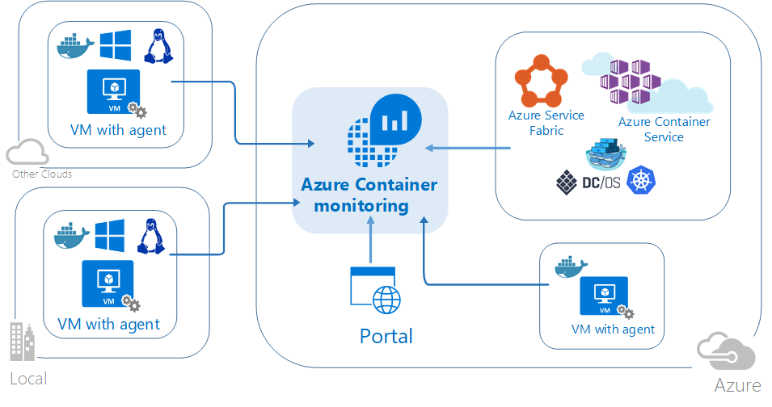

## System requirements and supported platforms

Before starting, review the following details to verify you meet the prerequisites.

### Container monitoring solution support for Docker Orchestrator and OS platform
The following table outlines the Docker orchestration and operating system monitoring support of container inventory, performance, and logs with Log Analytics.   

| | ACS | Linux | Windows | Container<br>Inventory | Image<br>Inventory | Node<br>Inventory | Container<br>Performance | Container<br>Event | Event<br>Log | Container<br>Log |
|-----|-----|-----|-----|-----|-----|-----|-----|-----|-----|-----|
| Kubernetes | &#8226; | &#8226; | &#8226; | &#8226; | &#8226; | &#8226; | &#8226; | &#8226; | &#8226; | &#8226; |
| Mesosphere<br>DC/OS | &#8226; | &#8226; | | &#8226; | &#8226; | &#8226; | &#8226;| &#8226; | &#8226; | &#8226; |
| Docker<br>Swarm | &#8226; | &#8226; | &#8226; | &#8226; | &#8226; | &#8226; | &#8226; | &#8226; | | &#8226; |
| Service<br>Fabric | | &#8226; | &#8226; | &#8226; | &#8226; | &#8226; | &#8226; | &#8226; | &#8226; | &#8226; |
| Red Hat Open<br>Shift | | &#8226; | | &#8226; | &#8226;| &#8226; | &#8226; | &#8226; | | &#8226; |
| Windows Server<br>(standalone) | | | &#8226; | &#8226; | &#8226; | &#8226; | &#8226; | &#8226; | | &#8226; |
| Linux Server<br>(standalone) | | &#8226; | | &#8226; | &#8226; | &#8226; | &#8226; | &#8226; | | &#8226; |


### Docker versions supported on Linux

- Docker 1.11 to 1.13
- Docker CE and EE v17.06

### x64 Linux distributions supported as container hosts

- Ubuntu 14.04 LTS and 16.04 LTS
- CoreOS(stable)
- Amazon Linux 2016.09.0
- openSUSE 13.2
- openSUSE LEAP 42.2
- CentOS 7.2 and 7.3
- SLES 12
- RHEL 7.2 and 7.3
- Red Hat OpenShift Container Platform (OCP) 3.4 and 3.5
- ACS Mesosphere DC/OS 1.7.3 to 1.8.8
- ACS Kubernetes 1.4.5 to 1.6
    - Kubernetes events, Kubernetes inventory, and container processes are only supported with version 1.4.1-45 and later of the OMS Agent for Linux
- ACS Docker Swarm

### Supported Windows operating system

- Windows Server 2016
- Windows 10 Anniversary Edition (Professional or Enterprise)

### Docker versions supported on Windows

- Docker 1.12 and 1.13
- Docker 17.03.0 and later

## Installing and configuring the solution
Use the following information to install and configure the solution.

1. Add the Container Monitoring solution to your Log Analytics workspace from [Azure marketplace](https://azuremarketplace.microsoft.com/marketplace/apps/Microsoft.ContainersOMS?tab=Overview) or by using the process described in [Add Log Analytics solutions from the Solutions Gallery](log-analytics-add-solutions.md).

2. Install and use Docker with an OMS agent. Based on your operating system and Docker orchestrator, you can use the following methods to configure your agent.
  - For standalone hosts:
    - On supported Linux operating systems, install and run Docker and then install and configure the [OMS Agent for Linux](log-analytics-agent-linux.md).  
    - On CoreOS, you cannot run the OMS Agent for Linux. Instead, you run a containerized version of the OMS Agent for Linux. Review [Linux container hosts including CoreOS](#for-all-linux-container-hosts-including-coreos) or [Azure Government Linux container hosts including CoreOS](#for-all-azure-government-linux-container-hosts-including-coreos) if you are working with containers in Azure Government Cloud.
    - On Windows Server 2016 and Windows 10, install the Docker Engine and client then connect an agent to gather information and send it to Log Analytics. Review [Install and configure Windows container hosts](#install-and-configure-windows-container-hosts) if you have a Windows environment.
  - For Docker multi-host orchestration:
    - If you have a Red Hat OpenShift environment, review [Configure an OMS agent for Red Hat OpenShift](#configure-an-oms-agent-for-red-hat-openshift).
    - If you have a Kubernetes cluster using the Azure Container Service:
       - Review [Configure an OMS Linux agent for Kubernetes](#configure-an-oms-linux-agent-for-kubernetes).
       - Review [Configure an OMS Windows agent for Kubernetes](#configure-an-oms-windows-agent-for-kubernetes).
       - Review [Use Helm to deploy OMS Agent on Linux Kubernetes](#use-helm-to-deploy-oms-agent-on-linux-kubernetes).
    - If you have an Azure Container Service DC/OS cluster, learn more at [Monitor an Azure Container Service DC/OS cluster with Operations Management Suite](../container-service/dcos-swarm/container-service-monitoring-oms.md).
    - If you have a Docker Swarm mode environment, learn more at [Configure an OMS agent for Docker Swarm](#configure-an-oms-agent-for-docker-swarm).
    - If you have a Service Fabric cluster, learn more at [Monitor containers with OMS Log Analytics](../service-fabric/service-fabric-diagnostics-oms-containers.md).

Review the [Docker Engine on Windows](https://docs.microsoft.com/virtualization/windowscontainers/manage-docker/configure-docker-daemon) article for additional information about how to install and configure your Docker Engines on computers running Windows.

> [!IMPORTANT]
> Docker must be running **before** you install the [OMS Agent for Linux](log-analytics-agent-linux.md) on your container hosts. If you've already installed the agent before installing Docker, you need to reinstall the OMS Agent for Linux. For more information about Docker, see the [Docker website](https://www.docker.com).


### Install and configure Linux container hosts

After you've installed Docker, use the following settings for your container host to configure the agent for use with Docker. First you need your Log Analytics workspace ID and key, which you can find in the Azure portal. In your workspace, click **Quick Start** > **Computers** to view your **Workspace ID** and **Primary Key**.  Copy and paste both into your favorite editor.

**For all Linux container hosts except CoreOS:**

- For more information and steps on how to install the OMS Agent for Linux, see [Connect your Linux Computers to Log Analytics](log-analytics-concept-hybrid.md).

**For all Linux container hosts including CoreOS:**

Start the container that you want to monitor. Modify and use the following example:

```
sudo docker run --privileged -d -v /var/run/docker.sock:/var/run/docker.sock -v /var/lib/docker/containers:/var/lib/docker/containers -e WSID="your workspace id" -e KEY="your key" -h=`hostname` -p 127.0.0.1:25225:25225 --name="omsagent" --restart=always microsoft/oms
```

**For all Azure Government Linux container hosts including CoreOS:**

Start the container that you want to monitor. Modify and use the following example:

```
sudo docker run --privileged -d -v /var/run/docker.sock:/var/run/docker.sock -v /var/log:/var/log -v /var/lib/docker/containers:/var/lib/docker/containers -e WSID="your workspace id" -e KEY="your key" -e DOMAIN="opinsights.azure.us" -p 127.0.0.1:25225:25225 -p 127.0.0.1:25224:25224/udp --name="omsagent" -h=`hostname` --restart=always microsoft/oms
```

**Switching from using an installed Linux agent to one in a container**

If you previously used the directly-installed agent and want to instead use an agent running in a container, you must first remove the OMS Agent for Linux. See [Uninstalling the OMS Agent for Linux](log-analytics-agent-linux.md) to understand how to successfully uninstall the agent.  

#### Configure an OMS Agent for Docker Swarm

You can run the OMS Agent as a global service on Docker Swarm. Use the following information to create an OMS Agent service. You need to provide your Log Analytics Workspace ID and Primary Key.

- Run the following on the master node.

    ```
    sudo docker service create  --name omsagent --mode global  --mount type=bind,source=/var/run/docker.sock,destination=/var/run/docker.sock --mount type=bind,source=/var/lib/docker/containers,destination=/var/lib/docker/containers -e WSID="<WORKSPACE ID>" -e KEY="<PRIMARY KEY>" -p 25225:25225 -p 25224:25224/udp  --restart-condition=on-failure microsoft/oms
    ```

##### Secure secrets for Docker Swarm

For Docker Swarm, once the secret for Workspace ID and Primary Key is created, use the following information to create your secret information.

1. Run the following on the master node.

    ```
    echo "WSID" | docker secret create WSID -
    echo "KEY" | docker secret create KEY -
    ```

2. Verify that secrets were created properly.

    ```
    keiko@swarmm-master-13957614-0:/run# sudo docker secret ls
    ```

    ```
    ID                          NAME                CREATED             UPDATED
    j2fj153zxy91j8zbcitnjxjiv   WSID                43 minutes ago      43 minutes ago
    l9rh3n987g9c45zffuxdxetd9   KEY                 38 minutes ago      38 minutes ago
    ```

3. Run the following command to mount the secrets to the containerized OMS Agent.

    ```
    sudo docker service create  --name omsagent --mode global  --mount type=bind,source=/var/run/docker.sock,destination=/var/run/docker.sock --mount type=bind,source=/var/lib/docker/containers,destination=/var/lib/docker/containers --secret source=WSID,target=WSID --secret source=KEY,target=KEY  -p 25225:25225 -p 25224:25224/udp --restart-condition=on-failure microsoft/oms
    ```

#### Configure an OMS Agent for Red Hat OpenShift
There are three ways to add the OMS Agent to Red Hat OpenShift to start collecting container monitoring data.

* [Install the OMS Agent for Linux](log-analytics-agent-linux.md) directly on each OpenShift node  
* [Enable Log Analytics VM Extension](log-analytics-azure-vm-extension.md) on each OpenShift node residing in Azure  
* Install the OMS Agent as a OpenShift daemon-set  

In this section we cover the steps required to install the OMS Agent as an OpenShift daemon-set.  

1. Sign on to the OpenShift master node and copy the yaml file [ocp-omsagent.yaml](https://github.com/Microsoft/OMS-docker/blob/master/OpenShift/ocp-omsagent.yaml) from GitHub to your master node and modify the value with your Log Analytics Workspace ID and with your Primary Key.
2. Run the following commands to create a project for Log Analytics and set the user account.

    ```
    oadm new-project omslogging --node-selector='zone=default'
    oc project omslogging  
    oc create serviceaccount omsagent  
    oadm policy add-cluster-role-to-user cluster-reader   system:serviceaccount:omslogging:omsagent  
    oadm policy add-scc-to-user privileged system:serviceaccount:omslogging:omsagent  
    ```

4. To deploy the daemon-set, run the following:

    `oc create -f ocp-omsagent.yaml`

5. To verify it is configured and working correctly, type the following:

    `oc describe daemonset omsagent`  

    and the output should resemble:

    ```
    [ocpadmin@khm-0 ~]$ oc describe ds oms  
    Name:           oms  
    Image(s):       microsoft/oms  
    Selector:       name=omsagent  
    Node-Selector:  zone=default  
    Labels:         agentVersion=1.4.0-12  
                    dockerProviderVersion=10.0.0-25  
                    name=omsagent  
    Desired Number of Nodes Scheduled: 3  
    Current Number of Nodes Scheduled: 3  
    Number of Nodes Misscheduled: 0  
    Pods Status:    3 Running / 0 Waiting / 0 Succeeded / 0 Failed  
    No events.  
    ```

If you want to use secrets to secure your Log Analytics Workspace ID and Primary Key when using the OMS Agent daemon-set yaml file, perform the following steps.

1. Sign on to the OpenShift master node and copy the yaml file [ocp-ds-omsagent.yaml](https://github.com/Microsoft/OMS-docker/blob/master/OpenShift/ocp-ds-omsagent.yaml) and secret generating script [ocp-secretgen.sh](https://github.com/Microsoft/OMS-docker/blob/master/OpenShift/ocp-secretgen.sh) from GitHub.  This script will generate the secrets yaml file for Log Analytics Workspace ID and Primary Key to secure your secrete information.  
2. Run the following commands to create a project for Log Analytics and set the user account. The secret generating script asks for your Log Analytics Workspace ID <WSID> and Primary Key <KEY> and upon completion, it creates the ocp-secret.yaml file.  

    ```
    oadm new-project omslogging --node-selector='zone=default'  
    oc project omslogging  
    oc create serviceaccount omsagent  
    oadm policy add-cluster-role-to-user cluster-reader   system:serviceaccount:omslogging:omsagent  
    oadm policy add-scc-to-user privileged system:serviceaccount:omslogging:omsagent  
    ```

4. Deploy the secret file by running the following:

    `oc create -f ocp-secret.yaml`

5. Verify deployment by running the following:

    `oc describe secret omsagent-secret`  

    and the  output should resemble:  

    ```
    [ocpadmin@khocp-master-0 ~]$ oc describe ds oms  
    Name:           oms  
    Image(s):       microsoft/oms  
    Selector:       name=omsagent  
    Node-Selector:  zone=default  
    Labels:         agentVersion=1.4.0-12  
                    dockerProviderVersion=10.0.0-25  
                    name=omsagent  
    Desired Number of Nodes Scheduled: 3  
    Current Number of Nodes Scheduled: 3  
    Number of Nodes Misscheduled: 0  
    Pods Status:    3 Running / 0 Waiting / 0 Succeeded / 0 Failed  
    No events.  
    ```

6. Deploy the OMS Agent daemon-set yaml file by running the following:

    `oc create -f ocp-ds-omsagent.yaml`  

7. Verify deployment by running the following:

    `oc describe ds oms`

    and the output should resemble:

    ```
    [ocpadmin@khocp-master-0 ~]$ oc describe secret omsagent-secret  
    Name:           omsagent-secret  
    Namespace:      omslogging  
    Labels:         <none>  
    Annotations:    <none>  

    Type:   Opaque  

     Data  
     ====  
     KEY:    89 bytes  
     WSID:   37 bytes  
    ```

#### Configure an OMS Linux agent for Kubernetes

For Kubernetes, you use a script to generate the secrets yaml file for your Workspace ID and Primary Key to install the OMS Agent for Linux. At the [OMS Docker Kubernetes GitHub](https://github.com/Microsoft/OMS-docker/tree/master/Kubernetes) page, there are files that you can use with or without your secret information.

- The Default OMS Agent for Linux DaemonSet does not have secret information (omsagent.yaml)
- The OMS Agent for Linux DaemonSet yaml file uses secret information (omsagent-ds-secrets.yaml) with secret generation scripts to generate the secrets yaml (omsagentsecret.yaml) file.

You can choose to create omsagent DaemonSets with or without secrets.

**Default OMSagent DaemonSet yaml file without secrets**

- For the default OMS Agent DaemonSet yaml file, replace the `<WSID>` and `<KEY>` to your WSID and KEY. Copy the file to your master node and run the following:

    ```
    sudo kubectl create -f omsagent.yaml
    ```

**Default OMSagent DaemonSet yaml file with secrets**

1. To use OMS Agent DaemonSet using secret information, create the secrets first.
    1. Copy the script and secret template file and make sure they are on the same directory.
        - Secret generating script - secret-gen.sh
        - secret template - secret-template.yaml
    2. Run the script, like the following example. The script asks for the Log Analytics Workspace ID and Primary Key and after you enter them, the script creates a secret yaml file so you can run it.   

        ```
        #> sudo bash ./secret-gen.sh
        ```

    3. Create the secrets pod by running the following:
        ```
        sudo kubectl create -f omsagentsecret.yaml
        ```

    4. To verify, run the following:

        ```
        keiko@ubuntu16-13db:~# sudo kubectl get secrets
        ```

        Output should resemble:

        ```
        NAME                  TYPE                                  DATA      AGE
        default-token-gvl91   kubernetes.io/service-account-token   3         50d
        omsagent-secret       Opaque                                2         1d
        ```

        ```
        keiko@ubuntu16-13db:~# sudo kubectl describe secrets omsagent-secret
        ```

        Output should resemble:

        ```
        Name:           omsagent-secret
        Namespace:      default
        Labels:         <none>
        Annotations:    <none>

        Type:   Opaque

        Data
        ====
        WSID:   36 bytes
        KEY:    88 bytes
        ```

    5. Create your omsagent daemon-set by running ``` sudo kubectl create -f omsagent-ds-secrets.yaml ```

2. Verify that the OMS Agent DaemonSet is running, similar to the following:

    ```
    keiko@ubuntu16-13db:~# sudo kubectl get ds omsagent
    ```

    ```
    NAME       DESIRED   CURRENT   NODE-SELECTOR   AGE
    omsagent   3         3         <none>          1h
    ```


For Kubernetes, use a script to generate the secrets yaml file for Workspace ID and Primary Key for the OMS Agent for Linux. Use the following example information with the [omsagent yaml file](https://github.com/Microsoft/OMS-docker/blob/master/Kubernetes/omsagent.yaml) to secure your secret information.

```
keiko@ubuntu16-13db:~# sudo kubectl describe secrets omsagent-secret
Name:           omsagent-secret
Namespace:      default
Labels:         <none>
Annotations:    <none>

Type:   Opaque

Data
====
WSID:   36 bytes
KEY:    88 bytes
```

#### Configure an OMS Windows agent for Kubernetes
For Windows Kubernetes, you use a script to generate the secrets yaml file for your Workspace ID and Primary Key to install the OMS Agent. At the [OMS Docker Kubernetes GitHub](https://github.com/Microsoft/OMS-docker/tree/master/Kubernetes/windows) page, there are files that you can use with your secret information.  You need to install the OMS Agent separately for the master and agent nodes.  

1. To use OMS Agent DaemonSet using secret information on the Master node, sign in and create the secrets first.
    1. Copy the script and secret template file and make sure they are on the same directory.
        - Secret generating script - secret-gen.sh
        - secret template - secret-template.yaml

    2. Run the script, like the following example. The script asks for the OMS Workspace ID and Primary Key and after you enter them, the script creates a secret yaml file so you can run it.   

        ```
        #> sudo bash ./secret-gen.sh
        ```
    3. Create your omsagent daemon-set by running ``` kubectl create -f omsagentsecret.yaml ```
    4. To check, run the following:

        ```
        root@ubuntu16-13db:~# kubectl get secrets
        ```

        Output should resemble:

        ```
        NAME                  TYPE                                  DATA      AGE
        default-token-gvl91   kubernetes.io/service-account-token   3         50d
        omsagent-secret       Opaque                                2         1d
        root@ubuntu16-13db:~# kubectl describe secrets omsagent-secret
        Name:           omsagent-secret
        Namespace:      default
        Labels:         <none>
        Annotations:    <none>

        Type:   Opaque

        Data
        ====
        WSID:   36 bytes
        KEY:    88 bytes
        ```

    5. Create your omsagent daemon-set by running ```kubectl create -f ws-omsagent-de-secrets.yaml```

2. Verify that the OMS Agent DaemonSet is running, similar to the following:

    ```
    root@ubuntu16-13db:~# kubectl get deployment omsagent
    NAME       DESIRED   CURRENT   NODE-SELECTOR   AGE
    omsagent   1         1         <none>          1h
    ```

3. To install the agent on the Worker Node, which are running Windows, follow the steps in the section [install and configure Windows container hosts](#install-and-configure-windows-container-hosts).

#### Use Helm to deploy OMS Agent on Linux Kubernetes
To use helm to deploy OMS Agent on your Linux Kubernetes environment, perform the following steps.

1. Create your omsagent daemon-set by running ```helm install --name omsagent --set omsagent.secret.wsid=<WSID>,omsagent.secret.key=<KEY> stable/msoms```
2. The results will look similar to the following:

    ```
    NAME:   omsagent
    LAST DEPLOYED: Tue Sep 19 20:37:46 2017
    NAMESPACE: default
    STATUS: DEPLOYED

    RESOURCES:
    ==> v1/Secret
    NAME            TYPE    DATA  AGE
    omsagent-msoms  Opaque  3     3s

    ==> v1beta1/DaemonSet
    NAME            DESIRED  CURRENT  READY  UP-TO-DATE  AVAILABLE  NODE-SELECTOR  AGE
    omsagent-msoms  3        3        3      3           3          <none>         3s
    ```
3. You can check the status of the omsagent by running: ```helm status "omsagent"``` and the output will look similar to the following:

    ```
    keiko@k8s-master-3814F33-0:~$ helm status omsagent
    LAST DEPLOYED: Tue Sep 19 20:37:46 2017
    NAMESPACE: default
    STATUS: DEPLOYED
 
    RESOURCES:
    ==> v1/Secret
    NAME            TYPE    DATA  AGE
    omsagent-msoms  Opaque  3     17m
 
    ==> v1beta1/DaemonSet
    NAME            DESIRED  CURRENT  READY  UP-TO-DATE  AVAILABLE  NODE-SELECTOR  AGE
    omsagent-msoms  3        3        3      3           3          <none>         17m
    ```
For further information, please visit [Container Solution Helm Chart](https://aka.ms/omscontainerhelm).

### Install and configure Windows container hosts

Use the information in section to install and configure Windows container hosts.

#### Preparation before installing Windows agents

Before you install agents on computers running Windows, you need to configure the Docker service. The configuration allows the Windows agent or the Log Analytics virtual machine extension to use the Docker TCP socket so that the agents can access the Docker daemon remotely and to capture data for monitoring.

##### To start Docker and verify its configuration

There are steps needed to set up TCP named pipe for Windows Server:

1. In Windows PowerShell, enable TCP pipe and named pipe.

    ```
    Stop-Service docker
    dockerd --unregister-service
    dockerd --register-service -H npipe:// -H 0.0.0.0:2375  
    Start-Service docker
    ```

2. Configure Docker with the configuration file for TCP pipe and named pipe. The configuration file is located at C:\ProgramData\docker\config\daemon.json.

    In the daemon.json file, you will need the following:

    ```
    {
    "hosts": ["tcp://0.0.0.0:2375", "npipe://"]
    }
    ```

For more information about the Docker daemon configuration used with Windows Containers, see [Docker Engine on Windows](https://docs.microsoft.com/virtualization/windowscontainers/manage-docker/configure-docker-daemon).


#### Install Windows agents

To enable Windows and Hyper-V container monitoring, install the Microsoft Monitoring Agent (MMA) on Windows computers that are container hosts. For computers running Windows in your on-premises environment, see [Connect Windows computers to Log Analytics](log-analytics-windows-agent.md). For virtual machines running in Azure, connect them to Log Analytics using the [virtual machine extension](log-analytics-azure-vm-extension.md).

You can monitor Windows containers running on Service Fabric. However, only [virtual machines running in Azure](log-analytics-azure-vm-extension.md) and [computers running Windows in your on-premises environment](log-analytics-windows-agent.md) are currently supported for Service Fabric.

You can verify that the Container Monitoring solution is set correctly for Windows. To check whether the management pack was download properly, look for *ContainerManagement.xxx*. The files should be in the C:\Program Files\Microsoft Monitoring Agent\Agent\Health Service State\Management Packs folder.


## Solution components

From the OMS portal, navigate to the *Solutions Gallery* and add the **Container Monitoring Solution**. If you are using Windows agents, then the following management pack is installed on each computer with an agent when you add this solution. No configuration or maintenance is required for the management pack.

- *ContainerManagement.xxx* installed in C:\Program Files\Microsoft Monitoring Agent\Agent\Health Service State\Management Packs

## Container data collection details
The Container Monitoring solution collects various performance metrics and log data from container hosts and containers using agents that you enable.

Data is collected every three minutes by the following agent types.

- [OMS Agent for Linux](log-analytics-linux-agents.md)
- [Windows agent](log-analytics-windows-agent.md)
- [Log Analytics VM extension](log-analytics-azure-vm-extension.md)


### Container records

The following table shows examples of records collected by the Container Monitoring solution and the data types that appear in log search results.

| Data type | Data type in Log Search | Fields |
| --- | --- | --- |
| Performance for hosts and containers | `Perf` | Computer, ObjectName, CounterName &#40;%Processor Time, Disk Reads MB, Disk Writes MB, Memory Usage MB, Network Receive Bytes, Network Send Bytes, Processor Usage sec, Network&#41;, CounterValue,TimeGenerated, CounterPath, SourceSystem |
| Container inventory | `ContainerInventory` | TimeGenerated, Computer, container name, ContainerHostname, Image, ImageTag, ContainerState, ExitCode, EnvironmentVar, Command, CreatedTime, StartedTime, FinishedTime, SourceSystem, ContainerID, ImageID |
| Container image inventory | `ContainerImageInventory` | TimeGenerated, Computer, Image, ImageTag, ImageSize, VirtualSize, Running, Paused, Stopped, Failed, SourceSystem, ImageID, TotalContainer |
| Container log | `ContainerLog` | TimeGenerated, Computer, image ID, container name, LogEntrySource, LogEntry, SourceSystem, ContainerID |
| Container service log | `ContainerServiceLog`  | TimeGenerated, Computer, TimeOfCommand, Image, Command, SourceSystem, ContainerID |
| Container node inventory | `ContainerNodeInventory_CL`| TimeGenerated, Computer, ClassName_s, DockerVersion_s, OperatingSystem_s, Volume_s, Network_s, NodeRole_s, OrchestratorType_s, InstanceID_g, SourceSystem|
| Kubernetes inventory | `KubePodInventory_CL` | TimeGenerated, Computer, PodLabel_deployment_s, PodLabel_deploymentconfig_s, PodLabel_docker_registry_s, Name_s, Namespace_s, PodStatus_s, PodIp_s, PodUid_g, PodCreationTimeStamp_t, SourceSystem |
| Container process | `ContainerProcess_CL` | TimeGenerated, Computer, Pod_s, Namespace_s, ClassName_s, InstanceID_s, Uid_s, PID_s, PPID_s, C_s, STIME_s, Tty_s, TIME_s, Cmd_s, Id_s, Name_s, SourceSystem |
| Kubernetes events | `KubeEvents_CL` | TimeGenerated, Computer, Name_s, ObjectKind_s, Namespace_s, Reason_s, Type_s, SourceComponent_s, SourceSystem, Message |

Labels appended to *PodLabel* data types are your own custom labels. The appended PodLabel labels shown in the table are examples. So, `PodLabel_deployment_s`, `PodLabel_deploymentconfig_s`, `PodLabel_docker_registry_s` will differ in your environment's data set and generically resemble `PodLabel_yourlabel_s`.


## Monitor containers
After you have the solution enabled in the Log Analytics portal, the **Containers** tile shows summary information about your container hosts and the containers running in hosts.


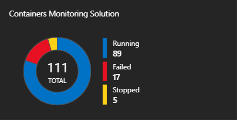

The tile shows an overview of how many containers you have in the environment and whether they're failed, running, or stopped.

### Using the Containers dashboard
Click the **Containers** tile. From there you'll see views organized by:

- **Container Events** - Shows container status and computers with failed containers.
- **Container Logs** - Shows a chart of container log files generated over time and a list of computers with the highest number of log files.
- **Kubernetes Events** - Shows a chart of Kubernetes events generated over time and a list of the reasons why pods generated the events. *This data set is used only in Linux environments.*
- **Kubernetes Namespace Inventory** - Shows the number of namespaces and pods and shows their hierarchy. *This data set is used only in Linux environments.*
- **Container Node Inventory** - Shows the number of orchestration types used on container nodes/hosts. The computer nodes/hosts are also listed by the number of containers. *This data set is used only in Linux environments.*
- **Container Images Inventory** - Shows the total number of container images used and number of image types. The number of images are also listed by the image tag.
- **Containers Status** - Shows the total number of container nodes/host computers that have running containers. Computers are also listed by the number of running hosts.
- **Container Process** - Shows a line chart of container processes running over time. Containers are also listed by running command/process within containers. *This data set is used only in Linux environments.*
- **Container CPU Performance** - Shows a line chart of the average CPU utilization over time for computer nodes/hosts. Also lists the computer nodes/hosts based on average CPU utilization.
- **Container Memory Performance** - Shows a line chart of memory usage over time. Also lists computer memory utilization based on instance name.
- **Computer Performance** - Shows line charts of the percent of CPU performance over time, percent of memory usage over time, and megabytes of free disk space over time. You can hover over any line in a chart to view more details.


Each area of the dashboard is a visual representation of a search that is run on collected data.

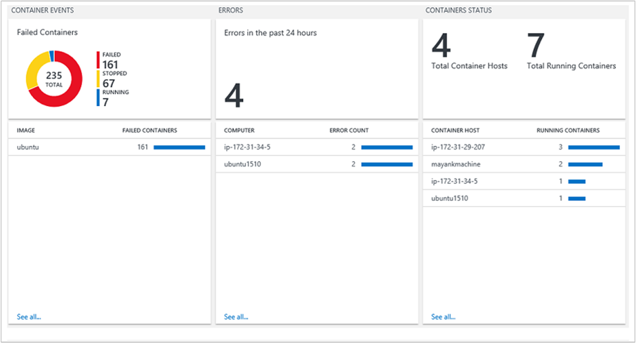

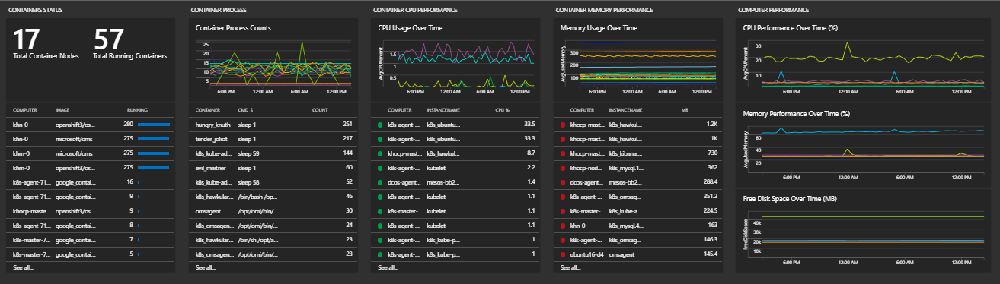

In the **Container Status** area, click the top area, as shown below.

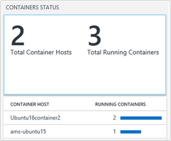

Log Search opens, displaying information about the state of your containers.

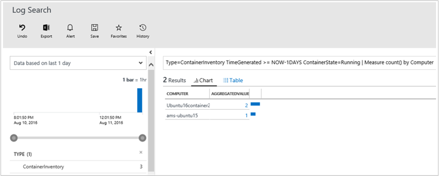

From here, you can edit the search query to modify it to find the specific information you're interested in. For more information about Log Searches, see [Log searches in Log Analytics](log-analytics-log-searches.md).

## Troubleshoot by finding a failed container

Log Analytics marks a container as **Failed** if it has exited with a non-zero exit code. You can see an overview of the errors and failures in the environment in the **Failed Containers** area.

### To find failed containers
1. Click the **Container Status** area.  
   
2. Log Search opens and displays the state of your containers, similar to the following.  
   
3. Next, click the aggregated value of failed containers to view additional information. Expand **show more** to view the image ID.  
   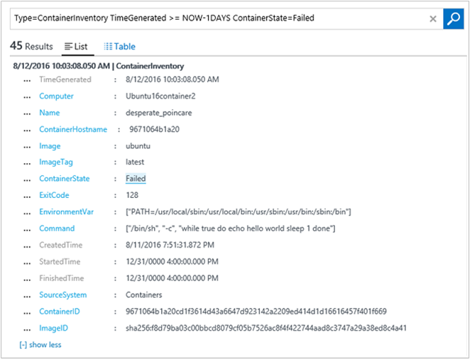  
4. Next, type the following in the search query. `ContainerInventory <ImageID>` to see details about the image such as image size and number of stopped and failed images.  
   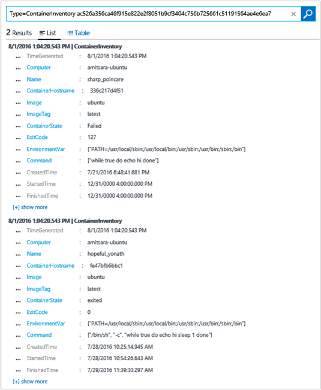

## Search logs for container data
When you're troubleshooting a specific error, it can help to see where it is occurring in your environment. The following log types will help you create queries to return the information you want.


- **ContainerImageInventory** – Use this type when you're trying to find information organized by image and to view image information such as image IDs or sizes.
- **ContainerInventory** – Use this type when you want information about container location, what their names are, and what images they're running.
- **ContainerLog** – Use this type when you want to find specific error log information and entries.
- **ContainerNodeInventory_CL**  Use this type when you want the information about host/node where containers are residing. It provides you Docker version, orchestration type, storage, and network information.
- **ContainerProcess_CL** Use this type to quickly see the process running within the container.
- **ContainerServiceLog** – Use this type when you're trying to find audit trail information for the Docker daemon, such as start, stop, delete, or pull commands.
- **KubeEvents_CL**  Use this type to see the Kubernetes events.
- **KubePodInventory_CL**  Use this type when you want to understand the cluster hierarchy information.


### To search logs for container data
* Choose an image that you know has failed recently and find the error logs for it. Start by finding a container name that is running that image with a **ContainerInventory** search. For example, search for `ContainerInventory | where Image == "ubuntu" and ContainerState == "Failed"`  
    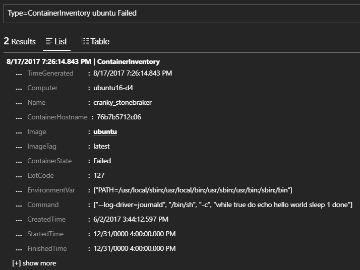

  The name of the container next to **Name**, and search for those logs. In this example, it is `ContainerLog | where Name == "cranky_stonebreaker"`.

**View performance information**

When you're beginning to construct queries, it can help to see what's possible first. For example, to see all performance data, try a broad query by typing the following search query.

```
Perf
```

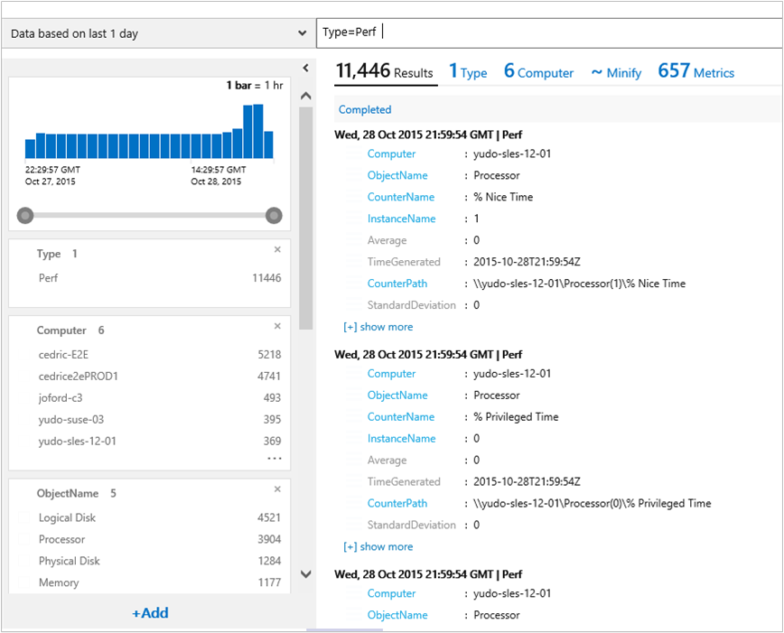

You can scope the performance data you're seeing to a specific container by typing the name of it to the right of your query.

```
Perf <containerName>
```

That shows the list of performance metrics that are collected for an individual container.

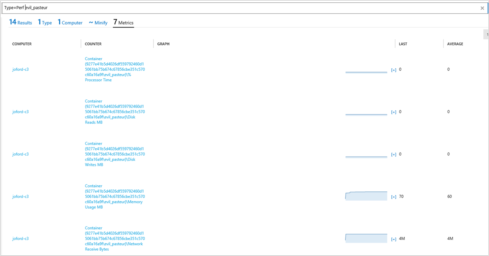

## Example log search queries
It's often useful to build queries starting with an example or two and then modifying them to fit your environment. As a starting point, you can experiment with the **Sample Queries** area to help you build more advanced queries.

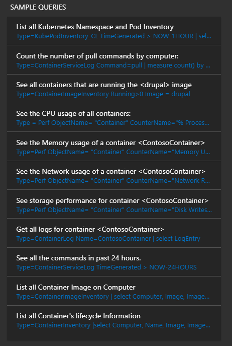


## Saving log search queries
Saving queries is a standard feature in Log Analytics. By saving them, you'll have those that you've found useful handy for future use.

After you create a query that you find useful, save it by clicking **Favorites** at the top of the Log Search page. Then you can easily access it later from the **My Dashboard** page.

## Next steps
* [Search logs](log-analytics-log-searches.md) to view detailed container data records.
