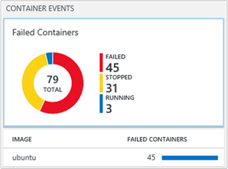
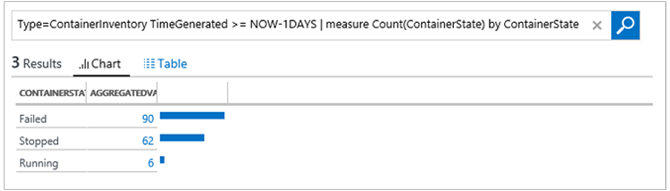

---
title: Containers solution in Azure Log Analytics | Microsoft Docs
description: The Containers solution in Log Analytics helps you view and manage your Docker and Windows container hosts in a single location.
services: log-analytics
documentationcenter: ''
author: bandersmsft
manager: carmonm
editor: ''
ms.assetid: e1e4b52b-92d5-4bfa-8a09-ff8c6b5a9f78
ms.service: log-analytics
ms.workload: na
ms.tgt_pltfrm: na
ms.devlang: na
ms.topic: article
ms.date: 06/29/2017
ms.author: banders

---
# Containers (Preview) solution in Log Analytics


This article describes how to set up and use the Containers solution in Log Analytics, which helps you view and manage your Docker and Windows container hosts in a single location. Docker is a software virtualization system used to create containers that automate software deployment to their IT infrastructure.

With the solution, you can see which containers are running on your container hosts and what images are running in the containers. You can view detailed audit information showing commands used with containers. And, you can troubleshoot containers by viewing and searching centralized logs without having to remotely view Docker or Windows hosts. You can find containers that may be noisy and consuming excess resources on a host. And, you can view centralized CPU, memory, storage, and network usage and performance information for containers. On computers running Windows, you can centralize and compare logs from Windows Server, Hyper-V, and Docker containers.

The following diagram shows the relationships between various container hosts and agents with OMS.


## Installing and configuring the solution
Use the following information to install and configure the solution.

Add the Containers solution to your OMS workspace from [Azure marketplace](https://azuremarketplace.microsoft.com/marketplace/apps/Microsoft.ContainersOMS?tab=Overview) or by using the process described in [Add Log Analytics solutions from the Solutions Gallery](log-analytics-add-solutions.md).

There are a few ways to install and use Docker with OMS:

* On supported Linux operating systems, install and run Docker and then install and configure the OMS Agent for Linux.
* On CoreOS, you cannot run the OMS Agent for Linux. Instead, you run a containerized version of the OMS Agent for Linux.
* On Windows Server 2016 and Windows 10, install the Docker Engine and client then connect an agent to gather information and send it to Log Analytics.


You can review the supported Docker and Linux operating system versions for your container host on [GitHub](https://github.com/Microsoft/OMS-docker).

### Container services

- If you have a Kubernetes cluster using the Azure Container Service, learn more at  [Monitor an Azure Container Service cluster with Microsoft Operations Management Suite (OMS)](../container-service/container-service-kubernetes-oms.md).
- If you have an Azure Container Service DC/OS cluster, learn more at [Monitor an Azure Container Service DC/OS cluster with Operations Management Suite](../container-service/container-service-monitoring-oms.md).
- If you have a Docker Swarm mode environment, learn more at [Configure an OMS agent for Docker Swarm](#configure-an-oms-agent-for-docker-swarm).
- If you use containers with Service Fabric, learn more at [Overview of Azure Service Fabric ](../service-fabric/service-fabric-overview.md).
- Review the [Docker Engine on Windows](https://docs.microsoft.com/virtualization/windowscontainers/manage-docker/configure-docker-daemon) article for additional information about how to install and configure your Docker Engines on computers running Windows.

> [!IMPORTANT]
> Docker must be running **before** you install the [OMS Agent for Linux](log-analytics-linux-agents.md) on your container hosts. If you've already installed the agent before installing Docker, you'll need to reinstall the OMS Agent for Linux. For more information about Docker, see the [Docker website](https://www.docker.com).
>
>

You need the following settings configured on your container hosts before you can monitor containers.

## Linux container hosts

Supported Linux versions:

- Docker 1.11 thru 1.13
- Docker CE and EE v17.03


The following x64 Linux distributions are supported as container hosts:

- Ubuntu 14.04 LTS, 16.04 LTS
- CoreOS(stable)
- Amazon Linux 2016.09.0
- openSUSE 13.2
- openSUSE LEAP 42.2
- CentOS 7.2, 7.3
- SLES 12
- RHEL 7.2, 7.3


After you've installed Docker, use the following settings for your container host to configure the agent for use with Docker. You'll need your [OMS workspace ID and key](log-analytics-linux-agents.md).


### For all Linux container hosts except CoreOS

- Follow the instructions at  [Steps to install the OMS Agent for Linux](https://github.com/Microsoft/OMS-Agent-for-Linux/blob/master/docs/OMS-Agent-for-Linux.md).

### For all Linux container hosts including CoreOS

Start the OMS container that you want to monitor. Modify and use the following example.

```
sudo docker run --privileged -d -v /var/run/docker.sock:/var/run/docker.sock -e WSID="your workspace id" -e KEY="your key" -h=`hostname` -p 127.0.0.1:25225:25225 --name="omsagent" --restart=always microsoft/oms
```

### For all Azure Government Linux container hosts including CoreOS

Start the OMS container that you want to monitor. Modify and use the following example.

```
sudo docker run --privileged -d -v /var/run/docker.sock:/var/run/docker.sock -v /var/log:/var/log -e WSID="your workspace id" -e KEY="your key" -e DOMAIN="opinsights.azure.us" -p 127.0.0.1:25225:25225 -p 127.0.0.1:25224:25224/udp --name="omsagent" -h=`hostname` --restart=always microsoft/oms
```


### Switching from using an installed Linux agent to one in a container
If you previously used the directly-installed agent and want to instead use an agent running in a container, you must first remove OMSAgent. See [Steps to install the OMS Agent for Linux](https://github.com/Microsoft/OMS-Agent-for-Linux/blob/master/docs/OMS-Agent-for-Linux.md).

### Configure an OMS agent for Docker Swarm

You can run the OMS Agent as a global service on Docker Swarm. Use the following information to create an OMS Agent service. You need to insert your Workspace ID and Primary Key.

- Run the following on the master node.

    ```
    sudo docker service create  --name omsagent --mode global  --mount type=bind,source=/var/run/docker.sock,destination=/var/run/docker.sock  -e WSID="<WORKSPACE ID>" -e KEY="<PRIMARY KEY>" -p 25225:25225 -p 25224:25224/udp  --restart-condition=on-failure microsoft/oms
    ```

### Secure your secret information for container services

You can secure your secret OMS Workspace ID and Primary Keys for Docker Swarm and Kubernetes.

#### Secure secrets for Docker Swarm

For Docker Swarm, once the secret for Workspace ID and Primary Key is created, you can run the create the Docker service for OMSagent. Use the following information to create your secret information.

1. Run the following on the master node.

    ```
    echo "WSID" | docker secret create WSID -
    echo "KEY" | docker secret create KEY -
    ```

2. Verify that secrets were created properly.

    ```
    keiko@swarmm-master-13957614-0:/run# sudo docker secret ls
    ```

    ```
    ID                          NAME                CREATED             UPDATED
    j2fj153zxy91j8zbcitnjxjiv   WSID                43 minutes ago      43 minutes ago
    l9rh3n987g9c45zffuxdxetd9   KEY                 38 minutes ago      38 minutes ago
    ```

3. Run the following command to mount the secrets to the containerized OMS Agent.

    ```
    sudo docker service create  --name omsagent --mode global  --mount type=bind,source=/var/run/docker.sock,destination=/var/run/docker.sock --secret source=WSID,target=WSID --secret source=KEY,target=KEY  -p 25225:25225 -p 25224:25224/udp --restart-condition=on-failure microsoft/oms
    ```

#### Secure secrets for Kubernetes with yaml files

For Kubernetes, you use a script to generate the secrets .yaml file for your Workspace ID and Primary Key. At the [OMS Docker Kubernetes GitHub](https://github.com/Microsoft/OMS-docker/tree/master/Kubernetes) page, there are files that you can use with or without your secret information.

- The Default OMS Agent DaemonSet which does not have secret information (omsagent.yaml)
- The OMS Agent DaemonSet yaml file which uses secret information (omsagent-ds-secrets.yaml) with secret generation scripts that generates the secrets yaml (omsagentsecret.yaml) file.

You can choose to create omsagent DaemonSets with or without secrets.

##### Default OMSagent DaemonSet yaml file without secrets

- For the default OMS Agent DaemonSet yaml file, replace the `<WSID>` and `<KEY>` to your WSID and KEY. Copy the file to your master node and run the following:

    ```
    sudo kubectl create -f omsagent.yaml
    ```

##### Default OMSagent DaemonSet yaml file with secrets

1. To use OMS Agent DaemonSet using secret information, create the secrets first.
    1. Copy the script and secret template file and make sure they are on the same directory.
        - Secret generating script - secret-gen.sh
        - secret template - secret-template.yaml
    2. Run the script, like the following example. The script asks for the OMS Workspace ID and Primary Key and after you enter them, the script creates a secret .yaml file so you can run it.   

        ```
        #> sudo bash ./secret-gen.sh
        ```

    3. Create the secrets pod by running the following:
        ```
        sudo kubectl create -f omsagentsecret.yaml
        ```

    4. To verify, run the following:

        ```
        keiko@ubuntu16-13db:~# sudo kubectl get secrets
        ```

        Output should resemble:

        ```
        NAME                  TYPE                                  DATA      AGE
        default-token-gvl91   kubernetes.io/service-account-token   3         50d
        omsagent-secret       Opaque                                2         1d
        ```

        ```
        keiko@ubuntu16-13db:~# sudo kubectl describe secrets omsagent-secret
        ```

        Output should resemble:

        ```
        Name:           omsagent-secret
        Namespace:      default
        Labels:         <none>
        Annotations:    <none>

        Type:   Opaque

        Data
        ====
        WSID:   36 bytes
        KEY:    88 bytes
        ```

    5. Create your omsagent daemon-set by running ``` sudo kubectl create -f omsagent-ds-secrets.yaml ```

2. Verify that the OMS Agent DaemonSet is running, similar to the following:

    ```
    keiko@ubuntu16-13db:~# sudo kubectl get ds omsagent
    ```

    ```
    NAME       DESIRED   CURRENT   NODE-SELECTOR   AGE
    omsagent   3         3         <none>          1h
    ```


For Kubernetes, use a script to generate the secrets yaml file for Workspace ID and Primary Key. Use the following example information with the [omsagent yaml file](https://github.com/Microsoft/OMS-docker/blob/master/Kubernetes/omsagent.yaml) to secure your secret information.

```
keiko@ubuntu16-13db:~# sudo kubectl describe secrets omsagent-secret
Name:           omsagent-secret
Namespace:      default
Labels:         <none>
Annotations:    <none>

Type:   Opaque

Data
====
WSID:   36 bytes
KEY:    88 bytes
```


## Windows container hosts

Supported Windows versions:

- Windows Server 2016
- Windows 10 Anniversary Edition (Professional or Enterprise)

### Docker versions supported on Windows

- Docker 1.12 – 1.13
- Docker 17.03.0 [stable]

### Preparation before installing Windows agents

Before you install agents on computers running Windows, you need to configure the Docker service. The configuration allows the Windows agent or the Log Analytics virtual machine extension to use the Docker TCP socket so that the agents can access the Docker daemon remotely and to capture data for monitoring.

#### To start Docker and verify its configuration

There are steps needed to set up TCP named pipe for Windows Server:

1. In Windows PowerShell, enable TCP pipe and named pipe.

    ```
    Stop-Service docker
    dockerd --unregister-service
    dockerd --register-service -H npipe:// -H 0.0.0.0:2375  
    Start-Service docker
    ```

2. Configure Docker with the configuration file for TCP pipe and named pipe. The configuration file is located at C:\ProgramData\docker\config\daemon.json.

    In the daemon.json file, you will need the following:

    ```
    {
    "hosts": ["tcp://0.0.0.0:2375", "npipe://"]
    }
    ```

For more information about the Docker daemon configuration used with Windows Containers, see [Docker Engine on Windows](https://docs.microsoft.com/virtualization/windowscontainers/manage-docker/configure-docker-daemon).


### Install Windows agents

To enable Windows and Hyper-V container monitoring, install agents on Windows computers that are container hosts. For computers running Windows in your on-premises environment, see [Connect Windows computers to Log Analytics](log-analytics-windows-agents.md). For virtual machines running in Azure, connect them to Log Analytics using the [virtual machine extension](log-analytics-azure-vm-extension.md).

You can monitor Windows containers running on Service Fabric. However, only [virtual machines running in Azure](log-analytics-azure-vm-extension.md) and [computers running Windows in your on-premises environment](log-analytics-windows-agents.md) are currently supported for Service Fabric.

To verify that the Containers solution is set correctly:

- Check whether the management pack was download properly, look for *ContainerManagement.xxx*.
    - The files should be in the C:\Program Files\Microsoft Monitoring Agent\Agent\Health Service State\Management Packs folder.
- Verify that the OMS Workspace ID is correct by going to **Control Panel** > **System and Security**.
    - Open **Microsoft Monitoring Agent** and verify that the workspace information is correct.


## Containers data collection details
The Containers solution collects various performance metrics and log data from container hosts and containers using agents that you  enable.

The following table shows data collection methods and other details about how data is collected for Containers.

| platform | [OMS Agent for Linux](log-analytics-linux-agents.md) | SCOM agent | Azure Storage | SCOM required? | SCOM agent data sent via management group | collection frequency |
| --- | --- | --- | --- | --- | --- | --- |
| Linux | | | | | |every 3 minutes |

| platform | [Windows agent](log-analytics-windows-agents.md) | SCOM agent | Azure Storage | SCOM required? | SCOM agent data sent via management group | collection frequency |
| --- | --- | --- | --- | --- | --- | --- |
| Windows | | | | | |every 3 minutes |

| platform | [Log Analytics VM extension](log-analytics-azure-vm-extension.md) | SCOM agent | Azure Storage | SCOM required? | SCOM agent data sent via management group | collection frequency |
| --- | --- | --- | --- | --- | --- | --- |
| Azure | | | | | |every 3 minutes |

The following table show examples of data types collected by the Containers solution and the data types that are used in Log Searches and results.

| Data type | Data type in Log Search | Fields |
| --- | --- | --- |
| Performance for hosts and containers | `Type=Perf` | Computer, ObjectName, CounterName &#40;%Processor Time, Disk Reads MB, Disk Writes MB, Memory Usage MB, Network Receive Bytes, Network Send Bytes, Processor Usage sec, Network&#41;, CounterValue,TimeGenerated, CounterPath, SourceSystem |
| Container inventory | `Type=ContainerInventory` | TimeGenerated, Computer, container name, ContainerHostname, Image, ImageTag, ContinerState, ExitCode, EnvironmentVar, Command, CreatedTime, StartedTime, FinishedTime, SourceSystem, ContainerID, ImageID |
| Container image inventory | `Type=ContainerImageInventory` | TimeGenerated, Computer, Image, ImageTag, ImageSize, VirtualSize, Running, Paused, Stopped, Failed, SourceSystem, ImageID, TotalContainer |
| Container log | `Type=ContainerLog` | TimeGenerated, Computer, image ID, container name, LogEntrySource, LogEntry, SourceSystem, ContainerID |
| Container service log | `Type=ContainerServiceLog`  | TimeGenerated, Computer, TimeOfCommand, Image, Command, SourceSystem, ContainerID |

## Monitor containers
After you have the solution enabled in the OMS portal, you'll see the **Containers** tile showing summary information about your container hosts and the containers running in hosts.


The tile shows an overview of how many containers you have in the environment and whether they're failed, running, or stopped.

### Using the Containers dashboard
Click the **Containers** tile. From there you'll see views organized by:

* Container Events
* Errors
* Containers Status
* Container Image Inventory
* CPU and Memory performance

Each pane in the dashboard is a visual representation of a search that is run on collected data.


In the **Container Status** blade, click to top area, as shown below.


Log Search opens, displaying information about the hosts and containers running in them.


From here, you can edit the search query to modify it to find the specific information you're interested in. For more information about Log Searches, see [Log searches in Log Analytics](log-analytics-log-searches.md).

For example, you can modify the search query so that it shows all the stopped containers instead of the running containers by changing **Running** to **Stopped** in the search query.

## Troubleshoot by finding a failed container
OMS marks a container as **Failed** if it has exited with a non-zero exit code. You can see an overview of the errors and failures in the environment in the **Failed Containers** blade.

### To find failed containers
1. Click the **Container Events** blade.  
   
2. Log Search opens, displaying the status of containers, similar to the following.  
   
3. Next, click the failed value to view additional information such as image size and number of stopped and failed images. Expand **show more** to view the image ID.  
   
4. Next, find the container that is running this image. Type the following into the search query.
   `Type=ContainerInventory <ImageID>`
   This displays the logs. You can scroll to see the failed container.  
   

## Search logs for container data
When you're troubleshooting a specific error, it can help to see where it is occurring in your environment. The following log types will help you create queries to return the information you want.

* **ContainerInventory** – Use this type when you want information about container location, what their names are, and what images they're running.
* **ContainerImageInventory** – Use this type when you're trying to find information organized by image and to view image information such as image IDs or sizes.
* **ContainerLog** – Use this type when you want to find specific error log information and entries.
* **ContainerServiceLog** – Use this type when you're trying to find audit trail information for the Docker daemon, such as start, stop, delete, or pull commands.

### To search logs for container data
* Choose an image that you know has failed recently and find the error logs for it. Start by finding a container name that is running that image with a **ContainerInventory** search. For example, search for `Type=ContainerInventory ubuntu Failed`  
    

  Note the name of the container next to **Name**, and search for those logs. In this example, it is `Type=ContainerLog adoring_meitner`.

**View performance information**

When you're beginning to construct queries, it can help to see what's possible first. For example, to see all performance data, try a broad query by typing the following search query.

```
Type=Perf
```


You can see this in a more graphical form when you click the word **Metrics** in the results.


You can scope the performance data you're seeing to a specific container by typing the name of it to the right of your query.

```
Type=Perf <containerName>
```

That shows the list of performance metrics that are collected for an individual container.


## Example log search queries
It's often useful to build queries starting with an example or two and then modifying them to fit your environment. As a starting point, you can experiment with the **Notable Queries** blade to help you build more advanced queries.


## Saving log search queries
Saving queries is a standard feature in Log Analytics. By saving them, you'll have those that you've found useful handy for future use.

After you create a query that you find useful, save it by clicking **Favorites** at the top of the Log Search page. Then you can easily access it later from the **My Dashboard** page.

## Next steps
* [Search logs](log-analytics-log-searches.md) to view detailed container data records.
