<properties
   pageTitle="Custom fields in Log Analytics | Microsoft Azure"
   description="The Custom Fields feature of Log Analytics allows you to create your own searchable fields from OMS data that add to the properties of a collected record.  This article describes the process to create a custom field and provides a detailed walkthrough with a sample event."
   services="log-analytics"
   documentationCenter=""
   authors="bwren"
   manager="jwhit"
   editor="tysonn" />
<tags
   ms.service="log-analytics"
   ms.devlang="na"
   ms.topic="article"
   ms.tgt_pltfrm="na"
   ms.workload="infrastructure-services"
   ms.date="07/25/2016"
   ms.author="bwren" />

# Custom fields in Log Analytics

The **Custom Fields** feature of Log Analytics allows you to extend existing records in the OMS repository by adding your own searchable fields.  Custom fields are automatically populated from data extracted from other properties in the same record.

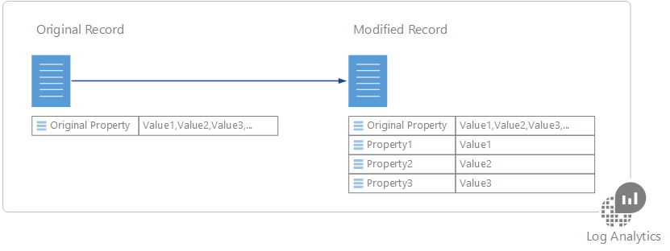

For example, the sample record below has useful data buried in the event description.  Extracting this data into separate properties makes it available for such actions as sorting and filtering.

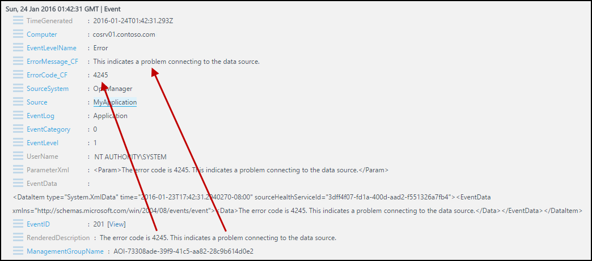

>[AZURE.NOTE] In the Preview, you are limited to 100 custom fields in your workspace.  This limit will be expanded when this feature reaches general availability.

## Creating a custom field

When you create a custom field, Log Analytics must understand which data to use to populate its value.  It uses a technology from Microsoft Research called FlashExtract to quickly identify this data.  Rather than requiring you to provide explicit instructions, Log Analytics learns about the data you want to extract from examples that you provide.

The following sections provide the procedure for creating a custom field.  At the bottom of this article is a walkthrough of a sample extraction.

> [!NOTE] The custom field is populated as records matching the specified criteria are added to the OMS data store, so it will only appear on records collected after the custom field is created.  The custom field will not be added to records that are already in the data store when it’s created.

### Step 1 – Identify records that will have the custom field
The first step is to identify the records that will get the custom field.  You start with a [standard log search](log-analytics-log-searches.md) and then select a record to act as the model that Log Analytics will learn from.  When you specify that you are going to extract data into a custom field, the **Field Extraction Wizard** is opened where you validate and refine the criteria.

2. Go to **Log Search** and use a [query to retrieve the records](log-analytics-log-searches.md) that will have the custom field.
2. Select a record that Log Analytics will use to act as a model for extracting data to populate the custom field.  You will identify the data that you want to extract from this record, and Log Analytics will use this information to determine the logic to populate the custom field for all similar records.
3. Click the button to the left of any text property of the record and select **Extract fields from**.
4. The **Field Extraction Wizard is opened**, and the record you selected is displayed in the **Main Example** column.  The custom field will be defined for those records with the same values in the properties that are selected.  
5. If the selection is not exactly what you want, select additional fields to narrow the criteria.  In order to change the field values for the criteria, you must cancel and select a different record matching the criteria you want.

### Step 2 - Perform initial extract.
Once you’ve identified the records that will have the custom field, you identify the data that you want to extract.  Log Analytics will use this information to identify similar patterns in similar records.  In the step after this you will be able to validate the results and provide further details for Log Analytics to use in its analysis.

1. Highlight the text in the sample record that you want to populate the custom field.  You will then be presented with a dialog box to provide a name for the field and to perform the initial extract.  The characters **\_CF** will automatically be appended.
2. Click **Extract** to perform an analysis of collected records.  
3. The **Summary** and **Search Results** sections display the results of the extract so you can inspect its accuracy.  **Summary** displays the criteria used to identify records and a count for each of the data values identified.  **Search Results** provides a detailed list of records matching the criteria.

### Step 3 – Verify accuracy of the extract and create custom field

Once you have performed the initial extract, Log Analytics will display its results based on data that has already been collected.  If the results look accurate then you can create the custom field with no further work.  If not, then you can refine the results so that Log Analytics can improve its logic.

2.	If any values in the initial extract aren’t correct, then click the **Edit** icon next to an inaccurate record and select **Modify this highlight** in order to modify the selection.
3.	The entry is copied to the **Additional examples** section underneath the **Main Example**.  You can adjust the highlight here to help Log Analytics understand the selection it should have made.
4.	Click **Extract** to use this new information to evaluate all the existing records.  The results may be modified for records other than the one you just modified based on this new intelligence.
5.	Continue to add corrections until all records in the extract correctly identify the data to populate the new custom field.
6. Click **Save Extract** when you are satisfied with the results.  The custom field is now defined, but it won’t be added to any records yet.
7.	Wait for new records matching the specified criteria to be collected and then run the log search again. New records should have the custom field.
8.	Use the custom field like any other record property.  You can use it to aggregate and group data and even use it to produce new insights.

## Viewing custom fields
You can view a list of all custom fields in your management group from the **Settings** tile of the OMS dashboard.  Select **Data** and then **Custom fields** for a list of all custom fields in your workspace.  

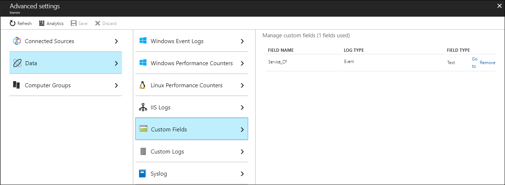

## Removing a custom field
There are two ways to remove a custom field.  The first is the **Remove** option for each field when viewing the complete list as described above.  The other method is to retrieve a record and click the button to the left of the field.  The menu will have an option to remove the custom field.

## Sample walkthrough

The following section walks through a complete example of creating a custom field.  This example extracts the service name in Windows events that indicate a service changing state.  This relies on events created by Service Control Manager in the System log on Windows computers.  If you want to follow this example, you must be [collecting Information events for the System log](log-analytics-data-sources-windows-events.md).

We enter the following query to return all events from Service Control Manager that have an Event ID of 7036 which is the event that indicates a service starting or stopping.

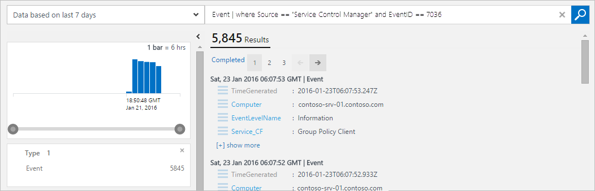

We then select any record with event ID 7036.

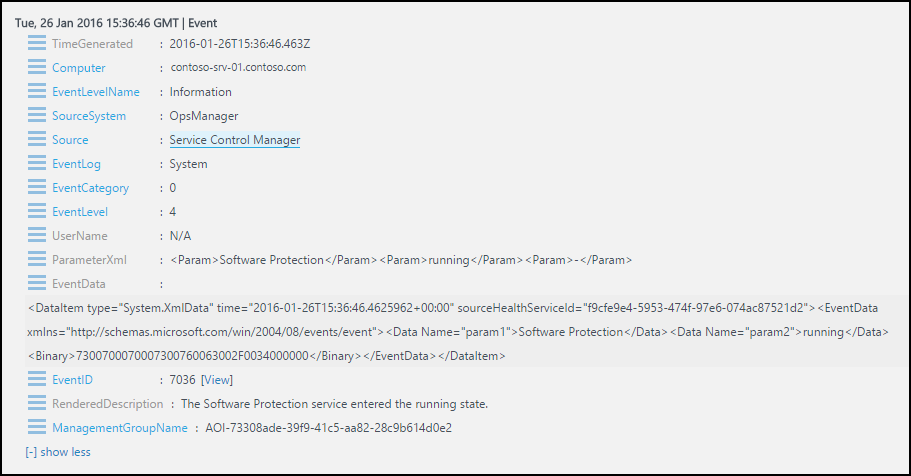

We want the service name that appears in the **RenderedDescription** property and select the button next to this property.

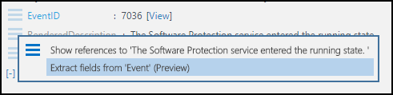

The **Field Extraction Wizard** is opened, and the **EventLog** and **EventID** fields are selected in the **Main Example** column.  This indicates that the custom field will be defined for events from the System log with an event ID of 7036.  This is sufficient so we don’t need to select any other fields.

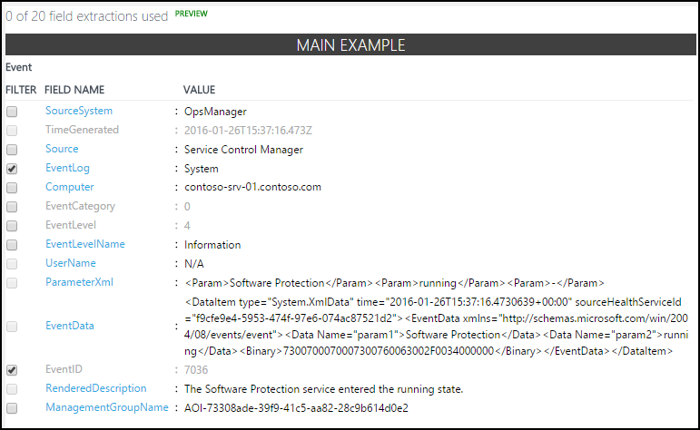

We highlight the name of the service in the **RenderedDescription** property and use **Service** to identify the service name.  The custom field will be called **Service_CF**.

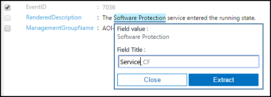

We see that the service name is identified properly for some records but not for others.   The **Search Results** show that part of the name for the **WMI Performance Adapter** wasn’t selected.  The **Summary** shows that four records with **DPRMA** service incorrectly included an extra word, and two records identified **Modules Installer** instead of **Windows Modules Installer**.  

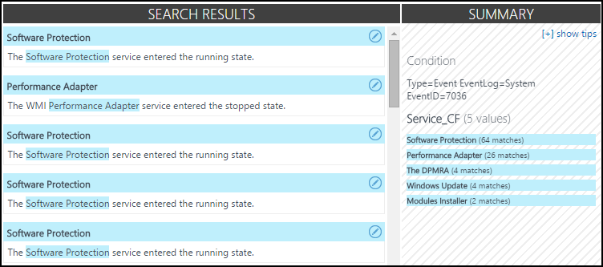

We start with the **WMI Performance Adapter** record.  We click its edit icon and then **Modify this highlight**.  

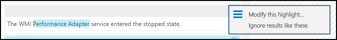

We increase	the highlight to include the word **WMI** and then rerun the extract.  

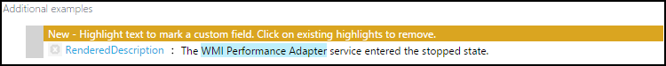

We can see that the entries for **WMI Performance Adapter** have been corrected, and Log Analytics also used that information to correct the records for **Windows Module Installer**.  We can see in the **Summary** section though that **DPMRA** is still not being identified correctly.

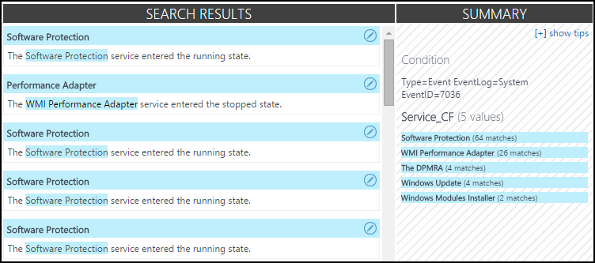

We scroll to a record with the DPMRA service and use the same process to correct that record.

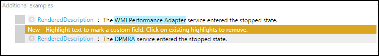

 When we run the extraction, we can see that all of our results are now accurate.

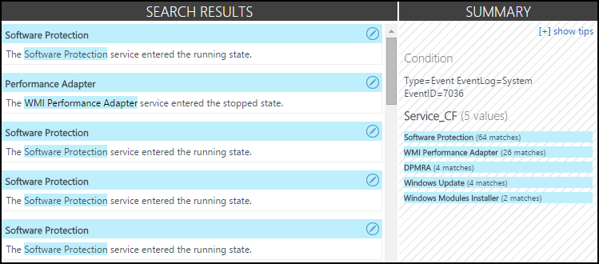

We can see that **Service_CF** is created but is not yet added to any records.

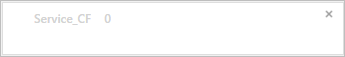

After some time has passed so new events are collected, we can see that that the **Service_CF** field is now being added to records that match our criteria.

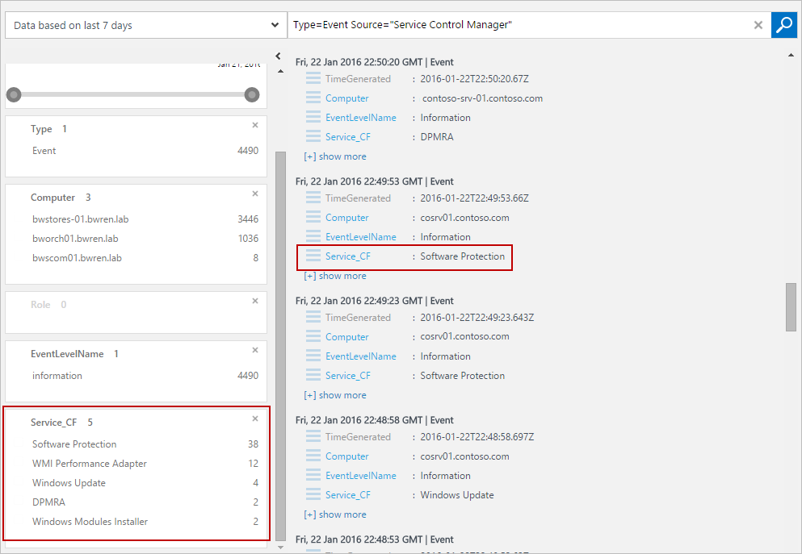

We can now use the custom field like any other record property.  To illustrate this, we create a query that groups by the new **Service_CF** field to inspect which services are the most active.

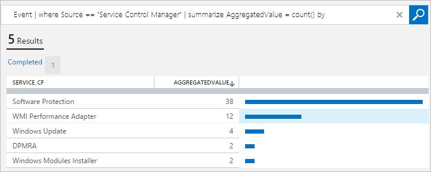

## Next steps

- Learn about [log searches](log-analytics-log-searches.md) to build queries using custom fields for criteria.
- Monitor [custom log files](log-analytics-data-sources-custom-logs.md) that you parse using custom fields.