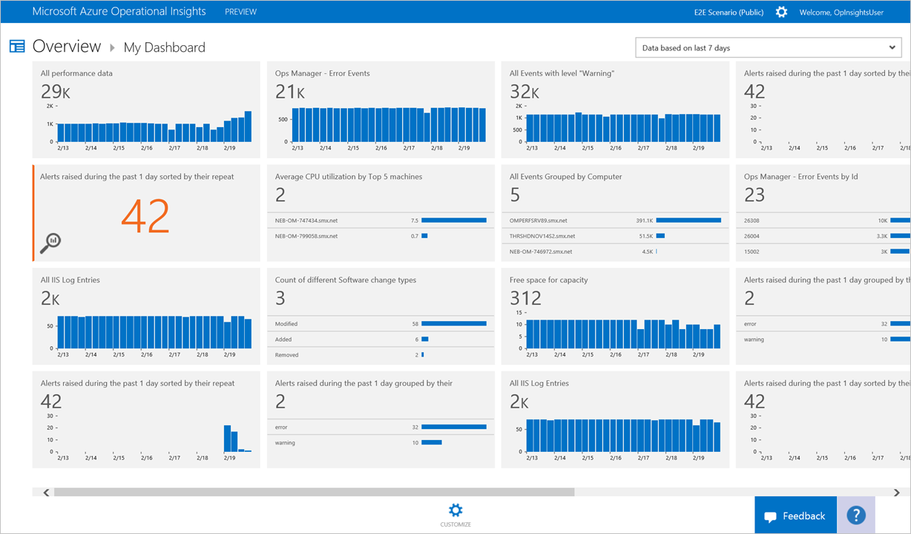
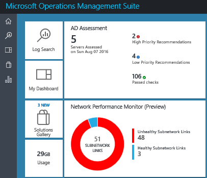
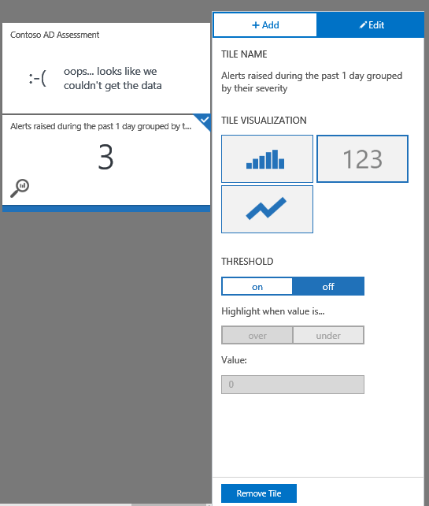
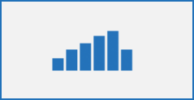
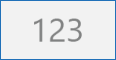
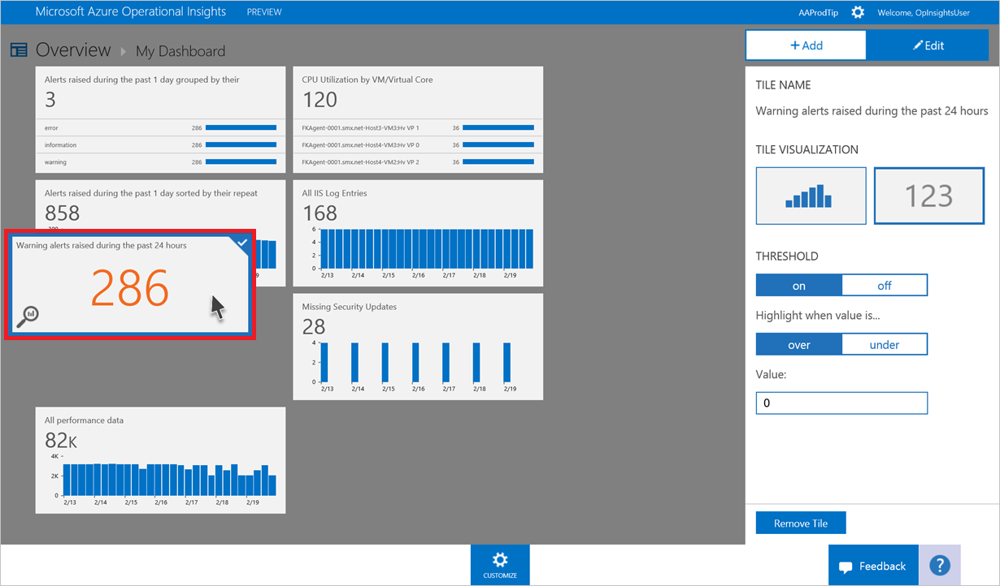
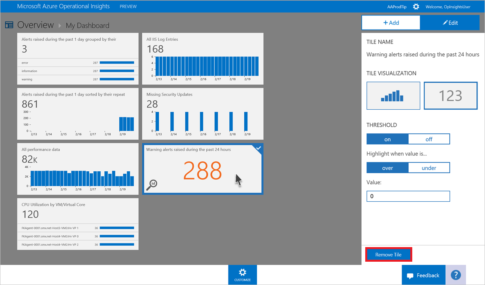

<properties
	pageTitle="Create a custom dashboard in Log Analytics | Microsoft Azure"
	description="This guide helps you understand how Log Analytics Dashboards can visualize all of your saved log searches, giving you a single lens to view your environment."
	services="log-analytics"
	documentationCenter=""
	authors="bandersmsft"
	manager="jwhit"
	editor=""/>

<tags
	ms.service="log-analytics"
	ms.workload="na"
	ms.tgt_pltfrm="na"
	ms.devlang="na"
	ms.topic="article"
	ms.date="08/08/2016"
	ms.author="banders"/>

# Create a custom dashboard in Log Analytics

This guide helps you understand how Log Analytics dashboards can visualize all of your saved log searches, giving you a single lens to view your environment.

All the custom dashboards that you create in the OMS portal are also available in the OMS Mobile App. See the following pages for more information about the apps.

- [OMS mobile app from the Microsoft Store](http://www.windowsphone.com/store/app/operational-insights/4823b935-83ce-466c-82bb-bd0a3f58d865)
- [OMS mobile app from Apple iTunes](https://itunes.apple.com/app/microsoft-operations-management/id1042424859?mt=8)

## How do I create my dashboard?

To begin, go to the OMS Overview page. You'll see the **My Dashboard** tile on the left. Click it to drill down into your dashboard.

## Adding a tile

In dashboards, tiles are powered by your saved log searches. OMS comes with many pre-made saved log searches, so you can begin right away. Use the following steps that outline how to begin.

In the My Dashboard view, simply click **Customize** to enter customize mode.

 The panel that opens on the right side of the page shows all of your workspace's saved log searches. To visualize a saved log search as a tile,  hover over a saved search and then click the **plus** symbol.

When you click the **plus** symbol, a new tile appears in the My Dashboard view.

## Edit a tile

In the My Dashboard view, simply click  **Customize** to enter customize mode. Click the tile you want to edit. The right panel changes to edit, and gives a selection of options:

### Tile visualizations#
There are three kinds of tile visualizations to choose from:

|chart type|what it does|
|---|---|
||Displays a timeline of your saved log search's results as a bar chart, or a list of results by a field depending on if your log search aggregates results by a field or not.
||Displays your total log search result hits as a number in a tile. Metric tiles allow you to set a threshold that will highlight the tile when the threshold is reached.|
||Displays a timeline of your saved log search result hits with values as a line chart.|

### Threshold
You can create a threshold on a tile using the Metric visualization. Select on to create a threshold value on the tile. Choose whether to highlight the tile when the value is over or under the chosen threshold, then set the threshold value below.

## Organizing the dashboard
To organize your dashboard, navigate to the My Dashboard view and click **Customize** to enter customize mode. Click and drag the tile you want to move, and move it to where you want your tile to be.

## Remove a tile
To remove a tile, navigate to the My Dashboard view and click **Customize** to enter customize mode. Select the tile you want to remove, then on the right panel select **Remove Tile**.

## Next steps

- Create [alerts](log-analytics-alerts.md) in Log Analytics to generate notifications and to remediate problems.
