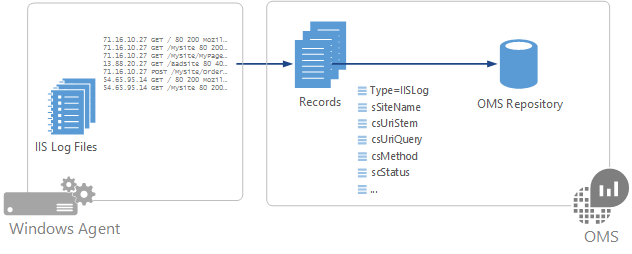

<properties 
   pageTitle="IIS logs in Log Analytics"
   description="Internet Information Services (IIS) stores user activity in log files that can be collected by Log Analytics.  This article describes how to configure collection of IIS logs and details of the records they create in the OMS repository.""
   services="log-analytics"
   documentationCenter=""
   authors="bwren"
   manager="jwhit"
   editor="tysonn" />
<tags 
   ms.service="log-analytics"
   ms.devlang="na"
   ms.topic="article"
   ms.tgt_pltfrm="na"
   ms.workload="infrastructure-services"
   ms.date="04/22/2016"
   ms.author="bwren" />

# IIS logs in Log Analytics
Internet Information Services (IIS) stores user activity in log files that can be collected by Log Analytics.  

## Configuring IIS logs
Log Analytics collects entries from log files created by IIS, so you must [configure IIS for logging](https://technet.microsoft.com/library/hh831775.aspx) and select the fields that you want Log Analytics to collect.  IIS does not log all fields by default, so you may want to manually select additional fields beyond the default. 

Log Analytics only supports IIS log files stored in W3C format.  It will not collect logs in NCSA or IIS native format.

Configure IIS logs in Log Analytics from the [Data menu in Log Analytics Settings](log-analytics-data-sources.md/configuring-data-sources).  There is no configuration required other than selecting **Collect W3C format IIS log files**.

## Data collection

Log Analytics will collect IIS log entries from each connected source approximately every 15 minutes.  The agent will record its place in each event log that it collects from.  If the agent goes offline for a period of time, then Log Analytics will collect events from where it last left off, even if those events were created while the agent was offline.

## IIS log record properties

IIS log records have a type of **W3CIISLog** and have the [standard properties of all Log Analytics records](log-analytics-data-sources.md#log-analytics-records) in addition to the properties in the following table.

| Property | Description |
|:--|:--|
| sSiteName | Name of the IIS site. |
| csMethod | Method of the request such as GET or POST. |
| scStatus | HTTP status code. |
| Computer | Name of the computer that the event was collected from. |
| RemoteIPCountry | Country of the IP address of the client. |
| sIP | IP address of the web server. |
| cIP | IP address of the client. |
| TimeTaken | Length of time to process the request in milliseconds. |
| csUriStem | Target of the request such as a web page. |
| csUriQuery | Query, if any, that the client was trying to perform. |
| sPort | Port on the server the client connected to. |
| csUserAgent | Browser type of the client. |
| csReferer | Site that the user followed a link from to the current site. |
| scSubStatus | Substatus  error code. |
| scWin32Status | Windows status code. |
| ManagementGroupName | Name of the management group for SCOM agents.  For other agents, this is AOI-<workspace ID> |
| RemoteIPLongitude | Longitude of the client IP address. |
| RemoteIPLatitude | Latitude of the client IP address. |
| csUserName | Name of the authenticated user that accessed the server. Anonymous users are indicated by a hyphen. |

## Log searches with IIS logs

The following table provides different examples of log queries that retrieve IIS log records.

| Query | Description |
|:--|:--|
| Type=IISLog | All IIS log records. |
| Type=IISLog EventLevelName=error | All Windows events with severity of error. |
| Type=W3CIISLog &#124; Measure count() by cIP | Count of IIS log entries by client IP address. |
| Type=W3CIISLog csHost="www.contoso.com" &#124; Measure count() by csUriStem | Count of IIS log entries by URL for the host www.contoso.com. |
| Type=W3CIISLog &#124; Measure Sum(csBytes) by Computer &#124; top 500000| Total bytes received by each IIS computer. |

## Next steps

- Configure Log Analytics to collect other [data sources](log-analytics-data-sources.md) for analysis.
- Learn about [log searches](log-analytics-log-searches.md) to analyze the data collected from data sources and solutions. 
- Configure alerts in Log Analytics to proactively notify you of important conditions found in IIS logs.