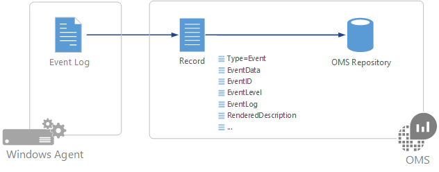
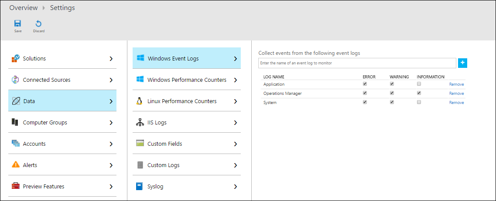

<properties 
   pageTitle="Windows Event logs in Log Analytics | Microsoft Azure"
   description="Windows Event logs are one of the most common data sources used by Log Analytics.  This article describes how to configure collection of Windows Event logs and details of the records they create in the OMS repository."
   services="log-analytics"
   documentationCenter=""
   authors="bwren"
   manager="jwhit"
   editor="tysonn" />
<tags 
   ms.service="log-analytics"
   ms.devlang="na"
   ms.topic="article"
   ms.tgt_pltfrm="na"
   ms.workload="infrastructure-services"
   ms.date="07/25/2016"
   ms.author="bwren" />

# Windows event log data sources in Log Analytics

Windows Event logs are one of the most common [data sources](log-analytics-data-sources.md) used for Windows agents since this is the method used by most applications to log information and errors.  You can collect events from standard logs such as System and Application in addition to specifying any custom logs created by applications you need to monitor.

     

## Configuring Windows Event logs

Configure Windows Event logs from the [Data menu in Log Analytics Settings](log-analytics-data-sources.md#configuring-data-sources).

Log Analytics will only collect events from the Windows event logs that are specified in the settings.  You can add a new log by typing in the name of the log and clicking **+**.  For each log, only events with the selected severities will be collected.  Check the severities for the particular log that you want to collect.  You cannot provide any additional criteria to filter events.

## Data collection

Log Analytics will collect each event that matches a selected severity from a monitored event log as the event is created.  The agent will record its place in each event log that it collects from.  If the agent goes offline for a period of time, then Log Analytics will collect events from where it last left off, even if those events were created while the agent was offline.

## Windows event records properties

Windows event records have a type of **Event** and have the properties in the following table.

| Property | Description |
|:--|:--|
| Computer            | Name of the computer that the event was collected from. |
| EventCategory       | Category of the event. |
| EventData           | All event data in raw format. |
| EventID             | Number of the event. |
| EventLevel          | Severity of the event in numeric form. |
| EventLevelName      | Severity of the event in text form. |
| EventLog            | Name of the event log that the event was collected from. |
| ParameterXml        | Event parameter values in XML format. |
| ManagementGroupName | Name of the management group for SCOM agents.  For other agents, this is AOI-<workspace ID> |
| RenderedDescription | Event description with parameter values |
| Source              | Source of the event. |
| SourceSystem  | Type of agent the event was collected from.   OpsManager – Windows agent, either direct connect or SCOM   Linux – All Linux agents    AzureStorage – Azure Diagnostics |
| TimeGenerated       | Date and time the event was created in Windows. |
| UserName            | User name of the account that logged the event. |

## Log searches with Windows Events

The following table provides different examples of log searches that retrieve Windows Event records.

| Query | Description |
|:--|:--|
| Type=Event | All Windows events. |
| Type=Event EventLevelName=error | All Windows events with severity of error. |
| Type=Event &#124; Measure count() by Source | Count of Windows events by source. |
| Type=Event EventLevelName=error &#124; Measure count() by Source | Count of Windows error events by source. |

## Next steps

- Configure Log Analytics to collect other [data sources](log-analytics-data-sources.md) for analysis.
- Learn about [log searches](log-analytics-log-searches.md) to analyze the data collected from data sources and solutions.  
- Use [Custom Fields](log-analytics-custom-fields.md) to parse the event records into individual fields.
- Configure [collection of performance counters](log-analytics-data-sources-performance-counters.md) from your Windows agents.