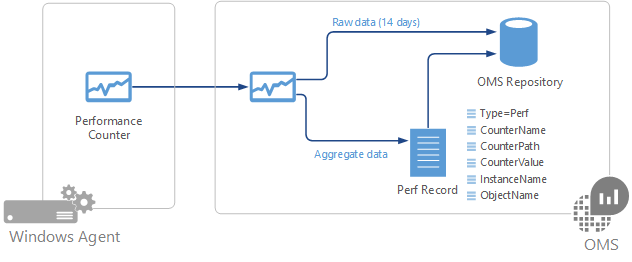
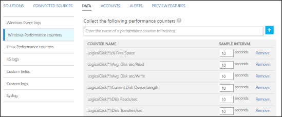
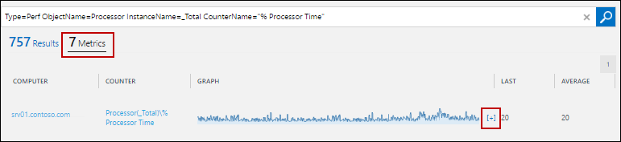

<properties 
   pageTitle="Windows Performance counters in Log Analytics"
   description="Windows Performance counters are collected by Log Analytics to analyze performance on Windows agents.  They can be collected at frequent intervals to provide Near Real Time (NRT) analysis in addition to aggregated over longer intervals.  This article describes how to configure collection of Windows Performance counters, details of they are stored in the OMS repository, and how to analyze them in the OMS portal."
   services="log-analytics"
   documentationCenter=""
   authors="bwren"
   manager="jwhit"
   editor="tysonn" />
<tags 
   ms.service="log-analytics"
   ms.devlang="na"
   ms.topic="article"
   ms.tgt_pltfrm="na"
   ms.workload="infrastructure-services"
   ms.date="04/29/2016"
   ms.author="bwren" />

Performance counters in Windows provide with insight in the performance of hardware components, operating systems, and applications.  Log Analytics can collect Windows performance counters at frequent intervals for Near Real Time (NRT) analysis in addition to aggregating performance data for longer term analysis and reporting.

# Configuring Windows Performance counters

When you first configure Windows Performance counters for a new OMS workspace, you will be given the option to quickly create several common counters.  They will listed with a checkbox next to each.  Ensure that any counters you want to initially create are checked and then click **Add the selected performance counters**.

Follow this procedure to add a new performance counter to collect.

1. Type the name of the counter in the text box in the format *object(instance)\counter*.  When you start typing, you will be presented with a matching list of common counters.  You can either select a counter from the list or type in one of your own.  You can also return all instances for a particular counter by specifying *object\counter*. 
2. Click **+** or press **Enter** to add the counter to the list.
3. When you add a counter, it will use the default of 10 seconds for its **Sample Interval**.  You can change this to a higher value of up to 1800 seconds (30 minutes) if you want to reduce the storage requirements of the collected performance data.
4. When you're done adding counters, click the **Save** button at the top of the screen to save the configuration.

# Data collection

Log Analytics will collect all specified performance counters at their specified sample interval on all Windows agents that have that counter installed.  Raw data will be available for 14 days in the expanded graph view in the OMS console.  

All collected performance data is aggregated at 30 minute intervals.  The aggregated data is available in all log search views for the duration specified by your OMS subscription.

# Windows Performance record properties

Windows Performance records are created from performance data aggregated over 30 minute intervals.  The value for the record is the average value of the counter fore the previous 30 minutes.  Records are not created for raw NRT data.  The raw data is only available in the **Metrics** view of the OMS console.

Windows Performance records have a type of **Perf** and have the [standard properties of all Log Analytics records](log-analytics-data-sources.md#log-analytics-events) in addition to the properties in the following table.

| Property | Description |
|:--|:--|
| Computer         | Computer that the event was collected from. |
| CounterName      | Name of the performance counter |
| CounterPath      | Full path of the counter in the form \\\\\<Computer>\\object(instance)\\counter. |
| CounterValue     | Numeric value of the counter aggregated over 30 minutes.  |
| InstanceName     | Name of the event instance.  Empty if no instance. |
| ObjectName       | Name of the performance object |

# Sizing estimates

 A rough estimate for collection of a particular counter at 10 second intervals is about 1 MB per day per instance.  You can estimate the storage requirements of a particular counter with the following formula.

	1 MB x (number of counters) x (number of agents) x (number of instances)

# Log queries with Windows Performance records

The record type for a Windows Performance counter record is **Perf**.  The following table provides different examples of log queries that retrieve Windows Perf records.

| Query | Description |
|:--|:--|
| Type=Perf | All Windows and Linux Performance data |
| Type=Perf Computer="MyComputer" | All Windows Performance data from a particular computer |
| Type=Perf CounterName="Current Disk Queue Length" | All Windows Performance data for a particular counter |
| Type=Perf (ObjectName=Processor) CounterName="% Processor Time" InstanceName=_Total &#124; measure Avg(Average) as AVGCPU  by Computer | Average CPU Utilization across all computers |
| Type=Perf (CounterName="% Processor Time") &#124;  measure max(Max) by Computer | Maximum CPU Utilization across all computers |
| Type=Perf ObjectName=LogicalDisk CounterName="Current Disk Queue Length" Computer="MyComputerName" &#124; measure Avg(Average) by InstanceName | Average Current Disk Queue length across all  the instances of a given computer |
| Type=Perf CounterName="DiskTransfers/sec" &#124; measure percentile95(Average) by Computer | 95th Percentile of Disk Transfers/Sec across all computers |
| Type=Perf CounterName="% Processor Time" InstanceName="_Total"  &#124; measure avg(CounterValue) by Computer Interval 1HOUR | Hourly average of CPU usage across all computers |
| Type=Perf Computer="MyComputer" CounterName=%* InstanceName=_Total &#124; measure percentile70(CounterValue) by CounterName Interval 1HOUR | Hourly 70 percentile of every % percent counter for a particular computer |
| Type=Perf CounterName="% Processor Time" InstanceName="_Total"  (Computer="MyComputer") &#124; measure min(CounterValue), avg(CounterValue), percentile75(CounterValue), max(CounterValue) by Computer Interval 1HOUR | Hourly average, minimum, maximum, and 75-percentile CPU usage for a specific computer |

## Viewing performance data

When you run a log search for performance data, the **Log** view is displayed by default.  This view includes aggregated performance records.  To view the data in graphical form, click **Metrics**.  Click the **+** next to the particular counter that you want to view.

If the time range you have selected is 6 hours or less, then the graph will display NRT data and will updated every few seconds.  The live data will be displayed on the right side of the graph in light blue.  If you have a time range greater than 6 hours then the graph uses aggregate data.

## Next steps

- Learn about log searches to analyze the data collected from data sources and solutions. 
- Configure [collection of performance counters](log-analytics-data-sources-windows-performance-counters.md) from your Windows agents.
- Export collected data to Power BI for additional visualizations and analysis.