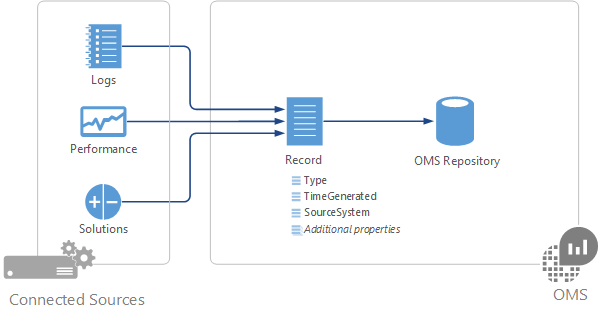
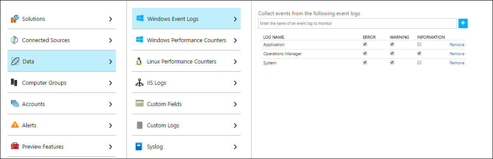

# Data sources in Log Analytics
Log Analytics collects data from your Connected Sources and stores it in your Log Analytics workspace.  The data that is collected from each is defined by the Data Sources that you configure.  Data in Log Analytics is stored as a set of records.  Each data source creates records of a particular type with each type having its own set of properties.

Data Sources are different than [management solutions](log-analytics-add-solutions.md), which also collect data from Connected Sources and create records in Log Analytics.  In addition to 
collecting data, solutions typically include log searches and views to help you analyze the operation of a particular application or service.

## Summary of data sources
The following table lists the data sources that are currently available in Log Analytics.  Each has a link to a separate article providing detail for that data source.   It also provides information on their method and frequency of data collection into Log Analytics.  You can use the information in this article to identify the different solutions available and to understand the data flow and connection requirements for different management solutions. For explanations of the columns, see [Data collection details for management solutions in Azure](../monitoring/monitoring-solutions-inventory.md).

| Data source | Platform | Microsoft monitoring agent | Operations Manager agent | Azure storage | Operations Manager required? | Operations Manager agent data sent via management group | Collection frequency |
| --- | --- | --- | --- | --- | --- | --- | --- | --- |
| [Custom logs](log-analytics-data-sources-custom-logs.md) | Windows |&#8226; |  | |  |  | on arrival |
| [Custom logs](log-analytics-data-sources-custom-logs.md) | Linux   |&#8226; |  | |  |  | on arrival |
| [IIS logs](log-analytics-data-sources-iis-logs.md) | Windows |&#8226; |&#8226; |&#8226; |  |  |depends on Log File Rollover setting |
| [Performance counters](log-analytics-data-sources-performance-counters.md) | Windows |&#8226; |&#8226; |  |  |  |as scheduled, minimum of 10 seconds |
| [Performance counters](log-analytics-data-sources-performance-counters.md) | Linux |&#8226; |  |  |  |  |as scheduled, minimum of 10 seconds |
| [Syslog](log-analytics-data-sources-syslog.md) | Linux |&#8226; |  |  |  |  |from Azure storage: 10 minutes; from agent: on arrival |
| [Windows Event logs](log-analytics-data-sources-windows-events.md) |Windows |&#8226; |&#8226; |&#8226; |  |&#8226; | on arrival |

## Configuring data sources
You configure data sources from the **Data** menu in Log Analytics **Advanced Settings**.  Any configuration is delivered to all connected sources in your workspace.  You cannot currently exclude any agents from this configuration.

1. In the Azure portal, select **Log Analytics** > your workspace > **Advanced Settings**.
2. Select **Data**.
3. Click on the data source you want to configure.
4. Follow the link to the documentation for each data source in the above table for details on their configuration.

## Data collection
Data source configurations are delivered to agents that are directly connected to Log Analytics within a few minutes.  The specified data is collected from the agent and delivered directly to Log Analytics at intervals specific to each data source.  See the documentation for each data source for these specifics.

For System Center Operations Manager agents in a connected management group, data source configurations are translated into management packs and delivered to the management group every 5 minutes by default.  The agent downloads the management pack like any other and collects the specified data. Depending on the data source, the data will be either sent to a management server which forwards the data to the Log Analytics, or the agent will send the data to Log Analytics without going through the management server. See [Data collection details for management solutions in Azure](../monitoring/monitoring-solutions-inventory.md) for details.  You can read about details of connecting Operations Manager and Log Analytics and modifying the frequency that configuration is delivered at [Configure Integration with System Center Operations Manager](log-analytics-om-agents.md).

If the agent is unable to connect to Log Analytics or Operations Manager, it will continue to collect data that it will deliver when it establishes a connection.  Data can be lost if the amount of data reaches the maximum cache size for the client, or if the agent is not able to establish a connection within 24 hours.

## Log Analytics records
All data collected by Log Analytics is stored in the workspace as records.  Records collected by different data sources will have their own set of properties and be identified by their **Type** property.  See the documentation for each data source and solution for details on each record type.

## Next steps
* Learn about [solutions](../monitoring/monitoring-solutions.md) that add functionality to Log Analytics and also collect data into the workspace.
* Learn about [log searches](log-analytics-log-searches.md) to analyze the data collected from data sources and solutions.  
* Configure [alerts](log-analytics-alerts.md) to proactively notify you of critical data collected from data sources and solutions.
