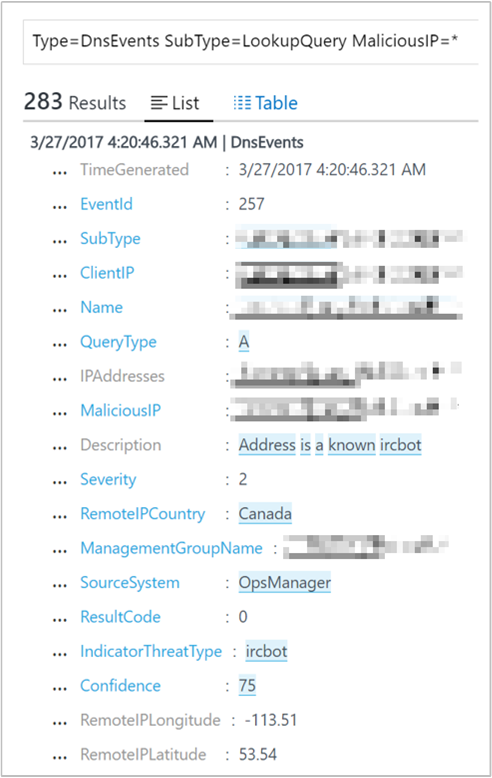
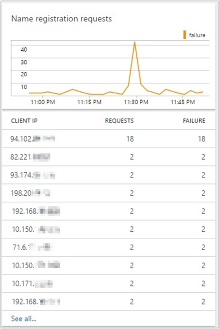
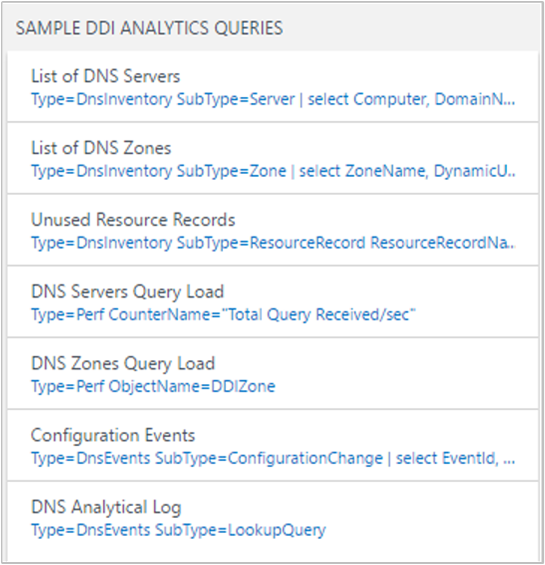
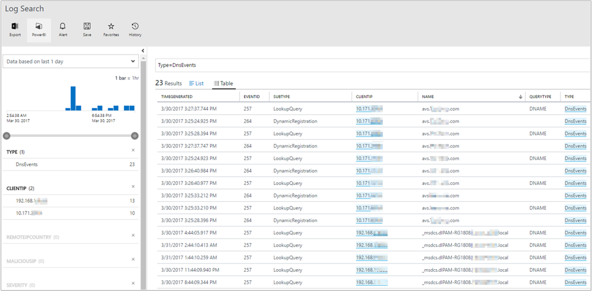

# Gather insights about your DNS infrastructure with the DNS Analytics (Preview) solution

This article describes how to set up and use the DNS Analytics solution in Log Analytics to gather security, performance, and operations-related insights into DNS infrastructure.

DNS Analytics helps you:

- Identify clients that try to resolve malicious domain names
- Identify stale resource records
- Identify frequently queried domain names and talkative DNS clients
- View request load on DNS servers
- View dynamic DNS registration failures

The solution collects, analyzes, and correlates Windows DNS analytic and audit logs and other related data from your DNS servers.

## Connected sources

The following table describes the connected sources that are supported by this solution.

| **Connected Source** | **Support** | **Description** |
| --- | --- | --- |
| [Windows agents](log-analytics-windows-agents.md) | Yes | The solution collects DNS information from Windows agents. |
| [Linux agents](log-analytics-linux-agents.md) | No | The solution does not collect DNS information from direct Linux agents. |
| [SCOM management group](log-analytics-om-agents.md) | Yes | The solution collects DNS information from agents in a connected SCOM management group. A direct connection from the SCOM agent to OMS is not required. Data is forwarded from the management group to the OMS repository. |
| [Azure storage account](log-analytics-azure-storage.md) | No | Azure storage isn't used by the solution. |

### Data collection details

The solution collects DNS inventory and DNS event-related data from the DNS servers where a Log Analytics agent is installed. This data is then uploaded to Log Analytics and then displayed in the solution dashboard. Inventory-related data, such as the number of DNS servers, zones, and resource records are collected by running the DNS Powershell cmdlets. The data is updated once every two days. The event-related data is collected near real-time from the [Analytic and Audit logs](https://technet.microsoft.com/library/dn800669.aspx#enhanc) provided by enhanced DNS logging and diagnostics in Windows Server 2012 R2.

## Configuration

Use the following information to configure the solution.

- You must have a  [Windows](log-analytics-windows-agents.md) or  [Operations Manager](log-analytics-om-agents.md) agent on each DNS server that you want to monitor.
- Add the DNS Analytics solution to your OMS workspace from the [Azure marketplace](https://aka.ms/dnsanalyticsazuremarketplace) or by using the process described in [Add Log Analytics solutions from the Solutions Gallery](log-analytics-add-solutions.md).

The solution starts collecting data without the need of further configuration. However, you can use the following configuration to customize data collection.

###  Configure the solution

On the solution dashboard, click **Configuration** to open the DNS Analytics Configuration page. There are two types of configuration changes that you can make:

- **Whitelisted Domain Names** The solution does not process all the lookup queries. It maintains a whitelist of domain name suffixes. The lookup queries, which resolve to the domain names that match  domain name suffixes in this whitelist, are not processed by the solution. Not processing whitelisted domain names helps to optimize the data sent to Log Analytics. The default whitelist includes popular public domain names, such as www.google.com and www.facebook.com. You can view the complete default list by using the scroll bar.

You can modify the list to add (or remove) any domain name suffix that you aren't interested in to view lookup insights.

- **Talkative Client Threshold** The DNS clients, which exceed the threshold for the number of lookup requests, are highlighted in the **DNS Clients** blade. The default threshold is 1000. You can edit the threshold.

## Management packs

If you are using the Microsoft Monitoring Agent (MMA) to connect to your OMS workspace, then the following management pack is installed.

- Microsoft DNS Data Collector Intelligence Pack (Microsft.IntelligencePacks.Dns)

If your SCOM management group is connected to your OMS workspace, then the following management packs are installed in SCOM when you add this solution. There is no required configuration or maintenance of these management packs.

- Microsoft DNS Data Collector Intelligence Pack (Microsft.IntelligencePacks.Dns)
- Microsoft System Center Advisor DNS Analytics Configuration (Microsoft.IntelligencePack.Dns.Configuration)

For more information on how solution management packs are updated, see [Connect Operations Manager to Log Analytics](log-analytics-om-agents.md).

## Use the solution

This section explains all the dashboard functions and how to use them.

After you've added the DNS Analytics solution to your workspace, the solution tile on the OMS Overview page provides a quick summary of your DNS infrastructure. It includes the number of DNS servers where the data is being collected and the number of requests made by clients to resolve malicious domains in the past 24 hours. When you click the tile, it opens the solution dashboard.

### Solution dashboard

The solution dashboard shows summarized information for the various features of the solution. It also includes links to the detailed view for forensic analysis and diagnosis. By default, the data is shown for the last seven days. You can change the date and time range with the date-time selection control, similar to the following image.

The solution dashboard shows the following blades:

**DNS Security** - Reports the DNS clients that are trying to communicate with malicious domains. By using Microsoft threat intelligence feeds, DNS Analytics can detect client IPs that are trying to access the malicious domains. In many cases, malware infected devices &quot;dial out&quot; to the &quot;command and control&quot; center of the malicious domain by resolving the malware domain name.

When you click a client IP in the list, Log Search opens showing the lookup details of the respective query. In the following example, DNS Analytics detected that the communication was done with an [IRCbot](https://www.microsoft.com/security/portal/threat/encyclopedia/entry.aspx?Name=Win32/IRCbot).

The information helps you to identify:

- the client IP that initiated the communication
- the domain name resolving to the malicious IP
- the IP addresses the domain name resolves to
- the malicious IP address
- the severity of the issue
- the reason for blacklisting the malicious IP
- the detection time

**Domains Queried**  - Provides the most frequent domain names being queried by the DNS clients in your environment. You can view the list of all the domain names queried, and drill down into the lookup request details of a specific domain name in Log Search.

**DNS Clients** - Reports the clients **breaching the threshold** for number of queries in the chosen time period. You can view the list of all the DNS clients and the details of the queries made by them in Log Search.

**Dynamic DNS Registrations** - Reports name registration failures. All registration failures for address [resource records](https://en.wikipedia.org/wiki/List_of_DNS_record_types) (Type A and AAAA) are highlighted along with the client IPs that made the registration requests. You can then use this information to find the root cause of the registration failure:

1. Find the zone that is authoritative for the name that the client is trying to update.
2. Use the solution to check the inventory information of that zone.
3. Verify that the dynamic update for the zone is enabled.
4. Check whether the zone is configured for secure dynamic update or not.

**Name registration requests** - The upper tile shows a trend of successful and failed DNS dynamic update request count. The lower tile lists the top 10 clients sending failed DNS update requests to the DNS servers, sorted by the number of failures.

**Sample DNS Analytics Queries**  - Contains a list of most common search queries that fetch raw analytics data directly.

You can use these queries as a starting point for creating your own queries for customized reporting.

- **List of servers:** This link opens the DNS Log search page showing a list of all DNS servers with their associated FQDN, domain name, forest name, and server IPs.
- **List of DNS zones:** This link opens the DNS Log search page showing a list of all DNS zones with the associated zone name, dynamic update status, name servers, and DNSSEC signing status.
- **Unused resource records:** This link opens the DNS Log search page and shows a list of all the unused/stale resource records. This list contains the resource record name, resource record type, the associated DNS server, record generation time, and zone name. You can use this list to identify the DNS resource records that are no longer in use. Based on this information, you can then act to remove those entries from the DNS servers.
- **DNS servers query load:** This link opens the DNS Log search page where you can get a perspective of the DNS load on your DNS servers to help you plan the capacity for the servers. You can move to the **Metrics** tab to change the view to a graphical visualization. This view helps you understand how the DNS load is distributed across your DNS servers. It shows DNS query rate trends for each server.
      
- **DNS zones query load:** This link opens the DNS Log search page where you can see the DNS zone query per second statistics of all the zones on the DNS servers being managed by the solution. Click the **Metrics** tab to change the view from detailed records to a graphical visualization of the results.
- **Configuration events:** This link opens the DNS Log search page where you can see all the DNS configuration change events and associated messages. You can then filter these events based on time of the event, event ID, DNS server, or task category. It can help you audit changes made to specific DNS servers at specific times.
- **DNS analytical log:** This link opens the DNS Log search page where you can see all the analytic events on all the DNS servers managed by the solution. You can then filter these events based on time of the event, event ID, DNS server, client IP that made the lookup query and query type task category. DNS server analytic events enable activity tracking on the DNS server. An analytic event is logged each time the server sends or receives DNS information.

### DNS log search

On the Search page, you can create a query, and then when you search, you can filter the results by using facet controls. You can also create advanced queries to transform, filter, and report on your results. You can start by using the following queries.

In the search query field, type `Type=DnsEvents` to view all the DNS events generated by the DNS servers managed by the solution. The results list log data for all events related to lookup queries, dynamic registrations, and configuration changes.

  

- To view the log data for lookup query, filter for SubType as **LookUpQuery** from the LHS facet control. A list/table containing the lookup query events for the selected time period is displayed.
- To view the log data for Dynamic Registrations, filter for SubType as **DynamicRegistration** from the LHS facet control. A list/table containing all the Dynamic Registrations event is displayed for the selected time-period.
- To view the log data for Configuration changes, filter for SubType as **ConfigurationChange** from the LHS facet control. A list/table containing all the Configuration changes event is displayed for the selected time-period.

In the search query field, type `Type=DnsInventory` to view all the DNS inventory-related data for the DNS servers managed by the solution. The results list the log data for DNS servers, DNS zones, and resource records.

## Feedback

There are a couple of different routes to give feedback:

- **UserVoice** Post ideas for DNS Analytics features to work on. Visit the [OMS UserVoice page](https://aka.ms/dnsanalyticsuservoice).
- **Join our cohort**   We're always interested in having new customers join our cohorts to get early access to new features and help us improve DNS Analytics going forward. If you are interested in joining our cohorts, fill out [this quick survey](https://aka.ms/dnsanalyticssurvey).

## Next steps

- [Search logs](log-analytics-log-searches.md) to view detailed DNS log records.
