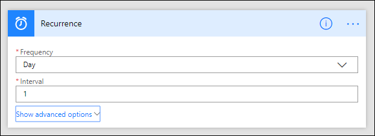
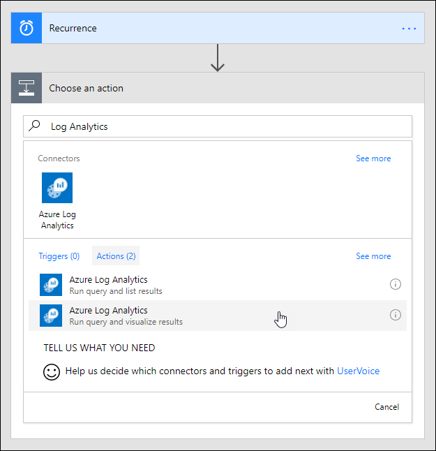
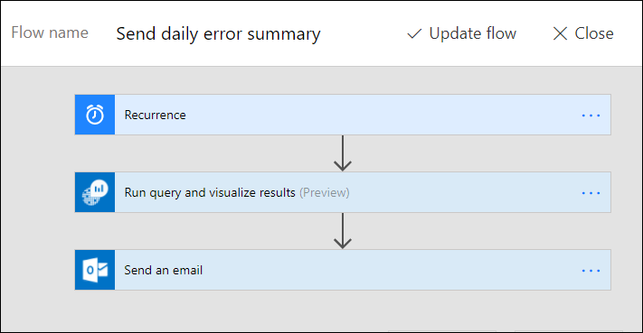
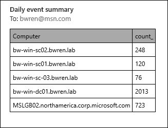

# Automate Log Analytics processes with the connector for Microsoft Flow
[Microsoft Flow](https://ms.flow.microsoft.com) allows you to create automated workflows using hundreds of actions for a variety of services. Output from one action can be used as input to another allowing you to create integration between different services.  The Azure Log Analytics connector for Microsoft Flow allow you to build workflows that include data retrieved by log searches in Log Analytics.

For example, you can use Microsoft Flow to use Log Analytics data in an email notification from Office 365, create a bug in Azure DevOps, or post a Slack message.  You can trigger a workflow by a simple schedule or from some action in a connected service such as when a mail or a tweet is received.  

The tutorial in this article shows you how to create a flow that automatically sends the results of a Log Analytics log search by email, just one example of how you can use Log Analytics in Microsoft Flow. 


## Step 1: Create a flow
1. Sign in to [Microsoft Flow](http://flow.microsoft.com), and select **My Flows**.
2. Click **+ Create from blank**.

## Step 2: Create a trigger for your flow
1. Click **Search hundreds of connectors and triggers**.
2. Type **Schedule** in the search box.
3. Select **Schedule**, and then select **Schedule - Recurrence**.
4. In the **Frequency** box select **Day** and in the **Interval** box, enter **1**.<br><br>


## Step 3: Add a Log Analytics action
1. Click **+ New step**, and then click **Add an action**.
2. Search for **Log Analytics**.
3. Click **Azure Log Analytics – Run query and visualize results**.<br><br>

## Step 4: Configure the Log Analytics action

1. Specify the details for your workspace including the Subscription ID, Resource Group, and Workspace Name.
2. Add the following Log Analytics query to the **Query** window.  This is only a sample query, and you can replace with any other that returns data.
```
	Event
	| where EventLevelName == "Error" 
	| where TimeGenerated > ago(1day)
	| summarize count() by Computer
	| sort by Computer
```

2. Select **HTML Table** for the **Chart Type**.<br><br>

## Step 5: Configure the flow to send email

1. Click **New step**, and then click **+ Add an action**.
2. Search for **Office 365 Outlook**.
3. Click **Office 365 Outlook – Send an email**.<br><br>

4. Specify the email address of a recipient in the **To** window and a subject for the email in **Subject**.
5. Click anywhere in the **Body** box.  A **Dynamic content** window opens with values from previous actions.  
6. Select **Body**.  This is the results of the query in the Log Analytics action.
6. Click **Show advanced options**.
7. In the **Is HTML** box, select **Yes**.<br><br>

## Step 6: Save and test your flow
1. In the **Flow name** box, add a name for your flow, and then click **Create flow**.<br><br>
2. The flow is now created and will run after a day which is the schedule you specified. 
3. To immediately test the flow, click **Run Now** and then **Run flow**.<br><br>
3. When the flow completes, check the mail of the recipient that you specified.  You should have received a mail with a body similar to the following:<br><br>


## Next steps

- Learn more about [log searches in Log Analytics](log-analytics-log-search-new.md).
- Learn more about [Microsoft Flow](https://ms.flow.microsoft.com).


