# Get started with a Log Analytics workspace
You can get up and running quickly with Azure Log Analytics, which helps you evaluate operational intelligence gathered from your IT infrastructure. Using this article, you can easily start exploring, analyzing, and take action on data that you collect *for free*.

This article serves as an introduction to Log Analytics using a brief tutorial to walk you through a minimal deployment in Azure so that you can start using the service. The logical container where your management data in Azure is stored is called a workspace. After you've reviewed this information and completed your own evaluation, you can remove the evaluation workspace. Because this article is a tutorial, it doesn't address business requirements, planning, or architecture guidance.

>[!NOTE]
>If you use the Microsoft Azure Government Cloud, use [Azure Government Monitoring + Management documentation](https://docs.microsoft.com/azure/azure-government/documentation-government-services-monitoringandmanagement#log-analytics) instead.

Here's a quick look at the process used to get started:

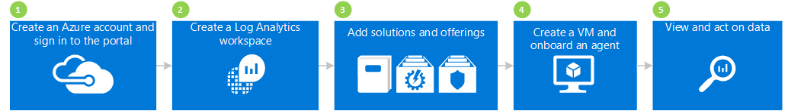

## 1 Create an Azure account and sign in

If you don't already have an Azure account, you need to create one to use Log Analytics. You can create a [free account](https://azure.microsoft.com/free/) that is good for 30 days that lets you access any Azure service.

### To create a free account and sign in
1. Follow the directions at [Create your free Azure account](https://azure.microsoft.com/free/).
2. Go to the [Azure portal](https://portal.azure.com) and sign in.

## 2 Create a workspace

The next step is to create a workspace.

1. In the Azure portal, search the list of services in the Marketplace for *Log Analytics*, and then select **Log Analytics**.  
    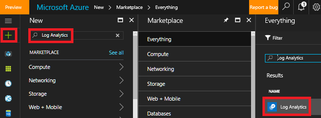
2. Click **Create**, then select choices for the following items:
   * **OMS Workspace** - Type a name for your workspace.
   * **Subscription** - If you have multiple subscriptions, choose the one you want to associate with the new workspace.
   * **Resource group**
   * **Location**
   * **Pricing tier**  
       
3. Click **OK** to see a list of your workspaces.
4. Select a workspace to see it's details in the Azure portal.       
             

## 3 Add solutions and solution offerings

Next, add management solutions and solution offerings. Management solutions are a collection of logic, visualization, and data acquisition rules that provide metrics pivoted around a particular problem area. A solution offering is a bundle of management solutions.

Adding solutions to your workspace allows Log Analytics to collect various kinds of data from computers that are connected to your workspace using agents. We cover onboarding agents later.

### To add solutions and solution offerings

1. In Azure portal, click **New** and then in the **Search the marketplace** box, type **Activity Log Analytics** and then press ENTER.
2. In the Everything blade, select **Activity Log Analytics** and then click **Create**.  
      
3. In the *management solution name* blade, select a workspace that you want to associate with the management solution.
4. Click **Create**.  
    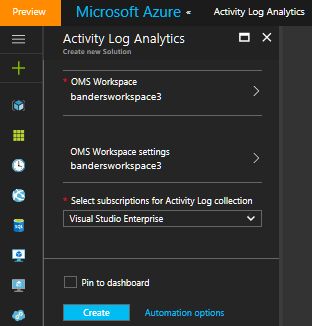  
5. Repeat steps 1 - 4 to add:
    - The **Security & Compliance** service offering with the Antimalware Assessment and Security and Audit solutions.
    - The **Automation & Control** service offering with the Automation Hybrid Worker, Change Tracking, and System Update Assessment (also called Update Management) solutions. You must create an Automation account when you add the solution offering.  
        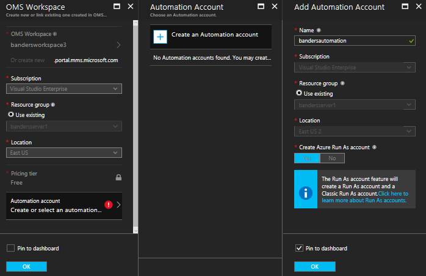  
6. You can view the management solutions that you added to your workspace by navigating to **Log Analytics** > **Subscriptions** > ***workspace name*** > **Overview**. Tiles for the management solutions that you added are shown.  
    >[!NOTE]
    >Because we have not yet connected any agents to the workspace, you do not see any data for the solutions that you added.  

    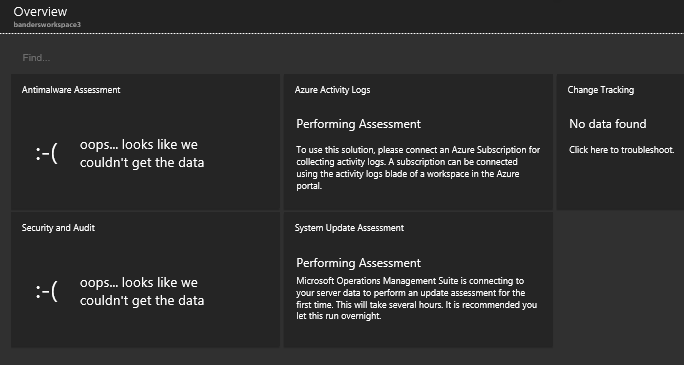

## 4 Create a VM and onboard an agent

Next, create a simple virtual machine in Azure. After you create a VM, onboard the OMS agent to enable it. Enabling the agent starts data collection from the VM and sends data to Log Analytics.

### To create a virtual machine

- Follow the directions at [Create your first Windows virtual machine in the Azure portal](../virtual-machines/virtual-machines-windows-hero-tutorial.md) and  start the new virtual machine.

### Connect the virtual machine to Log Analytics

- Follow the directions at [Connect Azure virtual machines to Log Analytics](log-analytics-azure-vm-extension.md) to connect the VM to Log Analytics using the Azure portal.

## 5 View and act on data

Previously, you enabled the Activity Log Analytics solution and the Security & Compliance and Automation & Control service offerings. Next, we start looking at data collected by solutions and results in log searches.

To start, look at data that is displayed from within solutions. Then, look at some log searches that are accessed from log searches. Log searches allow you to combine and correlate any machine data from multiple sources within your environment. For more information, see [Log searches in Log Analytics](log-analytics-log-searches.md). Lastly, take act on data that we find using the OMS portal, which is outside of the Azure portal.

### To view Antimalware data

1. In the Azure portal, navigate to **Log Analytics** > ***your workspace***.
2. In the blade for your workspace, under **General**, click **Overview**.  
    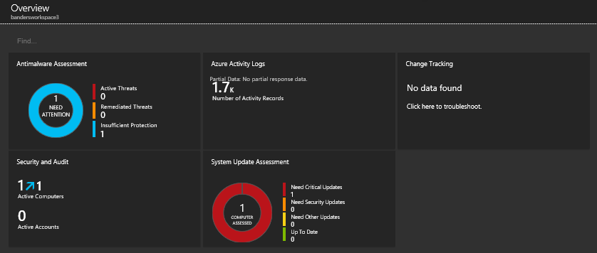
3. Click the **Antimalware Assessment** tile. In this example, you can see that Windows Defender is installed on one computer, but it's signature is out of date.  
    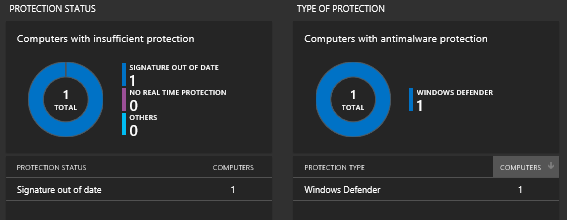
4. For this example, under **Protection status**, click **Signature out of date** to open Log Search and view details about the computers that have out of date signatures. In this example, note that the computer is named *getstarted*. If there were more than one computer with out of date signatures, they would all appear in the Log Search results.  
    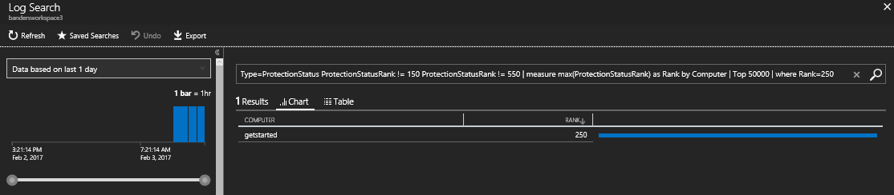

### To view Security and Audit data

1. In the blade for your workspace, under **General**, click **Overview**.  
2. Click the **Security and Audit** tile. In this example, you can see that there are two notable issues: there is one computer that is missing critical updates and there is one computer with insufficient protection.  
    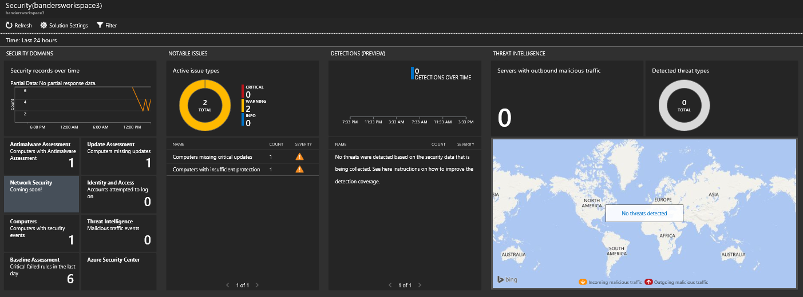
3. For this example, under **Notable Issues**, click **Computers missing critical updates** to open Log Search and view details about computers missing critical updates. In this example, there is one critical update missing and 63 other updates missing.  
    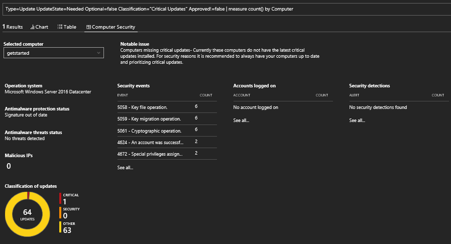

### To view and act on System Update data

1. In the blade for your workspace, under **General**, click **Overview**.  
2. Click the **System Update Assessment** tile. In this example, you can see that there is one Windows computer named *getstarted* that needs critical updates and one that needs definition updates.  
    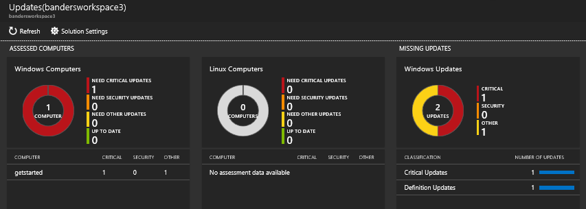
3. For this example, under **Missing Updates**, click **Critical Updates** to open Log Search and view details about computers missing critical updates. In this example, there is one missing update and there is one required update.  
    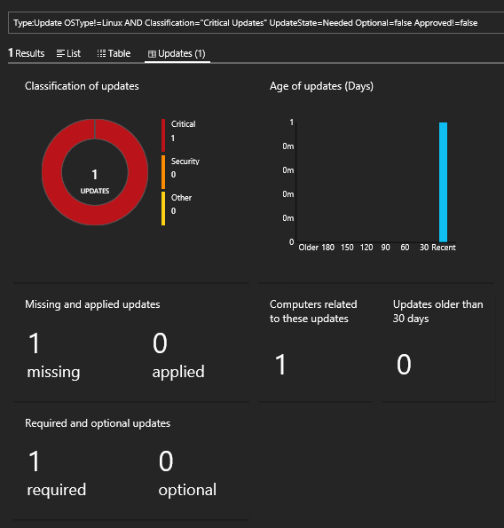
4. Go to the [Operations Management Suite](http://microsoft.com/oms) website and sign in with your Azure account. When signed in, notice that the solution information is similar to what you've see in the Azure portal.  
    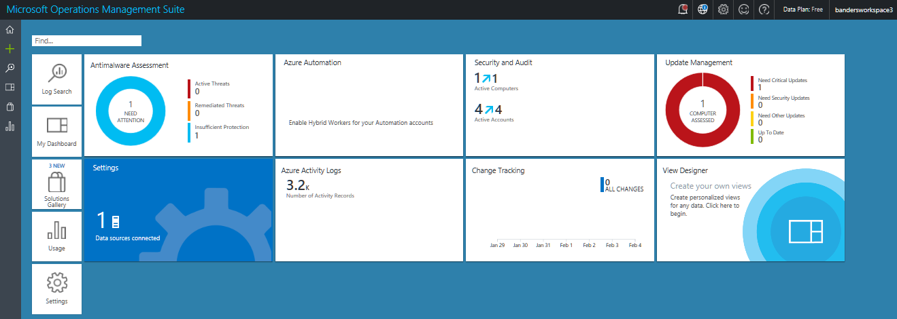
5. Click the **Update Management** tile.
6. In the Update Management dashboard, notice that the system update information is similar to the System Update information you've seen in the Azure portal. However, the **Manage Update Deployments** tile is new. Click the **Manage Update Deployments** tile.  
    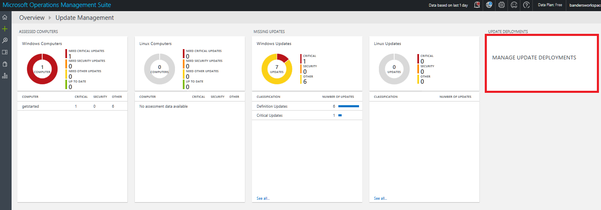
7. On the **Update Deployments** page, click **Add** to create an *update run*.  
    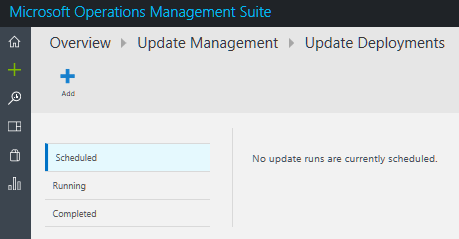
8.  On the **New Update Deployment** page, type a name for the update deployment, select computers to update (in this example, *getstarted*), choose a schedule, and then click **Save**.  
    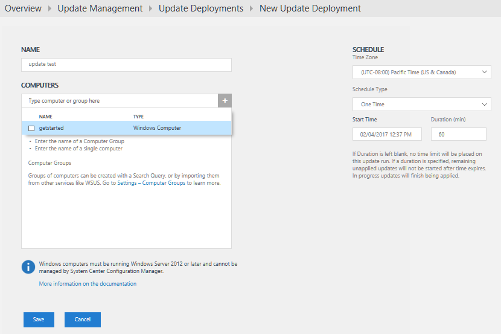  
    After you save the update deployment, you see the scheduled update.  
    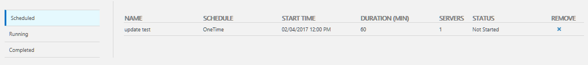  
    After the update run is completed, the status shows **Finished**.
    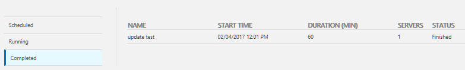
9. After the update run is finished, you can view whether the run was successful or not and you can view details about what updates where applied.

## After evaluation

In this tutorial, you installed an agent on a virtual machine and got started quickly. The steps that you followed were quick and simple. However, most large organizations and enterprises have complex on-premises IT infrastructures. So, collecting data from those complex environments takes additional planning and effort than the tutorial does. Review the information in the following Next steps section for links to helpful articles.

You can optionally remove the workspace that you created with this tutorial.

## Next steps
* Learn about connecting [Windows agents](log-analytics-windows-agents.md) to Log Analytics.
* Learn about connecting [Operations Manager agents](log-analytics-om-agents.md) to Log Analytics.
* [Add Log Analytics solutions from the Solutions Gallery](log-analytics-add-solutions.md) to add functionality and gather data.
* Get familiar with [log searches](log-analytics-log-searches.md) to view detailed information gathered by solutions.
