<properties
	pageTitle="Get started with Log Analytics | Microsoft Azure"
	description="You can get up and running with Log Analytics in the Microsoft Operations Management Suite (OMS) in minutes."
	services="log-analytics"
	documentationCenter=""
	authors="bandersmsft"
	manager="jwhit"
	editor=""/>

<tags
	ms.service="log-analytics"
	ms.workload="na"
	ms.tgt_pltfrm="na"
	ms.devlang="na"
	ms.topic="get-started-article"
	ms.date="05/11/2016"
	ms.author="banders"/>

# Get started with Log Analytics

You can get up and running with Log Analytics in the Microsoft Operations Management Suite (OMS) in minutes. You have two options when choosing how to create an OMS workspace, which is similar to an account:

- Microsoft Operations Management Suite website
- Microsoft Azure subscription

You can create an free OMS workspace using the OMS website. Or, you can use a Microsoft Azure subscription to create an OMS workspace. Both workspaces are functionally equivalent, except that a free OMS workspace can only send 500 MB of data daily to the OMS service. If you use an Azure subscription, you can also use that subscription to access other Azure services. Regardless of the method that you use to create the workspace, you'll create the workspace with either a Microsoft account or organizational account.

Here's a look at the process:

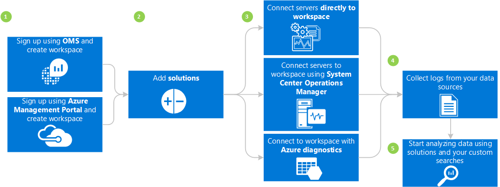

## Log Analytics prerequisites and deployment considerations

- You need a paid Microsoft Azure subscription to fully use Log Analytics. If you don't have an Azure subscription, create a [free account](https://azure.microsoft.com/free/) that lets you access any Azure service. Or, you can create a free OMS account at the [Operations Management Suite](http://microsoft.com/oms) website and click **Try for free**.
- An OMS workspace
- Each Windows computer that you want to gather data from must run Windows Server 2008 SP1, or above
- [Firewall](log-analytics-proxy-firewall.md) access to the OMS web service's addresses
- An [OMS Log Analytics Forwarder](https://blogs.technet.microsoft.com/msoms/2016/03/17/oms-log-analytics-forwarder) (Gateway) server to forward traffic from servers to OMS, if Internet access is not available from computers
- If you use Operations Manager, Log Analytics supports Operations Manager 2012 SP1 UR6 and above and Operations Manager 2012 R2 UR2 and above. Proxy support was added in Operations Manager 2012 SP1 UR7 and Operations Manager 2012 R2 UR3. Determine how it will be integrated with OMS.
- Determine if your computers have direct Internet access. If not, they require a gateway server to access the OMS web service sites. All access is via HTTPS.
- Determine which technologies and servers will send data to OMS. For example, domain controllers, SQL Server, etc.
- Grant permission to users in OMS and Azure.
- If you're concerned about data usage, deploy each solution individually and test the performance impact before adding additional solutions.
- Review your data usage and performance as you add solutions and features to Log Analytics. This includes event collection, log collection, performance data collection, etc. It is better to start with minimal collection until data usage or performance impact has been identified.
- Verify that Windows agents are not also managed using Operations Manager, otherwise duplicate data will result. This also applies to Azure-based-agents that have Azure Diagnostics enabled.
- After you install agents, verify that the agent is working properly. If not, check to ensure that Cryptography API: Next Generation (CNG) Key Isolation is not disabled using Group Policy.
- Some Log Analytics solutions have additional requirements

## Sign up in 3 steps using the Operations Management Suite

1. Go to the [Operations Management Suite](http://microsoft.com/oms) website and click **Try for free**. Sign in with your Microsoft account such as Outlook.com, or with an organizational account provided by your company or educational institution to use with Office 365 or other Microsoft services.
2. Provide a unique workspace name. A workspace is a logical container where your management data is stored. It provides you a way to partition data between different teams in your organization, as the data is exclusive to its workspace. Specify an email address and the region where you want to have your data stored.  
    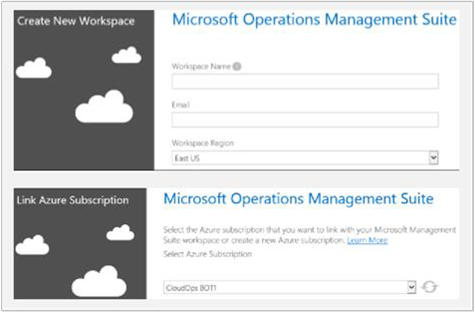
3. Next, you can create a new Azure subscription or link to an existing Azure subscription. If you would like to proceed using the Free Trial, click **Not Now**.

You're ready to get started with the Operations Management Suite portal.

You can learn more about setting up your workspace and linking existing Azure accounts to workspaces created with the Operations Management Suite at [Manage access to Log Analytics](log-analytics-manage-access.md).

## Sign up quickly using Microsoft Azure

1. Go to the [Azure portal](https://portal.azure.com) and sign in, browse the list of services, and then select **Log Analytics (OMS)**.  
    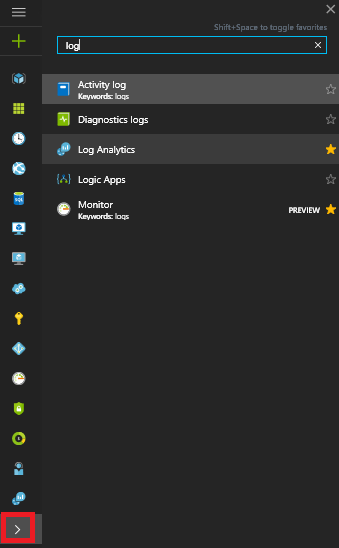
2. Click **Add**, then select choices for the following items:
    - **OMS Workspace** name
    - **Subscription** - If you have multiple subscriptions, choose the one you want to associate with the new workspace.
    - **Resource group**
    - **Location**
    - **Pricing tier**  
        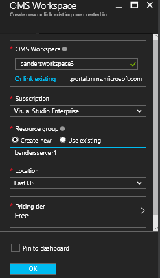
3. Click **Create** and you'll see the workspace details in the Azure portal.       
    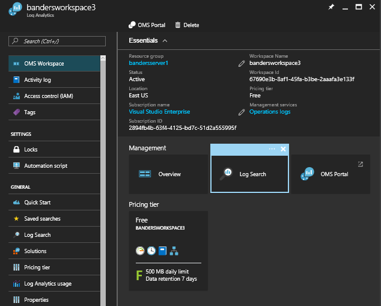         
4. Click the **OMS Portal** link to open the Operations Management Suite website with your new workspace.

You're ready to start using the Operations Management Suite portal.

You can learn more about setting up your workspace and linking existing workspaces that you created with the Operations Management Suite to Azure subscriptions at [Manage access to Log Analytics](log-analytics-manage-access.md).

## Get started with the Operations Management Suite portal
To choose solutions and connect the servers that you want to manage, click the **Settings** tile and follow the steps in this section.  

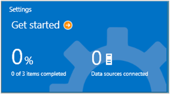  

- **Add Solutions** - Select the solutions you would like to use and then click **Add selected Solutions**.  
    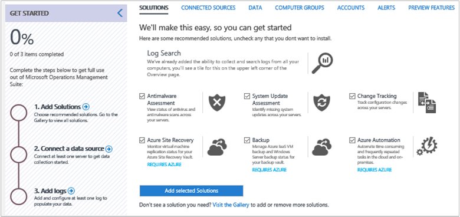
- **Connect a data source** - Choose how you would like to connect to your server environment to gather data:
    - Connect any Windows Server or client directly by installing an agent.
    - Use System Center Operations Manager to attach your management groups or your entire Operations Manager deployment.
    - Use an Azure storage account configured with the Windows or Linux Azure diagnostic VM extension.
        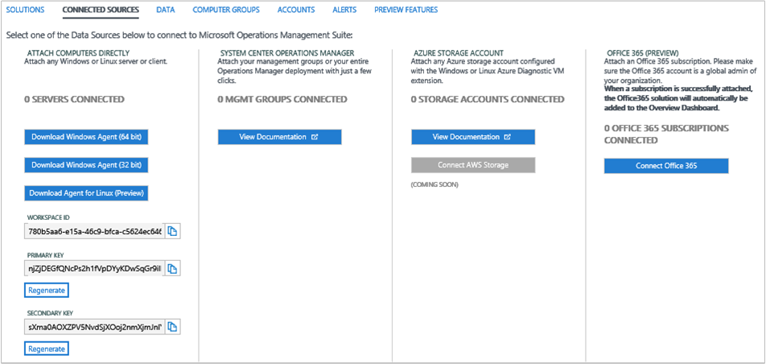    
- **Add logs** Configure at least one data source to populate your data and then select **Save**. For event logs, you can specify the type of messages including error, warning, and information to monitor.    

    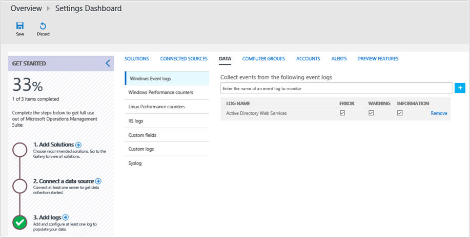    

## Optionally, connect servers directly to the Operations Management Suite by installing an agent
1. Click the **Settings** tile, click the **Connected Sources** tab, and then click **Download Windows Agent** for the architecture of the computer where you want to install. You can only install the agent on Windows Server 2008 SP 1 or later or on Windows 7 SP1 or later.
2. Install the agent on one or more servers. You can install agents one-by-one, or using a more automated method with a [custom script](log-analytics-windows-agents.md), or you can use an existing software distribution solution that you might have.
3. After you agree to the license agreement and you choose your installation folder, select **Connect the agent to Microsoft Azure Operational Insights**. (OMS was previously called Operational Insights).  
    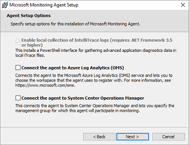

4. On the next page, you are asked for your Workspace ID and Workspace Key. Your Workspace ID and key are displayed on the screen where you downloaded the agent file.  
    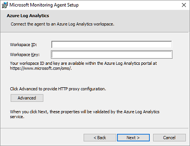
    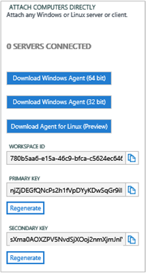
5. During installation, you can click **Advanced** to optionally set up your proxy server and provide authentication information. Click the **Next** button to return to the workspace information screen.
6. Click **Next** to validate your Workspace ID and Key. If any errors are found, you can click **Back** to make corrections. When your Workspace ID and Key are validated, click **Install** to complete the agent installation.
7. Log back in to the Operations Management Suite portal, and click the **Settings** tile on the Overview page. A green check mark icon will appear when the agents communicate with the Operations Management Suite service. Initially, this takes about 5-10 minutes.

>[AZURE.NOTE] The capacity management and configuration assessment solutions are not currently supported by servers connected directly to the Operations Management Suite.

You can also connect the agent to System Center Operations Manager 2012 SP1 and later. To do so, select **Connect the agent to System Center Operations Manager**. When you choose that option, you send data to the service without requiring additional hardware or load on your management groups.

You can read more about connecting agents to the Operations Management Suite at [Connect Windows computers to Log Analytics](log-analytics-windows-agents.md).

## Optionally, connect servers using System Center Operations Manager

1. In the Operations Manager console, select **Administration**.
2. Expand the **Operational Insights** node and select **Operational Insights Connection**.

  >[AZURE.NOTE] Depending on what Update Rollup of SCOM you are using, you may see a node for *System Center Advisor*, *Operational Insights*, or *Operations Management Suite*.

3. Click the **Register to Operational Insights** link towards the top right and follow the instructions.
4. After completing the registration wizard, click the **Add a Computer/Group** link.
5. In the **Computer Search** dialog box you can search for computers or groups monitored by Operations Manager. Select computers or groups to onboard them to Log Analytics, click **Add**, and then click **OK**. You can verify that the OMS service is receiving data by going to the **Usage** tile in the Operations Management Suite portal. Data should appear in about 5-10 minutes.

You can read more about connecting Operations Manager to the Operations Management Suite at [Connect Operations Manager to  Log Analytics](log-analytics-om-agents.md).

## Optionally, analyze data from cloud services in Microsoft Azure

With the Operations Management Suite, you can quickly search event and IIS logs for cloud services and virtual machines by enabling diagnostics for Azure Cloud Services. You can also receive additional insights for your Azure virtual machines by installing the Microsoft Monitoring Agent. You can read more about how to configure your Azure environment to use the Operations Management Suite at [Connect Azure storage to Log Analytics](log-analytics-azure-storage.md).

## Next steps

- [Add Log Analytics solutions from the Solutions Gallery](log-analytics-add-solutions.md) to add functionality and gather data.
- Get familiar with [log searches](log-analytics-log-searches.md) to view detailed information gathered by solutions.
- Use [dashboards](log-analytics-dashboards.md) to save and display your own custom searches.
