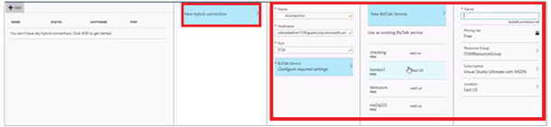
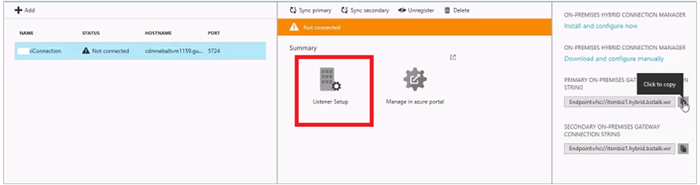
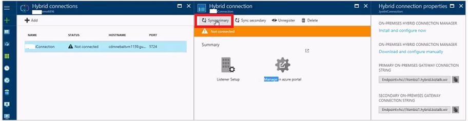
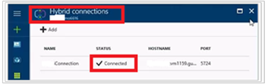
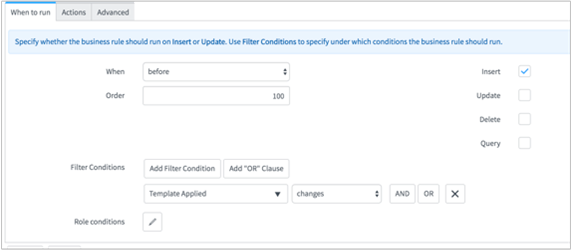
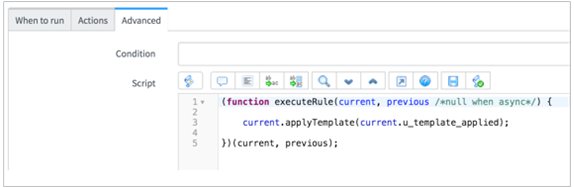

# Connect ITSM products/services with IT Service Management connector (Preview)
The following sections provide information about how to connect your ITSM product/service to IT Service Management Connector in OMS.

The following products/services are supported:

- [Service Manager](#connect-service-manager-to-it-service-management-connector-in-oms)
- [ServiceNow](#connect-servicenow-to-it-service-management-connector-in-oms)
- [Provance](#connect-provance-to-it-service-management-connector-in-oms)
- [Cherwell](#connect-cherwell-to-it-service-management-connector-in-oms)

## Connect Service Manager to IT Service Management Connector in OMS

The following sections provide details about how to connect your Service Manager product to the IT Service Manager Connector in OMS.

## Prerequisites

Ensure you have the following prerequisites met:

- IT Service Management Connector installed.
More information:  [Configuration](log-analytics-itsmc-overview.md#configuration).
- The Service Manager Web application (Web app) is deployed and configured. Information on Web app is [here](#create-and-deploy-service-manager-web-app-service).
- Hybrid connection role created and configured. More information: [Configure the hybrid Connector role](#configure-the-hybrid-connector-role).
- Supported versions of Service Manager:  2012 R2 or 2016.
- User role:  Advanced Operator.

## Connection procedure

Use the following procedure to connect your Service Manager instance to the IT Service Management Connector:

1. Go to **OMS** >**Settings** > **Connected Sources**.
2. Select **ITSM Connector,** click **Add New Connection**.

    
3. Provide the information as described in the following table, and click **Save** to create the connection:

> [!NOTE]
> All these parameters are mandatory.

| **Field** | **Description** |
| --- | --- |
| **Name**   | Type a name for the System Center Service Manager instance that you want to connect with the IT Service Management Connector.  You use this name later when you configure work items in this instance/ view detailed log analytics. |
| **Select Connection type**   | Select **Service Manager**. |
| **Server URL**   | Type the URL of the Service Manager Web app. More information about Service Manager Web app is [here](#create-and-deploy-service-manager-web-app-service).
| **Client ID**   | Type the client ID that you generated (using the automatic script) for authenticating the Web app. More information about the automated script is [here.](log-analytics-itsmc-service-manager-script.md)|
| **Client Secret**   | Type the client secret, generated for this ID.   |
| **Data Sync Scope**   | Select the Service Manager work items that you want to sync through the IT Service Management Connector.  These work items will be imported into Log Analytics. **Options:**  Incidents, Change Requests.|
| **Sync Data** | Type the number of past days that you want the data from. **Maximum limit**: 120 days. |

When successfully connected, and synced:

- Selected work items from Service Manager are imported into OMS **Log Analytics.** You can view the summary of these work items on the **IT Service Management Connector** tile.

- From OMS, you can create incidents from OMS alerts or from log search, in this Service Manager instance.

More information: [Create ITSM work items for OMS alerts](log-analytics-itsmc-overview.md#create-itsm-work-items-for-oms-alerts) and [Create ITSM work items from OMS logs](log-analytics-itsmc-overview.md#create-itsm-work-items-from-oms-logs).

### Create and Deploy Service Manager Web app service

To connect the on-premises Service Manager with the IT Service Management Connector on OMS, Microsoft has created a Service Manager Web app on the GitHub.

To set up the ITSM Web app for your Service Manager, do the following:

- **Deploy the Web app** – Deploy the Web app, set the properties, and authenticate with Azure AD. You can deploy the web app by using the [automated script](log-analytics-itsmc-service-manager-script.md) that Microsoft has provided you.
- **Configure the hybrid connector role** - Configure this role, manually.

#### Deploy the Web app
Use the automated [script](log-analytics-itsmc-service-manager-script.md) to deploy the Web app, set the properties, and authenticate with Azure AD.

Run the script by providing the required details as follows:

- Azure subscription details
- Resource group name
- Location
- Service Manager server details (server name, domain, user name, and password)
- URL for deployment
- Site name for your Web app
- Biz talk service name.

The script creates the Web app using the name that you specified (along with few additional strings to make it unique). It generates the **Web app URL**, **client ID** and **client secret**.

Save the values, you use them when you create a connection with IT Service Management connector.

**Check the Web app installation**

1. Go to **Azure portal** > **Resources**.
2. Select the Web app, click **Settings** > **Application Settings**.
3. Confirm the information about the Service Manager instance that you provided at the time of deploying the app through the script.

### Configure the hybrid connector role

Use the following procedure to connect the hybrid connector role that connects the Service Manager instance with the IT Service Management connector in OMS.

1. Find the Service Manager Web app, under **OMS Resources**.
2. Click **Settings > Networking**.
3. Under **Hybrid Connections**, click **Configure your hybrid connection endpoints**.

    
4. In the **Hybrid Connections** blade, click **Add**.

    
5. Type the following values and then click **OK**.

    - **Name**: Name for the new Hybrid connection.
    -  **Hostname**: FQDN of the Service Manager management server.
    - **Port**: 5724 (default)
    - **BizTalk Service**: Name of the BizTalk service to create.

    
6. Click **OK** to close the **Create hybrid connection** blade and start creating the hybrid connection.

#### Configure the listener setup

Use the following procedure to configure the listener setup for the hybrid connection.

1. In the **Hybrid Connections** blade, select the hybrid connection you created.
2. Click **Listener Setup**.

    

3. In the **Hybrid connection properties** blade, click **Download and configure manually** to download the **HybridConnectionManager.msi**
4. Copy the value for **Primary on-premises gateway connection string**.
5. Run the Windows Installer package file that you downloaded and paste the value of the connection string.

    
6. Click **OK** and then click **Close**.
7. In the **Hybrid Connections** blade, select your connection and then click **Sync primary** to sync the primary key.

    

Your hybrid connection should now be connected.

> [!NOTE]
> After the hybrid connection is created, you can verify the Service Manager connection by visiting the deployed Web app and also test the connection from the Web app screen.

The following image shows the details of a successful connection:

## Connect ServiceNow to IT Service Management Connector in OMS

The following sections provide details about how to connect your ServiceNow product to the IT Service Manager Connector in OMS.

### Prerequisites

Ensure you have the following prerequisites met:

- IT Service Management Connector installed. More information: [Configuration.](log-analytics-itsmc-overview.md#configuration)
- Client ID and client secret for ServiceNow product are generated and available.  For information on how to generate client ID and secret, see [OAuth Setup](http://wiki.servicenow.com/index.php?title=OAuth_Setup).
- ServiceNow supported versions – Fuji, Geneva, Helsinki.
- User role: Create an integration user role in the ServiceNow app to connect to the ITSM connector.

### **Connection procedure**

Use the following procedure to create a ServiceNow connection:

1. Go to **OMS** > **Settings** > **Connected Sources**.
2. Select **ITSM Connector,** click **Add New Connection**.

    

3. Provide the information as described in the following table, and click **Save** to create the connection:

> [!NOTE]
> All these parameters are mandatory.

| **Field** | **Description** |
| --- | --- |
| **Name**   | Type a name for the ServiceNow instance that you want to connect with the IT Service Management Connector.  You use this name later in OMS when you configure work items in this ITSM/ view detailed log analytics. |
| **Select Connection type**   | Select **ServiceNow**. |
| **Username**   | Type the integration user name that you created in the ServiceNow app to support the connection to the IT Service Management Connector. |
| **Password**   | Type the password associated with this user name.                                        **Note**: User name and password are used for generating authentication tokens only, and are not stored anywhere within the OMS service.  |
| **Server URL**   | Type the URL of the ServiceNow instance that you want to connect to IT Service Management Connector. |
| **Client ID**   | Type the client ID that you want to use for OAuth2 Authentication, which you generated earlier.  More information on generating client ID and secret:   [OAuth Setup](http://wiki.servicenow.com/index.php?title=OAuth_Setup). |
| **Client Secret**   | Type the client secret, generated for this ID.   |
| **Data Sync Scope**   | Select the ServiceNow work items that you want to sync to OMS, through the IT Service Management Connector.  The selected values will be imported into log analytics.   **Options:**  Incidents and Change Requests.|
| **Sync Data** | Type the number of past days that you want the data from. **Maximum limit**: 120 days. |

When successfully connected, and synced:

- Selected work items from ServiceNow connection are imported into OMS Log Analytics.  You can view the summary of these work items on the IT Service Management Connector tile.
- You can create incidents, alerts, and events from OMS Alerts or log search in this ServiceNow instance.  

> [!NOTE]

> For creating alerts and events in ServiceNow app from OMS, ensure the Event Management plugin is installed on ServiceNow. In addition, you must add the following roles to the ServiceNow integration user:  

-  evt_mgmt_integration
-  evt_mgmt_operator

More information: [Create ITSM work items for OMS alerts](log-analytics-itsmc-overview.md#create-itsm-work-items-for-oms-alerts) and [Create ITSM work items from OMS logs](log-analytics-itsmc-overview.md#create-itsm-work-items-from-oms-logs).

### Import ServiceNow templates in OMS

Perform the following steps in your ServiceNow instance to get connected to OMS and use the templates that you created in your ServiceNow instance:

1. Create an additional field on each of the incident form (need not be visible).

    For example:
  - **Field Label**: Template Applied
  - **Field Name**: u_template_applied
  - **Type**: String

2. Create an **On Before** Insert type business rule for each table (incident) with a condition that the field template applied changes. Refer to the following screenshot:

    

3. Add the following line to the script dialog under the **Advanced** tab: **applyTemplate(current.u\_template\_applied);**

    

4. Save the business rule.

## Connect Provance to IT Service Management Connector in OMS

The following sections provide details about how to connect your Provance product to the IT Service Manager Connector in OMS.

### Prerequisites

Ensure you have the following prerequisites met:

- IT Service Management Connector installed. More information: [Configuration](log-analytics-itsmc-overview.md#configuration).
- Provance App should be registered with Azure AD - and client ID is made available. For detailed information, see [how to configure active directory authentication](../app-service-mobile/app-service-mobile-how-to-configure-active-directory-authentication.md).
- User role:  Administrator.

### Connection Procedure

Use the following procedure to create a Provance connection:

1. Go to **OMS** > **Settings** > **Connected Sources**.
2. Select **ITSM Connector,** click **Add New Connection**.  

    
3. Provide the information as described in the following table, and click **Save** to create the connection.

> [!NOTE]
> All these parameters are mandatory.

| **Field** | **Description** |
| --- | --- |
| **Name**   | Type a name for the Provance instance that you want to connect with the IT Service Management Connector.  You use this name later in OMS when you configure work items in this ITSM/ view detailed log analytics. |
| **Select Connection type**   | Select **Provance**. |
| **Username**   | Type the user name that can connect to the IT Service Management Connector.    |
| **Password**   | Type the password associated with this user name. **Note:** User name and password are used for generating authentication tokens only, and are not stored anywhere within the OMS service._|
| **Server URL**   | Type the URL of your Provance instance that you want to connect to IT Service Management Connector. |
| **Client ID**   | Type the client ID for authenticating this connection, which you generated in your Provance instance.  More information on client ID, see [how to configure active directory authentication](../app-service-mobile/app-service-mobile-how-to-configure-active-directory-authentication.md). |
| **Data Sync Scope**   | Select the Provance work items that you want to sync to OMS, through the IT Service Management Connector.  These work items will be imported into log analytics.   **Options:**   Incidents, Change Requests.|
| **Sync Data** | Type the number of past days that you want the data from. **Maximum limit**: 120 days. |

When successfully connected, and synced:

- Selected work items from Provance connection are imported into OMS **Log Analytics.**  You can view the summary of these work items on the **IT Service Management Connector** tile.
- You can create incidents and events from OMS Alerts or Log Search in this Provance instance.

More information: [Create ITSM work items for OMS alerts](log-analytics-itsmc-overview.md#create-itsm-work-items-for-oms-alerts) and [Create ITSM work items from OMS logs](log-analytics-itsmc-overview.md#create-itsm-work-items-from-oms-logs).

## Connect Cherwell to IT Service Management Connector in OMS

The following sections provide details about how to connect your Cherwell product to the IT Service Manager Connector in OMS.

### Prerequisites

Ensure you have the following prerequisites met:

- IT Service Management Connector installed. More information: [Configuration](log-analytics-itsmc-overview.md#configuration).
- Client ID generated. More information: [Generate client ID for Cherwell](#generate-client-id-for-cherwell).
- User role:  Administrator.

### Connection Procedure

Use the following procedure to create a Cherwell connection:

1. Go to **OMS** >  **Settings** > **Connected Sources**.
2. Select **ITSM Connector** click **Add New Connection**.  

    

3. Provide the information as described in the following table, and click  **Save** to create the connection.

> [!NOTE]
> All these parameters are mandatory.

| **Field** | **Description** |
| --- | --- |
| **Name**   | Type a name for the Cherwell instance that you want to connect to the IT Service Management Connector.  You use this name later in OMS when you configure work items in this ITSM/ view detailed log analytics. |
| **Select Connection type**   | Select **Cherwell.** |
| **Username**   | Type the Cherwell user name that can connect to the IT Service Management Connector. |
| **Password**   | Type the password associated with this user name. **Note:** User name and password are used for generating authentication tokens only, and are not stored anywhere within the OMS service.|
| **Server URL**   | Type the URL of your Cherwell instance that you want to connect to IT Service Management Connector. |
| **Client ID**   | Type the client ID for authenticating this connection, which you generated in your Cherwell instance.   |
| **Data Sync Scope**   | Select the Cherwell work items that you want to sync through the IT Service Management Connector.  These work items will be imported into log analytics.   **Options:**  Incidents, Change Requests. |
| **Sync Data** | Type the number of past days that you want the data from. **Maximum limit**: 120 days. |

When successfully connected, and synced:

- Selected work items from this Cherwell connection are imported into OMS Log Analytics. You can view the summary of these work items  on the IT Service Management Connector tile.
- You can create incidents and events in this Cherwell instance from OMS. More information: Create ITSM work items for OMS alerts and Create ITSM work items from OMS logs.

More information: [Create ITSM work items for OMS alerts](log-analytics-itsmc-overview.md#create-itsm-work-items-for-oms-alerts) and [Create ITSM work items from OMS logs](log-analytics-itsmc-overview.md#create-itsm-work-items-from-oms-logs).

### Generate client ID for Cherwell

To generate the client ID/key for Cherwell, use the following procedure:

1. Log in to your Cherwell instance as admin.
2. Click **Security** > **Edit REST API client settings**.
3. Select **Create new client** > **client secret**.

    

## Next steps
 - [Create ITSM work items for OMS alerts](log-analytics-itsmc-overview.md#create-itsm-work-items-for-oms-alerts)

 - [Create ITSM work items from OMS logs](log-analytics-itsmc-overview.md#create-itsm-work-items-from-oms-logs)

- [View log analytics for your connection](log-analytics-itsmc-overview.md#using-the-solution)
