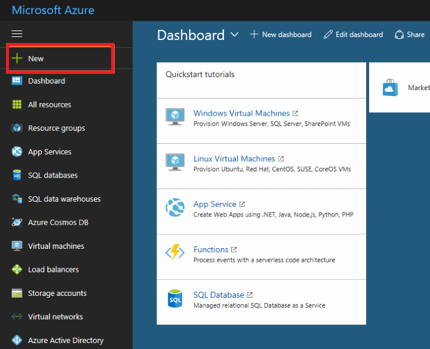
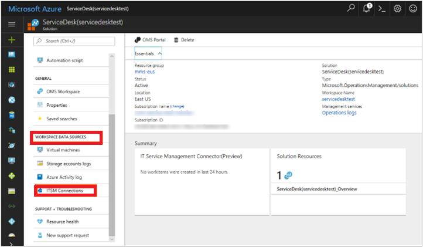
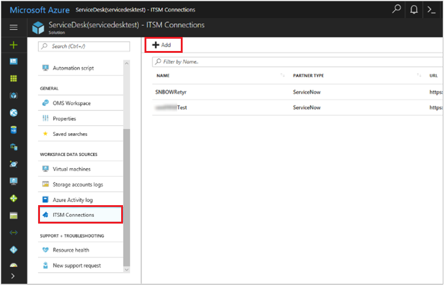
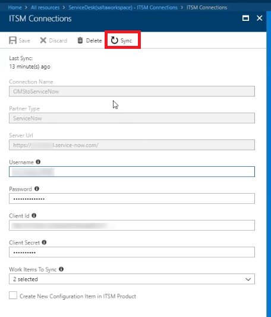
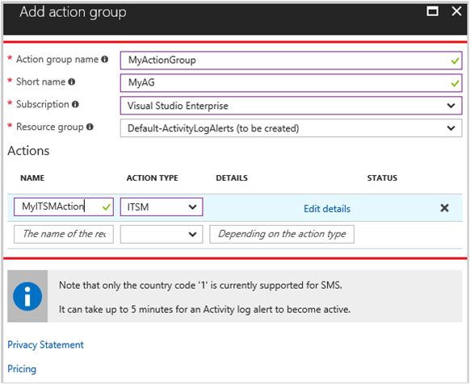

# Connect Azure to ITSM tools using IT Service Management Connector

The IT Service Management Connector (ITSMC) allows you to connect Azure and a supported IT Service Management (ITSM) product/service.

Azure services like Log Analytics and Azure Monitor provide tools to detect, analyze and troubleshoot issues with your Azure and non-Azure resources. However, the work items related to an issue  typically reside in an ITSM product/service. The ITSM connector provides a bi-directional connection between Azure and ITSM tools to help you resolve issues faster.

ITSMC supports connections with the following ITSM tools:

-	ServiceNow
-	System Center Service Manager
-	Provance
-	Cherwell

With ITSMC, you can

-  Create work items in ITSM tool, based on your Azure alerts (metric alerts, Activity Log alerts and Log Analytics alerts).
-  Optionally, you can sync your incident and change request data from your ITSM tool to an Azure Log Analytics workspace.

You can start using the ITSM Connector using the following steps:

1.	[Add the ITSM Connector Solution](#adding-the-it-service-management-connector-solution)
2.	[Create an ITSM connection](#creating-an-itsm-connection)
3.	[Use the connection](#using-the-solution)

##  Adding the IT Service Management Connector Solution

Before you can create a connection, you need to add the ITSM Connector Solution.

1.	In Azure portal, click **+ New** icon.

    

2.	Search for **IT Service Management Connector** in the Marketplace and click **Create**.

    

3.	In the **OMS Workspace** section, select the Azure Log Analytics workspace where you want to install the solution.
4.	In the **OMS Workspace Settings** section, select the ResourceGroup where you want to create the solution resource.

    

5.	Click **Create**.

When the solution resource is deployed, a notification appears at the top right of the window.

## Creating an ITSM  connection

Once you have installed the solution, you can create a connection.

For creating a connection, you will need to prep your ITSM tool to allow the connection from the ITSM Connector solution.  

Depending on the ITSM product you are connecting to, use the following steps :

- [System Center Service Manager (SCSM)](log-analytics-itsmc-connections.md#connect-system-center-service-manager-to-it-service-management-connector-in-azure)
- [ServiceNow](log-analytics-itsmc-connections.md#connect-servicenow-to-it-service-management-connector-in-azure)
- [Provance](log-analytics-itsmc-connections.md#connect-provance-to-it-service-management-connector-in-azure)  
- [Cherwell](log-analytics-itsmc-connections.md#connect-cherwell-to-it-service-management-connector-in-azure)

Once you have prepped your ITSM tools, follow the steps below to create a connection:

1.	Go to **All Resources**, look for **ServiceDesk(YourWorkspaceName)**.
2.	Under **WORKSPACE DATA SOURCES** in the left pane, click **ITSM Connections**.
    

    This page displays the list of connections.
3.  Click **Add Connection**.

    

4.	Specify the connection settings as described in [Configuring the ITSMC connection with your ITSM products/services article](log-analytics-itsmc-connections.md).

    > [!NOTE]

    > By default, ITSMC refreshes the connection's configuration data once in every 24 hours. To refresh your connection's data instantly for any edits or template updates that you make, click the **Sync** button on your connection's blade.

    

## Using the solution
   By using the ITSM Connector solution, you can create work items from Azure alerts, Log Analytics alerts  and  Log Analytics log records.

## Create ITSM work items from Azure alerts

Once you have your ITSM connection created, you can create work item(s) in your ITSM tool based on Azure alerts, by using the **ITSM Action** in **Action Groups**.

Action Groups provide a modular and reusable way of triggering actions for your Azure Alerts. You can use Action Groups with metric alerts, Activity Log alerts and Azure Log Analytics alerts in Azure portal.

Use the following procedure:

1. In Azure portal, click  **Monitor**.
2. In the left pane, click  **Action groups**. The **Add action group** window appears.

    

3. Provide **Name** and **ShortName** for your action group. Select the **Resource Group** and **Subscription** where you want to create your action group.

    

4. In the Actions list, select **ITSM** from the drop-down menu for **Action Type**. Provide a **Name** for the action and click **Edit details**.
5. Select the **Subscription** where your Log Analytics workspace is located. Select the **Connection** name (your ITSM Connector name) followed by your Workspace name. For example, "MyITSMMConnector(MyWorkspace)."

    

6. Select **Work Item** type from the drop-down menu.
   Choose to use an existing template or fill the fields required by your ITSM product.
7. Click **OK**.

When creating/editing an Azure alert rule, use an Action group, which has an ITSM Action. When the alert triggers, work item is created/updated in the ITSM tool.

>[!NOTE]

> For information on pricing of ITSM Action, see the [pricing page](https://azure.microsoft.com/pricing/details/monitor/) for Action Groups.

## Visualize and analyze the incident and change request data

Based on your configuration when setting up a connection, ITSM connector can sync up to 120 days of Incident and Change request data. The log record schema for this data is provided in the [next section](#additional-information).

The incident and change request data can be visualized using the ITSM Connector dashboard in the solution.

The dashboard also provides information on connector status which can be used as a starting point to analyze any issues with the connections.

You can also visualize the incidents synced against the impacted computers, within the Service Map solution.

Service Map automatically discovers the application components on Windows and Linux systems and maps the communication between services. It allows you to view your servers as you think of them – as interconnected systems that deliver critical services. Service Map shows connections between servers, processes, and ports across any TCP-connected architecture with no configuration required other than installation of an agent. [Learn more](../operations-management-suite/operations-management-suite-service-map.md).

If you are using the Service Map solution, you can view the service desk items created in the ITSM solutions as shown in the following example:

More information: [Service Map](../operations-management-suite/operations-management-suite-service-map.md)

## Additional information

### Data synced from ITSM product
Incidents and change requests are synced from your ITSM product to your Log Analytics workspace based on the connection's configuration.

The following information shows examples of data gathered by ITSMC:

> [!NOTE]

> Depending on the work item type imported into Log Analytics, **ServiceDesk_CL** contains the following fields:

**Work item:** **Incidents**  
ServiceDeskWorkItemType_s="Incident"

**Fields**

- ServiceDeskConnectionName
- Service Desk ID
- State
- Urgency
- Impact
- Priority
- Escalation
- Created By
- Resolved By
- Closed By
- Source
- Assigned To
- Category
- Title
- Description
- Created Date
- Closed Date
- Resolved Date
- Last Modified Date
- Computer

**Work item:** **Change Requests**

ServiceDeskWorkItemType_s="ChangeRequest"

**Fields**
- ServiceDeskConnectionName
- Service Desk ID
- Created By
- Closed By
- Source
- Assigned To
- Title
- Type
- Category
- State
- Escalation
- Conflict Status
- Urgency
- Priority
- Risk
- Impact
- Assigned To
- Created Date
- Closed Date
- Last Modified Date
- Requested Date
- Planned Start Date
- Planned End Date
- Work Start Date
- Work End Date
- Description
- Computer

## Output data for a ServiceNow incident

| Log Analytics field | ServiceNow field |
|:--- |:--- |
| ServiceDeskId_s| Number |
| IncidentState_s | State |
| Urgency_s |Urgency |
| Impact_s |Impact|
| Priority_s | Priority |
| CreatedBy_s | Opened by |
| ResolvedBy_s | Resolved by|
| ClosedBy_s  | Closed by |
| Source_s| Contact type |
| AssignedTo_s | Assigned to  |
| Category_s | Category |
| Title_s|  Short description |
| Description_s|  Notes |
| CreatedDate_t|  Opened |
| ClosedDate_t| closed|
| ResolvedDate_t|Resolved|
| Computer  | Configuration item |

## Output data for a ServiceNow change request

| Log Analytics | ServieNow field |
|:--- |:--- |
| ServiceDeskId_s| Number |
| CreatedBy_s | Requested by |
| ClosedBy_s | Closed by |
| AssignedTo_s | Assigned to  |
| Title_s|  Short description |
| Type_s|  Type |
| Category_s|  Category |
| CRState_s|  State|
| Urgency_s|  Urgency |
| Priority_s| Priority|
| Risk_s| Risk|
| Impact_s| Impact|
| RequestedDate_t  | Requested by date |
| ClosedDate_t | Closed date |
| PlannedStartDate_t  | 	Planned start date |
| PlannedEndDate_t  | 	Planned end date |
| WorkStartDate_t  | Actual start date |
| WorkEndDate_t | Actual end date|
| Description_s | Description |
| Computer  | Configuration Item |

## Troubleshoot ITSM connections
1.	If connection fails from connected source's UI with an **Error in saving connection** message, take the following steps:
 - For ServiceNow, Cherwell and Provance connections,  
    - ensure you correctly entered  the username, password, client ID, and client secret  for each of the connections.  
    - check if you have sufficient privileges in the corresponding ITSM product to make the connection.  
 - For Service Manager connections,  
    - ensure that the Web app is successfully deployed and hybrid connection is created. To verify the connection is successfully established with the on-prem Service Manager machine, visit the  Web app URL as detailed in the documentation for making the [hybrid connection](log-analytics-itsmc-connections.md#configure-the-hybrid-connection).  

2.	If data from ServiceNow is not getting synced to Log Analytics, ensure that the ServiceNow instance is not sleeping. ServiceNow Dev Instances sometimes go to sleep when idle for a long period. Else, report the issue.
3.	If OMS Alerts fire but work items are not created in ITSM product or configuration items are not created/linked to work items or for any other generic information, look in the following places:
 -  ITSMC: The solution shows a summary of connections/work items/computers etc. Click the tile showing **Connector Status**, which takes you to **Log Search**  with the relevant query. Look at the log records with LogType_S as ERROR for more information.
 - **Log Search** page: view the errors/related information directly using the query `*`ServiceDeskLog_CL`*`.

## Troubleshoot Service Manager Web App deployment
1.	In case of any issues with web app deployment, ensure you have sufficient permissions in the subscription mentioned to create/deploy resources.
2.	If you get an **"Object reference not set to instance of an object"** error when you run the [script](log-analytics-itsmc-service-manager-script.md), ensure that you entered valid values  under **User Configuration** section.
3.	If you fail to create service bus relay namespace, ensure that the required resource provider is registered in the subscription. If not registered, manually create service bus relay namespace from the Azure portal. You can also create it while [creating the hybrid connection](log-analytics-itsmc-connections.md#configure-the-hybrid-connection) from the Azure portal.

## Contact us

For any queries or feedback on the IT Service Management Connector, contact us at [omsitsmfeedback@microsoft.com](mailto:omsitsmfeedback@microsoft.com).

## Next steps
[Add ITSM products/services to IT Service Management Connector](log-analytics-itsmc-connections.md).
