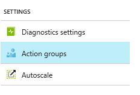
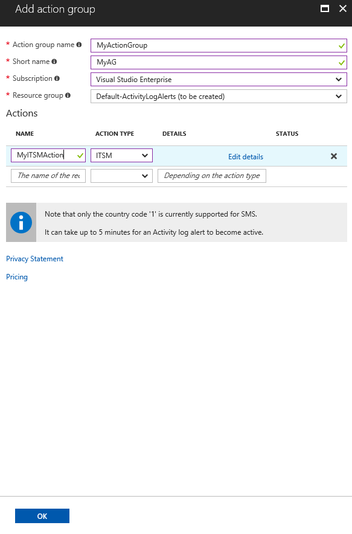
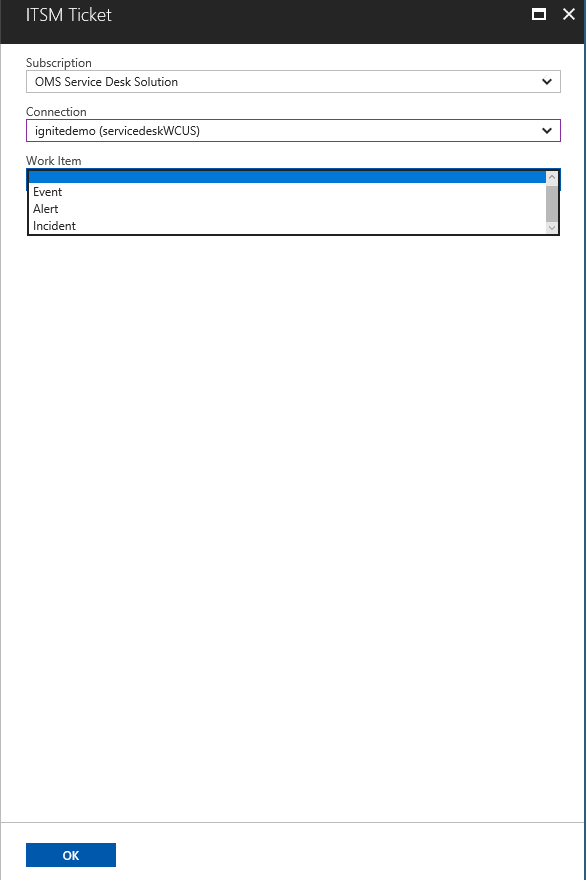

# Centrally manage ITSM work items using IT Service Management Connector (Preview)

The IT Service Management Connector provides a bi-directional integration between a supported IT Service Management (ITSM) product/service and Log Analytics.  Through this connection, you can create incidents, alerts, or events in ITSM product based on Log Analytics Alerts or Log records. The connector also imports data such as incidents, and change requests from ITSM product into OMS Log Analytics.

With IT Service Management Connector, you can:

  - Integrate operational alerting with your incident management practices in the ITSM tool of your choice.
    - Create work items (like alert, event, incident) in ITSM from OMS alerts and through log search.
    - Create work items based on your Azure Activity Log alerts through ITSM Action in Action Groups. 
  
  - Unify the monitoring, log and service management data used across your organization.
    - Correlate incident and change request data from your ITSM tooling with relevant log data in Log Analytics workspace.   
    - View top-level dashboards for an overview on incidents, change requests, and impacted systems.
    - Write Log Analytics queries to gain insights into Service Management data.
      
## Adding the IT Service Management Connector Solution

Add the IT Service Management Connector solution to your Log Analytics work space, using the process described in [Add Log Analytics solutions from the Solutions Gallery](log-analytics-add-solutions.md).

IT Service Management Connector tile as you see in the Solutions gallery:

After successful addition, you will see the IT Service Management Connector under **OMS** > **Settings** > **Connected Sources.**

> [!NOTE]

> By default, the IT Service Management Connector refreshes the connection's data once in every 24 hours. To refresh your connection's data instantly for any edits or template updates that you make, click the refresh button displayed next to your connection.

 

## Configuring the connection with your ITSM software

IT Service Management Connector Solution supports connections to **System Center Service Manager**, **ServiceNow**, **Provance** and **Cherwell**. Follow the respective links to configure your solution:

- [System Center Service Manager (SCSM)](log-analytics-itsmc-connections.md#connect-system-center-service-manager-to-it-service-management-connector-in-oms)

- [ServiceNow](log-analytics-itsmc-connections.md#connect-servicenow-to-it-service-management-connector-in-oms)

- [Provance](log-analytics-itsmc-connections.md#connect-provance-to-it-service-management-connector-in-oms)  

- [Cherwell](log-analytics-itsmc-connections.md#connect-cherwell-to-it-service-management-connector-in-oms)

## Using the solution

Once you have configured the IT Service Management Connector with your ITSM software details, the Connector starts gathering data from the connected ITSM product/service. Depending on the number of incidents, and change requests in the ITSM product/service, intial sync should be completed in few minutes. 

> [!NOTE]
> - Data imported from ITSM product by IT Service Management Connector solution appears in Log Analytics as log records of Type **ServiceDesk_CL**.
> - Log record contains a field named **ServiceDeskWorkItemType_s**, which is either incident or change request, the two kinds of data imported from the ITSM product

## Data synced from ITSM product
Incidents and change requests are synced from your ITSM product to your Log Analytics workspace. 
The following information shows examples of data gathered by the IT Service Management connector:

> [!NOTE]
> Depending on the work item type imported into Log Analytics, **ServiceDesk_CL** contains the following fields:

**Work item:** **Incidents**  
ServiceDeskWorkItemType_s="Incident"

**Fields**

- ServiceDeskConnectionName
- Service Desk ID
- State
- Urgency
- Impact
- Priority
- Escalation
- Created By
- Resolved By
- Closed By
- Source
- Assigned To
- Category
- Title
- Description
- Created Date
- Closed Date
- Resolved Date
- Last Modified Date
- Computer

**Work item:** **Change Requests**

ServiceDeskWorkItemType_s="ChangeRequest"

**Fields**
- ServiceDeskConnectionName
- Service Desk ID
- Created By
- Closed By
- Source
- Assigned To
- Title
- Type
- Category
- State
- Escalation
- Conflict Status
- Urgency
- Priority
- Risk
- Impact
- Assigned To
- Created Date
- Closed Date
- Last Modified Date
- Requested Date
- Planned Start Date
- Planned End Date
- Work Start Date
- Work End Date
- Description
- Computer

## Output data for a ServiceNow incident

| OMS field | ITSM field |
|:--- |:--- |
| ServiceDeskId_s| Number |
| IncidentState_s | State |
| Urgency_s |Urgency |
| Impact_s |Impact|
| Priority_s | Priority |
| CreatedBy_s | Opened by |
| ResolvedBy_s | Resolved by|
| ClosedBy_s  | Closed by |
| Source_s| Contact type |
| AssignedTo_s | Assigned to  |
| Category_s | Category |
| Title_s|  Short description |
| Description_s|  Notes |
| CreatedDate_t|  Opened |
| ClosedDate_t| closed|
| ResolvedDate_t|Resolved|
| Computer  | Configuration item |

## Output data for a ServiceNow change request

| OMS field | ITSM field |
|:--- |:--- |
| ServiceDeskId_s| Number |
| CreatedBy_s | Requested by |
| ClosedBy_s | Closed by |
| AssignedTo_s | Assigned to  |
| Title_s|  Short description |
| Type_s|  Type |
| Category_s|  Category |
| CRState_s|  State|
| Urgency_s|  Urgency |
| Priority_s| Priority|
| Risk_s| Risk|
| Impact_s| Impact|
| RequestedDate_t  | Requested by date |
| ClosedDate_t | Closed date |
| PlannedStartDate_t  | 	Planned start date |
| PlannedEndDate_t  | 	Planned end date |
| WorkStartDate_t  | Actual start date |
| WorkEndDate_t | Actual end date|
| Description_s | Description |
| Computer  | Configuration Item |

**Sample Log Analytics screen for ITSM data:**

## IT Service Management connector – integration with other OMS solutions

IT Service Management Connector currently supports integration with the Service Map solution.

Service Map automatically discovers the application components on Windows and Linux systems and maps the communication between services. It allows you to view your servers as you think of them – as interconnected systems that deliver critical services. Service Map shows connections between servers, processes, and ports across any TCP-connected architecture with no configuration required other than installation of an agent. More information: [Service Map](../operations-management-suite/operations-management-suite-service-map.md).

If you also use the Service Map solution, you can view the service desk items created in the ITSM solutions as shown in the following example:

## Create ITSM work items for OMS alerts

With ITSM Connector solution in place, you can configure OMS Alerts to trigger the creation of work items in your connected ITSM tool as follows:

1. From **Log Search** window, run a log search query to view data. Query results are the source for work items.
2. In **Log Search**, click **Alert** to open the **Add Alert Rule** page.

    

3. On the **Add Alert Rule** window, provide the required details for **Name**, **Severity**,  **Search query**, and **Alert criteria** (Time Window/Metric measurement).
4. Select **Yes** for **ITSM Actions**.
5. Select your ITSM connection from the **Select Connection** list.
6. Provide the details as required.
7. To create a separate work item for each log entry of this alert, select the **Create individual work items for each log entry** checkbox.

    Or

    leave this checkbox unselected to create only one work item for any number of log entries under this alert.

7. Click **Save**.

The OMS alert you have created can be seen under **Settings**>**Alerts**. The corresponding ITSM connection's work items are created when the specified alert's condition is met.

## Create ITSM work items from OMS logs

You can also create work items in the connected ITSM sources directly from a log record as follows:

1. From **Log Search**,  search the required data, select the detail, and click **Create work item**.

    The **Create ITSM Work item** window appears:

    

2.   Add the following details:

  - **Work item Title**: Title for the work item.
  - **Work item Description**: Description for the new work item.
  - **Affected Computer**: Name of the computer where this log data was found.
  - **Select Connection**:  ITSM connection in which you want to create this work item.
  - **Work item**:  Type of work item.

3. To use an existing work item template for an incident, click **Yes** under **Generate work item based on the template** option and then click **Create**.

    Or,

    Click **No** if you want to provide your customized values.

4. Provide the appropriate values in the **Contact Type**, **Impact**, **Urgency**, **Category**, and **Sub Category** text boxes, and then click **Create**.

## Create ITSM work items from Azure Alerts
ITSM Connector is now integrated with Action Groups. [Action Groups](../monitoring-and-diagnostics/monitoring-action-groups.md) provide a modular and reusable way of triggering actions for your Azure Alerts. The ITSM Action in Action Groups creates work items in your ITSM product using an existing ITSM Connector Solution.

1. In Azure portal, click on **Monitor**
2. In the left pane, click on **Action Groups**

    

3. Provide **Name** and **ShortName** for your action group. Select the **Resource Group** and **Subscription** where you want your action group to get created.

    

4. In the Actions list, select **ITSM** from the drop-down for **Action Type**. Provide a **Name** for the action and click on **Edit details**.

5. Select the **Subscription** where your Log Analytics workspace is located. Select the **Connection** i.e your ITSM Connector name followed by your Workspace name. For example - "MyITSMMConnector(MyWorkspace)."

    

6. Select **Work Item** type from the drop-down.
7. Choose to use an existing template or fill the fields required by your ITSM product.
8. Click **OK**

When creating/editing an Azure alert rule, use an Action Group which has an ITSM Action. When the alert triggers, work item is created in the ITSM tool. 

>[!NOTE]
>Currently only Activity Log Alerts support the ITSM Action. For other Azure alerts, this action is a no-op.
>

## Troubleshoot ITSM connections in OMS
1.	If connection fails from connected source's UI with an **Error in saving connection** message, take the following steps:
 - For ServiceNow, Cherwell and Provance connections,
    - ensure you correctly entered  the username, password, client ID, and client secret  for each of the connections.
    - check if you have sufficient privileges in the corresponding ITSM product to make the connection.
 - For Service Manager connections,
     - ensure that the Web app is successfully deployed and hybrid connection is created. To verify the connection is successfully established with the on-prem Service Manager machine, visit the  Web app URL as detailed in the documentation for making the [hybrid connection](log-analytics-itsmc-connections.md#configure-the-hybrid-connection).
     
2.	If data from ServiceNow is not getting synced to Log Analytics, ensure that the ServiceNow instance is not sleeping. ServiceNow Dev Instances sometimes go to sleep when idle for a long period. Else, report the issue.
3.	If OMS Alerts fire but work items are not created in ITSM product or configuration items are not created/linked to work items or for any other generic information, look in the following places:
 -  **IT Service Management Connector solution**: The solution shows a summary of connections/work items/computers etc. Click on the tile showing **Connector Status**, which takes you to **Log Search**  with the relevant query. Look at the log records with LogType_S as ERROR for more information.
 - Or view the errors/related information directly in the **Log Search** page using the query *Type=ServiceDeskLog_CL*.

## Troubleshoot Service Manager Web App deployment
1.	If you face issues with web app deployment, ensure you have sufficient permissions in the subscription mentioned to create/deploy resources.
2.	If you get an **"Object reference not set to instance of an object"** error when you run the [script](log-analytics-itsmc-service-manager-script.md), ensure that you entered valid values  under **User Configuration** section.
3.	If you fail to create service bus relay namespace, ensure that the required resource provider is registered in the subscription. If not registered, manually create service bus relay namespace from the Azure portal. You can also create it while [creating the hybrid connection](log-analytics-itsmc-connections.md#configure-the-hybrid-connection) from the Azure portal.

## Contact Us

For any queries or feedback on the IT Service Management Connector, contact us at [omsitsmfeedback@microsoft.com](mailto:omsitsmfeedback@microsoft.com).

## Next steps
[Add ITSM products/services to IT Service Management Connector](log-analytics-itsmc-connections.md).
