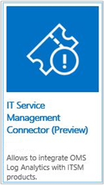
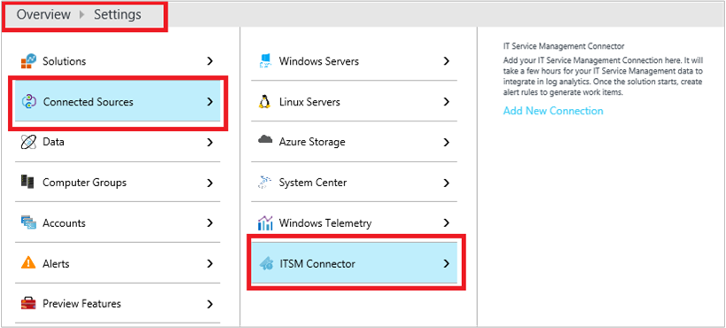
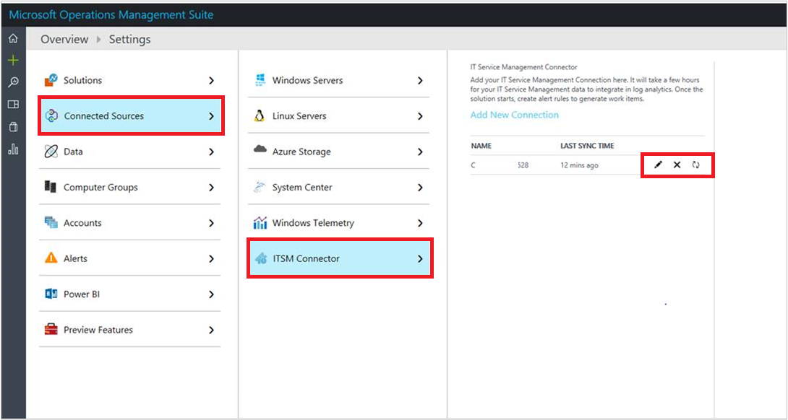
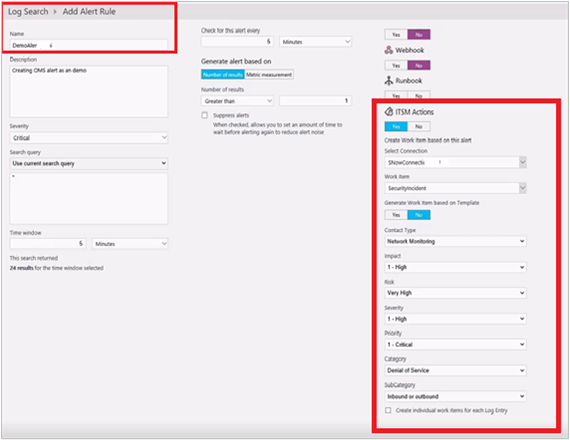
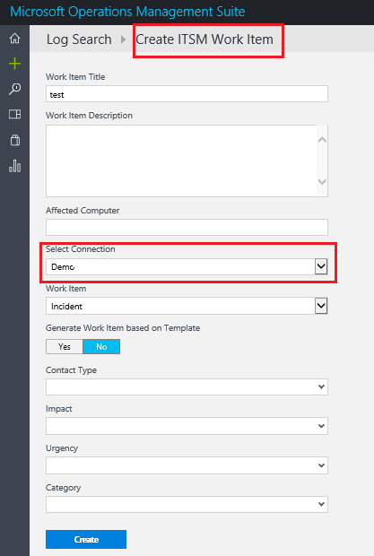

# Centrally manage ITSM work items using IT Service Management Connector (Preview)

You can use the IT Service Management Connector (ITSMC) in OMS Log Analytics to centrally monitor and manage work items across your ITSM products/services.

The IT Service Management Connector integrates your existing IT service management (ITSM) products and services with OMS Log Analytics.  The solution has bidirectional integration with ITSM products/services, where it provides the OMS users an option to create incidents, alerts, or events in ITSM solution. The connector also  imports data such as incidents, and change requests from ITSM solution into OMS Log Analytics.

With IT Service Management Connector, you can:

  - Centrally monitor and manage work items for ITSM products/services used across your organization.
  - Create ITSM work items (like alert, event, incident) in ITSM from OMS alerts and through log search.
  - Read incidents and change requests from your ITSM solution and correlate with relevant log data in Log Analytics workspace.
  - Find any unexpected and unusual events and resolve them, even before the end users call and report them to the helpdesk.
  - Import work items data into Log Analytics and create key performance indicator (KPI) reports.  Using these reports, you can identify, assess and act on several important items such as malware assessment.
  - View curated dashboards for deeper insights on incidents, change requests and impacted systems.
  - Troubleshoot faster by correlating with other management solutions in the Log Analytics workspace.

## Prerequisites

To import the ITSM work items into OMS Log Analytics, the solution requires a connection between the IT Service Management Connector in the OMS and the IT SM product/service from which you import the work items.

## Configuration

Add the IT Service Management Connector solution to your OMS work space, using the process described in [Add Log Analytics solutions from the Solutions Gallery](log-analytics-add-solutions.md).

IT Service Management Connector tile as you see in the Solutions gallery:

After successful addition, you will see the IT Service Management Connector under **OMS** > **Settings** > **Connected Sources.**

> [!NOTE]

> By default, the IT Service Management Connector refreshes the connection's data once in every 24 hours. To refresh your connection's data instantly for any edits or template updates that you make, click the refresh button displayed next to your connection.

 

## Management packs
This solution does not require any management packs.

## Connected sources

The following ITSM products/services are supported by the IT Service Management Connector:

- [System Center Service Manager (SCSM)](log-analytics-itsmc-connections.md#connect-system-center-service-manager-to-it-service-management-connector-in-oms)

- [ServiceNow](log-analytics-itsmc-connections.md#connect-servicenow-to-it-service-management-connector-in-oms)

- [Provance](log-analytics-itsmc-connections.md#connect-provance-to-it-service-management-connector-in-oms)  

- [Cherwell](log-analytics-itsmc-connections.md#connect-cherwell-to-it-service-management-connector-in-oms)

## Using the solution

Once you connect the OMS IT Service Management Connector with your ITSM service, the Log Analytics services starts gathering the data from the connected ITSM products/service.

> [!NOTE]
> - Data imported by IT Service Management Connector solution appears in Log Analytics as events named **ServiceDesk_CL**.
- Event contains a field named **ServiceDeskWorkItemType_s**. which can take its value as incident, or change request, depending on the work item data contained in the **ServiceDesk_CL** event.

The following information shows examples of data gathered by the IT Service Management Connector:

> [!NOTE]
> Depending on the work item type imported into Log Analytics, **ServiceDesk_CL** contains the following fields:

**Work item:** **Incidents**  
ServiceDeskWorkItemType_s="Incident"

**Fields**

- ServiceDeskConnectionName
- Service Desk ID
- State
- Urgency
- Impact
- Priority
- Escalation
- Created By
- Resolved By
- Closed By
- Source
- Assigned To
- Category
- Title
- Description
- Created Date
- Closed Date
- Resolved Date
- Last Modified Date
- Computer

**Work item:** **Change Requests**

ServiceDeskWorkItemType_s="ChangeRequest"

**Fields**
- ServiceDeskConnectionName
- Service Desk ID
- Created By
- Closed By
- Source
- Assigned To
- Title
- Type
- Category
- State
- Escalation
- Conflict Status
- Urgency
- Priority
- Risk
- Impact
- Assigned To
- Created Date
- Closed Date
- Last Modified Date
- Requested Date
- Planned Start Date
- Planned End Date
- Work Start Date
- Work End Date
- Description
- Computer

Sample Log Analytics screen for ITSM data:

## IT Service Management Connector – integration with other OMS solutions

IT Service Management Connector, currently supports integration with the Service Map solution.

Service Map automatically discovers the application components on Windows and Linux systems and maps the communication between services. It allows you to view your servers as you think of them – as interconnected systems that deliver critical services. Service Map shows connections between servers, processes, and ports across any TCP-connected architecture with no configuration required other than installation of an agent. More information: [Service Map](../operations-management-suite/operations-management-suite-service-map.md).

With this integration, you can view the service desk items created in the ITSM solutions as shown in the following example:

## Create ITSM work items for OMS alerts

For the OMS alerts, you can create associated work items in the connected ITSM sources.  To do this, use the following procedure:

1. From **Log Search** window, run a log search query to view data. Query results are the source for work items.
2. In **Log Search**, click **Alert** to open the **Add Alert Rule** page.

    

3. On the **Add Alert Rule** window, provide the required details for **Name**, **Severity**,  **Search query**, and **Alert criteria** (Time Window/Metric measurement).
4. Select **Yes** for **ITSM Actions**.
5. Select your ITSM connection from the **Select Connection** list.
6. Provide the details as required.
7. To create a separate work item for each log entry of this alert, select the **Create individual work items for each log entry** checkbox.

    Or

    leave this checkbox unselected to create only one work item for any number of log entries under this alert.

7. Click **Save**.

The OMS alert will be created under **Alerts**. The corresponding ITSM connection's work items are created when the specified alert's condition is met.

## Create ITSM work items from OMS logs

You can create work items in the connected ITSM sources by using OMS Log Search. To do this, use the following procedure:

1. From **Log Search**,  search the required data, select the detail, and click **Create work item**.

    The **Create ITSM Work item** window appears:

    

2.   Add the following details:

  - **Work item Title**: Title for the work item.
  - **Work item Description**: Description for the new work item.
  - **Affected Computer**: Name of the computer where this log data was found.
  - **Select Connection**:  ITSM connection in which you want to create this work item.
  - **Work item**:  Type of work item.

3. To use an existing work item template for an incident, click **Yes** under **Generate work item based on the template** option and then click **Create**.

    Or,

    Click **No** if you want to provide your customized values.

4. Provide the appropriate values in the **Contact Type**, **Impact**, **Urgency**, **Category**, and **Sub Category** text boxes, and then click **Create**.

The work item will be created in the ITSM, which you can also view in OMS.

## Contact us

For any queries or feedback on the IT Service Management Connector, contact us at [omsitsmfeedback@microsoft.com](mailto:omsitsmfeedback@microsoft.com).

## Next steps
[Add ITSM products/services to IT Service Management Connector](log-analytics-itsmc-connections.md).
