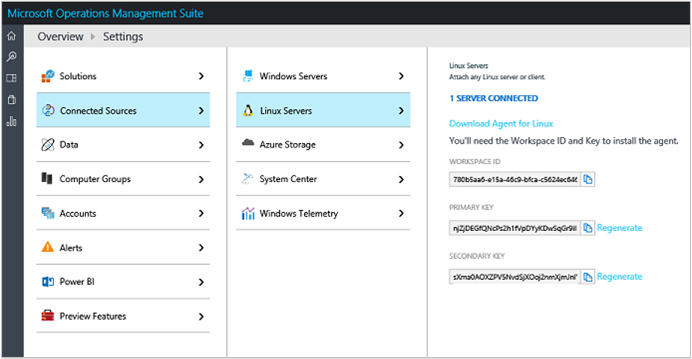
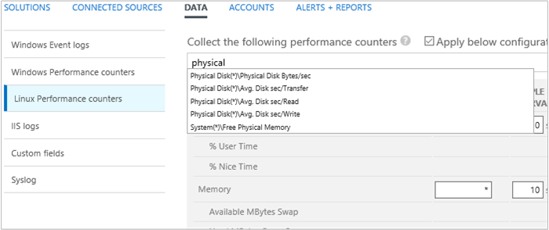
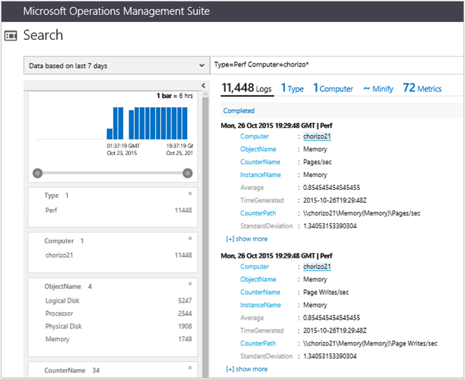
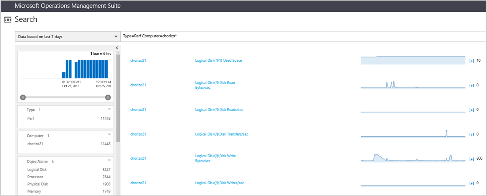
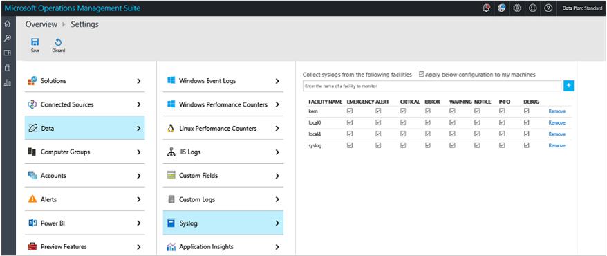
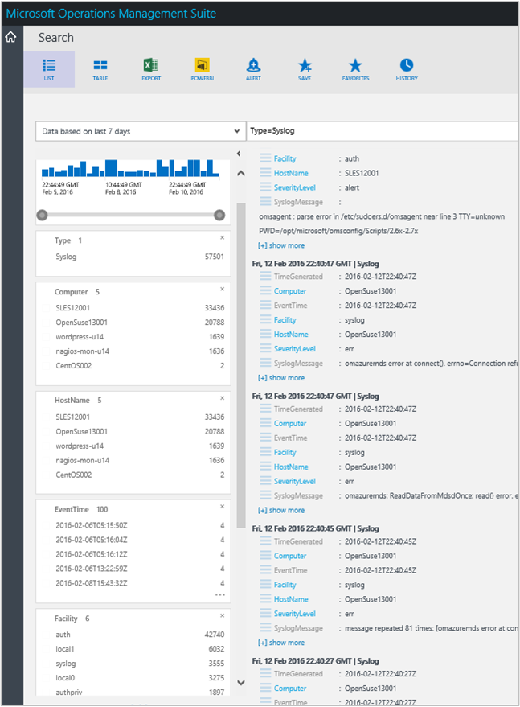
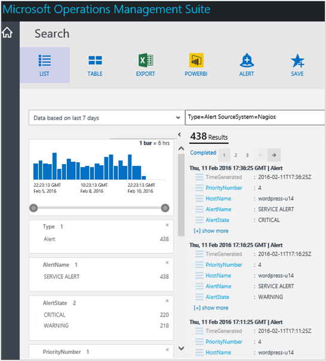
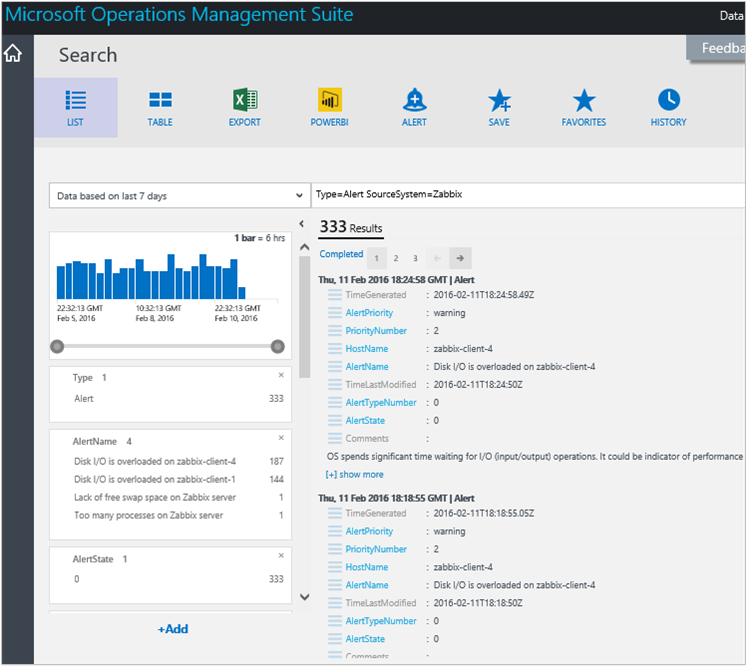
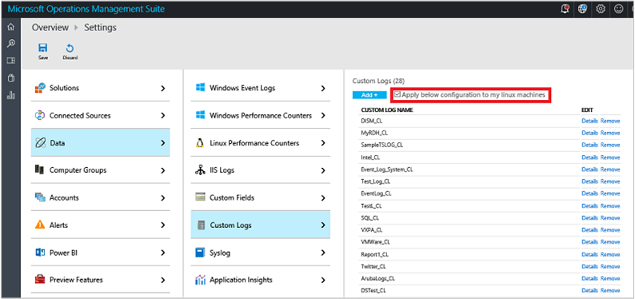

<properties
	pageTitle="Connect Linux computers to Log Analytics | Microsoft Azure"
	description="Using Log Analytics, you can collect and act on data generated from Linux computers."
	services="log-analytics"
	documentationCenter=""
	authors="bandersmsft"
	manager="jwhit"
	editor=""/>

<tags
	ms.service="log-analytics"
	ms.workload="na"
	ms.tgt_pltfrm="na"
	ms.devlang="na"
	ms.topic="article"
	ms.date="08/03/2016"
	ms.author="banders"/>

# Connect Linux computers to Log Analytics

Using Log Analytics, you can collect and act on data generated from Linux computers. Adding data collected from Linux to OMS allows you to manage Linux systems and container solutions like Docker regardless of where your computers are located—virtually anywhere. So, those data sources might reside in your on-premises datacenter as physical servers, virtual computers in a cloud-hosted service like Amazon Web Services (AWS) or Microsoft Azure, or even the laptop on your desk. In addition, OMS also collects data from Windows computers similarly, so it supports a truly hybrid IT environment.

You can view and manage data from all of those sources with Log Analytics in OMS with a single management portal. This reduces the need to monitor it using many different systems, makes it easy to consume, and you can export any data you like to whatever business analytics solution or system that you already have.

This article is a quick start guide that will help you collect and manage data for your Linux computers using the OMS Agent for Linux. For more technical details such as proxy server configuration, information about CollectD metrics, and custom JSON data sources, you’ll find that information at [OMS Agent for Linux overview](https://github.com/Microsoft/OMS-Agent-for-Linux) and [OMS Agent for Linux full documentation](https://github.com/Microsoft/OMS-Agent-for-Linux/blob/master/docs/OMS-Agent-for-Linux.md) on Github.


Currently, you can collect the following types of data from Linux computers:

- Performance metrics
- Syslog events
- Alerts from Nagios and Zabbix
- Docker container performance metrics, inventory and logs

## Supported Linux versions

Both x86 and x64 versions are officially supported on a variety of Linux distributions. However, the OMS Agent for Linux might also run on other distributions not listed.

- Amazon Linux 2012.09 through 2015.09
- CentOS Linux 5, 6, and 7
- Oracle Linux 5, 6, and 7
- Red Hat Enterprise Linux Server 5, 6 and 7
- Debian GNU/Linux 6, 7, and 8
- Ubuntu 12.04 LTS, 14.04 LTS, 15.04, 15.10
- SUSE Linux Enterprise Server 11 and 12

## OMS Agent for Linux
The Operations Management Suite Agent for Linux comprises multiple packages. The release file contains the following packages, available by running the shell bundle with `--extract`.

**Package** | **Version** | **Description**
----------- | ----------- | --------------
omsagent | 1.1.0 | The Operations Management Suite Agent for Linux
omsconfig | 1.1.1 | Configuration agent for the OMS Agent
omi | 1.0.8.3 | Open Management Infrastructure (OMI) -- a lightweight CIM Server
scx | 1.6.2 | OMI CIM Providers for operating system performance metrics
apache-cimprov | 1.0.0 | Apache HTTP Server performance monitoring provider for OMI. Only installed if Apache HTTP Server is detected.
mysql-cimprov | 1.0.0 | MySQL Server performance monitoring provider for OMI. Only installed if MySQL/MariaDB server is detected.
docker-cimprov | 0.1.0 | Docker provider for OMI. Only installed if Docker is detected.

### Additional installation artifacts
After installing the OMS agent for Linux packages, the following additional system-wide configuration changes are applied. These artifacts are removed when the omsagent package is uninstalled.
- A non-privileged user named: `omsagent` is created. This is the account the omsagent daemon runs as
- A sudoers “include” file is created at /etc/sudoers.d/omsagent This authorizes omsagent to restart the syslog and omsagent daemons. If sudo “include” directives are not supported in the installed version of sudo, these entries will be written to /etc/sudoers.
- The syslog configuration is modified to forward a subset of events to the agent. For more information, see the **Configuring Data Collection** section below

### Linux data collection details

The following table shows data collection methods and other details about how data is collected.

| source | Direct Agent | SCOM agent | Azure Storage | SCOM required? | SCOM agent data sent via management group | collection frequency |
|---|---|---|---|---|---|---|
|Zabbix||||            ||1 minute|
|Nagios||||            ||on arrival|
|syslog||||            ||from Azure storage: 10 minutes; from agent: on arrival|
|Linux performance counters||||            ||As scheduled, minimum of 10 seconds|
|change tracking||||            ||hourly|


### Package Requirements
| **Required package** 	| **Description** 	| **Minimum version**|
|--------------------- | --------------------- | -------------------|
|Glibc |	GNU C library	| 2.5-12|
|Openssl	| OpenSSL libraries | 0.9.8e or 1.0|
|Curl | cURL web client | 7.15.5
|Python-ctypes |function libraries | n/a|
|PAM | Pluggable authentication Modules	 |n/a |

>[AZURE.NOTE] Either rsyslog or syslog-ng are required to collect syslog messages. The default syslog daemon on version 5 of Red Hat Enterprise Linux, CentOS, and Oracle Linux version (sysklog) is not supported for syslog event collection. To collect syslog data from this version of these distributions, the rsyslog daemon should be installed and configured to replace sysklog.

## Quick install

Run the following commands to download the omsagent, validate the checksum, then  install and onboard the agent. Commands are for 64-bit. The Workspace ID and Primary Key are found in the OMS portal under **Settings** on the **Connected Sources** tab.



```
wget https://github.com/Microsoft/OMS-Agent-for-Linux/releases/download/v1.1.0-28/omsagent-1.1.0-28.universal.x64.sh
sha256sum ./omsagent-1.1.0-28.universal.x64.sh
sudo sh ./omsagent-1.1.0-28.universal.x64.sh --upgrade -w <YOUR OMS WORKSPACE ID> -s <YOUR OMS WORKSPACE PRIMARY KEY>
```

There are a variety of other methods to install the agent and upgrade it. You can read more about them at [Steps to install the OMS Agent for Linux](https://github.com/Microsoft/OMS-Agent-for-Linux/blob/master/docs/OMS-Agent-for-Linux.md#steps-to-install-the-oms-agent-for-linux).

You can also view the [Azure video walkthrough](https://www.youtube.com/watch?v=mF1wtHPEzT0).

## Choose your Linux data collection method

How you choose the data types you'd like to collect depends on whether you want to use the OMS portal or if you want edit various configuration files directly on your Linux clients. If you choose to use the portal, the configuration is sent to all of your Linux clients automatically. If you need different configurations for different Linux clients, you will need to edit client files individually – or use an alternative like PowerShell DSC, Chef, or Puppet.

You can specify the syslog events and performance counters that you want to collect using configuration files on the Linux computers. *If you chose to configure data collection by editing agent configuration files, you should disable the centralized configuration.*  Instructions are provided below to configure data collection in the agent's configuration files as well as to disable central configuration for all OMS Agents for Linux, or individual computers.

### Disable OMS management for an individual Linux computer

Centralized data collection for configuration data is disabled for an individual Linux computer with the OMS_MetaConfigHelper.py script. This can be useful if a subset of computers should have a specialized configuration.

To disable centralized configuration:

```
sudo /opt/microsoft/omsconfig/Scripts/OMS_MetaConfigHelper.py --disable
```

To re-enable centralized configuration:

```
sudo /opt/microsoft/omsconfig/Scripts/OMS_MetaConfigHelper.py –enable
```

## Linux performance counters

Linux performance counters are similar to Windows performance counters—both operate similarly. You can use the following procedures to add and configure them. After they are added to OMS, data is collected for them every 30 seconds.

### To add a Linux performance counter in OMS

1. To configure OMS Agents for Linux using the OMS portal, you can add Linux performance counters on the Settings page, click **Data**.  
    
2. On the **Settings** page under **Data** , click **Linux performance counters** and then to the left of the plus icon, type the name of the counter you want to add.  
    
3. If you don't know the full name of the counter, you can start typing a partial name and a list of available counters will appear. When you find the counter you want to add, click the name in the list and then click the plus icon to add the counter.
4. After you add the counter, it appears in the list of counters highlighted with a colored bar.
5. By default, the **Apply below configuration to my machines** option is selected. If you want to disable sending configuration data, clear the selection.
6. When you are done modifying performance counters, at the bottom of the page click **Save** to finalize your changes. The configuration changes that you've made are then sent to all the OMS Agents for Linux that are registered with OMS, typically within 5 minutes.

### Configure Linux performance counters in OMS

For Windows performance counters, you can choose a specific instance for each performance counter. However, for Linux performance counters, whatever instance of a counter that you choose applies to all child counters of the parent counter. The following table shows the common instances available to both Linux and Windows performance counters.

| **Instance name** | **Meaning** |
| --- | --- |
| \_Total | Total of all the instances |
| \* | All instances |
| (/&#124;/var) | Matches instances named: / or /var |


Similarly, the sample interval that you choose for a parent counter applies to all its child counters. In other words, all the child counter sample intervals and instances are tied together.

### Add and configure performance metrics with Linux

Performance metrics to collect are controlled by the configuration in /etc/opt/microsoft/omsagent/conf/omsagent.conf. See [Available performance metrics](https://github.com/Microsoft/OMS-Agent-for-Linux/blob/master/docs/OMS-Agent-for-Linux.md#appendix-available-performance-metrics) for available classes and metrics for the OMS Agent for Linux.

Each object, or category, of performance metrics to collect should be defined in the configuration file as a single `<source>` element. The syntax follows the pattern below.

```
<source>
  type oms_omi  
  object_name "Processor"
  instance_regex ".*"
  counter_name_regex ".*"
  interval 30s
</source>

```

The configurable parameters of this element are:

- **Object\_name**: the object name for the collection.
- **Instance\_regex**: a *regular expression* defining which instances to collect. The value: `.*` specifies all instances. To collect processor metrics for only the \_Total instance, you could specify `_Total`. To collect process metrics for only the crond or sshd instances, you could specify: `(crond|sshd)`.
- **Counter\_name\_regex**: a *regular expression* defining which counters (for the object) to collect. To collect all counters for the object, specify: `.*`. To collect only swap space counters for the memory object, you could specify: `.+Swap.+`
- **Interval:**: the frequency at which the object's counters are collected.

The default configuration for performance metrics is:

```
<source>
  type oms_omi
  object_name "Physical Disk"
  instance_regex ".*"
  counter_name_regex ".*"
  interval 5m
</source>

<source>
  type oms_omi
  object_name "Logical Disk"
  instance_regex ".*
  counter_name_regex ".*"
  interval 5m
</source>

<source>
  type oms_omi
  object_name "Processor"
  instance_regex ".*
  counter_name_regex ".*"
  interval 30s
</source>

<source>
  type oms_omi
  object_name "Memory"
  instance_regex ".*"
  counter_name_regex ".*"
  interval 30s
</source>

```

### Enable MySQL performance counters using Linux commands

If MySQL Server or MariaDB Server is detected on the computer when the omsagent bundle is installed, a performance monitoring provider for MySQL Server is automatically installed. This provider connects to the local MySQL/MariaDB server to expose performance statistics. You need to configure MySQL user credentials so that the provider can access the MySQL Server.

To define a default user account for the MySQL server on localhost, use the following command example.

>[AZURE.NOTE] The credentials file must be readable by the omsagent account. Running the mycimprovauth command as omsgent is recommended.


```
sudo su omsagent -c '/opt/microsoft/mysql-cimprov/bin/mycimprovauth default 127.0.0.1 <username> <password>'

sudo service omiserverd restart
```


Alternatively, you can specify the required MySQL credentials in a file, by creating the file: /var/opt/microsoft/mysql-cimprov/auth/omsagent/mysql-auth. For more information about managing MySQL credentials for monitoring through the mysql-auth file, see [Manage MySQL monitoring credentials in the authentication file](#manage-mysql-monitoring-credentials-in-the-authentication-file).

See [Database permissions required for MySQL performance counters](#database-permissions-required-for-mysql-performance-counters) for details about object permissions required by the MySQL user to collect MySQL Server performance data.

### Enable Apache HTTP Server performance counters using Linux commands

If Apache HTTP Server is detected on the computer when the omsagent bundle is installed, a performance monitoring provider for Apache HTTP Server is automatically installed. This provider relies on an Apache "module" that must be loaded into the Apache HTTP Server in order to access performance data.

You can load the module with the following command:

```
sudo /opt/microsoft/apache-cimprov/bin/apache_config.sh -c
```

To unload the Apache monitoring module, run the following command:

```
sudo /opt/microsoft/apache-cimprov/bin/apache_config.sh -u
```
### To view performance data with Log Analytics

1. In the Operations Management Suite portal, click the Log Search tile.
2. In the search bar, type `* (Type=Perf)` to view all performance counters.


Because OMS also collects Windows performance counter data, you should scope-down the search to Linux-specific data. So, the following example would show performance data specific to an example Linux server named Chorizo21.

```
Type=Perf Computer=chorizo*
```



In the results, you can click **Metrics** to view the counters that data was collected for. Real-time data is shown as graphs for each counter.




## Syslog

Syslog is an event logging protocol similar to Windows Event logs—both operate similarly when displayed in OMS.

### To add a new Linux syslog facility in OMS

1. On the **Settings** page under **Data** , click **Syslog** and then to the left of the plus icon, type the name of the syslog facility that you want to add.
    
2.	If you don’t know the full name of the facility, you can start typing a partial name and a list of available syslog facilities will appear. When you find the syslog facility that you want to add, click the name in the list and then click the plus icon to add the syslog facility.
3.	After you add the facility, it appears in the list of highlighted with a colored bar. Next, choose the severities (categories of syslog facility information) that you want to collect.
4.	At the bottom of the page click **Save** to finalize your changes. The configuration changes that you’ve made are then sent to all the OMS Agents for Linux that are registered with OMS, typically within 5 minutes.


### Configure Linux syslog facilities in Linux

Syslog events are sent from the syslog daemon, for example rsyslog or syslog-ng, to a local port that the agent is listening on. By default, port 25224. When the agent is installed, a default syslog configuration is applied. This is found at:


Rsyslog:
/etc/rsyslog.d/rsyslog-oms.conf

Syslog-ng:
/etc/syslog-ng/syslog-ng.conf


The default OMS agent syslog configuration uploads syslog events from all facilities with a severity of warning or higher.

>[AZURE.NOTE] If you edit the syslog configuration, you must restart the syslog daemon for the changes to take effect.

The default syslog configuration for the OMS Agent for Linux for OMS is:

#### Rsyslog

```
kern.warning       @127.0.0.1:25224
user.warning       @127.0.0.1:25224
daemon.warning     @127.0.0.1:25224
auth.warning       @127.0.0.1:25224
syslog.warning     @127.0.0.1:25224
uucp.warning       @127.0.0.1:25224
authpriv.warning   @127.0.0.1:25224
ftp.warning        @127.0.0.1:25224
cron.warning       @127.0.0.1:25224
local0.warning     @127.0.0.1:25224
local1.warning     @127.0.0.1:25224
local2.warning     @127.0.0.1:25224
local3.warning     @127.0.0.1:25224
local4.warning     @127.0.0.1:25224
local5.warning     @127.0.0.1:25224
local6.warning     @127.0.0.1:25224
local7.warning     @127.0.0.1:25224
```

#### Syslog-ng

```
#OMS_facility = all
filter f_warning_oms { level(warning); };
destination warning_oms { tcp("127.0.0.1" port(25224)); };
log { source(src); filter(f_warning_oms); destination(warning_oms); };
```

### To view all Syslog events with Log Analytics

1. In the Operations Management Suite portal, click the **Log Search** tile.
2. In the **Log Management** grouping, choose a predefined syslog search and then select one to run it.

This example shows all Syslog events.



Now you can drill into search results.

## Linux alerts

If you use Nagios or Zabbix to manage your Linux machines, then OMS can receive the alerts generated from those tools. However, there is currently no method to configure incoming alert data using the OMS portal. Instead, you will need to edit a config file to start sending alerts to OMS.


### Collect alerts from Nagios

To collect alerts from a Nagios server, you need to make the following configuration changes.

1. Grant the user **omsagent** read access to the Nagios log file (i.e. /var/log/nagios/nagios.log/var/log/nagios/nagios.log). Assuming the nagios.log file is owned by the group **nagios** , you can add the user **omsagent** to the **nagios** group.

    ```
    sudo usermod –a -G nagios omsagent
    ```

2. Modify the omsagent.confconfiguration file (/etc/opt/microsoft/omsagent/conf/omsagent.conf). Ensure the following entries are present and not commented out:

    ```
    <source>
    type tail
    #Update path to point to your nagios.log
    path /var/log/nagios/nagios.log
    format none
    tag oms.nagios
    </source>

    <filter oms.nagios>
    type filter_nagios_log
    </filter>
    ```

3. Restart the omsagent daemon:

    ```
    sudo service omsagent restart
    ```

### Collect alerts from Zabbix

To collect alerts from a Zabbix server, you'll perform similar steps to those for Nagios above, except you'll need to specify a user and password in *clear text*. This is not ideal, but will likely change soon. To address this issue, we recommend that you create the user and grant it permission to monitor only.

An example section of the omsagent.conf configuration file  (/etc/opt/microsoft/omsagent/conf/omsagent.conf) for Zabbix should resemble the following:

```
<source>
  type zabbix_alerts
  run_interval 1m
  tag oms.zabbix
  zabbix_url http://localhost/zabbix/api_jsonrpc.php
  zabbix_username Admin
  zabbix_password zabbix
</source>

```

### View alerts in Log Analytics search

After you've configured your Linux computers to send alerts to OMS, you can use a few simple log search queries to view the alerts. The following search query example returns all the recorded alerts that were generated. For example, if some sort of problem occurs in your IT infrastructure, then results for the following example query might indicate where the problem might originate. And, you can easily drill in to the alerts by source system to help narrow your investigation. The benefit is that you don't necessarily have to go to various management systems from the start—provided that your alerts are sent to OMS, you can start there.

```
Type=Alert
```

#### To view all Nagios alerts with Log Analytics
1. In the Operations Management Suite portal, click the **Log Search** tile.
2. In the query bar, type the following search query

    ```
    Type=Alert SourceSystem=Nagios
    ```


After you see the search results, you can drill into additional details such as *AlertState*.

### To view all Zabbix alerts with Log Analytics
1. In the Operations Management Suite portal, click the **Log Search** tile.
2. In the query bar, type the following search query

    ```
    Type=Alert SourceSystem=Zabbix
    ```


After you see the search results, you can drill into additional details such as *AlertName*.


## Compatibility with System Center Operations Manager

The OMS Agent for Linux shares agent binaries with the System Center Operations Manager agent. Installing the OMS Agent for Linux on a system currently managed by Operations Manager upgrades the OMI and SCX packages on the computer to a newer version. The OMS Agent for Linux and System Center 2012 R2 are compatible. However, **System Center 2012 SP1 and earlier versions are currently not compatible or supported with the OMS Agent for Linux.**

>[AZURE.NOTE] If the OMS Agent for Linux is installed to a computer that is not currently managed by Operations Manager, and you later want to manage the computer with Operations Manager, you must modify the OMI configuration before you discover the computer. **This step is not needed if the Operations Manager agent is installed before the OMS Agent for Linux.**

### To enable the OMS Agent for Linux to communicate with Operations Manager

1. Edit the file /etc/opt/omi/conf/omiserver.conf
2. Ensure that the line beginning with **httpsport=** defines the port 1270. Such as `httpsport=1270`
3. Restart the OMI server:

    ```
    service omiserver restart or systemctl restart omiserver
    ```


## Database permissions required for MySQL performance counters

To grant permissions to a MySQL monitoring user, the granting user must have the 'GRANT option' privilege as well as the privilege being granted.

In order for the MySQL User to return performance data the user will need access to the following queries:

```
SHOW GLOBAL STATUS;
SHOW GLOBAL VARIABLES:
```

In addition to these queries the MySQL user requires SELECT access to the following default tables:

- information_schema
- mysql

These privileges can be granted by running the following grant commands.

```
GRANT SELECT ON information_schema.* TO ‘monuser’@’localhost’;
GRANT SELECT ON mysql.* TO ‘monuser’@’localhost’;
```

## Manage MySQL monitoring credentials in the authentication file

The following sections help you manage MySQL credentials.

### Configure the MySQL OMI provider

The MySQL OMI provider requires a preconfigured MySQL user and installed MySQL client libraries in order to query the performance/health information from the MySQL instance.

### MySQL OMI authentication file

MySQL OMI provider uses an authentication file to determine what bind-address and port the MySQL instance is listening on and what credentials to use to gather metrics. During installation the MySQL OMI provider will scan MySQL my.cnf configuration files (default locations) for bind-address and port and partially set the MySQL OMI authentication file.

To complete monitoring of a MySQL server instance, add a pre-generated MySQL OMI authentication file into the correct directory.

### Authentication file format

The MySQL OMI authentication file is a text file that contains information about:

- Port
- Bind-Address
- MySQL username
- Base64 encoded password

The MySQL OMI authentication file only grants privileges for read/write to the Linux user that generated it.

```
[Port]=[Bind-Address], [username], [Base64 encoded Password]
(Port)=(Bind-Address), (username), (Base64 encoded Password)
(Port)=(Bind-Address), (username), (Base64 encoded Password)
AutoUpdate=[true|false]
```

A default MySQL OMI authentication file contains a default instance and a port number depending on what information is available and parsed from the found MySQL configuration file.

The default instance is a means to make managing multiple MySQL instances on one Linux host easier, and is denoted by the instance with port 0. All added instances will inherit properties set from the default instance. For example, if MySQL instance listening on port '3308' is added, the default instance's bind-address, username, and Base64 encoded password will be used to try and monitor the instance listening on 3308. If the instance on 3308 is binded to another address and uses the same MySQL username and password pair only the respecification of the bind-address is needed and the other properties will be inherited.

Examples of the authentication file resemble the following.

Default instance and instance with port 3308:

```
0=127.0.0.1, myuser, cnBwdA==3308=, ,AutoUpdate=true
```

Default instance and instance with port 3308 + different Base 64 encoded password:

```
0=127.0.0.1, myuser, cnBwdA==3308=127.0.1.1, , AutoUpdate=true
```


| **Property** | **Description** |
| --- | --- |
| Port | Port represents the current port the MySQL instance is listening on.  The port 0 implies that the properties following are used for default instance. |
| Bind-Address | the Bind Address is the current MySQL bind-address |
| username | This the username of the MySQL user you wish to use to monitor the MySQL server instance. |
| Base64 encoded Password | This is the password of the MySQL monitoring user encoded in Base64. |
| AutoUpdate | When the MySQL OMI Provider is upgraded the provider will rescan for changes in the my.cnf file and overwrite the MySQL OMI Authentication file. Set this flag to true or false depending on required updates to the MySQL OMI authentication file. |

#### Authentication file location

The MySQL OMI Authentication File should be located in the following location and named "mysql-auth":

/var/opt/microsoft/mysql-cimprov/auth/omsagent/mysql-auth

The file (and auth/omsagent directory) should be owned by the omsagent user.

## Agent logs

The logs for the OMS Agent for Linux is at:

/var/opt/microsoft/omsagent/log/

The logs for the OMS Agent for Linux for omsconfig (agent configuration) program is at:

/var/opt/microsoft/omsconfig/log/

Logs for the OMI and SCX components (which provide performance metrics data) is at:

/var/opt/omi/log/ and /var/opt/microsoft/scx/log

## Troubleshooting the OMS Agent for Linux

Use the following information to diagnose and troubleshoot common issues.

If none of the troubleshooting information in this section helps you, you can also use the following resources to help resolve your problem.

- Customers with Premier support can log a support case via [Premier](https://premier.microsoft.com/)
- Customers with Azure support agreements can log support cases in the [Azure portal](https://manage.windowsazure.com/?getsupport=true)
- File a [GitHub Issue](https://github.com/Microsoft/OMS-Agent-for-Linux/issues)
- Feedback forum for ideas and to create a bug report [http://aka.ms/opinsightsfeedback](http://aka.ms/opinsightsfeedback)

### Important log locations

File | Path
---- | -----
OMS Agent for Linux Log File | `/var/opt/microsoft/omsagent/log/omsagent.log `
OMS Agent Configuration Log File | `/var/opt/microsoft/omsconfig/omsconfig.log`

### Important configuration files

Catergory | File Location
----- | -----
Syslog | `/etc/syslog-ng/syslog-ng.conf` or `/etc/rsyslog.conf` or `/etc/rsyslog.d/95-omsagent.conf`
Performance, Nagios, Zabbix, OMS output and general agent | `/etc/opt/microsoft/omsagent/conf/omsagent.conf`
Additional configurations | `/etc/opt/microsoft/omsagent/conf.d/*.conf`

>[AZURE.NOTE] Editing configuration files for performance counters and syslog are overwritten if OMS Portal Configuration is enabled. You can disable configuration in the OMS Portal (for all nodes) or for single nodes by running the following:

```
sudo su omsagent -c /opt/microsoft/omsconfig/Scripts/OMS_MetaConfigHelper.py --disable
```


### Enable debug logging

To enable debug logging, you can use the OMS output plugin and verbose output.

#### OMS output plugin

FluentD allows the plugin to specify logging levels for different log levels for inputs and outputs. To specify a different log level for OMS output, edit the general agent configuration in the `/etc/opt/microsoft/omsagent/conf/omsagent.conf` file.

Near the bottom of the configuration file, change the `log_level` property from `info` to `debug`.

 ```
 <match oms.** docker.**>
  type out_oms
  log_level debug
  num_threads 5
  buffer_chunk_limit 5m
  buffer_type file
  buffer_path /var/opt/microsoft/omsagent/state/out_oms*.buffer
  buffer_queue_limit 10
  flush_interval 20s
  retry_limit 10
  retry_wait 30s
</match>
 ```

Debug logging allows you to see batched uploads to the OMS Service separated by type, number of data items, and time taken to send.

*Example debug enabled log:*
```
Success sending oms.nagios x 1 in 0.14s
Success sending oms.omi x 4 in 0.52s
Success sending oms.syslog.authpriv.info x 1 in 0.91s
```

#### Verbose output
Instead of using the OMS output plugin, you can also output data items directly to `stdout`, which is visible in the OMS Agent for Linux log file.

In the OMS general agent configuration file at `/etc/opt/microsoft/omsagent/conf/omsagent.conf`, comment-out the OMS output plugin by adding a `#` in front of each line.

```
#<match oms.** docker.**>
#  type out_oms
#  log_level info
#  num_threads 5
#  buffer_chunk_limit 5m
#  buffer_type file
#  buffer_path /var/opt/microsoft/omsagent/state/out_oms*.buffer
#  buffer_queue_limit 10
#  flush_interval 20s
#  retry_limit 10
#  retry_wait 30s
#</match>
```

Below the output plugin, remove the comment in the following section by removing the `#` symbol at the beginning of each line.

```
<match **>
  type stdout
</match>
```

### Forwarded Syslog messages do not appear in the log

#### Probable causes

- The configuration applied to the Linux server does not allow collection of the sent facilities and/or log levels
- Syslog is not being forwarded correctly to the Linux server
- The number of messages being forwarded per second are too large for the base configuration of the OMS Agent for Linux to handle

#### Resolutions

- Verify that the configuration in the OMS Portal for Syslog has all the facilities and the correct log levels
  - **OMS Portal > Settings > Data > Syslog**
-  Verify that native syslog messaging daemons (`rsyslog`, `syslog-ng`) are able to receive the forwarded messages
- Check firewall settings on the Syslog server to ensure that messages are not being blocked
-  Simulate a Syslog message to OMS using the `logger` command - for example:
  - `logger -p local0.err "This is my test message"`

### Problems connecting to OMS when using a proxy

#### Probable causes

- The proxy specified when installing and configuring the agent is incorrect
- The OMS Service endpoints are not whitelistested in your datacenter

#### Resolutions

- Reinstall the OMS Agent for Linux using the following command with the option `-v` enabled. This allows verbose output of the agent connecting through the proxy to the OMS Service.
  - `/opt/microsoft/omsagent/bin/omsadmin.sh -w <OMS Workspace ID> -s <OMS Workspace Key> -p <Proxy Conf> -v`
  - Review the documentation for OMS proxy at [Configuring the agent for use with an HTTP proxy server](https://github.com/Microsoft/OMS-Agent-for-Linux/blob/master/docs/OMS-Agent-for-Linux.md#configuring-the-agent-for-use-with-an-http-proxy-server)
- Verify that the following OMS Service endpoints are whitelisted

Agent Resource | Ports
---- | ----
&#42;.ods.opinsights.azure.com | Port 443
&#42;.oms.opinsights.azure.com | Port 443
ods.systemcenteradvisor.com | Port 443
&#42;.blob.core.windows.net/ | Port 443

### A 403 error is displayed when onboarding

#### Probable causes

- The date and time are incorrect on Linux Server
- The Workspace ID and Workspace Key used are incorrect

#### Resolution

- Verify the time on your Linux server with the `date` command. If the data is greater than or less than 15 minutes from the current time, then onboarding fails. To correct this, update the date and/or timezone of your Linux server.
- The latest version of the OMS Agent for Linux notifies you if a time difference is causing onboarding failure
- Re-onboard using the correct Workspace ID and Workspace Key. See  [Onboarding using the command line](https://github.com/Microsoft/OMS-Agent-for-Linux/blob/master/docs/OMS-Agent-for-Linux.md#onboarding-using-the-command-line) for more information.

### A 500 error or 404 error appears in the log file after onboarding

This is a known issue that occurs during the first upload of Linux data into an OMS workspace. This does not affect data being sent or other problems. You can ignore the errors when initially onboarding.

### Nagios data does not appear in the OMS Portal

#### Probable causes
- The omsagent user does not have permissions to read from the Nagios log file
- The Nagios source and filter sections are still commented in the omsagent.conf file

#### Resolutions

- Add the omsagent user in order to read from the Nagios file. See [Nagios alerts](https://github.com/Microsoft/OMS-Agent-for-Linux/blob/master/docs/OMS-Agent-for-Linux.md#nagios-alerts) for more information.
- In the OMS Agent for Linux general configuration file at `/etc/opt/microsoft/omsagent/conf/omsagent.conf`, ensure that **both** the Nagios source and filter sections have comments removed, similar to the following example.

```
<source>
  type tail
  path /var/log/nagios/nagios.log
  format none
  tag oms.nagios
</source>

<filter oms.nagios>
  type filter_nagios_log
</filter>
```


### Linux data doesn't appear in the OMS Portal

#### Probable causes

- Onboarding to the OMS Service failed
- Connection to the OMS Service is blocked
- The OMS Agent for Linux data is backed-up

#### Resolutions

- Verify that onboarding to the OMS Service was successful by verifying that the `/etc/opt/microsoft/omsagent/conf/omsadmin.conf` exists.
- Re-onboard using the omsadmin.sh command line. See [Onboarding using the command line](https://github.com/Microsoft/OMS-Agent-for-Linux/blob/master/docs/OMS-Agent-for-Linux.md#onboarding-using-the-command-line) for more information.
- If using a proxy, use the proxy troubleshooting steps above
- In some cases, when the OMS Agent for Linux cannot communicate with the OMS Service, data on the Agent is backed-up to the full buffer size of 50 MB. Restart the OMS Agent for Linux by running the either the `service omsagent restart` or `systemctl restart omsagent` commands.
  >[AZURE.NOTE] This issue is fixed in Agent version 1.1.0-28 and later.

### Syslog Linux performance counter configuration is not applied in the OMS portal

#### Probable causes

- The configuration agent in the OMS Agent for Linux has not retrieved the latest configuration from the OMS portal.
- The revised settings in the portal were not applied

#### Resolutions

`omsconfig` is the configuration agent in the OMS Agent for Linux that retrieves OMS portal configuration changes every 5 minutes. This configuration is then applied to the OMS Agent for Linux configuration files located at `/etc/opt/microsoft/omsagent/conf/omsagent.conf`.

- In some cases, the OMS Agent for Linux configuration agent might not be able to communicate with the portal configuration service resulting in latest configuration not being applied.
- Verify that the `omsconfig` agent is installed with the following:
  - `dpkg --list omsconfig` or `rpm -qi omsconfig`
  - If not installed, reinstall the latest version of the OMS Agent for Linux

- Verify that the `omsconfig` agent can communicate with the OMS service
  - Run the `sudo su omsagent -c 'python /opt/microsoft/omsconfig/Scripts/GetDscConfiguration.py'` command
    - The command above returns the configuration that agent retrieves from the portal, including Syslog settings, Linux performance counters, and custom logs
    - If the command above fails, run the `sudo su omsagent -c 'python /opt/microsoft/omsconfig/Scripts/PerformRequiredConfigurationChecks.py` command. This command forces the omsconfig agent to communicate with the OMS service to retrieve the latest configuration.


### Custom Linux log data does not appear in the OMS Portal

#### Probable causes

- Onboarding to OMS Service failed
- The **Apply the following configuration to my Linux Servers** setting has not been selected
- omsconfig has not picked up the latest custom log from the portal
- The `omsagent` use is unable to access the custom log due to a permissions problem or `omsagent` was not found. In this case, you'll see the following output:
  - `[DATETIME] [warn]: file not found. Continuing without tailing it.`
  - `[DATETIME] [error]: file not accessible by omsagent.`
- This is a known issue with the Race Condition that was fixed in the OMS Agent for Linux version 1.1.0-217

#### Resolutions
- Verify that you've successfully onboarded, by determining whether the `/etc/opt/microsoft/omsagent/conf/omsadmin.conf` file exists.
  - If needed, onboard again using the omsadmin.sh command line. See [Onboarding using the command line](https://github.com/Microsoft/OMS-Agent-for-Linux/blob/master/docs/OMS-Agent-for-Linux.md#onboarding-using-the-command-line) for more information.
- In the OMS Portal, under **Settings** on the **Data** tab, ensure that the **Apply the following configuration to my Linux Servers** setting is selected  
  

- Verify that the `omsconfig` agent can communicate with the OMS service
  - Run the `sudo su omsagent -c 'python /opt/microsoft/omsconfig/Scripts/GetDscConfiguration.py'` command
  - The command above returns the configuration that agent retrieves from the Portal, including Syslog settings, Linux performance counters, and custom Logs
  - If the command above fails, run the `sudo su omsagent -c 'python /opt/microsoft/omsconfig/Scripts/PerformRequiredConfigurationChecks.py` command. This command forces the omsconfig agent to communicate with OMS service and retrieve the latest configuration.


Instead of the OMS Agent for Linux user running as a privileged user `root`, the OMS Agent for Linux runs as the `omsagent` user. In most cases, explicit permission must be granted to the user in order to read certain files.

To grant permission to `omsagent` user, run the following commands:

1. Add the `omsagent` user to a specific group with `sudo usermod -a -G <GROUPNAME> <USERNAME>`
2. Grant universal read access to the required file with `sudo chmod -R ugo+rw <FILE DIRECTORY>`

There is a known issue with the Race Condition that was fixed in the OMS Agent for Linux version 1.1.0-217. After updating to the latest agent, run the following command to get the latest version of the output plugin:

```
sudo cp /etc/opt/microsoft/omsagent/sysconf/omsagent.conf /etc/opt/microsoft/omsagent/conf/omsagent.conf
```

## Known limitations
Review the following sections to learn about current limitations of the OMS Agent for Linux.

### Azure Diagnostics

For Linux virtual machines running in Azure, additional steps may be required to allow data collection by Azure Diagnostics and Operations Management Suite. **Version 2.2** of the Diagnostics Extension for Linux is required for compatibility with the OMS Agent for Linux.

For more information on installing and configuring the Diagnostic Extension for Linux, see [Use the Azure CLI command to enable Linux Diagnostic Extension](../virtual-machines/virtual-machines-linux-classic-diagnostic-extension.md#use-the-azure-cli-command-to-enable-the-linux-diagnostic-extension).

**Upgrading the Linux Diagnostics Extension from 2.0 to 2.2 Azure CLI ASM:**

```
azure vm extension set -u <vm_name> LinuxDiagnostic Microsoft.OSTCExtensions 2.0
azure vm extension set <vm_name> LinuxDiagnostic Microsoft.OSTCExtensions 2.2 --private-config-path PrivateConfig.json
```

**ARM**

```
azure vm extension set -u <resource-group> <vm-name> Microsoft.Insights.VMDiagnosticsSettings Microsoft.OSTCExtensions 2.0
azure vm extension set <resource-group> <vm-name> LinuxDiagnostic Microsoft.OSTCExtensions 2.2 --private-config-path PrivateConfig.json
```

These command examples reference a file named PrivateConfig.json. The format of that file should resemble the following sample.

```
	{
    "storageAccountName":"the storage account to receive data",
    "storageAccountKey":"the key of the account"
	}
```

### Sysklog is not supported

Either rsyslog or syslog-ng are required to collect syslog messages. The default syslog daemon on version 5 of Red Hat Enterprise Linux, CentOS, and Oracle Linux version (sysklog) is not supported for syslog event collection. To collect syslog data from this version of these distributions, the rsyslog daemon should be installed and configured to replace sysklog. For more information on replacing sysklog with rsyslog, see [Install the newly built rsyslog RPM](http://wiki.rsyslog.com/index.php/Rsyslog_on_CentOS_success_story#Install_the_newly_built_rsyslog_RPM).

## Next Steps

- [Add Log Analytics solutions from the Solutions Gallery](log-analytics-add-solutions.md) to add functionality and gather data.
- Get familiar with [log searches](log-analytics-log-searches.md) to view detailed information gathered by solutions.
- Use [dashboards](log-analytics-dashboards.md) to save and display your own custom searches.
