# Create log searches in Azure Log Analytics using the Log search portal

This article includes a tutorial that describes how to create log searches and analyze data stored in your Log Analytics workspace using the Log Search portal.  The tutorial includes running some simple queries to return different types of data and analyzing results.  It focuses on features in the Log Search portal for modifying the query rather than modifying it directly.  For details on directly editing the query, see the [Query Language reference](https://go.microsoft.com/fwlink/?linkid=856079).

To create searches in the Advanced Analytics portal instead of the Log Search portal, see [Getting Started with the Analytics Portal](https://go.microsoft.com/fwlink/?linkid=856587).  Both portals use the same query language to access the same data in the Log Analytics workspace.

## Prerequisites
This tutorial assumes that you already have a Log Analytics workspace with at least one connected source that generates data for the queries to analyze.  

- If you don't have a workspace, you can create a free one using the procedure at [Get started with a Log Analytics workspace](log-analytics-get-started.md).
- Connect least one [Windows agent](log-analytics-windows-agent.md) or one [Linux agent](log-analytics-linux-agents.md) to the workspace.  

## Open the Log Search portal
Start by opening the Log Search portal. 

1. Open the Azure portal.
2. Navigate to Log Analytics and select your workspace.
3. Select **Logs**.


## Create a simple search
The quickest way to retrieve some data to work with is a simple query that returns all records in table.  If you have any Windows or Linux clients connected to your workspace, then you'll have data in either the Event (Windows) or Syslog (Linux) table.

Type one the following queries in the search box and click the search button.  

```
Event
```
```
Syslog
```

Data is returned in the default list view, and you can see how many total records were returned.

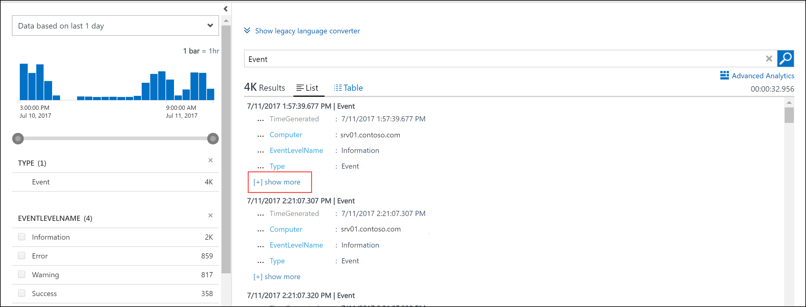

Only the first few properties of each record are displayed.  Click **show more** to display all properties for a particular record.

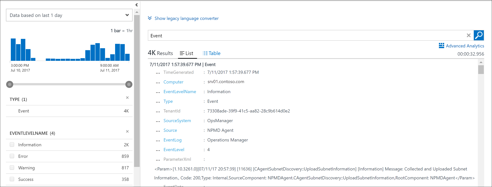

## Set the time scope
Every record collected by Log Analytics has a **TimeGenerated** property that contains the date and time that the record was created.  A query in the Log Search portal only returns records with a **TimeGenerated** within the time scope that's displayed on the left side of the screen.  

You can change the time filter either by selecting the dropdown or by modifying the slider.  The slider displays a bar graph that shows the relative number of records for each time segment within the range.  This segment will vary depending on the range.

The default time scope is **1 day**.  Change this value to **7 days**, and the total number of records should increase.

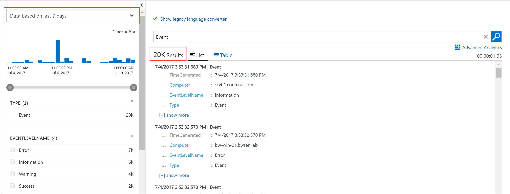

## Filter results of the query
On the left side of the screen is the filter pane which allows you to add filtering to the query without modifying it directly.  Several properties of the records returned are displayed with their top ten values with their record count.

If you're working with **Event**, select the checkbox next to **Error** under **EVENTLEVELNAME**.   If you're working with **Syslog**, select the checkbox next to **err** under **SEVERITYLEVEL**.  This changes the query to one of the following to limit the results to error events.

```
Event | where (EventLevelName == "Error")
```
```
Syslog | where (SeverityLevel == "err")
```

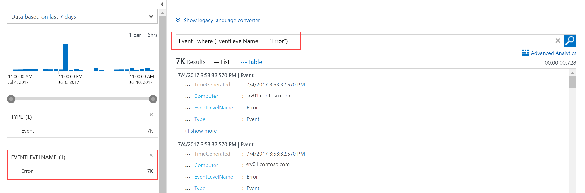

Add properties to the filter pane by selecting **Add to filters** from the property menu on one of the records.

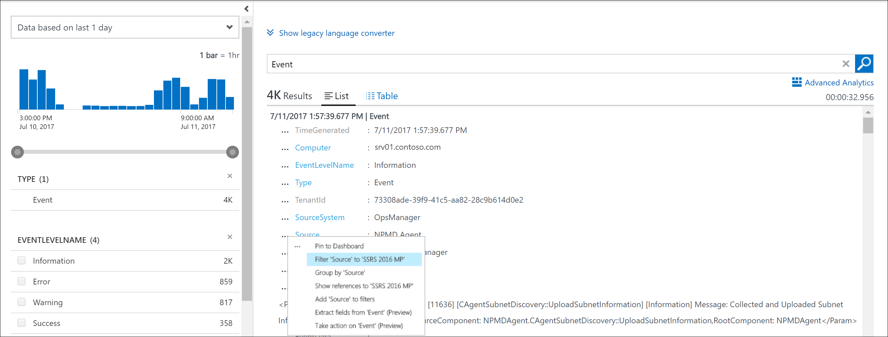

You can set the same filter by selecting **Filter** from the property menu for a record with the value you want to filter.  

You only have the **Filter** option for properties with their name in blue.  These are *searchable* fields which are indexed for search conditions.  Fields in grey are *free text searchable* fields which only have the **Show references** option.  This option returns records that have that value in any property.

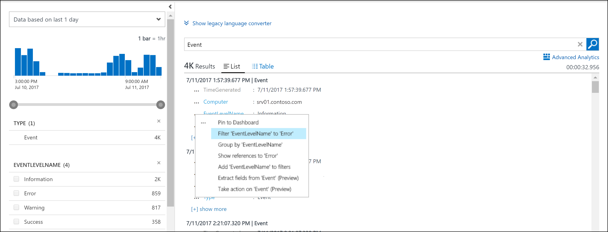

You can group the results on a single property by selecting the **Group by** option in the record menu.  This will add a [summarize](https://docs.loganalytics.io/docs/Language-Reference/Tabular-operators/summarize-operator) operator to your query that displays the results in a chart.  You can group on more than one property, but you would need to edit the query directly.  Select the record menu next the **Computer** property and select **Group by 'Computer'**.  

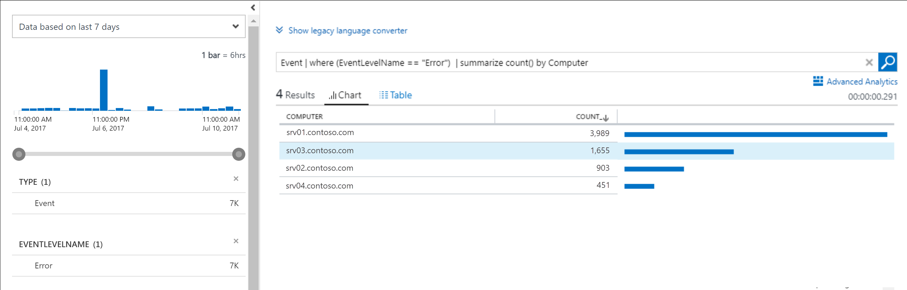

## Work with results
The Log Search portal has a variety of features for working with the results of a query.  You can sort, filter, and group results to analyze the data without modifying the actual query.  Results of a query are not sorted by default.

To view the data in table form which provides additional options for filtering and sorting, click **Table**.  

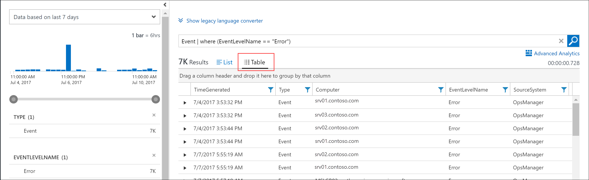

Click the arrow by a record to view the details for that record.

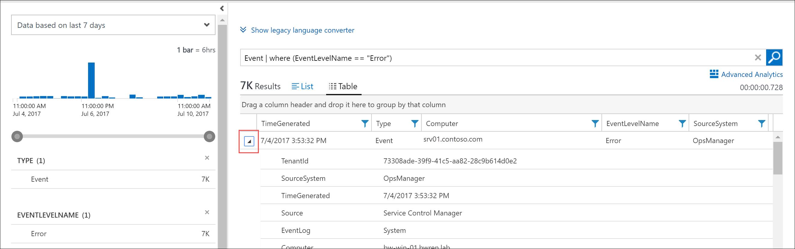

Sort on any field by clicking on its column header.

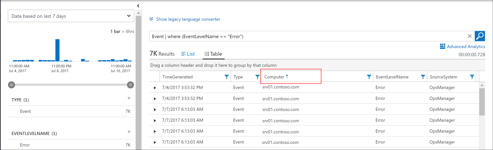

Filter the results on a specific value in the column by clicking the filter button and providing a filter condition.

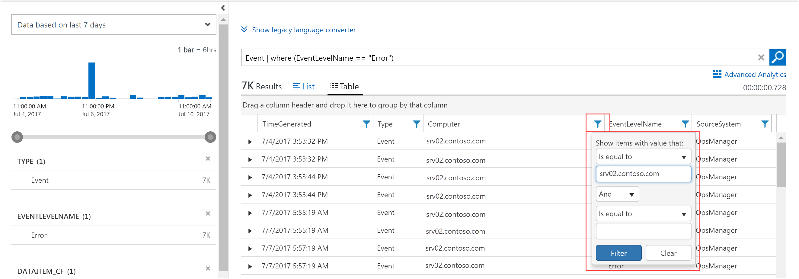

Group on a column by dragging its column header to the top of the results.  You can group on multiple fields by dragging multiple columns to the top.

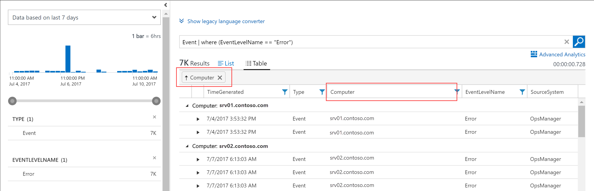


## Work with performance data
Performance data for both Windows and Linux agents is stored in the Log Analytics workspace in the **Perf** table.  Performance records look just like any other record, and we can write a simple query that returns all performance records just like with events.

```
Perf
```

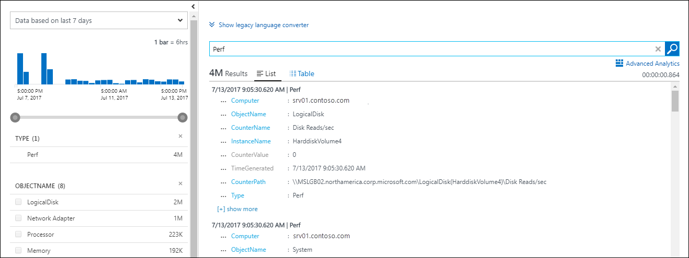

Returning millions of records for all performance objects and counters though isn't very useful.  You can use the same methods you used above to filter the data or just type the following query directly into the log search box.  This returns only processor utilization records for both Windows and Linux computers.

```
Perf | where (ObjectName == "Processor")  | where (CounterName == "% Processor Time")
```

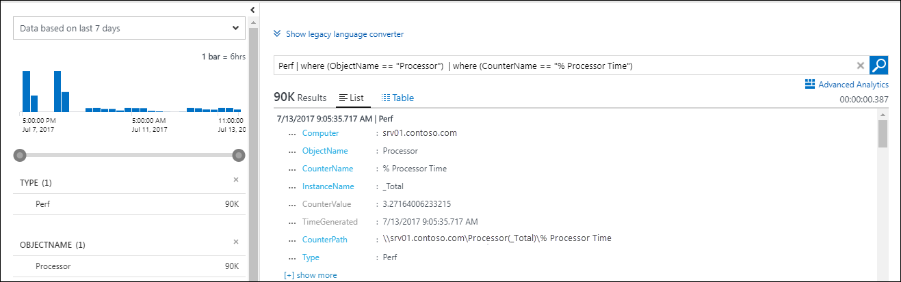

This limits the data to a particular counter, but it still doesn't put it in a form that's particularly useful.  You can display the data in a line chart, but first need to group it by Computer and TimeGenerated.  To group on multiple fields, you need to modify the query directly, so modify the query to the following.  This uses the [avg](https://docs.loganalytics.io/docs/Language-Reference/Aggregation-functions/avg()) function on the **CounterValue** property to calculate the average value over each hour.

```
Perf  | where (ObjectName == "Processor")  | where (CounterName == "% Processor Time") | summarize avg(CounterValue) by Computer, TimeGenerated
```


Now that the data is suitably grouped, you can display it in a visual chart by adding the [render](https://docs.loganalytics.io/docs/Language-Reference/Tabular-operators/render-operator) operator.  

```
Perf  | where (ObjectName == "Processor")  | where (CounterName == "% Processor Time") | summarize avg(CounterValue) by Computer, TimeGenerated | render timechart
```

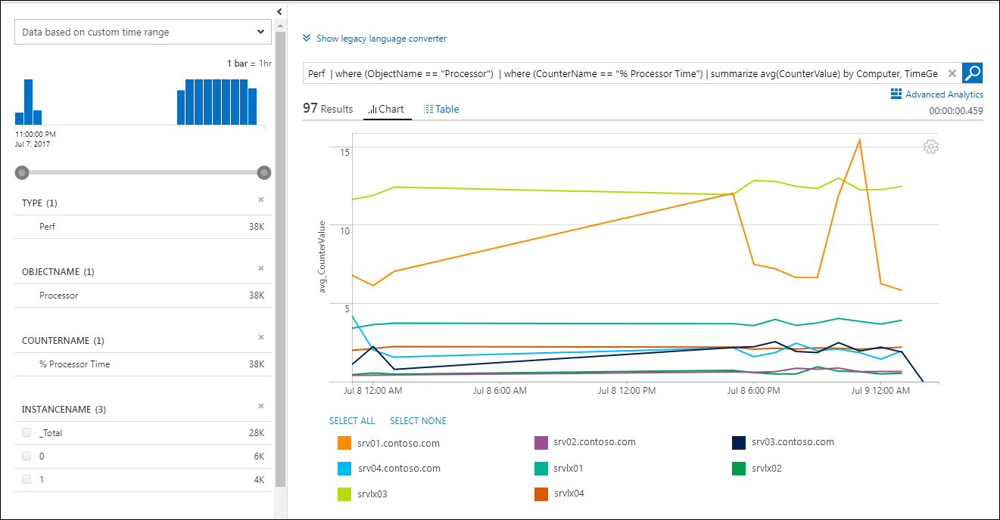

## Next steps

- Learn more about the Log Analytics query language at [Getting Started with the Analytics Portal](https://go.microsoft.com/fwlink/?linkid=856079).
- Walk through a tutorial using the [Advanced Analytics portal](https://go.microsoft.com/fwlink/?linkid=856587) which allows you to run the same queries and access the same data as the Log Search portal.
