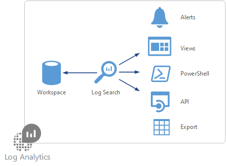
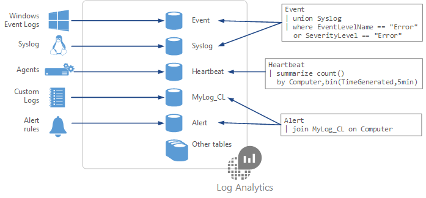

# Understanding log searches in Log Analytics

> [!NOTE]
> This article describes log searches in Azure Log Analytics using the new query language.  You can learn more about the new language and get the procedure to upgrade your workspace at [Upgrade your Azure Log Analytics workspace to new log search](log-analytics-log-search-upgrade.md).  
>
> If your workspace hasn't been upgraded to the new query language, you should refer to [Find data using log searches in Log Analytics](log-analytics-log-searches.md).

You require a log search to retrieve any data from Log Analytics.  Whether you're analyzing data in the portal, configuring an alert rule to be notified of a particular condition, or retrieving data using the Log Analytics API, you will use a log search to specify the data you want.  This article describes how log searches are used in Log Analytics and provides concepts that should understand before creating one. See the [Next steps](#next-steps) section for details on creating and editing log searches and for references on the query language.

## Where log searches are used

The different ways that you will use log searches in Log Analytics include the following:

- **Portals.** You can perform interactive analysis of data in the repository with the [Log Search portal](log-analytics-log-search-log-search-portal.md) or the [Advanced Analytics portal](https://go.microsoft.com/fwlink/?linkid=856587).  This allows you to edit your query and analyze the results in a variety of formats and visualizations.  Most queries that you create will start in one of the portals and then copied once you verify that it works as expected.
- **Alert rules.** [Alert rules](log-analytics-alerts.md) proactively identify issues from data in your workspace.  Each alert rule is based on a log search that is automatically run at regular intervals.  The results are inspected to determine if an alert should be created.
- **Views.**  You can create visualizations of data to be included in user dashboards with [View Designer](log-analytics-view-designer.md).  Log searches provide the data used by [tiles](log-analytics-view-designer-tiles.md) and [visualization parts](log-analytics-view-designer-parts.md) in each view.  You can drill down from visualization parts into the Log Search portal to perform further analysis on the data.
- **Export.**  When you export data from the Log Analytics workspace to Excel or [Power BI](log-analytics-powerbi.md), you create a log search to define the data to export.
- **PowerShell.** You can run a PowerShell script from a command line or an Azure Automation runbook that uses [Get-​Azure​Rm​Operational​Insights​Search​Results](https://docs.microsoft.com/powershell/module/azurerm.operationalinsights/get-azurermoperationalinsightssearchresults?view=azurermps-4.0.0) to retrieve data from Log Analytics.  This cmdlet requires a query to determine the data to retrieve.
- **Log Analytics API.**  The [Log Analytics log search API](log-analytics-log-search-api.md) allows any REST API client to retrieve data from the workspace.  The API request includes a query that is run against Log Analytics to determine the data to retrieve.

## How Log Analytics data is organized
When you build a query, you start by determining which tables have the data that you're looking for. Each [data source](log-analytics-data-sources.md) and [solution](../operations-management-suite/operations-management-suite-solutions.md) stores its data in dedicated tables in the Log Analytics workspace.  Documentation for each data source and solution includes the name of the data type that it creates and a description of each of its properties.     Many queries will only require data from a single tables, but others may use a variety of options to include data from multiple tables.

## Writing a query
At the core of log searches in Log Analytics is [an extensive query language](https://docs.loganalytics.io/) that lets you retrieve and analyze data from the repository in a variety of ways.  This same query language is used for [Application Insights](../application-insights/app-insights-analytics.md).  Learning how to write a query is critical to creating log searches in Log Analytics.  You'll typically start with basic queries and then progress to use more advanced functions as your requirements become more complex.

The basic structure of a query is a source table followed by a series of operators separated by a pipe character `|`.  You can chain together multiple operators to refine the data and perform advanced functions.

For example, suppose you wanted to find the top ten computers with the most error events over the past day.

	Event
	| where (EventLevelName == "Error")
	| where (TimeGenerated > ago(1days))
	| summarize ErrorCount = count() by Computer
	| top 10 by ErrorCount desc

Or maybe you want to find computers that haven't had a heartbeat in the last day.

	Heartbeat
	| where TimeGenerated > ago(7d)
	| summarize max(TimeGenerated) by Computer
	| where max_TimeGenerated < ago(1d)  

How about a line chart with the processor utilization for each computer from last week?

	Perf
	| where ObjectName == "Processor" and CounterName == "% Processor Time"
	| where TimeGenerated  between (startofweek(ago(7d)) .. endofweek(ago(7d)) )
	| summarize avg(CounterValue) by Computer, bin(TimeGenerated, 5min)
	| render timechart    

You can see from these quick samples that regardless of the kind of data that you're working with, the structure of the query is similar.  You can break it down into distinct steps where the resulting data from one command is sent through the pipeline to the next command.

For complete documentation on the Azure Log Analytics query language including tutorials and language reference, see the [Azure Log Analytics query language documentation](https://docs.loganalytics.io/).

## Next steps

- Learn about the [portals that you use to create and edit log searches](log-analytics-log-search-portals.md).
- Check out a [tutorial on writing queries](https://go.microsoft.com/fwlink/?linkid=856078) using the new query language.
