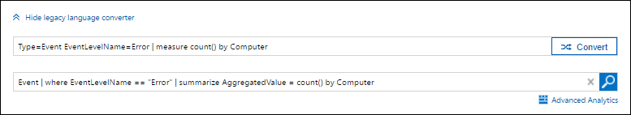

# Transitioning to Azure Log Analytics new query language

> [!NOTE]
> You can read more about the new Log Analytics query language and get the procedure to upgrade your workspace at Upgrade your [Azure Log Analytics workspace to new log search](log-analytics-log-search-upgrade.md).

This article provides assistance on transitioning to the new query language for Log Analytics if you're already familiar with the legacy language.

## Language converter

If you're familiar with the legacy Log Analytics query language, the easiest way to create the same query in the new language is to use the Language Converter that's installed in the Log Search portal when your workspace is converted.  Using the converter is as simple as typing in a legacy query in the top text box and then clicking **Convert**.  You can either click the search button to run the query or copy and paste it to use it somewhere else.

## Cheat sheet

The following table provides a comparison between a variety of common queries to equivalent commands between the new and legacy query language in Azure Log Analytics.

| Description | Legacy | new |
|:--|:--|:--|
| Search all tables      | error | search "error"  (not case sensitive) |
| Select data from table | Type=Event |  Event |
|                        | Type=Event &#124; select Source, EventLog, EventID | Event &#124; project Source, EventLog, EventID |
|                        | Type=Event &#124; top 100 | Event &#124; take 100 |
| String comparison      | Type=Event Computer=srv01.contoso.com   | Event &#124; where Computer == "srv01.contoso.com" |
|                        | Type=Event Computer=contains("contoso") | Event &#124; where Computer contains "contoso" (not case sensitive) Event &#124; where Computer contains_cs "Contoso" (case sensitive) |
|                        | Type=Event Computer=RegEx("@contoso@")  | Event &#124; where Computer matches regex ".*contoso*" |
| Date comparison        | Type=Event TimeGenerated > NOW-1DAYS | Event &#124; where TimeGenerated > ago(1d) |
|                        | Type=Event TimeGenerated>2017-05-01 TimeGenerated<2017-05-31 | Event &#124; where TimeGenerated between (datetime(2017-05-01) .. datetime(2017-05-31)) |
| Boolean comparison     | Type=Heartbeat IsGatewayInstalled=false  | Heartbeat | where IsGatewayInstalled == false |
| Sort                   | Type=Event &#124; sort Computer asc, EventLog desc, EventLevelName asc | Event \| sort by Computer asc, EventLog desc, EventLevelName asc |
| Distinct               | Type=Event &#124; dedup Computer \| select Computer | Event &#124; summarize by Computer, EventLog |
| Extend columns         | Type=Perf CounterName="% Processor Time" &#124; EXTEND if(map(CounterValue,0,50,0,1),"HIGH","LOW") as UTILIZATION | Perf &#124; where CounterName == "% Processor Time" \| extend Utilization = iff(CounterValue > 50, "HIGH", "LOW") |
| Aggregation            | Type=Event &#124; measure count() as Count by Computer | Event &#124; summarize Count = count() by Computer |
|                                | Type=Perf ObjectName=Processor CounterName="% Processor Time" &#124; measure avg(CounterValue) by Computer interval 5minute | Perf &#124; where ObjectName=="Processor" and CounterName=="% Processor Time" &#124; summarize avg(CounterValue) by Computer, bin(TimeGenerated, 5min) |
| Aggregation with limit | Type=Event &#124; measure count() by Computer &#124; top 10 | Event &#124; summarize AggregatedValue = count() by Computer &#124; limit 10 |
| Union                  | Type=Event or Type=Syslog | union Event, Syslog |
| Join                   | Type=NetworkMonitoring &#124; join inner AgentIP (Type=Heartbeat) ComputerIP | NetworkMonitoring &#124; join kind=inner (search Type == "Heartbeat") on $left.AgentIP == $right.ComputerIP |

## Next steps
- Check out a [tutorial on writing queries](https://go.microsoft.com/fwlink/?linkid=856078) using the new query language.
- Refer to the [Query Language Reference](https://go.microsoft.com/fwlink/?linkid=856079) for details on all command, operators, and functions for the new query language.  
