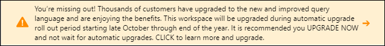
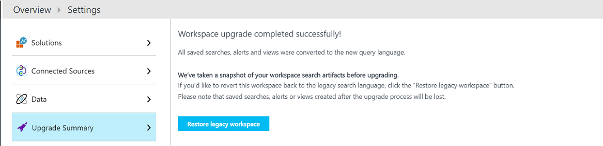
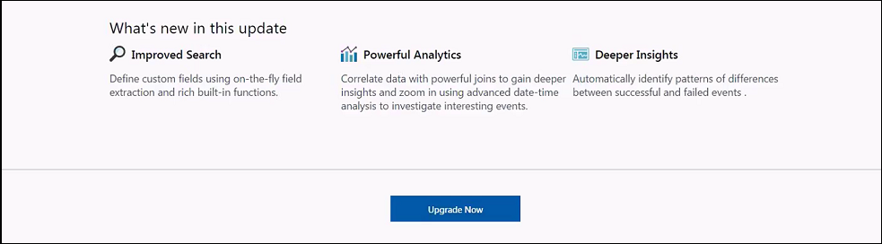
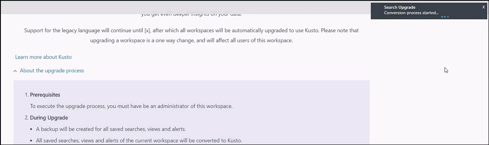
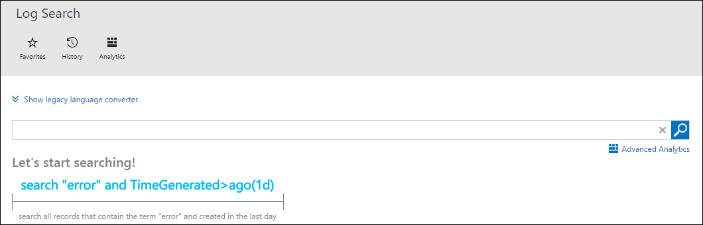
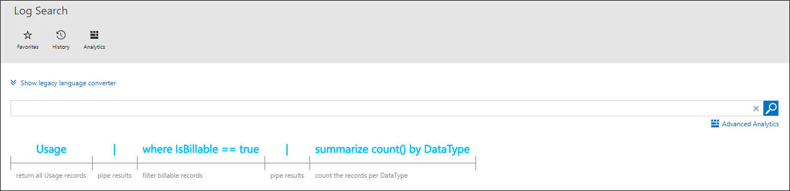

# Upgrade your Azure Log Analytics workspace to new log search

> [!NOTE]
> Upgrade to the new Log Analytics query language is currently optional giving you time to [ramp up on the new language](https://go.microsoft.com/fwlink/?linkid=856078).  

The new Log Analytics query language is here, and you need to upgrade your workspace to take advantage of it.  This article describes the advantages of the new language and how to convert your workspace.  If you don't choose to upgrade now, then your workspace will continue to operate just like it always did, but it will be automatically converted at a later date.  You will receive significant time and notification when that date is set.

This article provides details on the new language and the upgrade process.

## Why the new language?
We understand that there’s pain in any transition, and we aren’t just changing the query language for the fun of it.  There are several reasons that this change will provide significant value to our Log Analytics customers.

- **Simple yet powerful.** The new language is easier to understand and similar to SQL with constructs more like natural language than the legacy language.
- **Full piping language.**  The new language has more extensive piping capabilities than the legacy language.  Virtually any output can be piped to another command to create more complex queries than were previously possible.
- **Search-time field extractions.**  The new language supports more advanced runtime calculated fields than the legacy language.  You can use complex calculations for extended fields and then use the calculated fields for additional commands including joins and aggregations.
- **Advanced joins.**  The new language provides more advanced joins than the legacy language including the ability to join tables on multiple fields, use inner and outer joins, and join on extended fields.
- **Date/time functions.**  The new language has more advanced date/time functions than the legacy language.
- **Smart Analytics.**  The new language has advanced algorithms to evaluate patterns in datasets and compare different sets of data.
- **Advanced Analytics portal.**  The Advanced Analytics portal offers analysis features not available in the Log Analytics portal including multiline editing of queries, additional visualizations, and advanced diagnostics.
- **Consistency with other applications.**  The new language and the Advanced Analytics Portal are already used for analytics in Application Insights.  Implementing it for Log Analytics provides consistency across Azure services.
- **Better integration with Power BI.** Queries in the new language can be exported to Power BI Desktop, so you can utilize its rich data transformation capabilities.
- **Much more.** Refer to the [Azure Log Analytics Query Language](https://docs.loganalytics.io) site for complete details and tutorials on the new language.

## When can I upgrade?
The upgrade will be rolled out across all Azure regions so it may be available in some regions before others.  You'll know when your workspace is available to be upgraded when you see the purple banner across the top of your workspace inviting you to upgrade.

## What happens when I upgrade?
When you convert your workspace, any saved searches, alert rules, and views that you’ve created with the View Designer are automatically converted to the new language.  Searches included in solutions are not automatically converted, but they’re instead converted on the fly when you open them.  This is completely transparent to you.

## Can I go back after I upgrade?
When you upgrade, a complete backup of your workspace is taken that includes a snapshot of all saved searches, alert rule, and views.  This allows you to restore your old workspace if you should later desire.

To restore your legacy workspace, go to **Settings** in your workspace and then **Upgrade Summary**.  You can then select the option to **Restore legacy workspace**.  

## How do I perform the upgrade?
You can upgrade your workspace when you see the purple banner at the top of the portal.  

1.	Start the upgrade process by clicking on the purple banner that says **Learn more and upgrade**.  
2.	Read through the additional information about the upgrade on the upgrade information page.  
3.	Click **Upgrade Now** to start the upgrade.  A notification box in the upper right corner shows the status. 
4.	That’s it!  Go over to the Log Search page to have a look at your upgraded workspace.  

If you encounter an issue that causes the upgrade to fail, you can go to the [discussion forum](https://social.msdn.microsoft.com/Forums/azure/home?forum=opinsights) and post your question or [create a support request](../azure-supportability/how-to-create-azure-support-request.md) from the Azure portal.

## How do I learn the new language?
Since it's used by multiple services we've created an [external site to host the documentation](https://docs.loganalytics.io/) for the new language.  This includes tutorials, samples, and a complete reference to help you come up to speed. You can walk through a tutorial of the new language at [Getting Started with Queries](https://go.microsoft.com/fwlink/?linkid=856078) and access the language reference at [Log Analytics query langauge](https://go.microsoft.com/fwlink/?linkid=856079).  

If you're already familiar with the legacy Log Analytics query language though, then you can use the language converter which is added to your workspace as part of the upgrade.

Just type in your legacy query and then click **Convert** to see the translated version.  You can then either click the search button to run the search or copy and paste the converted query to use somewhere else such as an alert rule.

## Next steps
- Check out a [tutorial on the new language](https://go.microsoft.com/fwlink/?linkid=856078).
- Walk through a [tutorial on using the Log Search portal](log-analytics-log-search-log-search-portal.md) with the new query language.
- Get an introduction to the new [Advanced Analytics portal](https://go.microsoft.com/fwlink/?linkid=856587).
