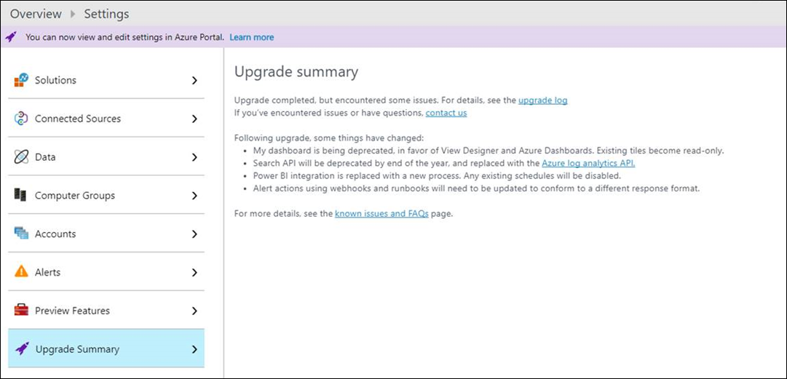

# Azure Log Analytics upgrade to new log search

The new Log Analytics query language is here, and your workspace needs to be upgraded to take advantage of it.  You can either upgrade your workspace yourself or wait for it to be automatically upgraded during the rollout period that starts in late October and goes through the end of the year.  This article describes the advantages of the new language and how to convert your workspace.  

## Why the new language?
We understand that there’s pain in any transition, and we aren’t just changing the query language for the fun of it.  There are several reasons that this change will provide significant value to our Log Analytics customers.

- **Simple yet powerful.** The new language is easier to understand and similar to SQL with constructs more like natural language than the legacy language.
- **Full piping language.**  The new language has more extensive piping capabilities than the legacy language.  Virtually any output can be piped to another command to create more complex queries than were previously possible.
- **Search-time field extractions.**  The new language supports more advanced runtime calculated fields than the legacy language.  You can use complex calculations for extended fields and then use the calculated fields for additional commands including joins and aggregations.
- **Advanced joins.**  The new language provides more advanced joins than the legacy language including the ability to join tables on multiple fields, use inner and outer joins, and join on extended fields.
- **Date/time functions.**  The new language has more advanced date/time functions than the legacy language.
- **Smart Analytics.**  The new language has advanced algorithms to evaluate patterns in datasets and compare different sets of data.
- **Advanced Analytics portal.**  The Advanced Analytics portal offers analysis features not available in the Log Analytics portal including multiline editing of queries, additional visualizations, and advanced diagnostics.
- **Consistency with other applications.**  The new language and the Advanced Analytics Portal are already used for analytics in Application Insights.  Implementing it for Log Analytics provides consistency across Azure services.
- **Better integration with Power BI.** Queries in the new language can be exported to Power BI Desktop, so you can utilize its rich data transformation capabilities.
- **Much more.** Refer to the [Azure Log Analytics Query Language](https://docs.loganalytics.io) site for complete details and tutorials on the new language.

## When can I upgrade?
The upgrade will be rolled out across all Azure regions so it may be available in some regions before others.  You know when your workspace is available to be upgraded when you see a banner across the top of your workspace inviting you to upgrade.

If your workspace is automatically upgraded, then you will see a banner indicating that is upgraded with a summary identifying whether any issues were encountered.

 

## What happens after the upgrade?
The following changes are made to your workspace when it's converted:

- Any saved searches, alert rules, and views that you’ve created with the View Designer are automatically converted to the new language.  Searches included in solutions are not automatically converted, but they’re instead converted on the fly when you open them.  
- [My dashboard](log-analytics-dashboards.md) is being deprecated in favor of [View Designer](log-analytics-view-designer.md) and [Azure Dashboards](https://docs.microsoft.com/en-us/azure/azure-portal/azure-portal-dashboards.md).  Tiles that you added to My Dashboard are still available, but they're read only.
- [Power BI integration](log-analytics-powerbi.md) is replaced with a new process.  Any existing Power BI schedules that you created will be disabled, and you need to replace them with the new process.
- Responses from [alert actions](log-analytics-alerts-actions.md) using webhooks and runbooks have a new format, and you may need to update your alert rules accordingly.
- Have a look at the [Log Search FAQ](log-analytics-log-search-faq.md) for common questions about the upgrade.

## How do I know if there were any issues from the upgrade?
After the upgrade has completed, there will be an **Upgrade Summary** section in the settings for the workspace.  Check this section for information about your upgrade and to view the

 

## How do I manually perform the upgrade?
You can upgrade your workspace when you see the banner at the top of the portal.  

1.	Start the upgrade process by clicking on the banner that says **Learn more and upgrade**.

     

2.	Read through the additional information about the upgrade on the upgrade information page.

     

3.	Click **Upgrade Now** to start the upgrade.

     A notification box in the upper right corner shows the status.
    
    

4.	That’s it!  Go over to the Log Search page to have a look at your upgraded workspace.

    

If you encounter an issue that causes the upgrade to fail, you can go to the [discussion forum](https://social.msdn.microsoft.com/Forums/azure/home?forum=opinsights) and post your question or [create a support request](../azure-supportability/how-to-create-azure-support-request.md) from the Azure portal.

## How do I learn the new language?
Since it's used by multiple services we've created an [external site to host the documentation](https://docs.loganalytics.io/) for the new language.  This includes tutorials, samples, and a complete reference to help you come up to speed. You can walk through a tutorial of the new language at [Getting Started with Queries](https://go.microsoft.com/fwlink/?linkid=856078) and access the language reference at [Log Analytics query language](https://go.microsoft.com/fwlink/?linkid=856079).  

If you want to try out the new language in a demo environment including a bunch of sample data, have a look at the [playground environment](https://portal.loganalytics.io/demo#/discover/home).

If you're already familiar with the legacy Log Analytics query language though, then you can use the language converter which is added to your workspace as part of the upgrade.  Just type in your legacy query and then click **Convert** to see the translated version.  You can then either click the search button to run the search or copy and paste the converted query to use somewhere else such as an alert rule.  You can also have a look at our [cheat sheet](log-analytics-log-search-transition.md) that directly compares common queries from the legacy language.

## Next steps
- Check out a [tutorial on the new language](https://go.microsoft.com/fwlink/?linkid=856078).
- Walk through a [tutorial on using the Log Search portal](log-analytics-log-search-log-search-portal.md) with the new query language.
- Get an introduction to the new [Advanced Analytics portal](https://go.microsoft.com/fwlink/?linkid=856587).
