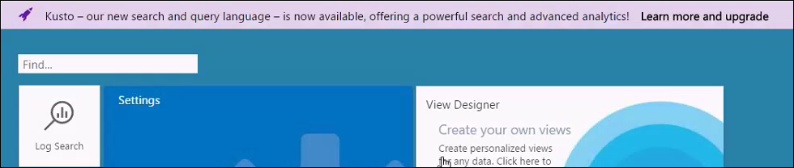
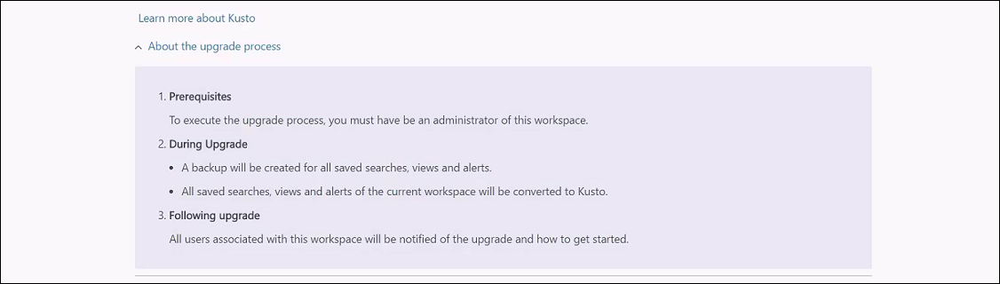

# Upgrade your Azure Log Analytics workspace to next generation log search (Public Preview)
The next generation Log Analytics query language is almost here, and you can participate in the public preview.  This article describes the advantages of the next generation language and how to convert your workspace if you choose to join the preview.  If you don't join, then your workspace will continue to operate just like it always did, but it will be automatically converted when the next generation language reaches general availability sometime later this year.

This article provides details on the next generation language and the upgrade process.

## Why the new language?
We understand that there’s pain in any transition, and we aren’t just changing the query language for the fun of it.  There are several reasons that this change will provide significant value to our Log Analytics customers.

- **Full piping language.**  The next generation language has more extensive piping capabilities than the legacy language.  Virtually any output can be piped to another command to create more complex queries than were previously possible.
- **Search-time field extractions.**  The next generation language supports more advanced runtime calculated fields than the legacy language.  You can use complex calculations for extended fields and then use the calculated fields for additional commands including joins and aggregations.
- **Advanced joins.**  The next generation language provides more advanced joins than the legacy language including the ability to join tables on multiple fields, use inner and outer joins, and join on extended fields.
- **Date/time functions.**  The next generation language has more advanced date/time functions than the legacy language.
- **Advanced Analysis.**  The next generation language has advanced algorithms to evaluate patterns in datasets and compare different sets of data.
- **Advanced Analytics portal.**  The Advanced Analytics portal offers analysis features not available in the Log Analytics portal including multiline editing of queries, additional visualizations, and advanced diagnostics.
- **Consistency with other applications.**  The next generation language and the Advanced Analytics Portal are already used for analytics in Application Insights.  Implementing it for Log Analytics provides consistency across Azure services.

## What happens when I upgrade?
When you convert your workspace, any saved searches, alert rules, and views that you’ve created with the View Designer are automatically converted to the next generation language.  Searches included in solutions are not automatically converted, but they’re instead converted on the fly when you open them.  This is completely transparent to you.

### Can I go back?
When you upgrade, a complete backup of your workspace is taken that includes a snapshot of all saved searches, alert rule, and views.  This allows you to restore your old workspace if you should later desire.  ( HOW? )

## How do I perform the upgrade?
You can upgrade your workspace when you see the purple banner at the top of the portal.  Note that you can only perform the upgrade from the OMS portal, although the converted workspace will also be available in the Azure portal after the upgrade is complete.

1.	Start the upgrade process by clicking on the purple banner that says **Learn more and upgrade**.  
2.	Read through the additional information about the upgrade on the upgrade information page.  
3.	Click **Upgrade Now** to start the upgrade.  A notification box in the upper right corner shows the status. 
4.	That’s it!  Go over to the Log Search page to have a look at your upgraded workspace.  

## How do I learn the new language?
Since it's used by multiple services we've created an [external site to host the documentation](https://docs-analytics-eus.azurewebsites.net/) for the next generation language.  This includes tutorials, samples, and a complete reference to help you come up to speed. You can walk through a tutorial of the new language at [Getting Started with Queries](https://docs.loganalytics.io/learn/tutorial_getting_started_with_queries.html) and access the language reference at [Log Analytics query langauge](https://docs.loganalytics.io/queryLanguage/query_language.html).  

If you're already familiar with the legacy Log Analytics query language though, then you can use the language converter which is added to your workspace as part of the upgrade.

Just type in your legacy query and then click **Convert** to see the translated version.  You can then either click the search button to run the search or copy and paste the converted query to use somewhere else such as an alert rule.
  

## Next steps
- Check out a [tutorial on the new language](https://docs.loganalytics.io/learn/tutorial_getting_started_with_queries.html).
- Walk through a [tutorial on using the Log Search portal](log-analytics-log-search-logsearchportal.md) with the next generation query language.
- Get an introduction to the new [Advanced Analytics portal](https://docs.loganalytics.io/learn/tutorial_getting_started_with_analytics_portal.html).