<properties
	pageTitle="Log searches in Log Analytics | Microsoft Azure"
	description="Log searches allow you to combine and correlate any machine data from multiple sources within your environment."
	services="log-analytics"
	documentationCenter=""
	authors="bandersmsft"
	manager="jwhit"
	editor=""/>

<tags
	ms.service="log-analytics"
	ms.workload="na"
	ms.tgt_pltfrm="na"
	ms.devlang="na"
	ms.topic="article"
	ms.date="08/09/2016"
	ms.author="banders"/>

# Log searches in Log Analytics

At the core of Log Analytics is the log search feature which allows you to combine and correlate any machine data from multiple sources within your environment. Solutions are also powered by log search to bring you metrics pivoted around a particular problem area.

On the Search page, you can create a query, and then when you search, you can filter the results by using facet controls. You can also create advanced queries to transform, filter, and report on your results.

Common log search queries appear on most solution pages. Throughout the OMS console, you can click tiles or drill in to other items to view details about the item by using log search.

In this tutorial, we'll walk through examples to cover all the basics when you use log search.

We'll start with simple, practical examples and then build on them so that you can get an understanding of practical use cases about how to use the syntax to extract the insights you want from the data.

After you've familiar with search techniques, you can review the [Log Analytics log search reference](log-analytics-search-reference.md).

## Use basic filters

The first thing to know is that the first part of a search query, before any "|" vertical pipe character, is always a *filter*. You can think of it as a WHERE clause in TSQL--it determines *what* subset of data to pull out of the OMS data store. Searching in the data store is largely about specifying the characteristics of the data that you want to extract, so it is natural that a query would start with the WHERE clause.

The most basic filters you can use are *keywords*, such as ‘error’ or ‘timeout’, or a computer name. These types of simple queries generally return diverse shapes of data within the same result set. This is because Log Analytics has different *types* of data in the system.


### To conduct a simple search
1. In the OMS portal, click **Log Search**.  
    
2. In the query field, type `error` and then click **Search**.  
    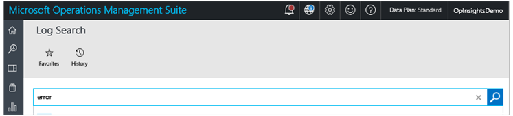  
    For example, the query for `error` in the following image returned 100,000 **Event** records (collected by Log Management), 18 **ConfigurationAlert** records (generated by Configuration Assessment) and 12 **ConfigurationChange** records (captured by the Change Tracking).   
    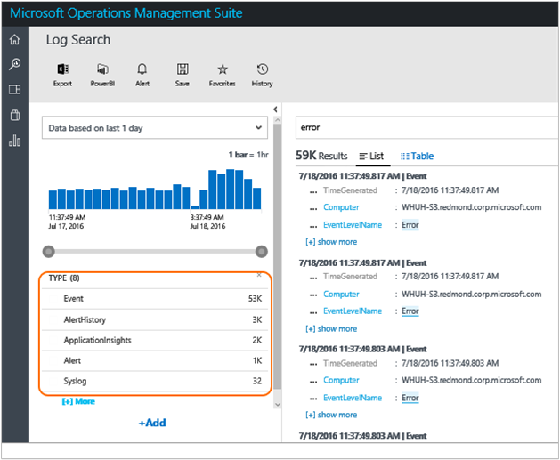  

These filters are not really object types/classes. *Type* is just a tag, or a property, or a string/name/category, that is attached to a piece of data. Some documents in the system are tagged as **Type:ConfigurationAlert** and some are tagged as **Type:Perf**, or **Type:Event**, and so on. Each search result, document, record, or entry displays all the raw properties and their values for each of those pieces of data, and you can use those field names to specify in the filter when you want to retrieve only the records where the field has that given value.

*Type* is really just a field that all records have, it is not different from any other field. This was established based on the value of the Type field. That record will have a different shape or form. Incidentally, **Type=Perf**, or **Type=Event** is also the syntax that you need to learn to query for performance data or events.

You can use either a colon (:) or an equal sign (=) after the field name and before the value. **Type:Event** and **Type=Event** are equivalent in meaning, you can choose the style you prefer.

So, if the Type=Perf records have a field called 'CounterName', then you can write a query resembling `Type=Perf CounterName="% Processor Time"`.

This will give you only the performance data where the performance counter name is "% Processor Time".

### To search for processor time performance data
- In the search query field, type `Type=Perf CounterName="% Processor Time"`

You can also be more specific and use **InstanceName=_'Total'** in the query, which is a Windows performance counter. You can also select a facet and another **field:value**. The filter is automatically added to your filter in the query bar. You can see this in the following image. It shows you where to click to add **InstanceName:’_Total’** to the query without typing anything.


Your query now becomes `Type=Perf CounterName="% Processor Time" InstanceName="_Total"`

In this example, you don't have to specify **Type=Perf** to get to this result. Because the fields CounterName and InstanceName only exist for records of Type=Perf, the query is specific enough to return the same results as the longer, previous one:
```
CounterName="% Processor Time" InstanceName="_Total"
```

This is because all the filters in the query are evaluated as being in *AND* with each other. Effectively, the more fields you add to the criteria, you get less, more specific and refined results.

For example, the query `Type=Event EventLog="Windows PowerShell"` is identical to `Type=Event AND EventLog="Windows PowerShell"`. It returns all events that were logged in and collected from the Windows PowerShell event log. If you add a filter multiple times by repeatedly selecting the same facet, then the issue is purely cosmetic--it might clutter the Search bar, but it still returns the same results because the implicit AND operator is always there.

You can easily reverse the implicit AND operator by using a NOT operator explicitly. For example:

`Type:Event NOT(EventLog:"Windows PowerShell")` or its equivalent `Type=Event EventLog!="Windows PowerShell"` return all events from all other logs that are NOT the Windows PowerShell log.

Or, you can use other Boolean operator such as ‘OR’. The following query returns records for which the EventLog is either Application OR System.

```
EventLog=Application OR EventLog=System
```

Using the above query, you’ll get entries for both logs in the same result set.

However, if you remove the OR by leaving the implicit AND in place, then the following query will not produce any results because there isn’t an event log entry that belongs to BOTH logs. Each event log entry was written to only one of the two logs.

```
EventLog=Application EventLog=System
```


## Use additional filters

The following query returns entries for 2 event logs for all the computers that have sent data.

```
EventLog=Application OR EventLog=System
```

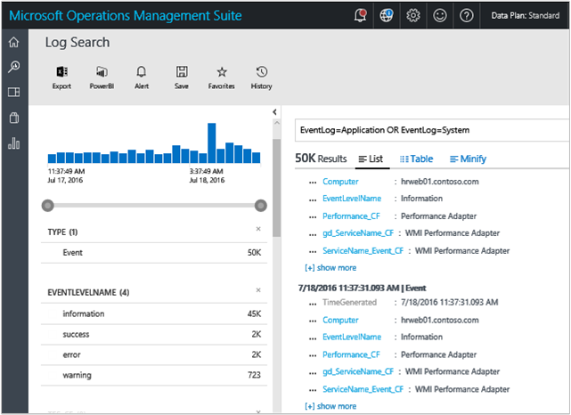

Selecting one of the fields or filters will narrow the query to a specific computer, excluding all other ones. The resulting query would resemble the following.

```
EventLog=Application OR EventLog=System Computer=SERVER1.contoso.com
```

Which is equivalent to the following, because of the implicit AND.

```
EventLog=Application OR EventLog=System AND Computer=SERVER1.contoso.com
```

Each query is evaluated in the following explicit order. Note the parenthesis.

```
(EventLog=Application OR EventLog=System) AND Computer=SERVER1.contoso.com
```

Just like the event log field, you can retrieve data only for a set of specific computers by adding OR. For example:

```
(EventLog=Application OR EventLog=System) AND (Computer=SERVER1.contoso.com OR Computer=SERVER2.contoso.com OR Computer=SERVER3.contoso.com)
```

Similarly, this the following query return **% CPU Time** for the selected two computers only.

```
CounterName="% Processor Time"  AND InstanceName="_Total" AND (Computer=SERVER1.contoso.com OR Computer=SERVER2.contoso.com)
```


### Boolean operators
With datetime and numeric fields, you can search for values using *greater than*, *lesser than*, and *lesser than or equal*. You can use simple operators such as >, < , >=, <= , != in the query search bar.


You can query a specific event log for a specific period of time. For example, the last 24 hours is expressed with the following mnemonic expression.

```
EventLog=System TimeGenerated>NOW-24HOURS
```


#### To search using a boolean operator
- In the search query field, type `EventLog=System TimeGenerated>NOW-24HOURS"`  
    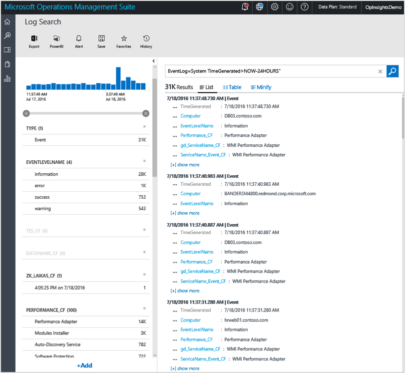

Although you can control the time interval graphically, and most times you might want to do that, there are advantages to including a time filter directly into the query. For example, this works great with dashboards where you can override the time for each tile, regardless of the *global* time selector on the dashboard page. For more information, see [Time Matters in Dashboard](http://cloudadministrator.wordpress.com/2014/10/19/system-center-advisor-restarted-time-matters-in-dashboard-part-6/).

When filtering by time, keep in mind that you get results for the *intersection* of the two time periods: the one specified in the OMS portal (S1) and the one specified in the query (S2).


This means, if the time periods don’t intersect, for example in the OMS portal where you choose **This week** and in the query where you define **last week**, then there is no intersection and you won't receive any results.

Comparison operators used for the TimeGenerated field are also useful in other situations. For example, with numeric fields.

For example, given that Configuration Assessment’s alerts have the following severity values:

- 0 = Information
- 1 = Warning
- 2 = Critical

You can query for both warning and critical alerts and also exclude informational ones with the following query:

```
Type=ConfigurationAlert  Severity>=1
```


You can also use range queries. This means that you can provide the beginning and end range of values in a sequence. For example, if you want events from the Operations Manager event log where the EventID is greater than or equal to 2100 but not greater than 2199, then the following query would return them.

```
Type=Event EventLog="Operations Manager" EventID:[2100..2199]
```


>[AZURE.NOTE] The range syntax you must use is the colon (:) field:value separator and *not* the equal sign (=). Enclose the lower and upper end of the range in square brackets and separate them with two periods (..).

## Manipulate search results

When you're searching for data, you'll want to refine your search query and have a good level of control over the results. When results are retrieved, you can apply commands to transform them.

Commands in Log Analytics searches *must* follow after the vertical pipe character (|). A filter must always be the first part of a query string. It defines the data set you're working with and then "pipes" those results into a command. You can then use the pipe to add additional commands. This is loosely similar to the Windows PowerShell pipeline.

In general, the Log Analytics search language tries to follow PowerShell style and guidelines to make it similar to the IT pros, and to ease the learning curve.

Commands have names of verbs so you can easily tell what they do.  

### Sort

The sort command allows you to define the sorting order by one or multiple fields. Even if you don’t use it, by default, a time descending order is enforced. The most recent results are always at the top of search results. This means that when you run a search, with `Type=Event EventID=1234` what really is executed for you is:

```
Type=Event EventID=1234 **| Sort TimeGenerated desc**
```

That's because it is the type of experience you are familiar with in logs. For example, in the Windows Event Viewer.

You can use Sort to change the way results are returned. The following examples show how this works.

```
Type=Event EventID=1234 | Sort TimeGenerated asc
```

```
Type=Event EventID=1234 | Sort Computer asc
```

```
Type=Event EventID=1234 | Sort Computer asc,TimeGenerated desc
```


The simple examples above show you how commands work--they change the shape of the results that the filter returned.

### Limit and top
Another less known command is LIMIT. Limit is a PowerShell-like verb. Limit is functionally identical to the TOP command. The following queries return the same results.

```
Type=Event EventID=600 | Limit 1
```

```
Type=Event EventID=600 | Top 1
```


#### To search using top
- In the search query field, type `Type=Event EventID=600 | Top 1`   
    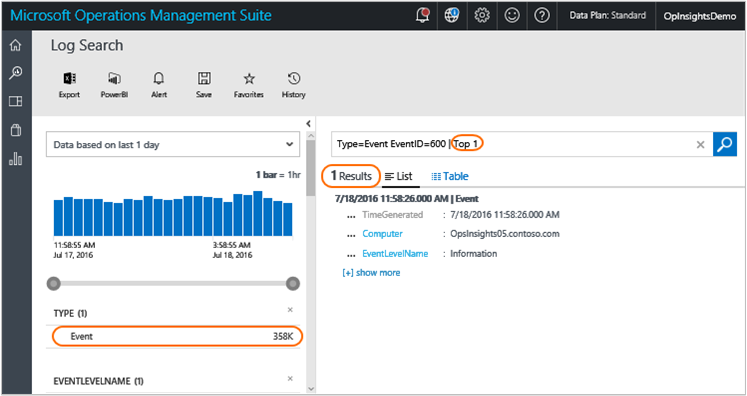

In the image above, there are 358 thousand records with EventID=600. The fields, facets, and filters on the left always show information about the results returned *by the filter portion* of the query, which is the part before any pipe character. The **Results** pane only returns the most recent 1 result, because the example command shaped and transformed the results.

### Select

The SELECT command behaves like Select-Object in PowerShell. It returns filtered results that do not have all of their original properties. Instead, it selects only the properties that you specify.

#### To run a search using the select command

1. In Search, type `Type=Event` and then click **Search**.
2. Click **+ show more** in one of the results to view all the properties that the results have.
3. Select some of those explicitly, and the query changes to `Type=Event | Select Computer,EventID,RenderedDescription`.  
    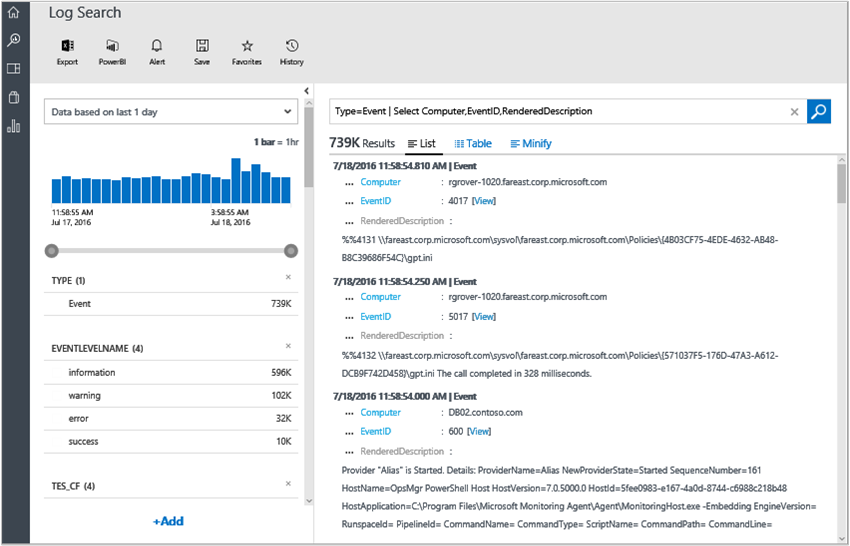

This is command particularly useful when you want to control search output and choose only the portions of data that really matter for your exploration, which often isn’t the full record. This is also useful when records of different types have *some* common properties, but not *all* of their properties are common. The, you can generate output that looks more naturally like a table, or work well when exported to a CSV file and then massaged in Excel.


## Use the measure command

MEASURE is one of the most versatile commands in Log Analytics searches. It allows you to apply statistical *functions* to your data and aggregate results grouped by a given field. There are multiple statistical functions that Measure supports.

### Measure count()

The first statistical function to work with, and one of the simplest to understand is the *count()* function.

Results from any search query such as `Type=Event`, show filters also called facets on the left side of search results. The filters show a distribution of values by a given field for the results in the search executed.

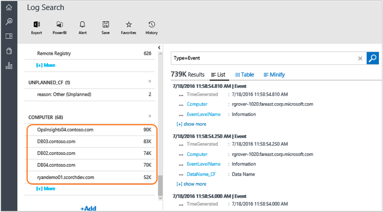

For example, in the image above you'll see the **Computer** field and it shows that within the almost 739 thousand events in the results, there are 68 unique and distinct values for the **Computer** field in those records. The tile only shows the top 5, which are the most common 5 values that are written in the **Computer** fields), sorted by the number of documents that contain that specific value in that field. In the image you can see that – among those almost 369 thousand events – 90 thousand come from the OpsInsights04.contoso.com computer, 83 thousand from the DB03.contoso.com computer, and so on.


What if you want to see all values, since the tile only shows only the top 5?

That’s what the measure command can do with the count() function. This function doesn't use any parameters. You just specify the field by which you want to group by – the **Computer** field in this case:

`Type=Event | Measure count() by Computer`

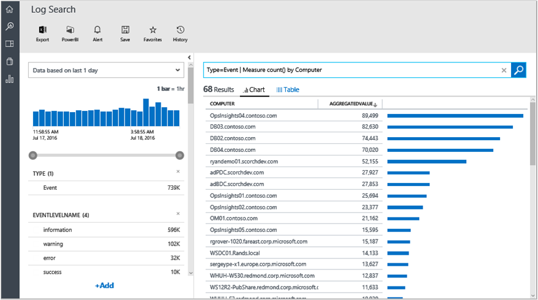

However, **Computer** is just a field used *in* each piece of data – there are no relational databases involved and there is no separate **Computer** object anywhere. Just the values *in* the data can describe which entity generated them, and a number of other characteristics and aspects of the data – hence the term *facet*. However, you can just as well group by other fields. Because the original results of almost 739 thousand events that are piped into the measure command also have a field called **EventID**, you can apply the same technique to group by that field and get a count of events by EventID:

```
Type=Event | Measure count() by EventID
```

If you're not interested in the actual record count that contain a specific value, but instead if you only want a list of the values themselves, you can add a *Select* command at the end of it and just select the first column:

```
Type=Event | Measure count() by EventID | Select EventID
```

Then you can get more intricate and pre-sort the results in the query, or you can just click the columns in the grid, too.

```
Type=Event | Measure count() by EventID | Select EventID | Sort EventID asc
```

#### To search using measure count

- In the search query field, type `Type=Event | Measure count() by EventID`
- Append `| Select EventID` to the end of the query.
- Finally, append `| Sort EventID asc` to the end of the query.


There are a couple important points to notice and emphasize:

First, the results you see are not the original raw results anymore. Instead, they are aggregated results – essentially groups of results. This isn't a problem, but you should understand that you're interacting with a very different shape of data that differs from the original raw shape that gets created on the fly as a result of the aggregation/statistical function.

Second, **Measure count** currently returns only the top 100 distinct results. This limit does not apply to the other statistical functions. So, you'll usually need to use a more precise filter first to search for specific items before you apply measure count().

## Use the max and min functions with the measure command

There are various scenarios where **Measure Max()** and **Measure Min()** are useful. However, since each function is opposite of each other, we'll illustrate Max() and you can experiment with Min() on your own.

If you query for security events, they have a **Level** property that can vary. For example:

```
Type=SecurityEvent
```


If you want to view the highest value for all of the security events given a common Computer, the group by field, you can use

```
Type=ConfigurationAlert | Measure Max(Level) by Computer
```

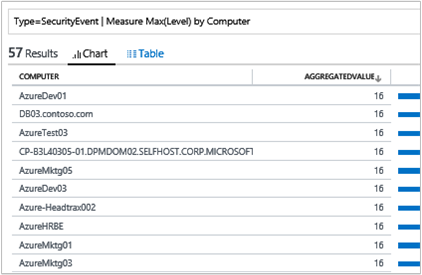

It will display that for the computers that had **Level** records, most of them have at least level 8, many had a level of 16.

```
Type=ConfigurationAlert | Measure Max(Severity) by Computer
```

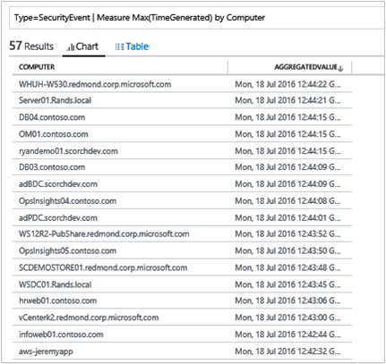

This function works well with numbers, but it also works with DateTime fields. It is useful to check for the last or most recent time stamp for any piece of data indexed for each computer. For example: When was the most recent security event reported for each machine?

```
Type=ConfigurationChange | Measure Max(TimeGenerated) by Computer
```

## Use the avg function with the measure command

The Avg() statistical function used with measure allows you to calculate the average value for some field, and group results by the same or other field. This is useful in a variety of cases, such as performance data.

We'll start with performance data. Note that OMS currently collects performance counters for both Windows and Linux machines.

To search for *all* performance data, the most basic query is:

```
Type=Perf
```

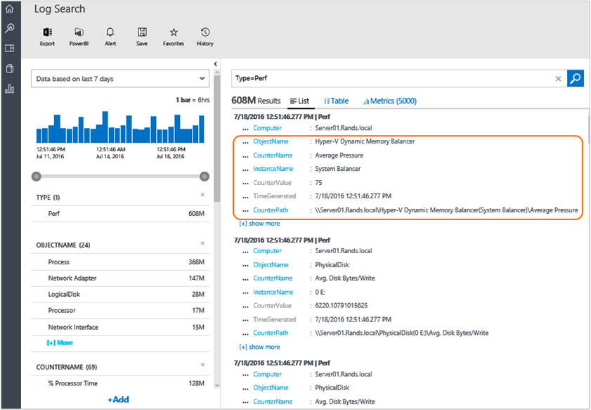

The first thing you'll notice is that Log Analytics shows you three perspectives: List, which shows you which shows the actual records behind the charts; Table, which shows a tabular view of performance counter data; and Metrics, which shows charts for the performance counters.

In the image above, there are two sets of fields marked that indicate the following:

- The first set identifies Windows Performance Counter Name, Object Name, and Instance Name in the query filter. These are the fields you probably will most commonly use as facets/filters
- **CounterValue** is the actual value of the counter. In this example, the value is *75*.
- **TimeGenerated** is 12:51, in 24-hour time format.

Here's a view of the metrics in a graph.

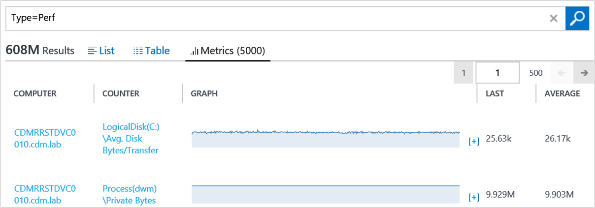

After reading about the Perf record shape, and having read about other search techniques, you can use measure Avg() to aggregate this type of numerical data.

Here's a simple example:

```
Type=Perf  ObjectName:Processor  InstanceName:_Total  CounterName:"% Processor Time" | Measure Avg(CounterValue) by Computer
```

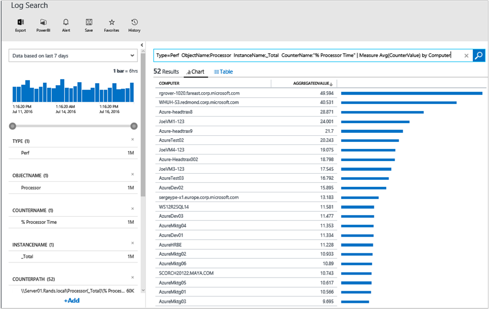

In this example, you select the CPU Total Time performance counter and average by Computer. If you want to narrow down your results to only the last 6 hours, you can either use the time filter control or specify in your query as follows:

```
Type=Perf  ObjectName:Processor  InstanceName:_Total  CounterName:"% Processor Time" TimeGenerated>NOW-6HOURS | Measure Avg(CounterValue) by Computer
```

### To search using the avg function with the measure command
- In the Search query box, type `Type=Perf  ObjectName:Processor  InstanceName:_Total  CounterName:"% Processor Time" TimeGenerated>NOW-6HOURS | Measure Avg(CounterValue) by Computer`.


You can aggregate and correlate data *across* computers. For example, imagine that you have a set of hosts in some sort of farm where each node is equal to any other one and they just do all the same type of work and load should be roughly balanced. You could get their counters all in one go with the following query and get averages for the entire farm. You can start by choosing the computers with the following example:

```
Type=Perf AND (Computer="AzureMktg01" OR Computer="AzureMktg02" OR Computer="AzureMktg03")
```

Now that you have the computers, you also only want to select two key performance indicators (KPIs): % CPU Usage and % Free Disk Space. So, that part of the query becomes:

```
Type=Perf InstanceName:_Total  ((ObjectName:Processor AND CounterName:"% Processor Time") OR (ObjectName="LogicalDisk" AND CounterName="% Free Space")) AND TimeGenerated>NOW-4HOURS
```

Now you can add computers and counters with the following example:

```
Type=Perf InstanceName:_Total  ((ObjectName:Processor AND CounterName:"% Processor Time") OR (ObjectName="LogicalDisk" AND CounterName="% Free Space")) AND TimeGenerated>NOW-4HOURS AND (Computer="AzureMktg01" OR Computer="AzureMktg02" OR Computer="AzureMktg03")
```

Because you have a very specific selection, the **measure Avg()** command can return the average not by computer, but across the farm, simply by grouping by CounterName. For example:

```
Type=Perf  InstanceName:_Total  ((ObjectName:Processor AND CounterName:"% Processor Time") OR (ObjectName="LogicalDisk" AND CounterName="% Free Space")) AND TimeGenerated>NOW-4HOURS AND (Computer="AzureMktg01" OR Computer="AzureMktg02" OR Computer="AzureMktg03") | Measure Avg(CounterValue) by CounterName
```

This gives you a useful compact view of a couple of your environment's KPIs.

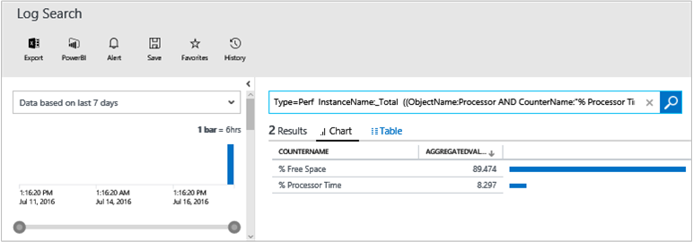


You can easily use the search query in a dashboard. For example, you could save the search query and create a dashboard from it named *Web Farm KPIs*. To learn more about using dashboards, see [Create a custom dashboard in Log Analytics](log-analytics-dashboards.md).

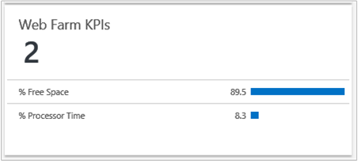

### Use the sum function with the measure command

The sum function is similar to other functions of the measure command. You can see an example about how to use the sum function at [W3C IIS Logs Search in Microsoft Azure Operational Insights](http://blogs.msdn.com/b/dmuscett/archive/2014/09/20/w3c-iis-logs-search-in-system-center-advisor-limited-preview.aspx).

You can use Max() and Min() with numbers, date times and text strings. With text strings, they are sorted alphabetically and you get first and last.

However, you cannot use Sum() with anything other than numerical fields. This also applies to Avg().

### Use the percentile function with the measure command

The percentile function is similar to Avg() and Sum() in that you can only use it for numerical fields. You can use any percentile between 1 to 99 on a numeric field. You can also use both **percentile** and **pct** commands. Here are few examples:  

```
Type:Perf CounterName:"DiskTransers/sec" |measure percentile95(CurrentValue) by Computer
```
```
Type:Perf ObjectName=LogicalDisk CounterName="Current Disk Queue Length" Computer="MyComputerName" | measure pct65(CurrentValue) by InstanceName
```

## Use the where command

The where command works like a filter, but it can be applied in the pipeline to further filter aggregated results that have been produced by a Measure command – as opposed to raw results that are filtered at the beginning of a query.

For example:

```
Type=Perf  CounterName="% Processor Time"  InstanceName="_Total" | Measure Avg(CounterValue) as AVGCPU by Computer
```

You can add another pipe "|" character and the Where command to only get computers whose average CPU is above 80%, with the following example:

```
Type=Perf  CounterName="% Processor Time"  InstanceName="_Total" | Measure Avg(CounterValue) as AVGCPU by Computer | Where AVGCPU>80
```

If you're familiar with Microsoft System Center - Operations Manager, you can think of the where command in management pack terms. If the example were a rule, the first part of the query would be the data source and the where command would be the condition detection.

You can use the query as a tile in **My Dashboard**, as a monitor of sorts, to see when computer CPUs are over-utilized. To learn more about dashboards, see [Create a custom dashboard in Log Analytics](log-analytics-dashboards.md). You can also create and use dashboards using the mobile app. For more information, see [OMS Mobile App ](http://www.windowsphone.com/en-us/store/app/operational-insights/4823b935-83ce-466c-82bb-bd0a3f58d865). In the bottom two tiles of the following image, you can see the monitor displayed a list and as a number. Essentially, you always want the number to be zero and the list to be empty. Otherwise, it indicates an alert condition. If needed, you can use it to take a look at which machines are under pressure.


## Use the in operator

The *IN* operator, along with *NOT IN* allows you to use subsearches, which are searches that include another search as an argument. They are contained in braces {} within another *primary* or *outer* search. The result of a subsearch, often a list of distinct results, is then used as an argument in its primary search.

You can use subsearches to match subsets of your data that you cannot describe directly in a search expression, but which can be generated from a search. For example, if you’re interested in using one search to find all events from *computers missing security updates*, then you need to design a subsearch that first identifies that *computers missing security updates* before it finds events belonging to those hosts.

So, you could express *computers currently missing required security updates* with the following query:

```
Type:Update UpdateState=Needed Optional=false Classification="Security Updates" TimeGenerated>NOW-24HOURS | measure count() by Computer
```    

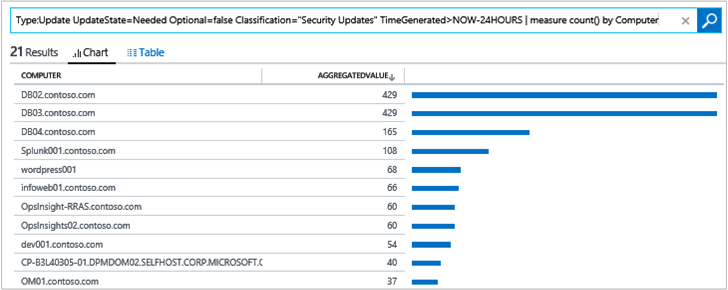

Once you have the list, you can use the search as an inner search to feed the list of computers into an outer (primary) search that will look for events for those computers. You do this by enclosing the inner search in braces and feeding its results as possible values for a filter/field in the outer search using the IN operator. The query would resemble:

```
Type=Event Computer IN {Type:Update UpdateState=Needed Optional=false Classification="Security Updates" TimeGenerated>NOW-24HOURS | measure count() by Computer}
```
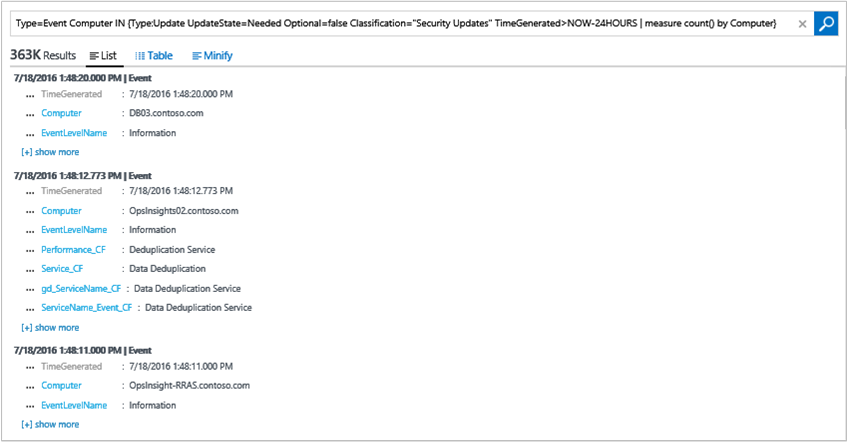


Also notice the time filter used in the inner search because the System Update Assessment takes a snapshot of all computers every 24 hours. You can make the inner query more lightweight and precise by only searching for a day. The outer search instead uses the time selection in the user interface, retrieving events from the last 7 days. See [Boolean operators](#boolean-operators) for more information about time operators.

Because you really only use the results of the inner search as a filter value for the outer one, you can still apply commands in the outer search. For example, you can still group the above events with another measure command:

```
Type=Event Computer IN {Type:Update UpdateState=Needed Optional=false Classification="Security Updates" TimeGenerated>NOW-24HOURS | measure count() by Computer} | measure count() by Source
```

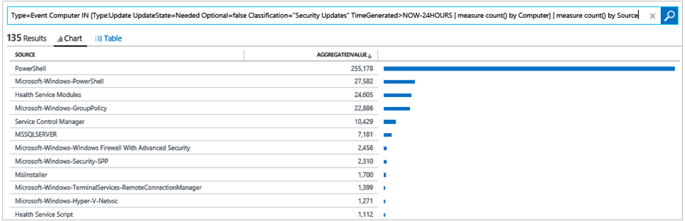


Generally, you want your inner query to execute quickly because Log Analytics has service-side timeouts for it and also to return a small amount of results. If the inner query returns more results, the result list gets truncated, which could potentially cause the outer search to return incorrect results.

Another rule is that the inner search currently needs to provide *aggregated* results. In other words, it must contain a *measure* command; you cannot currently feed raw results into an outer search.

Also, there can be only one IN operator and it must be the last filter in the query. Multiple IN operators cannot be OR’d – this essentially prevents running multiple subsearches: the important point is that only one sub/inner search is possible for each outer search.

Even with these limits, IN enables many kinds of correlated searches, and allows you to define something similar to groups such as computers, users, or files – whatever the fields in your data contain. Here are more examples:

**All updates missing from computers where Automatic Update setting is disabled**

```
Type=Update UpdateState=Needed Optional=false Computer IN {Type=UpdateSummary WindowsUpdateSetting=Manual | measure count() by Computer} | measure count() by KBID
```

**All error events from computers running SQL Server (=where SQL Assessment has run)**

```
Type=Event EventLevelName=error Computer IN {Type=SQLAssessmentRecommendation | measure count() by Computer}
```

**All security events from computers that are Domain Controllers (=where AD Assessment has run)**

```
Type=SecurityEvent Computer IN { Type=ADAssessmentRecommendation | measure count() by Computer }
```

**Which other accounts have logged on to the same computers where account BACONLAND\jochan has logged on?**

```
Type=SecurityEvent EventID=4624   Account!="BACONLAND\\jochan" Computer IN { Type=SecurityEvent EventID=4624   Account="BACONLAND\\jochan" | measure count() by Computer } | measure count() by Account
```

## Use the distinct command

As the name suggests, this command provides a list of distinct values for a field. It's surprisingly simple but quite useful. The same could be achieved with measure count() command as well, as shown below.

```
Type=Event | Measure count() by Computer
```


However, if all you're interested in is just a list of distinct values and not the count of documents that have that values, then DISTINCT can provide cleaner and easier to read output, and shorter syntax, as shown below.

```
Type=Event | Distinct Computer
```
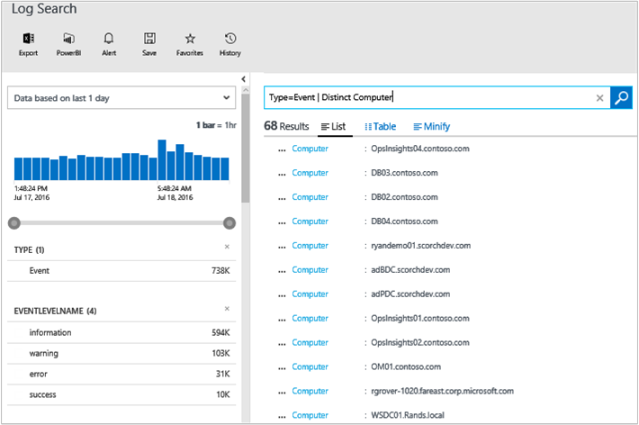

## Use the countdistinct function with the measure command
The countdistinct function counts the number of distinct values within each group. For example, it could be used to count the number of unique computers reporting for each Type:

```
* | measure countdistinct(Computer) by Type
```

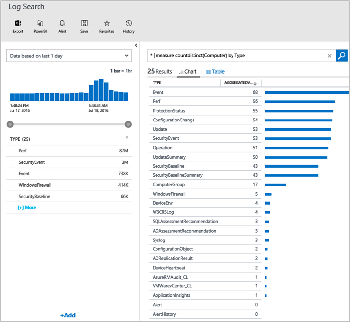

## Use the measure interval command
With near real-time performance data collection, you can collect and visualize any performance counter in Log Analytics. Simply entering the query **Type:Perf** will return thousands of metric graphs based on the number of counters and servers in your Log Analytics environment. With on-demand metric aggregation, you can look at the overall metrics in your environment at a high level, and deep dive into more granular data as you need to.

Let’s say that you want to know what is the average CPU across all your computers. Looking at the average CPU for every computer might not be helpful because results may get smoothed out. To look into more details, you can aggregate your result in a smaller time window chunks, and look into a time series across different dimensions. For example, you can perform the hourly average of CPU usage across all your computers as follows:

```
Type:Perf CounterName="% Processor Time" InstanceName="_Total" | measure avg(CounterValue) by Computer Interval 1HOUR
```

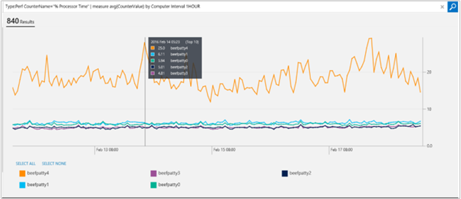

By default these results will be displayed in a multi-series interactive line chart.  This chart supports series toggling (with y-axis rescaling), zooming, and hovering.  The table display option is still available for viewing the raw data if necessary.

You can also group by other fields. In this example, I am looking at all the % counters for one specific computer, and I want to know what is the hourly 70 percentiles of every counter:

```
Type:Perf Computer=beefpatty4 CounterName=%* InstanceName=_Total | measure percentile70(CounterValue) by CounterName Interval 1HOUR
```
One thing to note is that these queries are not limited to performance counters. You can apply them to any metric. In this example, I’m looking at W3C IIS logs. I want to know what is the maximum time it takes over a 5-minute interval for processing each request:

```
Type:W3CIISLog | measure max(TimeTaken) by csMethod Interval 5MINUTES
```

### Use multiple aggregates in one query
You can specify multiple aggregate clauses in a measure command.  Each one can be aliased independently.  If it is not given an alias the resulting field name will be the aggregate function that was used (i.e. "avg(CounterValue)" for avg(CounterValue)).

 ```
Type=WireData | measure avg(ReceivedBytes), avg(SentBytes) by Direction interval 1hour
```
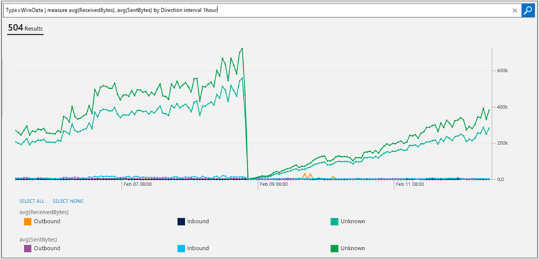

Here is another example:
 ```
* | measure countdistinct(Computer) as Computers, count() as TotalRecords by Type
```


## Next steps

For additional information about log searches, see:

- Use [Custom fields in Log Analytics](log-analytics-custom-fields.md) to extend log searches.
- Review the [Log Analytics log search reference](log-analytics-search-reference.md) to view all of the search fields and facets available in Log Analytics.
