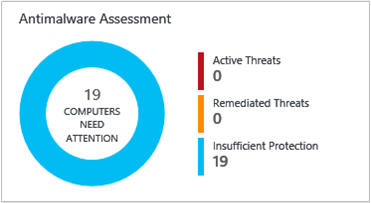
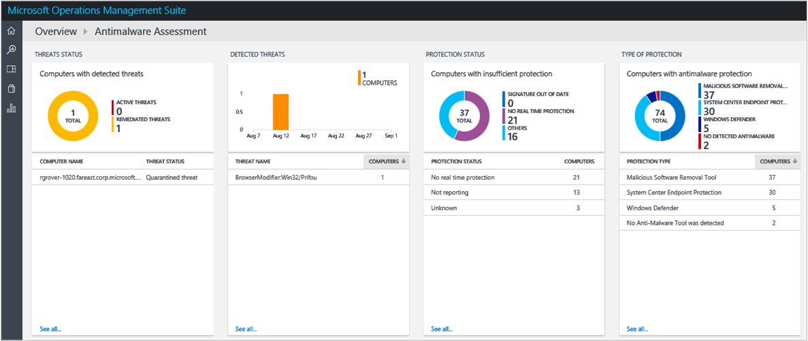
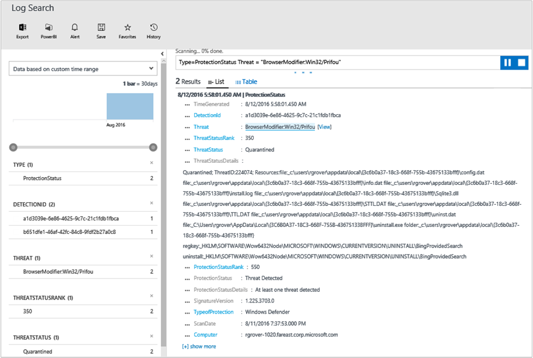
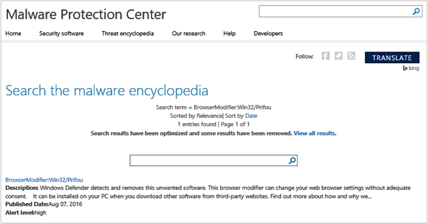
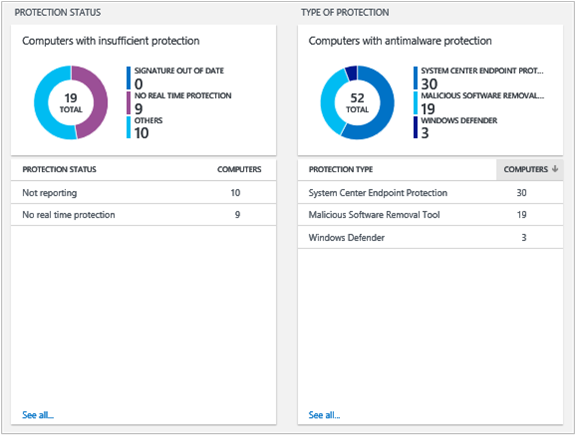
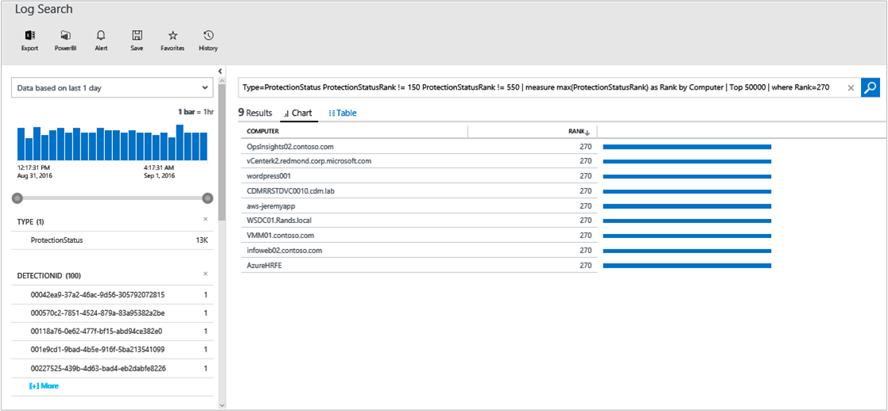

<properties
	pageTitle="Malware Assessment solution in Log Analytics | Microsoft Azure"
	description="You can use the Antimalware solution in Log Analytics to report on the status of antimalware protection in your infrastructure."
	services="log-analytics"
	documentationCenter=""
	authors="bandersmsft"
	manager="jwhit"
	editor=""/>

<tags
	ms.service="log-analytics"
	ms.workload="na"
	ms.tgt_pltfrm="na"
	ms.devlang="na"
	ms.topic="article"
	ms.date="05/26/2016"
	ms.author="banders"/>

# Malware Assessment solution in Log Analytics


You can use the Antimalware solution in Log Analytics to report on the status of antimalware protection in your infrastructure. Installing the solution updates the OMS agent and base configuration for OMS. Antimalware protection status and detected threats on the monitored servers are read, and then the data is sent to the Log Analytics service in the cloud for processing. Logic is applied to the received data and the cloud service records the data. Servers with detected threats and servers with insufficient protection are shown in the **Antimalware** dashboard. By using the information on the **Antimalware** dashboard, you can identify a plan to apply protection to the servers that need it.

## Installing and configuring the solution
Use the following information to install and configure the solution.

- Add the Malware Assessment solution to your OMS workspace using the process described in [Add Log Analytics solutions from the Solutions Gallery](log-analytics-add-solutions.md).  There is no further configuration required.


## Use Antimalware

Log Analytics reports antimalware status for:

- Computers running Windows Defender on Windows 8, Windows 8.1, Windows 10, and Windows Server 2016 TP4 or later
- Windows Security Center (WSC) on Windows 8, Windows 8.1, Windows 10, Windows Server 2016 TP4 or later
- Servers running System Center Endpoint Protection (v4.5.216 or later), Azure virtual machines with the [antimalware extension](http://go.microsoft.com/fwlink/?linkid=398023), and Windows Malicious Software Removal Tool (MSRT)  
- Servers with Windows Management Framework 3 &#40;or later&#41; [WMF 3.0](https://support.microsoft.com/kb/2506143), [WMF 4.0](http://www.microsoft.com/download/details.aspx?id=40855).

The antimalware solution does not currently report on:

- Servers running Windows Server 2008 and earlier
- Web and Worker roles in Microsoft Azure
- 3rd party antimalware products

You can help us prioritize the addition of new features by voting or adding a new suggestion on our [feedback page](http://feedback.azure.com/forums/267889-azure-operational-insights/category/88093-malware-assessment-solution).

Refer to [Reporting antimalware status for servers not supported by the antimalware solution](#Reporting-antimalware-status-for-servers-not-supported-by-the-antimalware-solution) for details on how to build a dashboard to report on all computers.

## Malware Assessment data collection details

Malware Assessment collects configuration data, metadata, and state data using the agents that you have enabled.

The following table shows data collection methods and other details about how data is collected for Malware Assessment.

| platform | Direct Agent | SCOM agent | Azure Storage | SCOM required? | SCOM agent data sent via management group | collection frequency |
|---|---|---|---|---|---|---|
|Windows||||            || hourly|


The following table shows examples of data types collected by Malware Assessment:

|**Data type**|**Fields**|
|---|---|
|Configuration|CustomerID, AgentID, EntityID, ManagedTypeID, ManagedTypePropertyID, CurrentValue, ChangeDate|
|Metadata|BaseManagedEntityId, ObjectStatus, OrganizationalUnit, ActiveDirectoryObjectSid, PhysicalProcessors, NetworkName, IPAddress, ForestDNSName, NetbiosComputerName, VirtualMachineName, LastInventoryDate, HostServerNameIsVirtualMachine, IP Address, NetbiosDomainName, LogicalProcessors, DNSName, DisplayName, DomainDnsName, ActiveDirectorySite, PrincipalName, OffsetInMinuteFromGreenwichTime|
|State|StateChangeEventId, StateId, NewHealthState, OldHealthState, Context, TimeGenerated, TimeAdded, StateId2, BaseManagedEntityId, MonitorId, HealthState, LastModified, LastGreenAlertGenerated, DatabaseTimeModified|

### To review detected threats for servers

1. On the **Overview** page, click the **Antimalware Assessment** tile.  
    
2. On the **Antimalware** dashboard, you will review the **Detected Threats** blade and click a server name with active threats.  
    
3. On the **Search** page you can see detailed information about the detected threat. Next to **Threat**, click **View**.  
    
4. On the **Search the malware encyclopedia** page, click the malware item to view more details about it.  
    
5. On the Microsoft **Malware Protection Center** page for the malware item, review information in the **What to do now** and **Get more help** sections for ways to remove the threat or take other corrective actions. Recommendations are specific to the malware found.  
    

### To review protection status

1. On the **Antimalware** dashboard, you will review the **Protection Status** blade and click **no real time protection**.  
    
2. Search shows a list of servers without protection.  
    
3. At this point you now know what servers do not have realtime protection.

Computers that do not have System Center Endpoint Protection installed (or if SCEP is not detected) will be reported as **no real time protection**.

## Reporting antimalware status for servers not supported by the antimalware solution

You can use event log analysis to report on the antimalware status of computers that are not supported by the antimalware solution. This approach works for computers running Windows Defender, Microsoft Security Essentials or System Center Endpoint Protection.
This also includes web roles, worker roles and virtual machines that are in Azure.

You need collect information, warning, and error events from the Application event log to use these queries.

For computers running in Azure, you can use [Azure storage](log-analytics-azure-storage.md) to collect these events.

Using [dashboards](log-analytics-dashboards.md) you can visualize the following log search queries that report antimalware status:

- Computers with threats detected

    ```
    Type:Event Source:"Microsoft Antimalware" EventID:1116
    ```

- Computers without a Microsoft antimalware product installed/reporting

    ```
    Type=Event Computer NOT IN { Type=Event Source:"Microsoft Antimalware" EventID:2000 | measure count() by Computer } | measure count() by Computer
    ```

- Computers with a Microsoft antimalware product installed and reporting

    ```
    Type=Event Source:"Microsoft Antimalware" | measure count() as Count by Computer
    ```

- Computers with no signature update in the last 24 hours

    ```
    Type=Event Source:"Microsoft Antimalware" EventID:2000 | measure max(TimeGenerated) as lastdata by Computer | where lastdata < NOW-24HOURS
    ```

- Antimalware error and warning events

    ```
    Type=Event Source:"Microsoft Antimalware" EventLevelName <> Information
    ```

## Next steps

- Use [Log searches in Log Analytics](log-analytics-log-searches.md) to view detailed malware assessment data.
