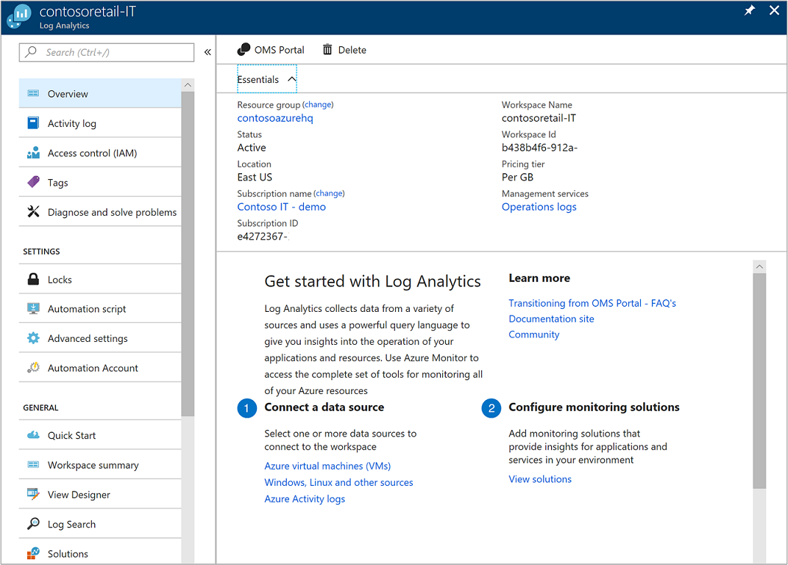
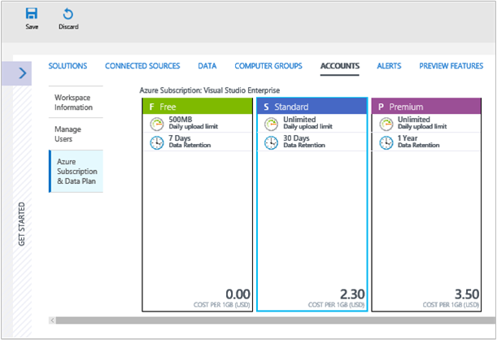

# Manage workspaces

To manage access to Log Analytics, you perform various administrative tasks related to workspaces. This article provides advice and procedures to manage workspaces. A workspace is essentially a container that includes account information and simple configuration information for the account. You or other members of your organization might use multiple workspaces to manage different sets of data that is collected from all or portions of your IT infrastructure.

To create a workspace, you need to:

1. Have an Azure subscription.
2. Choose a workspace name.
3. Associate the workspace with one of your subscriptions and resource groups.
4. Choose a geographical location.

## Determine the number of workspaces you need
A workspace is an Azure resource and is a container where data is collected, aggregated, analyzed, and presented in the Azure portal.

You can have multiple workspaces per Azure subscription and you can have access to more than one workspace, with the ability to easily query across them. This section describes when it can be helpful to create more than one workspace.

Today, a workspace provides:

* A geographic location for data storage
* Data isolation to define different user access rights
* Scope for configuration of settings like retention and data capping

From consumption point of view, we recommend you create as few workspaces as possible. It makes administration and query experience easier and quicker. But, based on the preceding characteristics, you may want to create multiple workspaces if:

* You are a global company and you need data stored in specific regions for data sovereignty or compliance reasons.
* You are using Azure and you want to avoid outbound data transfer charges by having a workspace in the same region as the Azure resources it manages.
* You want to allocate charges to different departments or business groups based on their usage by creating a workspace for each department or business group in its own Azure subscription.
* You are a managed service provider and need to keep the Log Analytics data for each customer you manage isolated from other customer’s data.
* You manage multiple customers and you want each customer / department / business group to see their own data, but not data from others.

When using Windows agents to collect data, you can [configure each agent to report to one or more workspaces](log-analytics-windows-agents.md).

If you are using System Center Operations Manager, each Operations Manager management group can be connected with only one workspace. You can install the Microsoft Monitoring Agent on computers managed by Operations Manager and have the agent report to both Operations Manager and a different Log Analytics workspace.

## Workspace information

You can view details about your workspace in the Azure portal. 

1. If you haven't already done so, sign in to the [Azure portal](https://portal.azure.com).

2. In the Azure portal, click **All services**. In the list of resources, type **Log Analytics**. As you begin typing, the list filters based on your input. Select **Log Analytics**.  

      

3. On the Log Analytics subscriptions pane, select a workspace.

4. The workspace page displays details about the getting started, configuration, and links for additional information.  

      

## Manage accounts and users
Each workspace can have multiple accounts associated with it, and each account can have access to multiple workspaces. Access is managed via [Azure role-based access](../active-directory/role-based-access-control-configure.md). These access rights applies both on the Azure portal and on the API access.

The following activities also require Azure permissions:

| Action                                                          | Azure Permissions Needed | Notes |
|-----------------------------------------------------------------|--------------------------|-------|
| Adding and removing management solutions                        | `Microsoft.Resources/deployments/*`   `Microsoft.OperationalInsights/*`   `Microsoft.OperationsManagement/*`   `Microsoft.Automation/*`   `Microsoft.Resources/deployments/*/write` | These permissions need to be granted at resource group or subscription level. |
| Changing the pricing tier                                       | `Microsoft.OperationalInsights/workspaces/*/write` | |
| Viewing data in the *Backup* and *Site Recovery* solution tiles | Administrator / Co-administrator | Accesses resources deployed using the classic deployment model |
| Creating a workspace in the Azure portal                        | `Microsoft.Resources/deployments/*`   `Microsoft.OperationalInsights/workspaces/*` ||

### Managing access to Log Analytics using Azure permissions
To grant access to the Log Analytics workspace using Azure permissions, follow the steps in [use role assignments to manage access to your Azure subscription resources](../active-directory/role-based-access-control-configure.md).

Azure has two built-in user roles for Log Analytics:
- Log Analytics Reader
- Log Analytics Contributor

Members of the *Log Analytics Reader* role can:
- View and search all monitoring data 
- View monitoring settings, including viewing the configuration of Azure diagnostics on all Azure resources.

The Log Analytics Reader role includes the following Azure actions:

| Type    | Permission | Description |
| ------- | ---------- | ----------- |
| Action | `*/read`   | Ability to view all Azure resources and resource configuration. Includes viewing:   Virtual machine extension status   Configuration of Azure diagnostics on resources   All properties and settings of all resources |
| Action | `Microsoft.OperationalInsights/workspaces/analytics/query/action` | Ability to perform Log Search v2 queries |
| Action | `Microsoft.OperationalInsights/workspaces/search/action` | Ability to perform Log Search v1 queries |
| Action | `Microsoft.Support/*` | Ability to open support cases |
|Not Action | `Microsoft.OperationalInsights/workspaces/sharedKeys/read` | Prevents reading of workspace key required to use the data collection API and to install agents. This prevents the user from adding new resources to the workspace |

Members of the *Log Analytics Contributor* role can:
- Read all monitoring data as Log Analytics Reader can  
- Creating and configuring Automation accounts  
- Adding and removing management solutions    
    > [!NOTE] 
    > In order to successfully perform the last two actions, this permission needs to be granted at the resource group or subscription level.  

- Reading storage account keys   
- Configure collection of logs from Azure Storage  
- Edit monitoring settings for Azure resources, including
  - Adding the VM extension to VMs
  - Configuring Azure diagnostics on all Azure resources

> [!NOTE] 
> You can use the ability to add a virtual machine extension to a virtual machine to gain full control over a virtual machine.

The Log Analytics Contributor role includes the following Azure actions:

| Permission | Description |
| ---------- | ----------- |
| `*/read`     | Ability to view all resources and resource configuration. Includes viewing:   Virtual machine extension status   Configuration of Azure diagnostics on resources   All properties and settings of all resources |
| `Microsoft.Automation/automationAccounts/*` | Ability to create and configure Azure Automation accounts, including adding and editing runbooks |
| `Microsoft.ClassicCompute/virtualMachines/extensions/*`   `Microsoft.Compute/virtualMachines/extensions/*` | Add, update and remove virtual machine extensions, including the Microsoft Monitoring Agent extension and the OMS Agent for Linux extension |
| `Microsoft.ClassicStorage/storageAccounts/listKeys/action`   `Microsoft.Storage/storageAccounts/listKeys/action` | View the storage account key. Required to configure Log Analytics to read logs from Azure storage accounts |
| `Microsoft.Insights/alertRules/*` | Add, update, and remove alert rules |
| `Microsoft.Insights/diagnosticSettings/*` | Add, update, and remove diagnostics settings on Azure resources |
| `Microsoft.OperationalInsights/*` | Add, update, and remove configuration for Log Analytics workspaces |
| `Microsoft.OperationsManagement/*` | Add and remove management solutions |
| `Microsoft.Resources/deployments/*` | Create and delete deployments. Required for adding and removing solutions, workspaces, and automation accounts |
| `Microsoft.Resources/subscriptions/resourcegroups/deployments/*` | Create and delete deployments. Required for adding and removing solutions, workspaces, and automation accounts |

To add and remove users to a user role, it is necessary to have `Microsoft.Authorization/*/Delete` and `Microsoft.Authorization/*/Write` permission.

Use these roles to give users access at different scopes:
- Subscription - Access to all workspaces in the subscription
- Resource Group - Access to all workspace in the resource group
- Resource - Access to only the specified workspace

We recommend you perform assignments at the resource level (workspace) to assure accurate access control.  Use [custom roles](../active-directory/role-based-access-control-custom-roles.md) to create roles with the specific permissions needed.

## Link an existing workspace to an Azure subscription
All workspaces created after September 26, 2016 must be linked to an Azure subscription at creation time. Workspaces created before this date must be linked to a workspace when you sign in. When you create the workspace from the Azure portal, or when you link your workspace to an Azure subscription, your Azure Active Directory is linked as your organizational account.

### To link a workspace to an Azure subscription in the Azure portal
1. In the Azure portal, click **All services**. In the list of resources, type **Log Analytics**. As you begin typing, the list filters based on your input. Select **Log Analytics**.  

2. On the Log Analytics subscriptions pane, click **Add**.  

    

3. From the **Log Analytics workspace** pane, click **Link existing**.  

4. Click **Configure required settings**.  

5. You see the list of workspaces that are not yet linked to your Azure account. Select the workspace.  
   
6. If needed, you can change values for the following items:
   * Subscription
   * Resource group
   * Location
   * Pricing tier  

7. Click **OK**. The workspace is now linked to your Azure account.

> [!NOTE]
> If you do not see the workspace you'd like to link, then your Azure subscription does not have access to the workspace that you created using the OMS portal.  To grant access to this account from the OMS portal, see [Add a user to an existing workspace](#add-a-user-to-an-existing-workspace).
>
>

## Upgrade a workspace to a paid plan
There are three workspace plan types for OMS: **Free**, **Standalone**, and **OMS**.  If you are on the *Free* plan, there is a limit of 500 MB of data per day sent to Log Analytics.  If you exceed this amount, you need to change your workspace to a paid plan to avoid not collecting data beyond this limit. You can change your plan type at any time.  For more information on OMS pricing, see [Pricing Details](https://www.microsoft.com/en-us/cloud-platform/operations-management-suite-pricing).

### Using entitlements from an OMS subscription
To use the entitlements that come from purchasing OMS E1, OMS E2 OMS or OMS Add-On for System Center, choose the *OMS* plan of OMS Log Analytics.

When you purchase an OMS subscription, the entitlements are added to your Enterprise Agreement. Any Azure subscription that is created under this agreement can use the entitlements. All workspaces on these subscriptions use the OMS entitlements.

To ensure that usage of a workspace is applied to your entitlements from the OMS subscription, you need to:

1. Create your workspace in an Azure subscription that is part of the Enterprise Agreement that includes the OMS subscription

2. Select the *OMS* plan for the workspace

> [!NOTE]
> If your workspace was created before September 26, 2016 and your Log Analytics pricing plan is *Premium*, then this workspace uses entitlements from the OMS Add-On for System Center. You can also use your entitlements by changing to the *OMS* pricing tier.
>
>

The OMS subscription entitlements are not visible in the Azure portal. You can see entitlements and usage in the Enterprise Portal.  

If you need to change the Azure subscription that your workspace is linked to, you can use the Azure PowerShell [Move-AzureRmResource](https://msdn.microsoft.com/library/mt652516.aspx) cmdlet.

### Using Azure Commitment from an Enterprise Agreement
If you do not have an OMS subscription, you pay for each component of OMS separately and the usage appears on your Azure bill.

If you have Azure monetary commitment on the enterprise enrollment to which your Azure subscriptions are linked, usage of Log Analytics will automatically debit against the remaining monetary commit.

If you need to change the Azure subscription that the workspace is linked to, you can use the Azure PowerShell [Move-AzureRmResource](https://msdn.microsoft.com/library/mt652516.aspx) cmdlet.  

### Change a workspace to a paid pricing tier in the Azure portal
1. In the Azure portal, from the Log Analytics subscriptions pane, select a workspace.

2. From the workspace pane, under **General**, select **Pricing tier**.  

3. Under **Pricing tier**, select a pricing tier and then click **Select**.  
    

> [!NOTE]
> If your workspace is linked to an Automation account, before you can select the *Standalone (Per GB)* pricing tier you must delete any **Automation and Control** solutions and unlink the Automation account. In the workspace blade, under **General**, click **Solutions** to see and delete solutions. To unlink the Automation account, click the name of the Automation account on the **Pricing tier** blade.
>
>

### Change a workspace to a paid pricing tier in the OMS portal

To change the pricing tier using the OMS portal, you must have an Azure subscription.

1. In the OMS portal, click the **Settings** tile.

2. Click the **Accounts** tab and then click the **Azure Subscription & Data Plan** tab.

3. Click the pricing tier you want to use.

4. Click **Save**.  

    

Your new data plan is displayed in the OMS portal ribbon at the top of your web page.

## Next steps
* See [Collect data from computers in your environment with Log Analytics](log-analytics-concept-hybrid.md) to gather data from computers in your datacenter or other cloud environment.
* See [Collect data about Azure Virtual Machines](log-analytics-quick-collect-azurevm.md) to configure data collection from Azure VMs.  
* [Add Log Analytics solutions from the Solutions Gallery](log-analytics-add-solutions.md) to add functionality and gather data.

