<properties
	pageTitle="Manage access to Log Analytics | Microsoft Azure"
	description="Manage access to Log Analytics using a variety of administrative tasks on users, accounts, OMS workspaces, and Azure accounts."
	services="log-analytics"
	documentationCenter=""
	authors="bandersmsft"
	manager="jwhit"
	editor=""/>

<tags
	ms.service="log-analytics"
	ms.workload="na"
	ms.tgt_pltfrm="na"
	ms.devlang="na"
	ms.topic="get-started-article"
	ms.date="04/28/2016"
	ms.author="banders"/>

# Manage access to Log Analytics

To manage access to Log Analytics, you'll use a variety of administrative tasks on users, accounts, OMS workspaces, and Azure accounts. To create a new workspace in the Operations Management Suite (OMS), you choose a workspace name, associate it with your account, and you choose a geographical location. A workspace is essentially a container that includes account information and simple configuration information for the account. You or other members of your organization might use multiple OMS workspaces to manage different sets of data that is collected from all or portions of your IT infrastructure.

The [Get started with Log Analytics](log-analytics-get-started.md) article shows you how to quickly get up and running and the rest of this article describes in more detail some of the actions you'll need to manage access to OMS.

Although you might not need to perform every management task at first, we'll cover all the commonly used tasks that you might use in the following sections:

- Determine the number of workspaces you need
- Manage accounts and users
- Add a group to an existing workspace
- Link an existing workspace to an Azure subscription
- Upgrade a workspace to a paid data plan
- Change a data plan type
- Add an Azure Active Directory Organization to an existing workspace
- Close your OMS workspace

## Determine the number of workspaces you need

A workspace is an Azure resource and is a container where data is collected, aggregated, analyzed, and presented in the OMS portal.

It is possible to create multiple OMS Log Analytics workspaces and for users to have access to one or more workspaces. In general you want to minimize the number of workspaces as this will allow you to query and correlate across the most data. This section describes when it can be helpful to create more than one workspace.

Today a log analytics workspace provides:

- A geographic location for data to be stored.
- Granularity for billing
- Data isolation

Based on the above characteristics, you may want to create multiple workspaces if:

- You are a global company and you need data stored in specific regions for data sovereignty / compliance reasons.
- You are using Azure and you want to avoid outbound data transfer charges by having a Log Analytics workspace in the same region as the Azure resources it manages.
- You want to allocate charges to different departments/business groups based on their usage. By creating a workspace for each department/business group your Azure bill and usage statement will show the charges for each workspace separately.
- You are a managed service provider and need to keep the log analytics data for each customer you manage isolated from other customer’s data.
- You manage multiple customers and you want each customer/department/business group to see their own data but not the data for other customers/departments/business groups.

When using agents to collect data you can configure each agent to report to the required workspace.

If you are using System Center Operations manager, each Operations Manager management group can be connected with only one workspace. You can install the Microsoft Monitoring Agent on computers managed by Operations Manager and have the agent report to both Operations Manager and a different Log Analytics workspace.

## Manage accounts and users

Each workspace can have multiple user accounts associated with it, and each user account (Microsoft account or Organizational account) can have access to multiple OMS workspaces.

By default, the Microsoft account or Organizational account used to create the workspace becomes the Administrator of the workspace. The administrator can then invite additional Microsoft accounts or pick users from his Azure Active Directory.

Giving people access to the OMS workspace can be controlled in 2 places:

- Using Azure role-based access control you can provide access to the Azure subscription and the associated Azure resources. This is also used for PowerShell and REST API access.
- Access to just the OMS portal and not the associated Azure subscription, can be managed within the OMS portal.

If you have given people access to the OMS portal but not to the Azure subscription that it is linked to, then the Automation, Backup, and Site Recovery solution tiles will not show any data for the user when they log into the OMS portal.

To allow all users to see the data in these solutions, ensure they have at least **reader** access for the Automation Account, Backup Vault, and Site Recovery vault that is linked to the OMS workspace.   

### Managing access to Log Analytics using the Azure portal

If you give people access to the Log Analytics workspace using Azure permissions (e.g. in the Azure portal) then the same users will also be able to access the Log Analytics portal. If users are in the Azure portal they can navigate to the OMS portal by clicking on the “OMS Portal” task when viewing the Log Analytics workspace resource.

Four things to know:

1. This is not Role-Based Access Control. If you have “Reader” access permissions in the Azure portal for the log analytics workspace, you will have the ability to make changes via the OMS portal. The OMS portal has a concept of Administrator, Contributor, and ReadOnly User. If the account you are logged in with is in the Azure Active Directory linked to the workspace you will be an Administrator in the OMS portal, otherwise you will be a Contributor.
2. If you are logging into the OMS portal via mms.microsoft.com then by default when you see the “Select a workspace” list it will only contain workspaces that you have been added to in the OMS portal. To see the workspaces you have access to via Azure subscriptions you need to specify a tenant as part of the URL:
e.g. mms.microsoft.com/?tenant=contoso.com (the tenant identifier is often that last part of the e-mail address you sign in with)
3. If the account you log in with is an account in the tenant AAD (this will usually be the case unless you’re signing in as a CSP) then you will be an Administrator in the OMS portal. If your account is not in the tenant AAD then you will be a User in the OMS portal.
4. If you want to navigate directly to a portal that you have access to via Azure permissions, then you need to specify the resource as part of the URL. It is possible to get this URL via PowerShell e.g. (Get-AzureRmOperationalInsightsWorkspace).PortalUrl
The URL will look like:
https://eus.mms.microsoft.com/?tenant=contoso.com&resource=%2fsubscriptions%2faaa5159e-dcf6-890a-a702-2d2fee51c102%2fresourcegroups%2fdb-resgroup%2fproviders%2fmicrosoft.operationalinsights%2fworkspaces%2fmydemo12

### Managing users in the OMS portal

You manage accounts and users using the **Accounts** tab in the Settings page. There, you can perform the tasks in the following sections.  

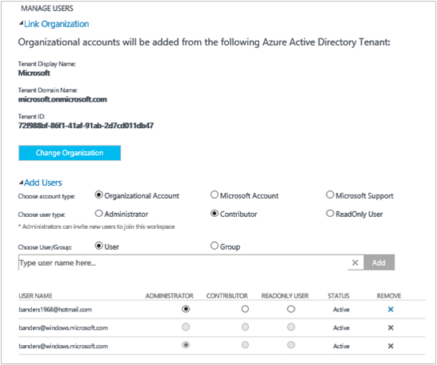

#### Add a user to an existing workspace

Use the following steps to add a user or group to an OMS workspace. The user or group will be able to view and act on all alerts that are associated with this workspace.

>[AZURE.NOTE] If you want to add a user or group from your Azure Active Directory organizational account, you must first ensure that you have associated your OMS account with your Active Directory domain. See [Add an Azure Active Directory Organization to an existing workspace](#add-an-azure-active-directory-organization-to-an-existing-workspace).

1. In OMS, click the **Settings** tile.
2. Click the **Accounts** tab.
3. In the **Manage Users** section, choose the account type to add: **Organizational Account**, **Microsoft Account**, **Microsoft Support**.
    - If  you choose Microsoft Account, type the email address of the user associated with the Microsoft Account.
    - If you choose Organizational Account, you can enter part of the user or group’s name or email alias and a list of users and groups will appear. Select a user or group.
    - Use Microsoft Support to give a Microsoft Support engineer temporary access to your workspace to help with troubleshooting.

    >[AZURE.NOTE] For the best performance results, limit the number of Active Directory groups associated with a single OMS account to three—one for administrators, one for contributors, and one for read-only users. Using more groups might impact the performance of Log Analytics.

7. Choose the type of user or group to add: **Administrator**, **Contributor**, or **ReadOnly User** .  
8. Click **Add**.

  If you are adding a Microsoft account, an invitation to join the workspace is sent to the email you provided. After the user follows the instructions in the invitation to join OMS, the user can view the alerts and account information for this OMS account, and you will be able to view the user information on the **Accounts**  tab of the **Settings** page.
  If you are adding an organizational account, the user will be able to access Log Analytics immediately.  
  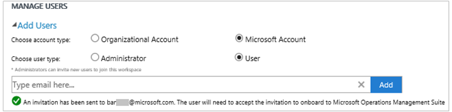

#### Edit an existing user type

You can change the account role for a user associated with your OMS account. You have the following role options:

 - *Administrator*: Can manage users, view and act on all alerts, and add and remove servers

 - *Contributor*: Can view and act on all alerts, and add and remove servers

 - *ReadOnly User*: Users marked as read-only will not be able to:
   1. Add/remove solutions (the solution gallery is hidden)
   2. Add/modify/remove tiles on ‘My Dashboard’
   3. View the Setting pages (the pages are hidden)
   4. In the Search view: PowerBI configuration, Saved Searches, and Alerts tasks are hidden

#### To edit an account
1. On the **Settings** page in the **Accounts** tab in OMS, select the role for the user that you want to change.
2. Click **OK**.

### Remove a user from a OMS workspace

Use the following steps to remove a user from an OMS workspace. Note that this does not close the user’s workspace. Instead, it removes the association between that user and the workspace. If a user is associated with multiple workspaces, that user will still be able to sign in to OMS and see the other workspaces.

1. On the **Settings** page in the **Accounts** tab of OMS, click Remove next to the user name that you want to remove.
2. Click **OK** to confirm that you want to remove the user.

### Add a group to an existing workspace

1.	Follow steps 1 -4 in “To add a user to an existing workspace”, above.
2.	Under **Choose User/Group**, select **Group**.
    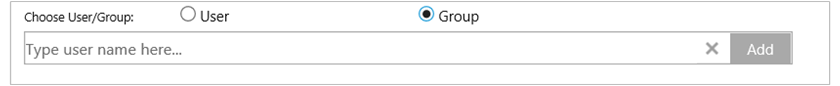
3.	Enter the Display Name or Email address for the group you’d like to add.
4.	Select the group in the list results and then click **Add**.

## Link an existing workspace to an Azure subscription

It is possible to create a workspace from the [microsoft.com/oms](https://microsoft.com/oms) website.  However, certain limits exist for these workspaces, the most notable being a limit of 500MB/day of data uploads if you're using a free account. To make changes to this workspace you will need to **link your existing workspace to an Azure subscription**.

>[AZURE.IMPORTANT] In order to link a workspace, your Azure account must already have access to the workspace you'd like to link.  In other words, the account you use to access the Azure portal must be **the same** as the account you use to access your OMS workspace. If this is not the case, see [Add a user to an existing workspace](#add-a-user-to-an-existing-workspace).

1.	Sign into the [Azure portal](http://portal.azure.com).
2.	Browse for **Log Analytics (OMS)** and then select it.
3.	You’ll see your list of existing workspaces. Click **Add**.  
    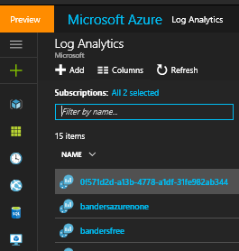
4.	Under **OMS Workspace**, click **Or link existing**.  
    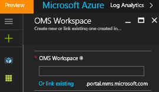
5.	Click **Configure required settings**.  
    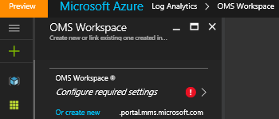
6.	You’ll see the list of workspaces that are not yet linked to your Azure account. Select a workspace.
    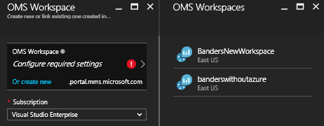
7.	If needed, you can change values for the following items:
    - Subscription
    - Resource group
    - Location
    - Pricing tier  
        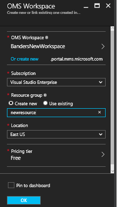
8.	Click **Create**. The workspace is now linked to your Azure account.

>[AZURE.NOTE] If you do not see the workspace you'd like to link, then your Azure subscription does not have access to the OMS workspace that you created using the OMS website.  You will need to grant access to this account from inside your OMS workspace using the OMS website. To do so, see [Add a user to an existing workspace](#add-a-user-to-an-existing-workspace).

## Upgrade a workspace to a paid data plan

There are three workspace data plan types for OMS: **Free**, **Standard**, and **Premium**.  If you are on a *Free* plan, you may have hit your data cap of 500MB.  You will need to upgrade your workspace to a '**pay-as-you-go plan**' in order to collect data beyond this limit. At any time you can convert your plan type.  For more information on OMS pricing, see [Pricing Details](https://www.microsoft.com/en-us/server-cloud/operations-management-suite/pricing.aspx).

>[AZURE.IMPORTANT] Workspace plans can only be changed if they are *linked* to an Azure subscription.  If you created your workspace in Azure or if you've *already* linked your workspace, you can ignore this message.  If you created your workspace with the [OMS website](http://www.microsoft.com/oms), you will need to follow the steps at [Link an existing workspace to an Azure subscription](#link-an-existing-workspace-to-an-azure-subscription).

### Using entitlements from the OMS Add-On for System Center

The OMS Add-On for System Center provides an entitlement for the Premium plan of OMS Log Analytics, described at [OMS Pricing](https://www.microsoft.com/en-us/server-cloud/operations-management-suite/pricing.aspx).

When you purchase the OMS add-on for System Center, the OMS add-on is added as an entitlement on your System Center agreement. Any Azure subscription that is created under this agreement can make use of the entitlement. This allows you, for example, to have multiple OMS workspaces that use the entitlement from the OMS add-on.

To ensure that usage of an OMS workspace is applied to your entitlements from the OMS add-on, you'll need to:

1. Link your OMS workspace to an Azure subscription that is part of the Enterprise Agreement that includes both the OMS add-on purchase and Azure subscription usage
2. Select the Premium plan for the workspace

When you review your usage in the Azure or OMS portal, you won’t see the OMS add-on entitlements. However, you can see entitlements in the Enterprise Portal.  

If you need to change the Azure subscription that your OMS workspace is linked to, you can use the Azure PowerShell [Move-AzureRmResource](https://msdn.microsoft.com/library/mt652516.aspx) cmdlet.

### Using Azure Commitment from an Enterprise Agreement

If you choose to use standalone pricing for OMS components, you will pay for each component of OMS separately and the usage will appear on your Azure bill.

If you have an Azure monetary commit on the enterprise enrollment to which your Azure subscriptions are linked, any usage of Log Analytics will automatically debit agains any remaining monetary commit.

If you need to change the Azure subscription that the OMS workspace is linked to you can use the Azure PowerShell [Move-AzureRmResource](https://msdn.microsoft.com/library/mt652516.aspx) cmdlet.  

### To change a workspace to a paid data plan

1.	Sign into the [Azure portal](http://portal.azure.com).
2.	Browse for **Log Analytics (OMS)** and then select it.
3.	You’ll see your list of existing workspaces. Select a workspace.  
    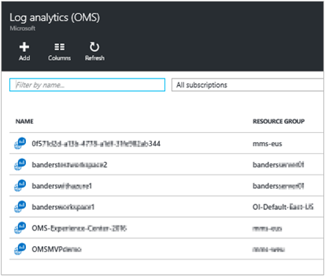
4.	Under **Settings**, click **Pricing tier**.  
    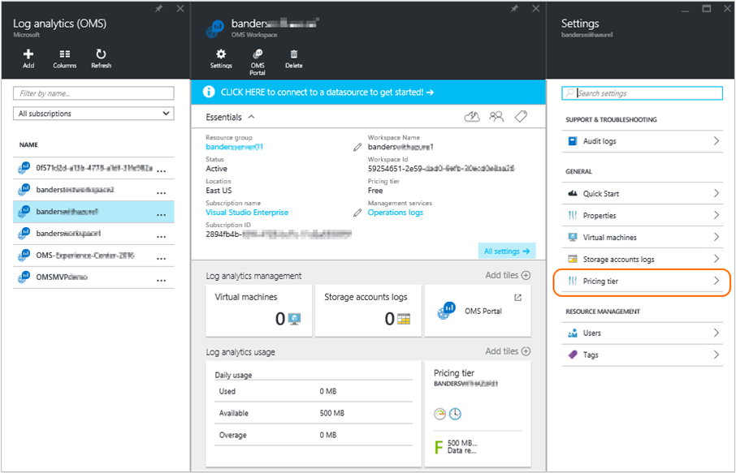
5.	Under **Pricing tier**, select a data plan and then click **Select**.  
    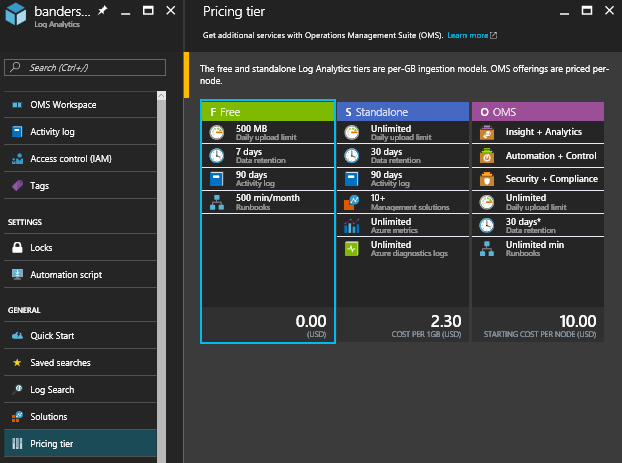
6.	When you refresh your view in the Azure portal, you’ll see **Pricing tier** updated for the plan you selected.  
    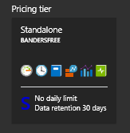

Now you can collect data beyond the "free" data cap.

## Add an Azure Active Directory Organization to an existing workspace

You can associate your Log Analytics (OMS) workspace with an Azure Active Directory domain. This enables you to add users from Active Directory directly to your OMS workspace without requiring a separate Microsoft account.

When you create the workspace from the Azure portal, or link your workspace to an Azure subscription your Azure Active Directory will be linked as your organizational account.

When you create the workspace from the OMS portal you will be prompted to link to an Azure subscription and an organizational account.

### To add an Azure Active Directory Organization to an existing workspace

1. On the Settings page in OMS, click **Accounts** and then click **Workspace Information**.  
2. Review the information about organizational accounts, and then click **Add Organization**.  
    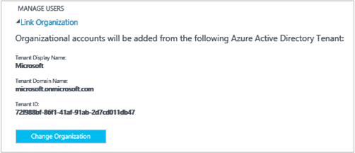
3. Enter the identity information for the administrator of your Azure Active Directory domain. Afterward, you'll see an acknowledgment stating that your workspace is linked to your Azure Active Directory domain.
    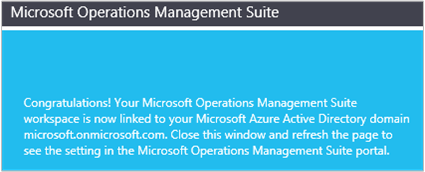

>[AZURE.NOTE]Once your account is linked to an Organizational Account, the linking cannot be removed or changed.

## Close your OMS workspace

When you close an OMS workspace, all data related to your workspace is deleted from the OMS service not more than 30 days after you close the workspace.

If you are an administrator, and there are multiple users associated with the workspace, the association between those users and the workspace is broken. If the users are associated with other workspaces, then they can continue using OMS with those other workspaces. However, if they are not associated with other workspaces then they will need to create a new workspace to use OMS.

### To close an OMS workspace

1. On the **Settings** page in the **Accounts** tab of OMS, click **Close Workspace**.

2. Select one of the reasons for closing your workspace, or enter a different reason in the text box.

3. Click **Close workspace**.

## Next steps

- See [Connect Windows computers to Log Analytics](log-analytics-windows-agents.md) to add agents and gather data.
- [Add Log Analytics solutions from the Solutions Gallery](log-analytics-add-solutions.md) to add functionality and gather data.
- [Configure proxy and firewall settings in Log Analytics](log-analytics-proxy-firewall.md) if your organization uses a proxy server or firewall so that agents can communicate with the Log Analytics service.
