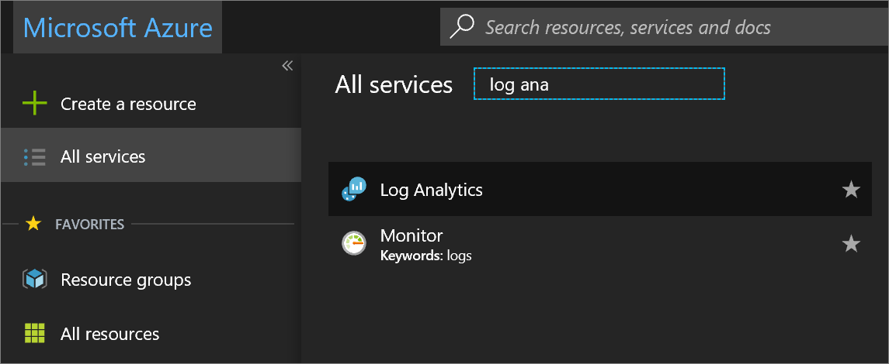
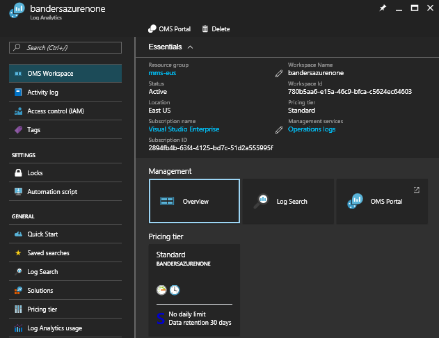
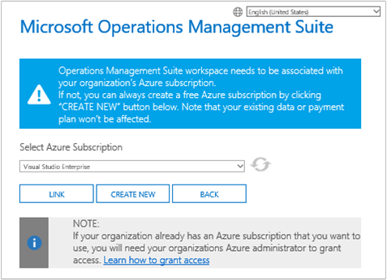
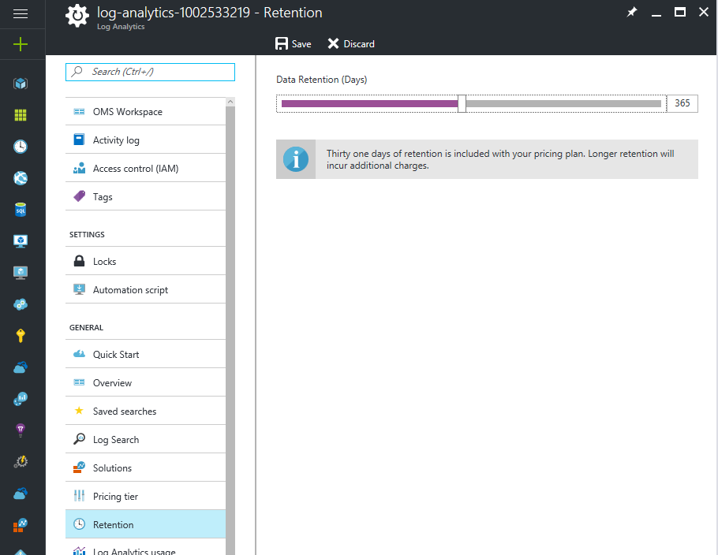

# Manage workspaces

To manage access to Log Analytics, you perform various administrative tasks related to workspaces. This article provides best practice advice and procedures to manage workspaces. A workspace is essentially a container that includes account information and simple configuration information for the account. You or other members of your organization might use multiple workspaces to manage different sets of data that is collected from all or portions of your IT infrastructure.

To create a workspace, you need to:

1. Have an Azure subscription.
2. Choose a workspace name.
3. Associate the workspace with your subscription.
4. Choose a geographical location.

## Determine the number of workspaces you need
A workspace is an Azure resource and is a container where data is collected, aggregated, analyzed, and presented in the Azure portal.

It is possible to create multiple workspaces for users to have access to one or more workspaces. Minimizing the number of workspaces allows you to query and correlate across the most data. This section describes when it can be helpful to create more than one workspace.

Today, a workspace provides:

* A geographic location for data storage
* Granularity for billing
* Data isolation
* Scope for configuration

Based on the preceding characteristics, you may want to create multiple workspaces if:

* You are a global company and you need data stored in specific regions for data sovereignty or compliance reasons.
* You are using Azure and you want to avoid outbound data transfer charges by having a workspace in the same region as the Azure resources it manages.
* You want to allocate charges to different departments or business groups based on their usage. When you create a workspace for each department or business group, your Azure bill and usage statement shows the charges for each workspace separately.
* You are a managed service provider and need to keep the log analytics data for each customer you manage isolated from other customer’s data.
* You manage multiple customers and you want each customer / department / business group to see their own data but not the data for others.

When using agents to collect data, you can configure each agent to report to one or more workspaces.

If you are using System Center Operations Manager, each Operations Manager management group can be connected with only one workspace. You can install the Microsoft Monitoring Agent on computers managed by Operations Manager and have the agent report to both Operations Manager and a different Log Analytics workspace.

### Workspace information

You can view details about your workspace in the Azure portal. You can also view details in the OMS portal.

#### View workspace information the Azure portal

1. If you haven't already done so, sign in to the [Azure portal](https://portal.azure.com) using your Azure subscription.
2. On the **Hub** menu, click **More services** and in the list of resources, type **Log Analytics**. As you begin typing, the list filters based on your input. Click **Log Analytics**.  
      
3. In the Log Analytics subscriptions blade, select a workspace.
4. The workspace blade displays details about the workspace and links for additional information.  
      

## Manage accounts and users
Each workspace can have multiple user accounts associated with it, and each user account (Microsoft account or Organizational account) can have access to multiple workspaces.

By default, the Microsoft account or Organizational account used to create the workspace becomes the Administrator of the workspace. The administrator can then invite additional Microsoft accounts or pick users from Azure Active Directory.

Giving people access to the workspace is controlled in two places:

* In Azure, you can use role-based access control to provide access to the Azure subscription and the associated Azure resources. These permissions are also used for PowerShell and REST API access.
* In the OMS portal, access to only the OMS portal - not the associated Azure subscription.

To see data in the Backup and Site Recovery solution tiles, it is necessary to have administrator or co-administrator permission to the Azure subscription that the workspace is linked to.   

### Managing access to Log Analytics using the Azure portal
If you give people access to the Log Analytics workspace using Azure permissions, in the Azure portal for example, then the same users can access the Log Analytics portal. If users are in the Azure portal, they can navigate to the OMS portal by clicking the **OMS Portal** task when viewing the Log Analytics workspace resource.

Some points to keep in mind about the Azure portal:

* This is not *Role-Based Access Control*. If you have *Reader* access permissions in the Azure portal for the Log Analytics workspace, then you can make changes using the OMS portal. The OMS portal has a concept of Administrator, Contributor, and ReadOnly User. If the account you are signed-in with is in the Azure Active Directory linked to the workspace, then you are an Administrator in the OMS portal, otherwise you are a Contributor.
* When you sign in to the OMS portal using http://mms.microsoft.com, then by default, you see the **Select a workspace** list. It only contains workspaces that were added by using the OMS portal. To see the workspaces you have access to with Azure subscriptions, you need to specify a tenant as part of the URL. For example:

  `mms.microsoft.com/?tenant=contoso.com` The tenant identifier is often that last part of the e-mail address that you use to sign in.
* If the account you sign in with is an account in the tenant Azure Active Directory, then you are an *Administrator* in the OMS portal. This is usually the case unless you’re signing in as a CSP.  If your account is not in the tenant Azure Active Directory, then you are a *User* in the OMS portal.
* If you want to navigate directly to a portal that you have access to using Azure permissions, then you need to specify the resource as part of the URL. It is possible to get this URL using PowerShell.

  For example, `(Get-AzureRmOperationalInsightsWorkspace).PortalUrl`.

  The URL looks like:
  `https://eus.mms.microsoft.com/?tenant=contoso.com&resource=%2fsubscriptions%2faaa5159e-dcf6-890a-a702-2d2fee51c102%2fresourcegroups%2fdb-resgroup%2fproviders%2fmicrosoft.operationalinsights%2fworkspaces%2fmydemo12`

For example, in order to add or remove management solutions, the user must be an administrator or contributor to the Azure subscription when using the Azure portal. In addition, the user must be a member of the OMS workspace contributor or administrator role in the OMS portal.

### Managing users in the OMS portal
You manage users and group on the **Manage Users** tab under the **Accounts** tab in the Settings page.   

#### Add a user to an existing workspace
Use the following steps to add a user or group to a workspace.

1. In the OMS portal, click the **Settings** tile.
2. Click the **Accounts** tab and then click the **Manage Users** tab.
3. In the **Manage Users** section, choose the account type to add: **Organizational Account**, **Microsoft Account**, **Microsoft Support**.

   * If you choose Microsoft Account, type the email address of the user associated with the Microsoft Account.
   * If you choose Organizational Account, you can enter part of the user or group’s name or email alias and a list of matching users and groups appears in a dropdown box. Select a user or group.
   * Use Microsoft Support to give a Microsoft Support engineer or other Microsoft employee temporary access to your workspace to help with troubleshooting.

     > [!NOTE]
     > For the best performance results, limit the number of Active Directory groups associated with a single OMS account to three—one for administrators, one for contributors, and one for read-only users. Using more groups might impact the performance of Log Analytics.
     >
     >
4. Choose the type of user or group to add: **Administrator**, **Contributor**, or **ReadOnly User**.  
5. Click **Add**.

   If you are adding a Microsoft account, an invitation to join the workspace is sent to the email you provided. After the user follows the instructions in the invitation to join OMS, the user can access the workspace.
   If you are adding an organizational account, the user can access Log Analytics immediately.  

#### Edit an existing user type
You can change the account role for a user associated with your OMS account. You have the following role options:

* *Administrator*: Can manage users, view and act on all alerts, and add and remove servers
* *Contributor*: Can view and act on all alerts, and add and remove servers
* *ReadOnly User*: Users marked as read-only cannot:

  1. Add/remove solutions. The solution gallery is hidden.
  2. Add/modify/remove tiles on **My Dashboard**.
  3. View the **Settings** pages. The pages are hidden.
  4. In the Search view, PowerBI configuration, Saved Searches, and Alerts tasks are hidden.

#### To edit an account
1. In the OMS portal, click the **Settings** tile.
2. Click the **Accounts** tab and then click the **Manage Users** tab.
3. Select the role for the user that you want to change.
4. In the confirmation dialog box, click **Yes**.

### Remove a user from a workspace
Use the following steps to remove a user from a workspace. Removing the user does not close the workspace. Instead, it removes the association between that user and the workspace. If a user is associated with multiple workspaces, that user can still sign in to OMS and see their other workspaces.

1. In the OMS portal, click the **Settings** tile.
2. Click the **Accounts** tab and then click the **Manage Users** tab.
3. Click **Remove** next to the user name that you want to remove.
4. In the confirmation dialog box, click **Yes**.

### Add a group to an existing workspace
1. Follow steps 1 -4 in “To add a user to an existing workspace”, above.
2. Under **Choose User/Group**, select **Group**.  
   
3. Enter the Display Name or Email address for the group you’d like to add.
4. Select the group in the list results and then click **Add**.

## Link an existing workspace to an Azure subscription
All workspaces created after September 26, 2016 must be linked to an Azure subscription at creation time. Workspaces created before this date must be linked to a workspace when you next sign in. When you create the workspace from the Azure portal, or when you link your workspace to an Azure subscription, your Azure Active Directory is linked as your organizational account.

> [!IMPORTANT]
> To link a workspace, your Azure account must already have access to the workspace you'd like to link.  In other words, the account you use to access the Azure portal must be **the same** as the account you use to access the workspace. If not, see [Add a user to an existing workspace](#add-a-user-to-an-existing-workspace).
>
>

### To link a workspace to an Azure subscription in the OMS portal
To link a workspace to an Azure subscription in the OMS portal, the signed-in user must already have a paid Azure account.

1. In the OMS portal, click the **Settings** tile.
2. Click the **Accounts** tab and then click the **Azure Subscription & Data Plan** tab.
3. Click the data plan that you want use.
4. Click **Save**.  
   

Your new data plan is displayed in the OMS portal ribbon at the top of your web page.

### To link a workspace to an Azure subscription in the Azure portal
1. Sign into the [Azure portal](http://portal.azure.com).
2. Browse for **Log Analytics** and then select it.
3. You see your list of existing workspaces. Click **Add**.  
   
4. Under **OMS Workspace**, click **Or link existing**.  
   
5. Click **Configure required settings**.  
   
6. You see the list of workspaces that are not yet linked to your Azure account. Select a workspace.  
   
7. If needed, you can change values for the following items:
   * Subscription
   * Resource group
   * Location
   * Pricing tier  
     
8. Click **OK**. The workspace is now linked to your Azure account.

> [!NOTE]
> If you do not see the workspace you'd like to link, then your Azure subscription does not have access to the workspace that you created using the OMS website.  To grant access to this account from the OMS portal, see [Add a user to an existing workspace](#add-a-user-to-an-existing-workspace).
>
>

## Upgrade a workspace to a paid plan
There are three workspace plan types for OMS: **Free**, **Standalone**, and **OMS**.  If you are on the *Free* plan, there is a limit of 500 MB of data per day sent to Log Analytics.  If you exceed this amount, you need to change your workspace to a paid plan to avoid not collecting data beyond this limit. You can change your plan type at any time.  For more information on OMS pricing, see [Pricing Details](https://www.microsoft.com/en-us/cloud-platform/operations-management-suite-pricing).

### Using entitlements from an OMS subscription
To use the entitlements that come from purchasing OMS E1, OMS E2 OMS or OMS Add-On for System Center, choose the *OMS* plan of OMS Log Analytics.

When you purchase an OMS subscription, the entitlements are added to your Enterprise Agreement. Any Azure subscription that is created under this agreement can use the entitlements. This allows you, for example, to have multiple workspaces that use the entitlement from the OMS subscriptions.

To ensure that usage of a workspace is applied to your entitlements from the OMS subscription, you need to:

1. Create your workspace in an Azure subscription that is part of the Enterprise Agreement that includes the OMS subscription
2. Select the *OMS* plan for the workspace

> [!NOTE]
> If your workspace was created before September 26, 2016 and your Log Analytics pricing plan is *Premium*, then this workspace will use entitlements from the OMS Add-On for System Center. You can also use your entitlements by changing to the *OMS* pricing tier.
>
>

The OMS subscription entitlements are not visible in the Azure or OMS portal. You can see entitlements and usage in the Enterprise Portal.  

If you need to change the Azure subscription that your workspace is linked to, you can use the Azure PowerShell [Move-AzureRmResource](https://msdn.microsoft.com/library/mt652516.aspx) cmdlet.

### Using Azure Commitment from an Enterprise Agreement
If you do not have an OMS subscription, you pay for each component of OMS separately and the usage appears on your Azure bill.

If you have an Azure monetary commit on the enterprise enrollment to which your Azure subscriptions are linked, any usage of Log Analytics will automatically debit against any remaining monetary commit.

If you need to change the Azure subscription that the workspace is linked to, you can use the Azure PowerShell [Move-AzureRmResource](https://msdn.microsoft.com/library/mt652516.aspx) cmdlet.  

### Change a workspace to a paid pricing tier
1. Sign into the [Azure portal](http://portal.azure.com).
2. Browse for **Log Analytics** and then select it.
3. You see your list of existing workspaces. Select a workspace.  
4. In the workspace blade, under **General**, click **Pricing tier**.  
5. Under **Pricing tier**, click select a pricing tier and then click **Select**.  
    
6. When you refresh your view in the Azure portal, you see **Pricing tier** updated for the tier you selected.  
    

> [!NOTE]
> If your workspace is linked to an Automation account, before you can select the *Standalone (Per GB)* pricing tier you must delete any **Automation and Control** solutions and unlink the Automation account. In the workspace blade, under **General**, click **Solutions** to see and delete solutions. To unlink the Automation account, click the name of the Automation account on the **Pricing tier** blade.
>
>

## Change how long Log Analytics stores data

On the Free pricing tier, Log Analytics makes available the last seven days of data.
On the Standard pricing tier, Log Analytics makes available the last 30 days of data.
On the Premium pricing tier, Log Analytics makes available the last 365 days of data.
On the Standalone and OMS pricing tiers, by default, Log Analytics makes available the last 31 days of data.

When you use the Standalone and OMS pricing tiers, you can keep upto 2 years of data (730 days). Data stored longer than the default of 31 days incurs a data retention charge. For more information on pricing, see [overage charges](https://azure.microsoft.com/pricing/details/log-analytics/).

To change the length of data retention:

1. Sign into the [Azure portal](http://portal.azure.com).
2. Browse for **Log Analytics** and then select it.
3. You see your list of existing workspaces. Select a workspace.  
4. In the workspace blade under **General**, click **Retention**.  
5. Use the slider to increase or decrease the number of days of retention and then click **Save**

## Change an Azure Active Directory Organization for a workspace

You can change a workspace's Azure Active Directory organization. Changing the Azure Active Directory Organization allows you to add users and groups from that directory to the workspace.

### To change the Azure Active Directory Organization for a workspace

1. On the Settings page in the OMS portal, click **Accounts** and then click the **Manage Users** tab.  
2. Review the information about organizational accounts, and then click **Change Organization**.  
    
3. Enter the identity information for the administrator of your Azure Active Directory domain. Afterward, you see an acknowledgment stating that your workspace is linked to your Azure Active Directory domain.  
    

## Delete a Log Analytics workspace
When you delete a Log Analytics workspace, all data related to your workspace is deleted from the OMS service within 30 days.

If you are an administrator and there are multiple users associated with the workspace, the association between those users and the workspace is broken. If the users are associated with other workspaces, then they can continue using OMS with those other workspaces. However, if they are not associated with other workspaces then they need to create a workspace to use OMS.

### To delete a workspace
1. Sign into the [Azure portal](http://portal.azure.com).
2. Browse for **Log Analytics** and then select it.
3. You see your list of existing workspaces. Select the workspace that you want to delete.
4. In the workspace blade, click **Delete**.  
    
5. In the delete workspace confirmation dialog, click **Yes**.

## Next steps
* See [Connect Windows computers to Log Analytics](log-analytics-windows-agents.md) to add agents and gather data.
* [Add Log Analytics solutions from the Solutions Gallery](log-analytics-add-solutions.md) to add functionality and gather data.
* [Configure proxy and firewall settings in Log Analytics](log-analytics-proxy-firewall.md) if your organization uses a proxy server or firewall so that agents can communicate with the Log Analytics service.
