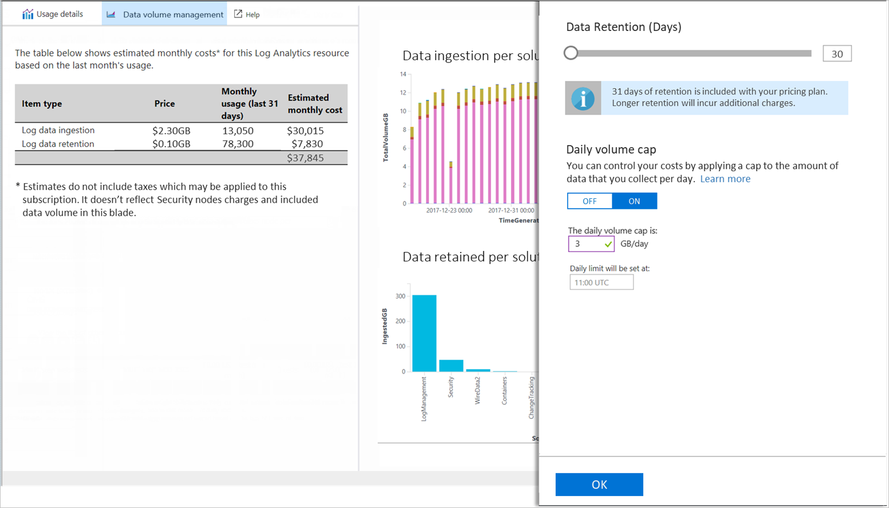
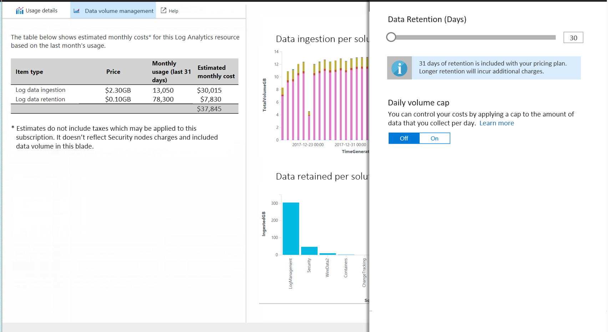
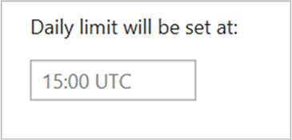

 
# Manage cost by controlling data volume and retention in Log Analytics

> [!NOTE]
> This article describes how to control your costs in Log Analytics by setting the data retention period.  Refer to the following articles for related information.
> - [Analyze data usage in Log Analytics](log-analytics-manage-cost-storage.md) describes how to analyze and alert on your data usage.
> - [Monitoring usage and estimated costs](../monitoring-and-diagnostics/monitoring-usage-and-estimated-costs.md) describes how to view usage and estimated costs across multiple Azure monitoring features for different pricing models. It also describes how to change your pricing model.

Log Analytics is designed to scale and support collecting, indexing, and storing massive amounts of data per day from any source in your enterprise or deployed in Azure.  While this may be a primary driver for your organization, cost-efficiency is ultimately the underlying driver. To that end, its important to understand that the cost of a Log Analytics workspace isn't just based on the volume of data collected, it is also dependent on the plan selected, and how long you chose to store data generated from your connected sources.  

In this article we review how you can proactively monitor data volume and storage growth, and define limits to control those associated costs. 

The cost of data can be considerable depending on the following factors: 

- Number of systems, infrastructure components, cloud resources, etc. you are collecting from 
- Type of data created by the source, such as message queues, logs, events, security-related data, or performance metrics 
- Volume of data generated by these sources and ingested to the workspace 
- The period data is retained in the workspace  
- Number of Management solutions enabled, data source, and collection frequency 

> [!NOTE]
> Refer to the documentation for each solution as it provides an estimate of how much data it collects.   

Customers with an Enterprise Agreement signed prior to July 1, 2018 or who already created a Log Analytics workspace in a subscription, you still have access to the *Free* plan. If your subscription is not tied to an existing EA enrollment, the *Free* tier is not available when you create a workspace in a new subscription after April 2, 2018.  Data is limited to 7 days retention for the *Free* tier.  For the *Standalone* or *Paid* tier, data collected is available for the last 31 days. The *Free* tier has 500 MB daily ingestion limit, and if you find that you consistently exceed the amounts allowed volume, you can change your workspace to a paid plan to collect data beyond this limit. 

> [!NOTE]
> Charges apply if you choose to select a longer retention period for the paid tier. You can change your plan type at any time and for more information on pricing, see [pricing details](https://azure.microsoft.com/pricing/details/log-analytics/). 

There are two ways in which the volume of data can be limited and help control your cost, these are daily cap and data retention.  

## Review estimated cost
Log Analytics makes it easy to understand what the costs are likely be based on recent usage patterns.  To do this, perform the following steps.  

1. Sign into the [Azure portal](http://portal.azure.com). 
2. In the Azure portal, click **All services**. In the list of resources, type **Log Analytics**. As you begin typing, the list filters based on your input. Select **Log Analytics**.       
3. In the Log Analytics subscriptions pane, select your workspace and then click **Usage and estimated costs**  from the left-hand pane.    

From here you can review your data volume for the month. This includes all the data received and retained in your Log Analytics workspace.  Click **Usage details** from the top of the page to view the usage dashboard with information on data volume trends by source, computers and offering. To view and set a daily cap or to modify the retention period, click **Data volume management**.
 
Log Analytics charges are added to your Azure bill. You can see details of your Azure bill under the Billing section of the Azure portal or in the [Azure Billing Portal](https://account.windowsazure.com/Subscriptions).  

## Daily cap
When creating a Log Analytics workspace from the Azure portal and you choose the *Free* plan, it is set to a 500 MB per day limit. There is no limit for the other pricing plans. You can configure a daily cap and limit the daily ingestion for your workspace, but use care as your goal should not be to hit the daily limit.  Otherwise, you lose data for the remainder of the day, which can impact other Azure services and solutions whose functionality may depend on up-to-date data being available in the workspace.  As a result, your ability to observe and receive alerts when the health conditions of resources supporting IT services are impacted.  The daily cap is intended to be used as a way to manage the unexpected increase in data volume from your managed resources and stay within your limit, or when you want to simply limit unplanned charges for your workspace.  

When the daily limit is reached, the collection of billable data types stops for the rest of the day. A warning banner appears across the top of the page for the selected Log Analytics workspace and an operation event is sent to the *Operation* table under **LogManagement** category. Data collection resumes after the reset time defined under *Daily limit will be set at*. We recommend defining an alert rule based on this operation event, configured to notify when the daily data limit has been reached. 

### Identify what daily data limit to define 
Review [Log Analytics Usage and estimated costs](log-analytics-usage.md) to understand the data ingestion trend and what is the daily volume cap to define. It should be considered with care, since you won’t be able to monitor your resources after the limit is reached. 

### Manage the maximum daily data volume 
The following steps describe how to configure a limit to manage the volume of data that Log Analytics will ingest per day.  

1. From your workspace, select **Usage and estimated costs** from the left pane.
2. On the **Usage and estimated costs** page for the selected workspace, click **Data volume management** from the top of the page. 
5. Daily cap is **OFF** by default – click **ON** to enable it, and then set the data volume limit in GB/day.   

### Alert when limit reached
While we present a visual cue in the Azure portal when your data limit threshold is met, this behavior doesn't necessarily align to how you manage operational issues requiring immediate attention.  To receive an alert notification, you can create a new alert rule in Azure Monitor.  To learn more, see [how to create, view and manage alerts](../monitoring-and-diagnostics/monitor-alerts-unified-usage.md).      

To get you started, here are the recommended settings for the alert:

* Target: Select your Log Analytics resource
* Criteria: 
   * Signal name: Custom log search
   * Search query: Operation | where Detail has 'OverQuota'
   * Based on: Number of results
   * Condition: Greater than
   * Threshold: 0
   * Period: 5 (minutes)
   * Frequency: 5 (minutes)
* Alert rule name: Daily data limit reached
* Severity: Warning (Sev 1)

Once alert is defined and the limit is reached, an alert is triggered and performs the response defined in the Action Group. It can notify your team via email and text messages, or automate actions using webhooks, Automation runbooks or [integrating with an external ITSM solution](log-analytics-itsmc-overview.md#create-itsm-work-items-from-azure-alerts). 

## Change the data retention period 
The following steps describe how to configure how long log data is kept by in your workspace.
 
1. From your workspace, select **Usage and estimated costs** from the left pane.
2. On the **Usage and estimated costs** page, click **Data volume management** from the top of the page.
5. On the pane, move the slider to increase or decrease the number of days and then click **OK**.  If you are on the *free* tier, you will not be able to modify the data retention period and you need to upgrade to the paid tier in order to control this setting.   

## Troubleshooting
**Question**: How do I troubleshoot if Log Analytics is no longer collecting data? 
**Answer**:  If you are on the free pricing tier and have sent more than 500 MB of data in a day, data collection stops for the rest of the day. Reaching the daily limit is a common reason that Log Analytics stops collecting data, or data appears to be missing.  
Log Analytics creates an event of type Operation when data collection starts and stops.  
Run the following query in search to check if you are reaching the daily limit and missing data: Operation | where OperationCategory == 'Data Collection Status'   
When data collection stops, the OperationStatus is Warning. When data collection starts, the OperationStatus is Succeeded.  
The following table describes reasons that data collection stops and a suggested action to resume data collection:  

|Reason collection stops| Solution| 
|-----------------------|---------|
|Daily limit of free data reached1|Wait until the following day for collection to automatically restart, or change to a paid pricing tier.|
|Daily limit you defined in Data volume management reached|Wait until the following day for collection to automatically restart, or increase the daily data volume limit described in [manage the maximum daily data volume](#manage-the-maximum-daily-volume)|
|Azure subscription is in a suspended state due to:  Free trial ended  Azure pass expired  Monthly spending limit reached (for example on an MSDN or Visual Studio subscription)|Convert to a paid subscription  Remove limit, or wait until limit resets|

1 If your workspace is on the free pricing tier, you're limited to sending 500 MB of data per day to the service. When you reach the daily limit, data collection stops until the next day. Data sent while data collection is stopped is not indexed and is not available for searching. When data collection resumes, processing occurs only for new sent data. 

Log Analytics uses UTC time. The reset time varies between workspaces to prevent all capped workspaces start ingesting data at the same time. If the workspace reaches the daily limit, processing resumes after the reset time defined in **Daily limit will be set at**.   

**Question**: How can I be notified when data collection stops? 
**Answer**: Use the steps described in *Create daily data cap* alert to be notified when data collection stops and follow the steps Use the steps described in add actions to alert rules configure an e-mail, webhook, or runbook action for the alert rule. 

## Next steps  

To determine how much data is collected, which sources are sending it, and the different types of data sent to help manage consumption and cost, see [Analyze data usage in Log Analytics](log-analytics-usage.md).