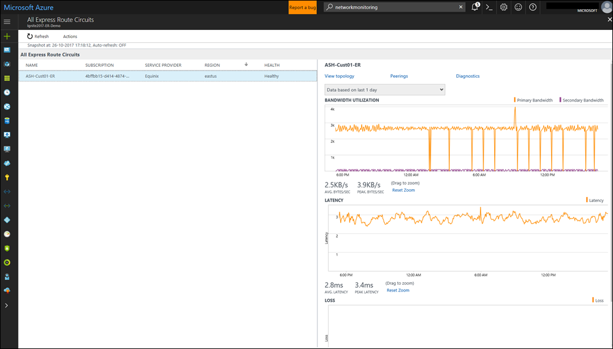
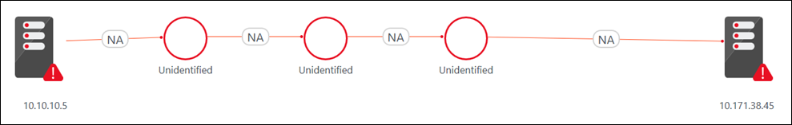
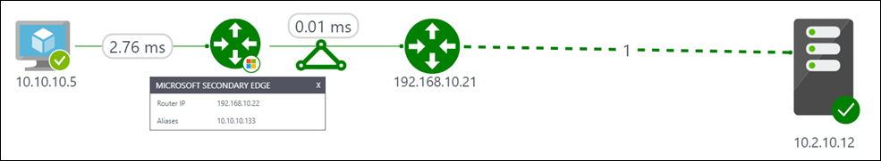

# ExpressRoute Monitor

You can use the Azure ExpressRoute Monitor capability in [Network Performance Monitor](log-analytics-network-performance-monitor.md) to monitor end-to-end connectivity and performance between your branch offices and Azure, over Azure ExpressRoute. Key advantages are: 

- Autodetection of ExpressRoute circuits associated with your subscription.
- Tracking of bandwidth utilization, loss and latency at the circuit, peering, and Azure Virtual Network level for ExpressRoute.
- Discovery of network topology of your ExpressRoute circuits.

## Configuration 
To open the configuration for Network Performance Monitor, open the [Network Performance Monitor solution](log-analytics-network-performance-monitor.md) and select **Configure**.

### Configure network security group rules 
For the servers in Azure that are used for monitoring via Network Performance Monitor, configure network security group (NSG) rules to allow TCP traffic on the port used by Network Performance Monitor for synthetic transactions. The default port is 8084. This configuration allows the Operations Management Suite agent installed on Azure VMs to communicate with an on-premises monitoring agent. 

For more information about NSGs, see [Network security groups](../virtual-network/manage-network-security-group.md). 

>[!NOTE]
> Before you continue with this step, install the on-premises server agent and the Azure server agent, and run the EnableRules.ps1 PowerShell script. 

 
### Discover ExpressRoute peering connections 
 
1. Select the **ExpressRoute Peerings** view.
2. Select **Discover Now** to discover all the ExpressRoute private peerings that are connected to the virtual networks in the Azure subscription linked with this Azure Log Analytics workspace.

    >[!NOTE]
    > The solution currently discovers only ExpressRoute private peerings. 

    >[!NOTE]
    > Only private peerings connected to the virtual networks associated with the subscription linked with this Log Analytics workspace are discovered. If ExpressRoute is connected to virtual networks outside of the subscription linked to this workspace, create a Log Analytics workspace in those subscriptions. Then use Network Performance Monitor to monitor those peerings. 

    
 
 After the discovery is complete, the discovered private peering connections are listed in a table. The monitoring for these peerings is initially in a disabled state. 

### Enable monitoring of the ExpressRoute peering connections 

1. Select the private peering connection you want to monitor.
2. In the pane on the right, select the **Monitor this Peering** check box. 
3. If you intend to create health events for this connection, select **Enable Health Monitoring for this peering**. 
4. Choose monitoring conditions. You can set custom thresholds for health event generation by entering threshold values. Whenever the value of the condition goes above its selected threshold for the peering connection, a health event is generated. 
5. Select **Add Agents** to choose the monitoring agents you intend to use for monitoring this peering connection. Make sure that you add agents on both ends of the connection. You need at least one agent in the virtual network connected to this peering. You also need at least one on-premises agent connected to this peering. 
6. Select **Save** to save the configuration. 

   

After you enable the rules and select values and agents, wait 30 to 60 minutes for the values to populate and the **ExpressRoute Monitoring** tiles to appear. When you see the monitoring tiles, your ExpressRoute circuits and connection resources are now monitored by Network Performance Monitor. 

>[!NOTE]
> This capability works reliably on workspaces that have upgraded to the new query language.

## Walkthrough 

The Network Performance Monitor dashboard shows an overview of the health of ExpressRoute circuits and peering connections. 

 

### Circuits list 

To see a list of all monitored ExpressRoute circuits, select the ExpressRoute circuits tile. You can select a circuit and view its health state, trend charts for packet loss, bandwidth utilization, and latency. The charts are interactive. You can select a custom time window for plotting the charts. Drag the mouse over an area on the chart to zoom in and see fine-grained data points. 

 

### Trends of loss, latency, and throughput 

The bandwidth utilization, latency, and loss charts are interactive. You can zoom in to any section of these charts by using mouse controls. You also can see the bandwidth, latency, and loss data for other intervals. In the upper left under the **Actions** button, select **Date/Time**. 

 

### Peerings list 

To bring up a list of all connections to virtual networks over private peering, select the **Private Peerings** tile on the dashboard. Here, you can select a virtual network connection and view its health state, trend charts for packet loss, bandwidth utilization, and latency. 

 

### Circuit topology 

To view circuit topology, select the **Topology** tile. This action takes you to the topology view of the selected circuit or peering. The topology diagram provides the latency for each segment on the network, and each layer 3 hop is represented by a node of the diagram. Selecting a hop reveals more details about the hop. To increase the level of visibility to include on-premises hops, move the slider bar under **FILTERS**. Moving the slider bar to the left or right increases or decreases the number of hops in the topology graph. The latency across each segment is visible, which allows for faster isolation of high-latency segments on your network. 

### Detailed topology view of a circuit 

This view shows virtual network connections. 

 

### Diagnostics 

Network Performance Monitor helps you diagnose several circuit connectivity issues. Some of the issues are listed here. 

**Circuit is down.** Network Performance Monitor notifies you as soon as the connectivity between your on-premises resources and Azure virtual networks is lost. This notification helps you take proactive action before you receive user escalations and reduce downtime.

 

**Traffic not flowing through intended circuit.** Network Performance Monitor notifies you whenever traffic isn't flowing through the intended ExpressRoute circuit. This issue can happen if the circuit is down and traffic is flowing through the backup route. It also can happen if there's a routing issue. This information helps you proactively manage any configuration issues in your routing policies and make sure that the most optimal and secure route is used. 

 

**Traffic not flowing through primary circuit.** Network Performance Monitor notifies you when traffic is flowing through the secondary ExpressRoute circuit. Even though you won't experience any connectivity issues in this case, proactively troubleshooting the issues with the primary circuit makes you better prepared. 

 

**Degradation due to peak utilization.** You can correlate the bandwidth utilization trend with the latency trend to identify whether the Azure workload degradation is due to a peak in bandwidth utilization or not. Then you can take action accordingly.

 

## Next steps
[Search logs](log-analytics-log-searches.md) to view detailed network performance data records.
