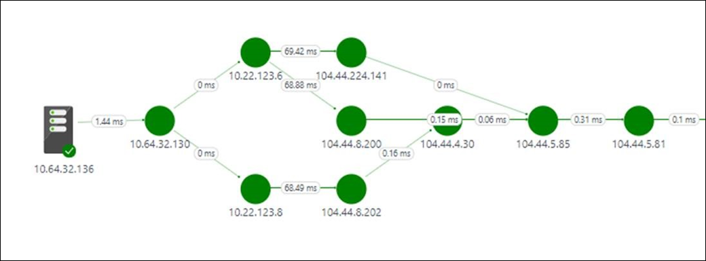
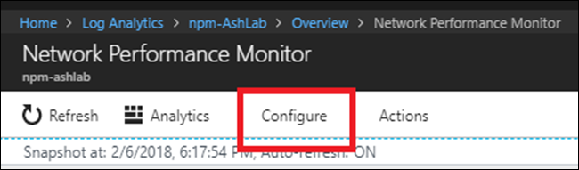
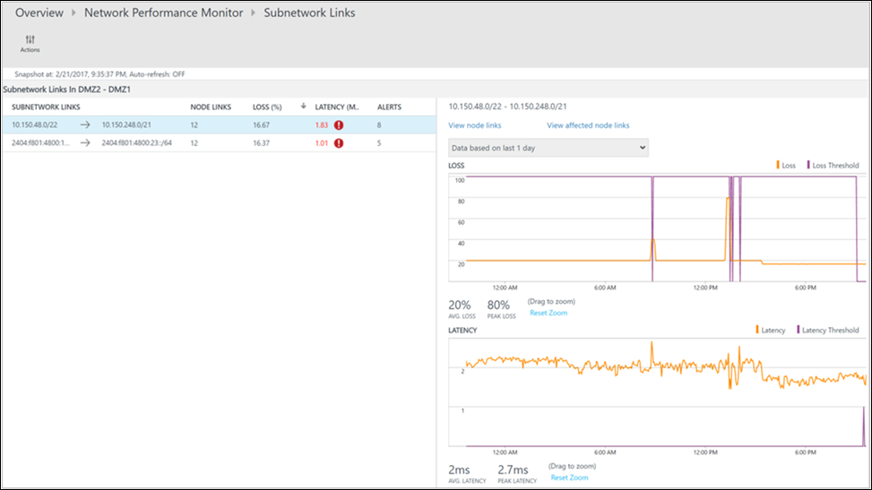
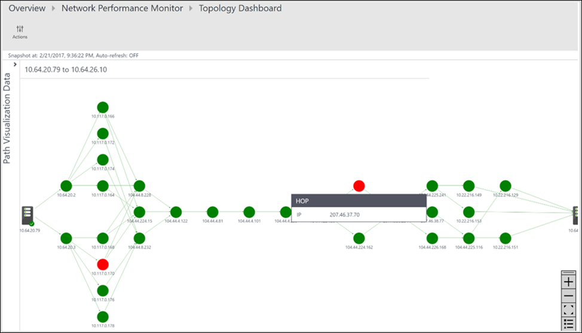

# Network Performance Monitor solution - Performance monitoring

The Performance Monitor capability in [Network Performance Monitor](log-analytics-network-performance-monitor.md) helps you monitor network connectivity across various points in your network, such as cloud deployments and on-premises locations, multiple data centers and branch offices, mission critical multi-tier applications/micro-services. With Performance Monitor, you can detect network issues before your users complain. Key advantages are: 

- Monitor loss and latency across various subnets and set alerts 
- Monitor all paths (including redundant paths) on the network 
- Troubleshoot transient & point-in-time network issues, which are difficult to replicate 
- Determine the specific segment on the network, which is responsible for degraded performance 
- Monitor the health of the network, without the need for SNMP 

## Configuration
To open the configuration for Network Performance Monitor, open the [Network Performance Monitor solution](log-analytics-network-performance-monitor.md) and click the **Configure** button.

### Create new networks

A Network in NPM is a logical container for subnets. It helps you organize the monitoring of your network infrastructure according to your monitoring needs. You can create a Network with a friendly name and add subnets to it according to your business logic. For example, you can create a network named London and add all the subnets in your London datacenter, or a network named *ContosoFrontEnd* and add all subnets serving the front end of your app named Contoso to this network. The solution automatically creates a Default network which contains all the subnets discovered in your environment. Whenever you create a network, you add a subnet to it and that subnet is removed from the Default network. If you delete a network, all its subnets are automatically returned to the Default network. Thus, the Default network acts as a container for all the subnets that are not contained in any user-defined network. You cannot edit or delete the Default network. It always remains in the system. However, you can create as many custom networks as you need. In most cases, the subnets in your organization are arranged in more than one network and you should create one or more networks to group your subnets for your business logic.

To create a new network:

1. Click on the **Networks tab**.
1. Click **Add network** and then type the network name and description. 
2. Select one or more subnets, and then click **Add**. 
3. Click **Save** to save the configuration. 

### Create monitoring rules 

Performance Monitor generates health events when the threshold of the performance of network connections between two subnetworks or between two networks is breached. These thresholds can be learned automatically by the system or you can provide custom thresholds. The system automatically creates a Default rule, which generates a health event whenever loss or latency between any pair of network/subnetwork links breaches the system-learned threshold. This helps the solution monitor your network infrastructure until you haven’t created any monitoring rules explicitly. If the **Default rule** is enabled, all the nodes send synthetic transactions to all the other nodes that you have enabled for monitoring. The default rule is useful with small networks, for example, in a scenario where you have a small number of servers running a microservice and you want to make sure that all the servers have connectivity to each other. 

>[!NOTE]
> It is highly recommended that you disable the **Default rule** and create custom monitoring rules, especially with large networks where you are using a large number of nodes for monitoring. This reduces the traffic generated by the solution and help you organize the monitoring of your network. 

Create monitoring rules according to your business logic. For example, if you want to monitor performance of the network connectivity of two office sites to headquarter, then group all the subnets in office site1 in network O1, all the subnets in office site2 in network O2 and all the subnets in the headquarter in network H. Create 2 monitoring rules-one between O1 and H and the other between O2 and H. 

To create custom monitoring rules:

1. Click **Add Rule** in the **Monitor** tab and enter the rule name and description. 
2. Select the pair of network or subnetwork links to monitor from the lists. 
3. First select the network in which the first subnetwork/s of interest is contained from the network dropdown, and then select the subnetwork/s from the corresponding subnetwork dropdown. Select **All subnetworks** if you want to monitor all the subnetworks in a network link. Similarly select the other subnetwork/s of interest. And, you can click **Add Exception** to exclude monitoring for particular subnetwork links from the selection you've made. 
4. Choose between ICMP and TCP protocols for executing synthetic transactions. 
5. If you don't want to create health events for the items you've selected, then clear **Enable health monitoring on the links covered by this rule**. 
6. Choose monitoring conditions. You can set custom thresholds for health event generation by typing threshold values. Whenever the value of the condition goes above its selected threshold for the selected network/subnetwork pair, a health event is generated. 
7. Click **Save** to save the configuration. 

After you save a monitoring rule, you can integrate that rule with Alert Management by clicking **Create Alert**. An alert rule is automatically created with the search query and other required parameters automatically filled-in. Using an alert rule, you can receive email-based alerts, in addition to the existing alerts within NPM. Alerts can also trigger remedial actions with runbooks or they can integrate with existing service management solutions using webhooks. You can click **Manage Alert** to edit the alert settings. 

You can now create more Performance Monitor rules or move to the solution dashboard to start using the capability 

### Choose the protocol

Network Performance Monitor (NPM) uses synthetic transactions to calculate network performance metrics like packet loss and link latency. To understand this better, consider an NPM agent connected to one end of a network link. This NPM agent sends probe packets to a second NPM agent connected to another end of the network. The second agent replies with response packets. This process is repeated a few times. By measuring the number of replies and time taken to receive each reply, the first NPM agent assesses link latency and packet drops. 

The format, size, and sequence of these packets is determined by the protocol that you choose when you create monitoring rules. Based on protocol of the packets, the intermediate network devices (routers, switches etc.) might process these packets differently. Consequently, your protocol choice affects the accuracy of the results. And, your protocol choice also determines whether you must take any manual steps after you deploy the NPM solution. 

NPM offers you the choice between ICMP and TCP protocols for executing synthetic transactions. If you choose ICMP when you create a synthetic transaction rule, the NPM agents use ICMP ECHO messages to calculate the network latency and packet loss. ICMP ECHO uses the same message that is sent by the conventional Ping utility. When you use TCP as the protocol, NPM agents send TCP SYN packet over the network. This is followed by a TCP handshake completion and then removing the connection using RST packets. 

Consider the following information before you choose a protocol to use: 

**Discovering multiple network routes.**  TCP is more accurate when discovering multiple routes and it needs fewer agents in each subnet. For example, one or two agents using TCP can discover all redundant paths between subnets. However, you need several agents using ICMP to achieve similar results. Using ICMP, if you have a number of routes between two subnets you need more than 5N agents in either a source or destination subnet. 

**Accuracy of results.** Routers and switches tend to assign lower priority to ICMP ECHO packets compared to TCP packets. In certain situations, when network devices are heavily loaded, the data obtained by TCP more closely reflects the loss and latency experienced by applications. This occurs because most of the application traffic flows over TCP. In such cases, ICMP provides less accurate results compared to TCP. 

**Firewall configuration.** TCP protocol requires that TCP packets are sent to a destination port. The default port used by NPM agents is 8084, however you can change this when you configure agents. So, you need to ensure that your network firewalls or NSG rules (in Azure) are allowing traffic on the port. You also need to make sure that the local firewall on the computers where agents are installed is configured to allow traffic on this port. You can use PowerShell scripts to configure firewall rules on your computers running Windows, however you need to configure your network firewall manually. In contrast, ICMP does not operate using port. In most enterprise scenarios, ICMP traffic is permitted through the firewalls to allow you to use network diagnostics tools like the Ping utility. So, if you can Ping one machine from another, then you can use the ICMP protocol without having to configure firewalls manually. 

>[!NOTE] 
> Some firewalls may block ICMP, which may lead to retransmission resulting in large number of events in your security information and event management system. Make sure the protocol that you choose is not blocked by a network firewall/NSG, otherwise NPM isn't able to monitor the network segment. Because of this, we recommended that you use TCP for monitoring. You should use ICMP in scenarios where you are not able to use TCP, such as when: 
>
> - You are using Windows client-based nodes, since TCP raw sockets are not allowed in Windows client
> - Your network firewall/NSG blocks TCP
> - How to switch the protocol 

If you chose to use ICMP during deployment, you can switch to TCP at any time by editing the default monitoring rule:

1. Navigate to **Network Performance** > **Monitor** > **Configure** > **Monitor** and then click **Default rule**. 
2. Scroll to the **Protocol** section and select the protocol that you want to use. 
3. Click **Save** to apply the setting. 

Even if the default rule is using a specific protocol, you can create new rules with a different protocol. You can even create a mix of rules where some of the rules use ICMP and another uses TCP. 

## Walkthrough 

Now that you've read about Performance Monitor, let's look at a simple investigation into the root cause for a health event.  

On the solution dashboard, you notice that there is a health event – a network link is unhealthy. You decide to investigate the issue and click on **Network links being monitored** tile.

On the drilldown page, you observe that the **DMZ2-DMZ1** network link is unhealthy. You click on the **View subnet links** link for this network link. 

The drill-down page shows all the subnetwork links in **DMZ2-DMZ1** network link. You notice that for both the subnetwork links, the latency has crossed the threshold making the network link unhealthy. You can also see the latency trends of both the subnetwork links. You can use the time selection control in the graph to focus on the required time range. You can see the time of the day when latency has reached its peak. You can later search the logs for this time period to investigate the issue. Click **View node links** to drill down further. 
 
  

Similar to the previous page, the drill-down page for the particular subnetwork link lists down its constituent node links. You can perform similar actions here as you did in the previous step. Click **View topology** to view the topology between the two nodes. 
 
  

All the paths between the two selected nodes are plotted in the topology map. You can visualize the hop-by-hop topology of routes between two nodes on the topology map. It gives you a clear picture of how many routes exist between the two nodes and what paths the data packets are taking. Network performance bottlenecks are marked in red color. You can locate a faulty network connection or a faulty network device by looking at red colored elements on the topology map. 

  

The loss, latency, and the number of hops in each path can be reviewed in the **Action** pane. Use the scrollbar to view the details of those unhealthy paths. Use the filters to select the paths with the unhealthy hop so that the topology for only the selected paths is plotted. You can use your mouse wheel to zoom in or out of the topology map. 

In the below image, you can clearly see the root-cause of the problem areas to the specific section of the network by looking at the paths and hops in red color. Clicking on a node in the topology map reveals the properties of the node, including the FQDN, and IP address. Clicking on a hop shows the IP address of the hop. 
 
 

## Next steps
* [Search logs](log-analytics-log-searches.md) to view detailed network performance data records.
