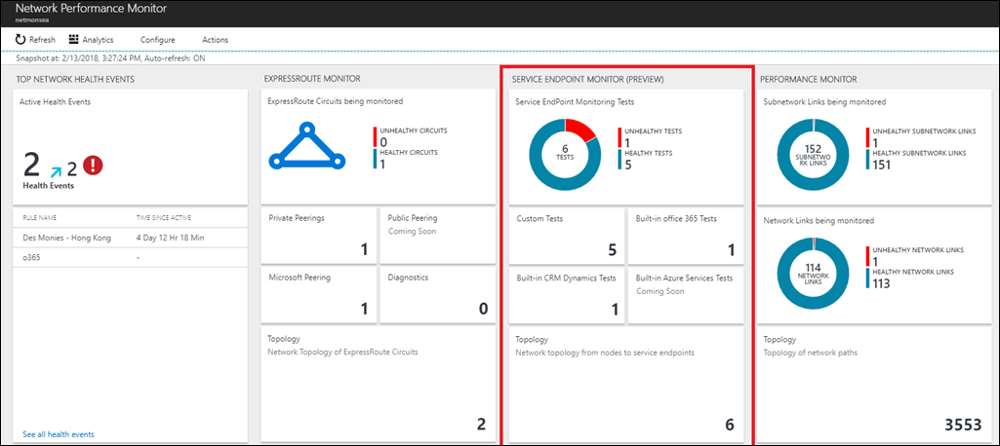
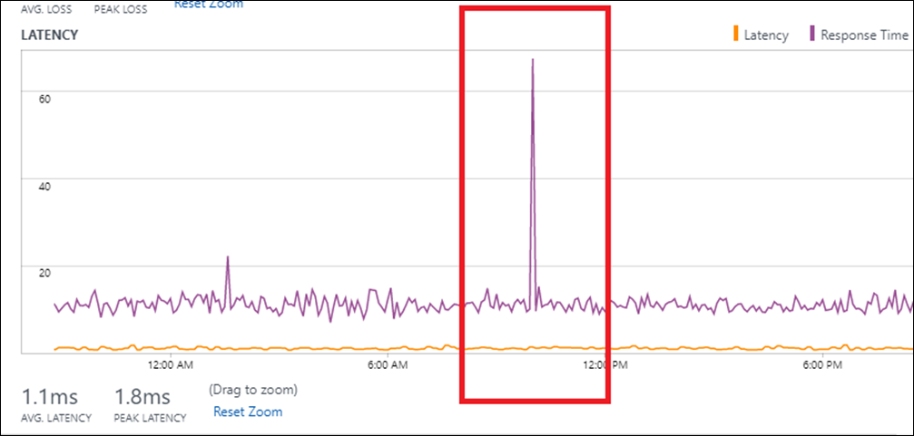
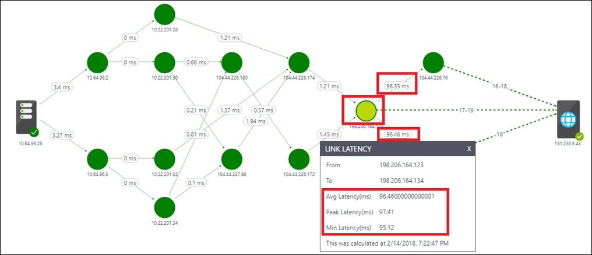

# Service Endpoint Monitor

The Service Endpoint Monitor capability in [Network Performance Monitor](log-analytics-network-performance-monitor.md) allows you to monitor network connectivity to any endpoint that has an open TCP port. Such endpoints include websites, SaaS applications, PaaS applications, and SQL databases. 

You can perform the following functions with **Service Endpoint Monitor**: 

- Monitor the network connectivity to your applications and network services (such as Office 365, Dynamics CRM, internal line of business applications, SQL database, etc) from multiple branch offices/locations 
- Built-in tests to monitor network connectivity to Office365 and Dynamics365 endpoints 
- Determine the response time, network latency, packet loss experienced when connecting to the endpoint 
- Determine whether poor application performance is because of the network or because of some issue at the application provider’s end 
- Identify hot spots on the network that may be causing poor application performance by viewing the latency contributed by each hop on a topology map. 


## Configuration 
To open the configuration for Network Performance Monitor, open the [Network Performance Monitor solution](log-analytics-network-performance-monitor.md) and click the **Configure** button.


### Configure OMS agents for the monitoring.  
Enable the following firewall rules on the nodes used for monitoring so that the solution can discover the topology from your nodes to the service endpoint: 

```
netsh advfirewall firewall add rule name="NPMDICMPV4Echo" protocol="icmpv4:8,any" dir=in action=allow 
netsh advfirewall firewall add rule name="NPMDICMPV6Echo" protocol="icmpv6:128,any" dir=in action=allow 
netsh advfirewall firewall add rule name="NPMDICMPV4DestinationUnreachable" protocol="icmpv4:3,any" dir=in action=allow 
netsh advfirewall firewall add rule name="NPMDICMPV6DestinationUnreachable" protocol="icmpv6:1,any" dir=in action=allow 
netsh advfirewall firewall add rule name="NPMDICMPV4TimeExceeded" protocol="icmpv4:11,any" dir=in action=allow 
netsh advfirewall firewall add rule name="NPMDICMPV6TimeExceeded" protocol="icmpv6:3,any" dir=in action 
```

### Create Service Endpoint Monitor tests 

Start creating your tests to monitor network connectivity to the service endpoints 

1. Click on the **Service Endpoint Monitor** tab.
2. Click **Add Test** and enter the Test name and description. 
3. Select the type of test:<br>Select **Web test** if you are monitoring connectivity to a service that responds to HTTP/S requests, such as outlook.office365.com, bing.com.<br>Select **Network test** if you are monitoring connectivity to a service that responds to TCP request but does not respond to HTTP/S request, such as a SQL server, FTP server, SSH port etc. 
4. If you do not wish to perform network measurements (network latency, packet loss, topology discovery), then uncheck the textbox. We recommend you keep it checked to get maximum benefit from the capability. 
5. Enter the target URL/FQDN/IP Address to which you want to monitor network connectivity.  
6. Enter the port number of the target service. 
7. Enter the frequency you want the test to run. 
8. Select the nodes from which you want to monitor the network connectivity to service. 

    >[!NOTE]
    > For Windows server-based nodes, the capability uses TCP-based requests to perform the network measurements. For Windows client-based nodes, the capability uses ICMP-based requests to perform the network measurements. In some cases, the target application blocks incoming ICMP-based request due to which when the nodes are Windows client-based, the solution is unable to perform network measurements. Therefore, it is recommended you use Windows server-based nodes in such cases. 

9. If you don't want to create health events for the items you've selected, then clear **Enable health monitoring on the targets covered by this test**. 
10. Choose monitoring conditions. You can set custom thresholds for health event generation by typing threshold values. Whenever the value of the condition goes above its selected threshold for the selected network/subnetwork pair, a health event is generated. 
11. Click **Save** to save the configuration. 

 


## Walkthrough 

Move to the Network Performance Monitoring dashboard view and observe the **Service Endpoint Monitor** page to get a summary of the health of the different tests you’ve created.  



Click on the tile to drill-down and view the details of the tests on the **Tests** page. On the LHS table, you can view the point-in-time health and value of the service response time, network latency, and packet loss for all the tests. You can use the Network State Recorder control to view the network snapshot at another time in past. Click on the test in the table which you want to investigate. You can view the historical trend of the loss, latency, and response time values from the charts in the RHS pane. Click on the Test Details link to view the performance from each node. 


On the **Test Nodes** view, you can observe the network connectivity from each node. Click on the node having performance degradation.  This is the node from where the application is observed to be running slow. 

Determine whether poor application performance is because of the network or because of some issue at the application provider’s end by observing the correlation between the response time of the application and the network latency- 

**Application issue:** If there is a spike in the response time, but the network latency is consistent, then this suggests that the network is working fine and the problem is due to an issue at the application end.  



**Network issue:** If a spike in response time is accompanied with a corresponding spike in the network latency, then this suggests that the increase in response time is due to an increase in network latency.  


Once you’ve determined that the problem is because of the network, you can click on the **Topology** view link to identify the troublesome hop on the Topology Map. For example, in the image below you can see that out of the 105 ms total latency between the node and the application endpoint, 96 ms is because of the hop marked in red. Once you’ve identified the troublesome hop, you can take corrective action.  



## Diagnostics 

If you observe an abnormality, then follow these steps:

If the service response time, network loss, and latency are shown as NA, then it can be because of one or more of the following reasons:
- The application is down.
- The node being used for checking network connectivity to the service is down.
- The target entered in the test configuration is incorrect.
- The node does not have any network connectivity.

If a valid service response time is shown but network loss as well as latency are shown as NA, then it can be because of one or more of the following reasons:
- If the node used for checking network connectivity to the service is Windows client machine, either the target service is blocking ICMP requests or a network firewall is blocking ICMP requests originating from the node.
- The checkbox for **Perform network measurements** has been unchecked in the test configuration. 

If the service response time is NA but network loss as well as latency are valid, then it suggests that the target service is not a web application. Edit the test configuration and choose the test type as Network test instead of Web test. 

If the application is running slow, you should determine whether poor application performance is because of the network or because of some issue at the application provider’s end.


## Next steps
* [Search logs](log-analytics-log-searches.md) to view detailed network performance data records.
