<properties
	pageTitle="Network Performance Monitor solution in Log Analytics | Microsoft Azure"
	description="Network Performance Monitor helps you monitor the performance of your networks-in near real-time-to detect and locate network performance bottlenecks."
	services="log-analytics"
	documentationCenter=""
	authors="bandersmsft"
	manager="jwhit"
	editor=""/>

<tags
	ms.service="log-analytics"
	ms.workload="na"
	ms.tgt_pltfrm="na"
	ms.devlang="na"
	ms.topic="article"
	ms.date="07/27/2016"
	ms.author="banders"/>

# Network Performance Monitor solution (preview) in Log Analytics

>[AZURE.NOTE] This is a [preview solution](log-analytics-add-solutions.md#log-analytics-preview-solutions-and-features).

This document describes how to set-up and use the Network Performance Monitor solution in Log Analytics, which helps you monitor the performance of your networks-in near real-time-to detect and locate network performance bottlenecks. With the Network Performance Monitor solution, you can monitor the loss and latency between two networks, subnets or servers. Network Performance Monitor detects network issues like traffic blackholing, routing errors, and issues that conventional network monitoring methods are not able to detect. Network Performance Monitor generates alerts and notifies as and when a threshold is breached for a network link. These thresholds can be learned automatically by the system or you can configure them to use custom alert rules. Network Performance Monitor ensures timely detection of network performance issues and localizes the source of the problem to a particular network segment or device.

You can detect network issues with the solution dashboard which displays summarized information about your network including recent network health events, unhealthy network links, and subnetwork links that are facing high packet loss and latency. You can drill-down into a network link to view the current health status of subnetwork links as well as node-to-node links. You can also view the historical trend of loss and latency at the network, subnetwork, and node-to-node level. You can detect transient network issues by viewing historical trend charts for packet loss and latency and locate network bottlenecks on a topology map. The interactive topology graph allows you to visualize the hop-by-hop network routes and determine the source of the problem. Like any other Log Analytics solutions, you can use Log Search for various analytics requirements to create custom reports based on the data collected by Network Performance Monitor.

The solution uses synthetic transactions as a primary mechanism to detect network faults. So, you can use it without regard for a specific network device's vendor or model. It works across on-premises, cloud (IaaS), and hybrid environments. The solution automatically discovers the network topology and various routes in your network.

Typical network monitoring products focus on monitoring the network device (routers, switches etc.) health but do not provide insights into the actual quality of network connectivity between two points, which Network Performance Monitor does.

## Using Network Performance Monitor standalone

If you want to monitor the quality of network connections between their critical workloads, networks, datacenters or office sites, then you can use the Network Performance Monitor solution by itself to monitor connectivity health between:

- multiple datacenters or office sites that are connected using a public or private network
- critical workloads that are running line of business applications
- public cloud services like Microsoft Azure or Amazon Web Services (AWS) and on-premises networks, if you have IaaS (VM) available and you have gateways configured to allow communication between on-premises networks and cloud networks
- Azure and on-premises networks when you use Express Route

## Using Network Performance Monitor with other networking tools

If you want to monitor a line of business application, you can use the Network Performance Monitor solution as a companion solution to other network tools. A slow network can lead to slow applications and Network Performance Monitor can help you investigate application performance issues that are caused by underlying networking issues. Because the solution does not require any access to network devices, the application administrator doesn't need to rely on a networking team to provide information about how the network is affecting applications.

Also, if you already invest in other network monitoring tools, then the solution can complement those tools because most traditional network monitoring solutions do not provide insights into end-to-end network performance metrics like loss and latency.  The Network Performance Monitor solution can help fill that gap.

## Preview status of the Network Performance Monitor solution

The Network Performance Monitor is in Public Preview. During public preview, the solution is available to all OMS subscribers in all regions supported by OMS. Although the solution is publicly available, the preview status of the solution means that there may be potential bugs or possible limitations in the solution in certain cases. If problems are found, we'll investigate them, triage them, and fix them as promised in our service level agreements.

## Installing and configuring agents for the Network Performance Monitor

Use the basic processes to install agents at [Connect Windows computers to Log Analytics](log-analytics-windows-agents.md) and [Connect Operations Manager to Log Analytics](log-analytics-om-agents.md).

>[AZURE.NOTE]
You'll need to install at least 2 agents in order to have enough data to discover and monitor your network resources. Otherwise, the solution will remain in a configuring state until you install and configure additional agents.

### Where to install the agents

Before you install agents, consider the topology of your network and what parts of the network you want to monitor. We recommend that you install more than one agent for each subnet that you want to monitor. In other words, for every subnet that you want to monitor, choose two or more servers or VMs and install the agent on them.

If you are unsure about the topology of your network, install the agents on servers with critical workloads where you want to monitor the network performance. For example, you might want to keep track of a network connection between a Web server and a server running SQL Server. In this example, you'd install an agent on both servers.

Agents monitor network connectivity (links) between hosts -- not the hosts themselves. So, to monitor a network link, you must install agents on both endpoints of that link.

### Configure agents

After you've installed agents, you'll need to open firewall ports for those computers to ensure that agents can communicate. You need to download and then run the [EnableRules.ps1 PowerShell script](https://gallery.technet.microsoft.com/OMS-Network-Performance-04a66634) without any parameters in a PowerShell window with administrative privileges

The script creates registry keys required by the Network Performance Monitor and it creates Windows firewall rules to allow agents to create TCP connections with each other. The registry keys created by the script also specify whether to log the debug logs and the path for the logs file. It also defines the agent TCP port used for communication. The values for these keys are automatically set by the script, so you should not manually change these keys.

The port opened by default is 8084. You can use a custom port by providing the parameter `portNumber` to the script. However, the same port should be used on all the computers where the script is run.

>[AZURE.NOTE] The EnableRules.ps1 script configures Windows firewall rules only on the computer where the script is run. If you have a network firewall, you should make sure that it allows traffic destined for the TCP port being used by Network Performance Monitor.

## Configuring the solution

Use the following information to install and configure the solution.

1. The Network Performance Monitor solution acquires data from computers running Windows Server 2008 SP 1 or later or Windows 7 SP1 or later, which are the same requirements as the Microsoft Monitoring Agent (MMA).
2. Add the Network Performance Monitor solution to your OMS workspace using the process described in [Add Log Analytics solutions from the Solutions Gallery](log-analytics-add-solutions.md).  
  
3. In the OMS portal, you'll see a new tile titled **Network Performance Monitor** with the message *Solution requires additional configuration*. You'll need to configure the solution to add networks based on subnetworks and nodes that are discovered by agents. Click **Network Performance Monitor** to start configuring the default network.  
  

### Configure the solution with a default network

On the configuration page, you'll see a single network named **Default**. When you haven't defined any networks, all the automatically-discovered subnets are placed in the Default network.

Whenever you create a network, you add a subnet to it and that subnet is removed from the Default network. If you delete a network, all its subnets are automatically returned to the Default network.

In other words, the Default network is the container for all the subnets that are not contained in any user-defined network. You cannot edit or delete the Default network. It always remains in the system. However, you can create as many networks as you need.

In most cases, the subnets in your organization will be arranged in more than one network and you should create one or more networks to logically group your subnets.

### Create new networks

A network in Network Performance Monitor is a container for subnets. You can create a network with any name that you want and add subnets to the network. For example, you can create a network named *Building1* and then add subnets, or you can create a network named *DMZ* and then add all subnets belonging to demilitarized zone to this network.

#### To create a new network

1. Click **Add network** and then type the network name and description.
2.  Select one or more subnets, and then click **Add**.
3. Click **Save** to save the configuration.  
  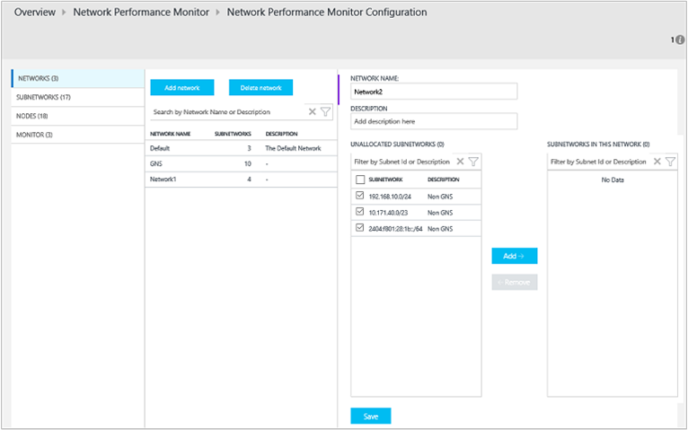

### Wait for data aggregation

After you've saved the configuration for first time, the solution starts collecting network packet loss and latency information between the nodes where agents are installed. This process can take a while, sometimes over 30 minutes. During this state, the Network Performance Monitor tile in the overview page displays a message stating *Data aggregation in process*.

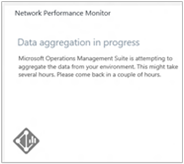

When the data has been uploaded, you'll see the Network Performance Monitor tile updated showing data.

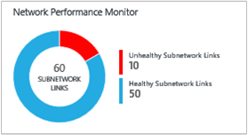

Click the tile to view the Network Performance Monitor dashboard.

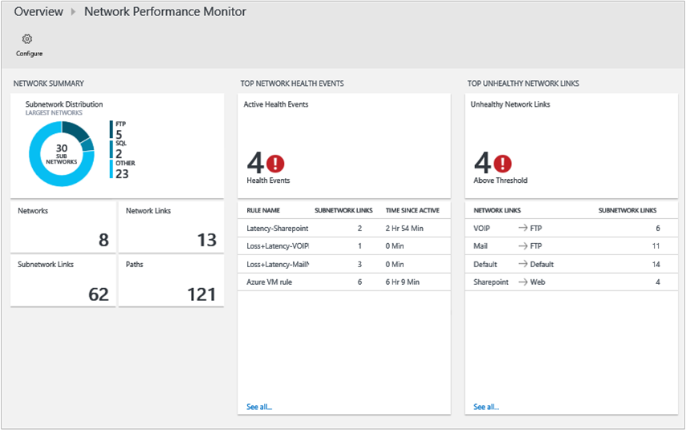

### Edit monitoring settings for subnets

All subnets where at least one agent was installed are listed on the **Subnetworks** tab in the configuration page.

#### To enable or disable monitoring for particular subnetworks

1. Select or clear the box next to the **subnetwork ID** and then ensure that **Use for Monitoring** is selected or cleared, as appropriate. You can select or clear multiple subnets. When disabled, subnetworks are not monitored as the agents will be updated to stop pinging other agents.
2. Choose the nodes that you want to monitor for a particular subnetwork by selecting the subnetwork from the list and moving the required nodes between the lists containing unmonitored and monitored nodes.
You can add a custom **description** to the subnetwork, if you like.
3. Click **Save** to save the configuration.  
  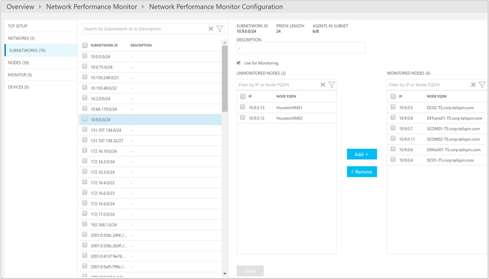

### Choose nodes to monitor

All the nodes that have an agent installed on them are listed in the **Nodes** tab.

#### To enable or disable monitoring for nodes

1. Select or clear the nodes that you want to monitor or stop monitoring.
2. Click **Use for Monitoring**, or clear it, as appropriate.
3. Click **Save**.  
  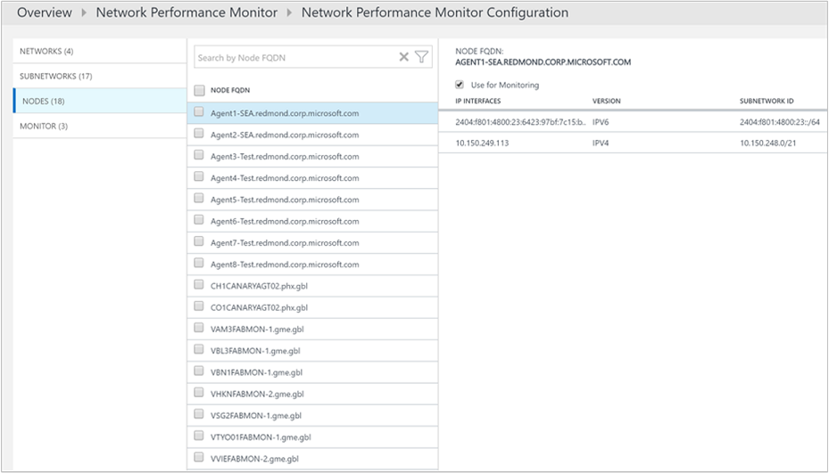

### Set monitoring rules

Network Performance Monitor generates health events about the connectivity between a pair of nodes or subnetwork or network links when a threshold is breached. These thresholds can be learned automatically by the system or you can configure them custom alert rules.

The *Default rule* is created by the system and it creates a health event whenever loss or latency between any pair of networks or subnetwork links breaches the system-learned threshold. You can choose to disable the default rule and create custom monitoring rules

#### To create custom monitoring rules

1. Click **Add Rule** the **Monitor** tab and enter the rule name and description.
2. Select the pair of network or subnetwork links to monitor from the lists.
3. First select the network in which the first subnetwork/s of interest is contained from the network dropdown, and then select the subnetwork/s from the corresponding subnetwork dropdown.
Select **All subnetworks** if you want to monitor all the subnetworks in a network link. Similarly select the other subnetwork/s of interest. And, you can click **Add Exception** to exclude monitoring for particular subnetwork links from the selection you've made.
4. If you don't want to create health events for the items you've selected, then clear **Enable health monitoring on the links covered by this rule**.
5. Choose monitoring conditions.
You can set custom thresholds for health event generation by typing threshold values. Whenever the value of the condition goes above its selected threshold for the selected network/subnetwork pair, a health event is generated.
6. Click **Save** to save the configuration.  
  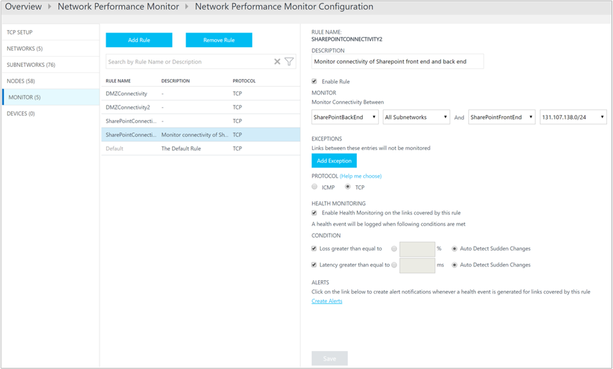

## Network Performance Monitor data collection details

Network Performance Monitor uses TCP SYN-SYNACK-ACK handshake packets to collect loss and latency information and traceroute is also used to get topology information.

The following table shows data collection methods and other details about how data is collected for Network Performance Monitor.

| platform | Direct Agent | SCOM agent | Azure Storage | SCOM required? | SCOM agent data sent via management group | collection frequency |
|---|---|---|---|---|---|---|
| Windows ||||            || TCP handshakes every 5 seconds, data sent every 3 minutes |

The solution makes use of synthetic transactions to assess the health of the network. OMS agents installed at various point in the network exchange TCP packets with one another and, in the process, learn the round trip time and packet loss, if any. Periodically, each agent also performs a trace route to other agents to find all of the various routes in the network that must be tested. Using this data, the agents are able to deduce the network latency and packet loss figures. The tests are repeated every five seconds and data is aggregated for a period of three minutes by the agents before uploading it to OMS.

>[AZURE.NOTE] Although agents communicate with each other frequently, they do not generate a lot of network traffic while conducting the tests. Agents rely only on TCP SYN-SYNACK-ACK handshake packets to determine the loss and latency -- no data packets are exchanged. During this process, agents communicate with each other only when needed and the agent communication topology is optimized to reduce network traffic.

## Using the Network Performance Monitor solution

This section explains all the dashboard functions and how to use them.

### Solution Overview tile

After you've enabled the Network Performance Monitor solution, the solution tile on the OMS Overview page provides a quick overview of the network health. It displays a doughnut chart showing the number of healthy and unhealthy subnetwork links. When you click the tile, it opens the solution dashboard.

### Network Performance Monitor solution dashboard

The **Network Summary** blade shows a summary of the networks along with their relative size. This is followed by tiles showing total number of network links, subnet links and paths in the system (a path consists of the IP addresses of two hosts with agents and all the hops between them).

The **Top Network Health Events** blade provides a list of most recent health events and alerts in the system and the time since the event has been active. A health event or alert is generated whenever the packet loss or latency of a network or subnetwork link exceeds a threshold.

The **Top Unhealthy Network Links** blade shows a list of unhealthy network links. These are the network links that have one or more adverse health event for them at the moment.

The **Top Subnetwork Links with Most Loss** and **Subnetwork Links with Most Latency** blades show the top subnetwork links by packet loss and top subnetwork links by latency respectively. High latency or some amount of packet loss might be expected on certain network links. Such links appear in the top ten lists but are not marked unhealthy.

The **Common Queries** blade contains a set of search queries that fetch raw network monitoring data directly. You can use these queries as a starting point for creating your own queries for customized reporting.

### Drill-down for depth

You can click various links on the solution dashboard to drill-down deeper into any area of interest. For example, when you see an alert or an unhealthy network link appear on the dashboard, you can click it to investigate further. You'll be taken to a page that lists all the subnetwork links for the particular network link. You will be able to see the loss, latency and health status of each subnetwork link and quickly find out what subnetwork links are causing the problem. You can then click **View node links** to see all the node links for the unhealthy subnet link. Then, you can see individual node-to-node links and find the unhealthy node links.

You can click **View topology** to view the hop-by-hop topology of the routes between the source and destination nodes and the unhealthy routes or hops are shown in red show that you can quickly identify the problem to a particular portion of the network.

#### Trend charts

At each level that you the drill-down, you'll can see the trend of loss and latency for a network link. Trend charts are also available for Subnetwork and Node links. You can change the time interval for the graph to plot by using the time control at the top of the chart.

Trend charts show you a historical perspective of the performance of a network link. Some network issues are transient in nature and would be hard to catch only by looking at the current state of the network. This is because issues can surface quickly and disappear before anyone notices, only to reappear at a later point in time. Such transient issues can also be difficult for application administrators because those issues often surface as unexplained increases in application response time, even when all application components appear to run smoothly.

You can easily detect those kinds of issues by looking at a trend chart where the issue will appear as a sudden spike in network latency or packet loss.

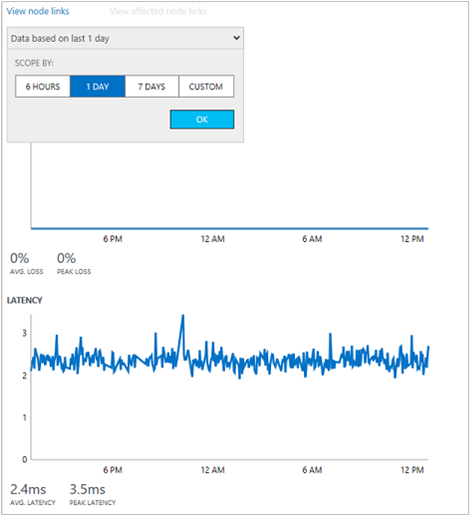

#### Hop-by-hop topology map

Network Performance Monitor shows you the hop-by-hop topology of routes between two nodes on an interactive topology map. You can view the topology map by selecting a node link and then clicking **View topology**. Also, you can view the topology map by clicking **Paths** tile on the dashboard. When you click **Paths** on the dashboard, you'll have to select the source and destination nodes from the left hand panel and then click **Plot** to plot the routes between the two nodes.

The topology map displays how many routes are between the two nodes and what paths the data packets take. Network performance bottlenecks are marked in red on the topology map. You can locate a faulty network connection or a faulty network device by looking at red colored elements on the topology map.

When you click a node or hover over it on the topology map, you'll see the properties of the node like FQDN and IP address. Click a hop to see it's IP address. You can highlight particular routes by clearing and then selecting only the routes that you want to highlight on the map. You can zoom in or out of the topology map by using your mouse wheel.

Note that the topology shown in the map is layer 3 topology and doesn't contain layer 2 devices and connections.

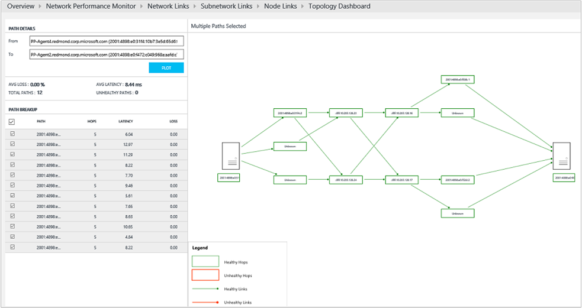

#### Fault localization

Network Performance Monitor is able to find the network bottlenecks without connecting to the network devices. Based on the data that it gathers from the network and by applying advanced algorithms on the network graph, Network Performance Monitor makes a probabilistic estimate of the parts of network that are most likely the source of the problem.

This approach is useful to determine the network bottlenecks when access to hops isn't available because it doesn't require any data to be gathered from the network devices such as routers or switches. This is also useful when the hops between two nodes are not in your administrative control. For example, the hops may be ISP routers.

### Log Analytics search

All data that is exposed graphically through the Network Performance Monitor dashboard and drill-down pages is also available natively in Log Analytics search. You can query the data using the search query language and create custom reports by exporting the data to Excel or PowerBI. The **Common Queries** blade in the dashboard has some useful queries that you can use as the starting point for creating your own queries and reports.

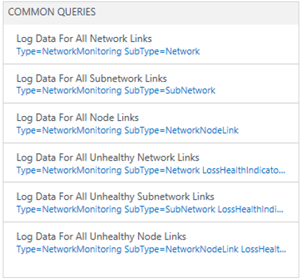

## Conduct a simple investigation for root-causing a health alert

Now that you've read about Network Performance Monitor, let's look at a simple investigation into the root-cause for a health event.

1. On the Overview page, you'll get a quick snapshot of the health of your network by observing the **Network Performance Monitor** tile. Notice that out of the 80 subnetworks links being monitored, 43 are unhealthy. This warrants investigation. Click the tile to view the solution dashboard.  
  

2. In the example image below, you'll notice that there are 4 health events currently and 4 network links which are unhealthy. You decide to investigate the issue and click on the **Sharepoint-Web** network link to find out the root of the problem.  
  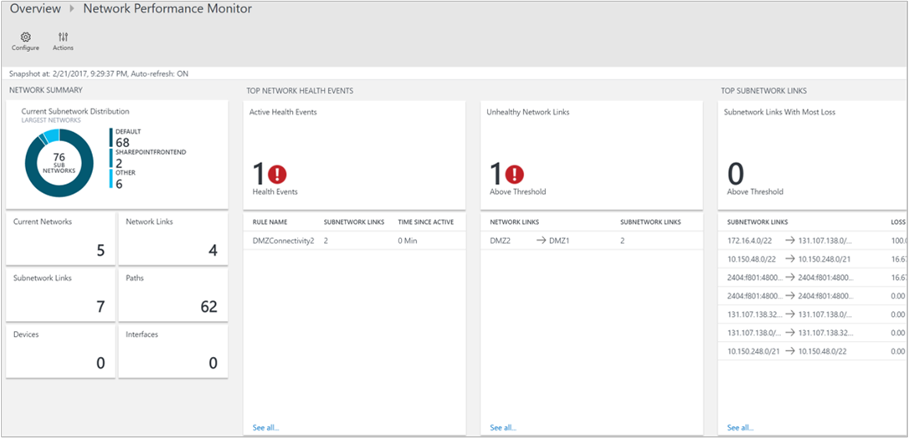

3. The drill-down page shows all the subnetwork links in **Sharepoint-Web** network link. You'll notice that for both the subnetwork links, the latency has crossed the threshold making the network link unhealthy. You can also see the latency trends of both the subnetwork links. You can use the time selection control in the graph to focus on the required time range. You can see the time of the day when latency has reached its peak. You can later search the logs for this time period to investigate the issue. Click **View node links** to drill-down further.  
  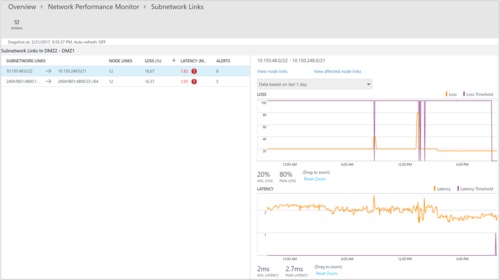

4.  Similar to the previous page, the drill-down page for the particular subnetwork link lists down its constituent node links. You can perform similar actions  here as you did in the previous step. Click **View topology** to view the topology between the 2 nodes.  
  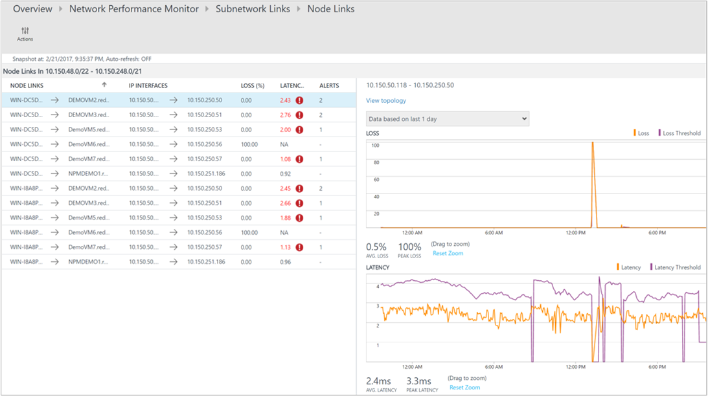

5. All the paths between the 2 selected nodes are plotted in the topology map. You can visualize the hop-by-hop topology of routes between two nodes on the topology map. It gives you a clear picture of how many routes exist between the two nodes and what paths the data packets are taking. Network performance bottlenecks are marked in red color. You can locate a faulty network connection or a faulty network device by looking at red colored elements on the topology map.  
  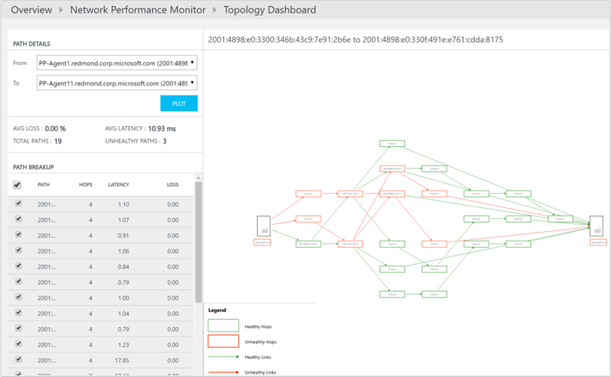

6. The loss, latency, and the number of hops in each path can be reviewed in the **Path Details** pane. In this example, you can see that there are 3 unhealthy paths as mentioned in the pane. Use the scrollbar to view the details of those unhealthy paths.  Use the checkboxes to select one of the paths so that the topology for only one path is plotted. You can use your mouse wheel to zoom in or out of the topology map.

  In the below image you can clearly see the root-cause of the problem areas to the specific section of the network by looking at the paths and hops in red color. Clicking on a node in the topology map reveals the properties of the node, including the FQDN, and IP address. Clicking on a hop shows the IP address of the hop.  
  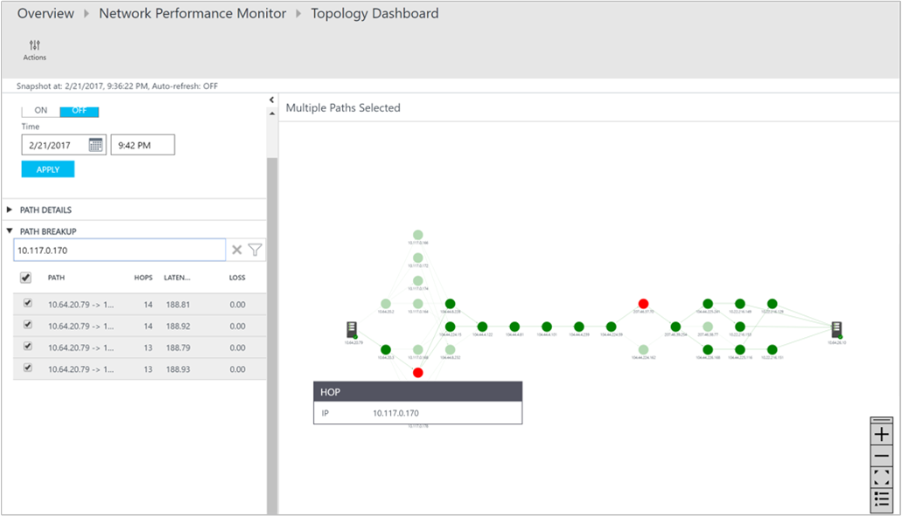

## Next steps

- [Search logs](log-analytics-log-searches.md) to view detailed network performance data records.
