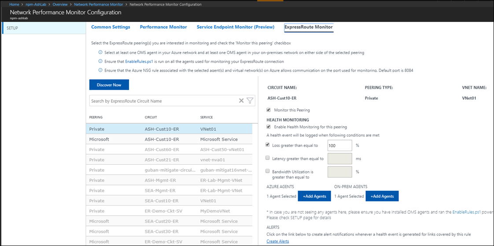
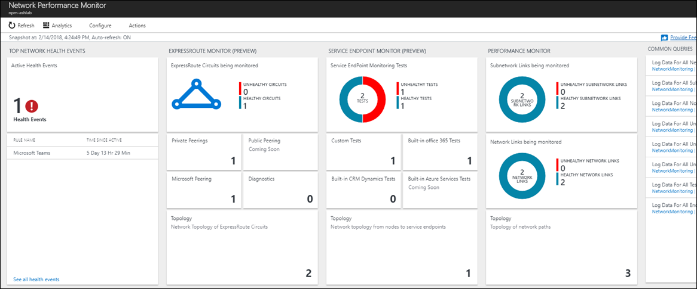
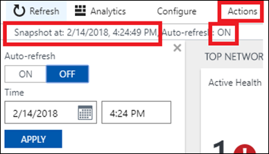
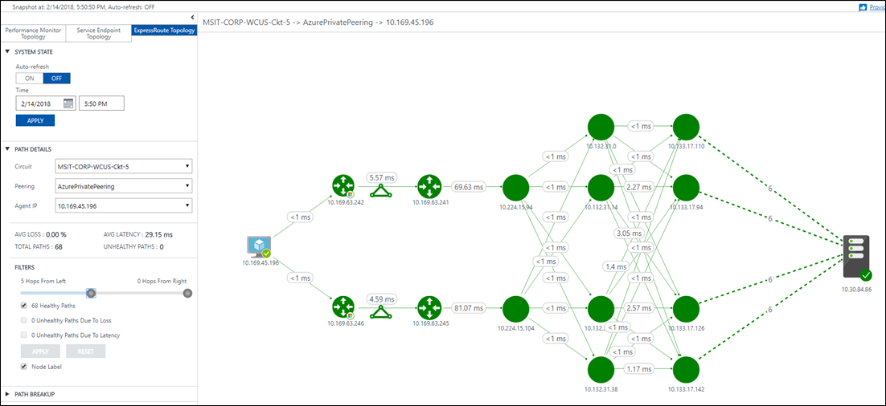

# Network Performance Monitor solution in Azure


Network Performance Monitor is a cloud-based hybrid network monitoring solution that helps you monitor network performance between various points in your network infrastructure. It also helps you monitor network connectivity to service and application endpoints and monitor the performance of Azure ExpressRoute. 

Network Performance Monitor detects network issues like traffic blackholing, routing errors, and issues that conventional network monitoring methods aren't able to detect. The solution generates alerts and notifies you when a threshold is breached for a network link. It also ensures timely detection of network performance issues and localizes the source of the problem to a particular network segment or device. 

Network Performance Monitor offers three broad capabilities: 

* [Performance Monitor](log-analytics-network-performance-monitor-performance-monitor.md): You can monitor network connectivity across cloud deployments and on-premises locations, multiple data centers, and branch offices and mission-critical multitier applications or microservices. With Performance Monitor, you can detect network issues before users complain.

* [Service Connectivity Monitor](log-analytics-network-performance-monitor-service-endpoint.md): You can monitor the connectivity from your users to the services you care about, determine what infrastructure is in the path, and identify where network bottlenecks occur. You can know about outages before your users, and see the exact location of the issues along your network path. 

    This capability helps you perform tests based on HTTP, HTTPS, TCP, and ICMP to monitor in near real time or historically the availability and response time of your service. You also can monitor the contribution of the network in packet loss and latency. With a network topology map, you can isolate network slowdowns. You can identify problem spots that occur along the network path from the node to the service, with latency data on each hop. With built-in tests, you can monitor network connectivity to Office 365 and Dynamics CRM without any preconfiguration. With this capability, you can monitor network connectivity to any TCP-capable endpoint, such as websites, SaaS applications, PaaS applications, and SQL databases.

* [ExpressRoute Monitor](log-analytics-network-performance-monitor-expressroute.md): Monitor end-to-end connectivity and performance between your branch offices and Azure, over Azure ExpressRoute.  

More information on the various capabilities supported by [Network Performance Monitor](https://docs.microsoft.com/azure/networking/network-monitoring-overview) is available online.
 
## Supported Regions
NPM can monitor connectivity between networks and applications in any part of the world, from a workspace that is hosted in one of the following regions:
* West Europe
* West Central US
* East US
* East Japan
* South East Asia
* South East Australia
* South UK
* US Government Virginia

The list of supported regions for ExpressRoute Monitor is available in the [documentation](https://docs.microsoft.com/azure/expressroute/how-to-npm?utm_swu=8117#regions).


## Set up and configure

### Install and configure agents 

Use the basic processes to install agents at [Connect Windows computers to Azure Log Analytics](log-analytics-windows-agents.md) and [Connect Operations Manager to Log Analytics](log-analytics-om-agents.md).

### Where to install the agents 

* **Performance Monitor**: Install Operations Management Suite agents on at least one node connected to each subnetwork from which you want to monitor network connectivity to other subnetworks.

    To monitor a network link, install agents on both endpoints of that link. If you're unsure about the topology of your network, install the agents on servers with critical workloads between which you want to monitor the network performance. For example, if you want to monitor the network connection between a web server and a server running SQL, install an agent on both servers. Agents monitor network connectivity (links) between hosts, not the hosts themselves. 

* **Service Connectivity Monitor**: Install an Operations Management Suite agent on each node from which you want to monitor the network connectivity to the service endpoint. An example is if you want to monitor network connectivity to Office 365 from your office sites labeled O1, O2, and O3. Install the Operations Management Suite agent on at least one node each in O1, O2, and O3. 

* **ExpressRoute Monitor**: Install at least one Operations Management Suite agent in your Azure virtual network. Also install at least one agent in your on-premises subnetwork, which is connected through ExpressRoute private peering.  

### Configure Operations Management Suite agents for monitoring 

Network Performance Monitor uses synthetic transactions to monitor network performance between source and destination agents. You can choose between TCP and ICMP as the protocol for monitoring in Performance Monitor and Service Connectivity Monitor capabilities. Only TCP is available as the monitoring protocol for ExpressRoute Monitor. Make sure that the firewall allows communication between the Operations Management Suite agents used for monitoring on the protocol you choose. 

* **TCP protocol**: If you choose TCP as the protocol for monitoring, open the firewall port on the agents used for Network Performance Monitor and ExpressRoute Monitor to make sure that the agents can connect to each other. To open the port, run the [EnableRules.ps1](https://aka.ms/npmpowershellscript) PowerShell script without any parameters in a PowerShell window with administrative privileges.

    The script creates registry keys required by the solution. It also creates Windows Firewall rules to allow agents to create TCP connections with each other. The registry keys created by the script specify whether to log the debug logs and the path for the logs file. The script also defines the agent TCP port used for communication. The values for these keys are automatically set by the script. Don't manually change these keys. The port opened by default is 8084. You can use a custom port by providing the parameter portNumber to the script. Use the same port on all the computers where the script is run. 

    >[!NOTE]
    > The script configures only Windows Firewall locally. If you have a network firewall, make sure that it allows traffic destined for the TCP port used by Network Performance Monitor.

    >[!NOTE]
    > You don't need to run the [EnableRules.ps1](https://aka.ms/npmpowershellscript ) PowerShell script for Service Endpoint Monitor.

    

* **ICMP protocol**: If you choose ICMP as the protocol for monitoring, enable the following firewall rules to reliably utilize ICMP:
    
   ```
   netsh advfirewall firewall add rule name="NPMDICMPV4Echo" protocol="icmpv4:8,any" dir=in action=allow 
   netsh advfirewall firewall add rule name="NPMDICMPV6Echo" protocol="icmpv6:128,any" dir=in action=allow 
   netsh advfirewall firewall add rule name="NPMDICMPV4DestinationUnreachable" protocol="icmpv4:3,any" dir=in action=allow 
   netsh advfirewall firewall add rule name="NPMDICMPV6DestinationUnreachable" protocol="icmpv6:1,any" dir=in action=allow 
   netsh advfirewall firewall add rule name="NPMDICMPV4TimeExceeded" protocol="icmpv4:11,any" dir=in action=allow 
   netsh advfirewall firewall add rule name="NPMDICMPV6TimeExceeded" protocol="icmpv6:3,any" dir=in action=allow 
   ```
 

### Configure the solution 

1. Add the Network Performance Monitor solution to your workspace from the [Azure marketplace](https://azuremarketplace.microsoft.com/marketplace/apps/Microsoft.NetworkMonitoringOMS?tab=Overview). You also can use the process described in [Add Log Analytics solutions from the Solutions Gallery](log-analytics-add-solutions.md). 
2. Open your Log Analytics workspace, and select the **Overview** tile. 
3. Select the **Network Performance Monitor** tile with the message *Solution requires additional configuration*.

   

4. On the **Setup** page, you see the option to install Operations Management Suite agents and configure the agents for monitoring in the **Common Settings** view. As previously explained, if you installed and configured Operations Management Suite agents, select the **Setup** view to configure the capability you want to use. 

   **Performance Monitor**: Choose the protocol to use for synthetic transactions in the **Default** Performance Monitor rule, and select **Save & Continue**. This protocol selection only holds for the system-generated default rule. You need to choose the protocol each time you create a Performance Monitor rule explicitly. You can always move to the **Default** rule settings on the **Performance Monitor** tab (it appears after you complete your day-0 configuration) and change the protocol later. If you don't want the rPerfomance Monitor capability, you can disable the default rule from the **Default** rule settings on the **Performance Monitor** tab.

   
    
   **Service Connectivity Monitor**: The capability provides built-in preconfigured tests to monitor network connectivity to Office 365 and Dynamics 365 from your agents. Choose the Office 365 and Dynamics 365 services that you want to monitor by selecting the check boxes beside them. To choose the agents from which you want to monitor, select **Add Agents**. If you don't want to use this capability or want to set it up later, don't choose anything and select **Save & Continue**.

   

   **ExpressRoute Monitor**: Select **Discover Now** to discover all the ExpressRoute private peerings that are connected to the virtual networks in the Azure subscription linked with this Log Analytics workspace. 

   >[!NOTE] 
   > The solution currently discovers only ExpressRoute private peerings. 

   >[!NOTE] 
   > Only private peerings that are connected to the virtual networks associated with the subscription linked with this Log Analytics workspace are discovered. If ExpressRoute is connected to virtual networks outside of the subscription linked to this workspace, create a Log Analytics workspace in those subscriptions. Use Network Performance Monitor to monitor those peerings.

   

   After the discovery is finished, the discovered private peerings are listed in a table. 

   
    
The monitoring for these peerings is initially in a disabled state. Select each peering that you want to monitor, and configure monitoring for them from the details view on the right. Select **Save** to save the configuration. To learn more, see the "Configure ExpressRoute monitoring" article. 

After the setup is finished, it takes 30 minutes to an hour for the data to populate. While the solution aggregates data from your network, you see the message *Solution requires additional configuration* on the Network Performance Monitor **Overview** tile. After the data is collected and indexed, the **Overview** tile changes and informs you of your network health in a summary. You then can edit the monitoring of the nodes on which Operations Management Suite agents are installed, as well as the subnets discovered from your environment.

#### Edit monitoring settings for subnets and nodes 

All subnets with at least one agent installed are listed on the **Subnetworks** tab on the configuration page. 


To enable or disable monitoring of particular subnetworks:

1. Select or clear the check box next to the **subnetwork ID**. Then make sure that **Use for Monitoring** is selected or cleared, as appropriate. You can select or clear multiple subnets. When disabled, subnetworks aren't monitored, and the agents are updated to stop pinging other agents. 
2. Choose the nodes that you want to monitor in a particular subnetwork. Select the subnetwork from the list, and move the required nodes between the lists that contain unmonitored and monitored nodes. You can add a custom description to the subnetwork.
3. Select **Save** to save the configuration. 

#### Choose nodes to monitor

All the nodes that have an agent installed on them are listed on the **Nodes** tab. 

1. Select or clear the nodes that you want to monitor or stop monitoring. 
2. Select **Use for Monitoring**, or clear it, as appropriate. 
3. Select **Save**. 


Configure the capabilities you want:

- [Performance Monitor](log-analytics-network-performance-monitor-performance-monitor.md#configuration)
- [Service Endpoint Monitor](log-analytics-network-performance-monitor-performance-monitor.md#configuration)
- [ExpressRoute Monitor](log-analytics-network-performance-monitor-expressroute.md#configuration)

 

## Data collection details
To collect loss and latency information, Network Performance Monitor uses TCP SYN-SYNACK-ACK handshake packets when you choose TCP as the protocol. Network Performance Monitor uses ICMP ECHO ICMP ECHO REPLY when you choose ICMP as the protocol. Trace route is also used to get topology information.

The following table shows data collection methods and other details about how data is collected for Network Performance Monitor.

| Platform | Direct agent | System Center Operations Manager agent | Azure Storage | Operations Manager required? | Operations Manager agent data sent via management group | Collection frequency |
| --- | --- | --- | --- | --- | --- | --- |
| Windows | &#8226; | &#8226; |  |  |  |TCP handshakes/ICMP ECHO messages every 5 seconds, data sent every 3 minutes |
 

 
The solution uses synthetic transactions to assess the health of the network. Operations Management Suite agents installed at various points in the network exchange TCP packets or ICMP Echo with one another. Whether the agents use TCP packets or ICMP Echo depends on the protocol you selected for monitoring. In the process, agents learn the round-trip time and packet loss, if any. Periodically, each agent also performs a trace route to other agents to find all the various routes in the network that must be tested. Using this data, the agents can deduce the network latency and packet loss figures. The tests are repeated every five seconds. Data is aggregated for about three minutes by the agents before it's uploaded to the Log Analytics service.


>[!NOTE]
> Although agents communicate with each other frequently, they don't generate significant network traffic while conducting the tests. Agents rely only on TCP SYN-SYNACK-ACK handshake packets to determine the loss and latency. No data packets are exchanged. During this process, agents communicate with each other only when needed. The agent communication topology is optimized to reduce network traffic.

## Use the solution 

### Network Performance Monitor Overview tile 

After you enable the Network Performance Monitor solution, the solution tile on the **Overview** page provides a quick overview of the network health. 

 

### Network Performance Monitor dashboard 

* **Top Network Health Events**: This page provides a list of the most recent health events and alerts in the system and the time since the events have been active. A health event or alert is generated whenever the value of the chosen metric (loss, latency, response time, or bandwidth utilization) for the monitoring rule exceeds the threshold. 

* **ExpressRoute Monitor**: This page provides health summaries for the various ExpressRoute peering connections the solution monitors. The **Topology** tile shows the number of network paths through the ExpressRoute circuits that are monitored in your network. Select this tile to go to the **Topology** view.

* **Service Connectivity Monitor**: This page provides health summaries for the different tests you created. The **Topology** tile shows the number of endpoints that are monitored. Select this tile to go to the **Topology** view.

* **Performance Monitor**: This page provides health summaries for the **Network** links and **Subnetwork** links that the solution monitors. The **Topology** tile shows the number of network paths that are monitored in your network. Select this tile to go to the **Topology** view. 

* **Common Queries**: This page contains a set of search queries that fetch raw network monitoring data directly. You can use these queries as a starting point to create your own queries for customized reporting. 

   

 

### Drill down for depth 

You can select various links on the solution dashboard to drill down deeper into any area of interest. For example, when you see an alert or an unhealthy network link appear on the dashboard, select it to investigate further. A page lists all the subnetwork links for the particular network link. You can see the loss, latency, and health status of each subnetwork link. You can quickly find out which subnetwork link causes problems. Select **View node links** to see all the node links for the unhealthy subnet link. Then, you can see individual node-to-node links and find the unhealthy node links. 

Select **View topology** to view the hop-by-hop topology of the routes between the source and destination nodes. The unhealthy routes appear in red. You can view the latency contributed by each hop so that you can quickly identify the problem to a particular portion of the network.

 

### Network State Recorder control

Each view displays a snapshot of your network health at a particular point in time. By default, the most recent state is shown. The bar at the top of the page shows the point in time for which the state is displayed. To view a snapshot of your network health at a previous time, select **Actions**. You also can enable or disable auto-refresh for any page while you view the latest state. 

 

 

### Trend charts 

At each level that you drill down, you can see the trend of the applicable metric. It can be loss, latency, response time, or bandwidth utilization. To change the time interval for the trend, use the time control at the top of the chart. 

Trend charts show you a historical perspective of the performance of a performance metric. Some network issues are transient in nature and are hard to catch by looking at only the current state of the network. Issues can surface quickly and disappear before anyone notices, only to reappear at a later point in time. Such transient issues also can be difficult for application administrators. The issues often show up as unexplained increases in application response time, even when all application components appear to run smoothly. 

You can easily detect these kinds of issues by looking at a trend chart. The issue appears as a sudden spike in network latency or packet loss. To investigate the issue, use the Network State Recorder control to view the network snapshot and topology for that point in time when the issue occurred.

 

 

### Topology map 

Network Performance Monitor shows you the hop-by-hop topology of routes between the source and destination endpoint on an interactive topology map. To view the topology map, select the **Topology** tile on the solution dashboard. You also can select the **View topology** link on the drill-down pages. 

The topology map displays how many routes are between the source and destination and what paths the data packets take. The latency contributed by each network hop is also visible. All the paths for which the total path latency is above the threshold (set in the corresponding monitoring rule) are shown in red. 

When you select a node or hover over it on the topology map, you see the node properties, such as FQDN and IP address. Select a hop to see its IP address. You can identify the troublesome network hop by noticing the latency it contributes. To filter particular routes, use the filters in the collapsible action pane. To simplify the network topologies, hide the intermediate hops by using the slider in the action pane. You can zoom in or zoom out of the topology map by using your mouse wheel. 

The topology shown in the map is layer 3 topology and doesn't contain layer 2 devices and connections. 

 

 

## Log Analytics search 

All data that is exposed graphically through the Network Performance Monitor dashboard and drill-down pages is also available natively in [Log Analytics search](log-analytics-log-search-new.md). You can perform interactive analysis of data in the repository and correlate data from different sources. You also can create custom alerts and views and export the data to Excel, Power BI, or a shareable link. The **Common Queries** area in the dashboard has some useful queries that you can use as the starting point to create your own queries and reports. 

## Alerts

Network Performance Monitor uses the alerting capabilities of [Azure Monitor](https://docs.microsoft.com/azure/monitoring-and-diagnostics/monitoring-overview-unified-alerts).

This means that all notifications are managed using [action groups](https://docs.microsoft.com/azure/monitoring-and-diagnostics/monitoring-action-groups#overview).  

If you are an NPM user creating an alert via OMS: 
1. You will see a link that will redirect you to Azure Portal. Click it to access the portal.
2. Click the Network Performance Monitor solution tile. 
3. Navigate to Configure.  
4. Select the test you want to create an alert on and follow the below mentioned steps.

If you are an NPM user creating an alert via Azure Portal:  
1. You can choose to enter your email directly or you can choose to create alerts via action groups.
2. If you choose to enter your email directly, an action group with the name **NPM Email ActionGroup** is created and the email id is added to that action group.
3. If you choose to use action groups, you will have to select an previously created action group. You can learn how to create an action group [here.](https://docs.microsoft.com/azure/monitoring-and-diagnostics/monitoring-action-groups#create-an-action-group-by-using-the-azure-portal) 
4. Once the alert is successfully created, you can use Manage Alerts link to manage your alerts. 

Each time you create an alert, NPM creates a query based log alert rule in Azure Monitor. 
This query is triggerred every 5 mins by default. Azure monitor does not charge for the first 250 log alert rules created, and any alert rules above the 250 log alert rules limit will be billed as per [Alerts pricing in Azure Monitor pricing page](https://azure.microsoft.com/en-us/pricing/details/monitor/).
Notifications are charged separately as per [Notifications pricing in Azure Monitor pricig page](https://azure.microsoft.com/en-us/pricing/details/monitor/).


## Pricing

Information on pricing is available [online](log-analytics-network-performance-monitor-pricing-faq.md).

## Provide feedback 

* **UserVoice:** You can post your ideas for Network Performance Monitor features that you want us to work on. Visit the [UserVoice page](https://feedback.azure.com/forums/267889-log-analytics/category/188146-network-monitoring). 

* **Join our cohort:** We're always interested in having new customers join our cohort. As part of it, you get early access to new features and an opportunity to help us improve Network Performance Monitor. If you're interested in joining, fill out this [quick survey](https://aka.ms/npmcohort). 

## Next steps 
Learn more about [Performance Monitor](log-analytics-network-performance-monitor-performance-monitor.md), [Service Connectivity Monitor](log-analytics-network-performance-monitor-performance-monitor.md), and [ExpressRoute Monitor](log-analytics-network-performance-monitor-expressroute.md). 
