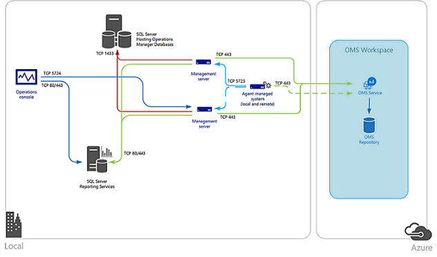
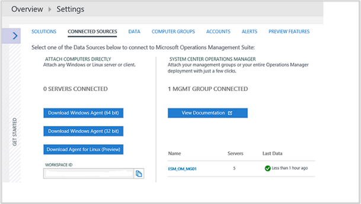

# Connect Operations Manager to Log Analytics
To maintain your existing investment in System Center Operations Manager and use extended capabilities with Log Analytics, you can integrate Operations Manager with your OMS workspace.  This allows you leverage the opportunities of OMS while continuing to use Operations Manager to:

* Continue monitoring the health of your IT services with Operations Manager
* Maintain integration with your ITSM solutions supporting incident and problem management
* Manage the lifecycle of agents deployed to on-premises and public cloud IaaS virtual machines that you monitor with Operations Manager

Integrating with System Center Operations Manager adds value to your service operations strategy by using the speed and efficiency of OMS in collecting, storing, and analyzing data from Operations Manager.  OMS helps correlate and work towards identifying the faults of problems and surfacing recurrences in support of your existing problem management process.   The flexibility of the search engine to examine performance, event and alert data, with rich dashboards and reporting capabilities to expose this data in meaningful ways, demonstrates the strength OMS brings in complimenting Operations Manager.

The agents reporting to the Operations Manager management group collect data from your servers based on the Log Analytics data sources and solutions you have enabled in your OMS subscription.  Depending on the solution you have enabled, data from these solutions are either sent directly from an Operations Manager management server to the OMS web service, or because of the volume of data collected on the agent-managed system, are sent directly from the agent to OMS web service. The management server forwards the OMS data directly to the OMS web service; it is never written to the OperationsManager or OperationsManagerDW database.  When a management server loses connectivity with the OMS web service, it caches the data locally until communication is re-established with OMS.  If the management server is offline due to planned maintenance or unplanned outage, another management server in the management group resumes connectivity with OMS.  

The following diagram depicts the connection between the management servers and agents in a System Center Operations Manager management group and OMS, including the direction and ports.   



If your IT security policies do not allow computers on your network to connect to the Internet, management servers can be configured to connect to the OMS Gateway to receive configuration information and send collected data depending on the solution you have enabled.  For more information and steps on how to configure your Operations Manager management group to communicate through an OMS Gateway to the OMS service, see [Connect computers to OMS using the OMS Gateway](log-analytics-oms-gateway.md).  

## System requirements
Before starting, review the following details to verify you meet prerequisites.

* OMS only supports Operations Manager 2016, Operations Manager 2012 SP1 UR6 and greater, and Operations Manager 2012 R2 UR2 and greater.  Proxy support was added in Operations Manager 2012 SP1 UR7 and Operations Manager 2012 R2 UR3.
* All Operations Manager agents must meet minimum support requirements. Ensure that agents are at the minimum update, otherwise Windows agent traffic may fail and many errors might fill the Operations Manager event log.
* An OMS subscription.  For further information, review [Get started with Log Analytics](log-analytics-get-started.md).

### Network
The information below list the proxy and firewall configuration information required for the Operations Manager agent, management servers, and Operations console to communicate with OMS.  Traffic from each component is outbound from your network to the OMS service.     

|Resource | Port number| Bypass HTTP Inspection|  
|---------|------|-----------------------|  
|**Agent**|||  
|\*.ods.opinsights.azure.com| 443 |Yes|  
|\*.oms.opinsights.azure.com| 443|Yes|  
|\*.blob.core.windows.net| 443|Yes|  
|\*.azure-automation.net| 443|Yes|  
|**Management server**|||  
|\*.service.opinsights.azure.com| 443||  
|\*.blob.core.windows.net| 443| Yes|  
|\*.ods.opinsights.azure.com| 443| Yes|  
|*.azure-automation.net | 443| Yes|  
|**Operations Manager console to OMS**|||  
|service.systemcenteradvisor.com| 443||  
|\*.service.opinsights.azure.com| 443||  
|\*.live.com| 80 and 443||  
|\*.microsoft.com| 80 and 443||  
|\*.microsoftonline.com| 80 and 443||  
|\*.mms.microsoft.com| 80 and 443||  
|login.windows.net| 80 and 443||  


## Connecting Operations Manager to OMS
Perform the following series of steps to configure your Operations Manager management group to connect to one of your OMS workspaces.

1. In the Operations Manager console, select the **Administration** workspace.
2. Expand the Operations Management Suite node and click **Connection**.
3. Click the **Register to Operations Management Suite** link.
4. On the **Operations Management Suite Onboarding Wizard: Authentication** page, enter the email address or phone number and password of the administrator account that is associated with your OMS subscription, and click **Sign in**.
5. After you are successfully authenticated, on the **Operations Management Suite Onboarding Wizard: Select Workspace** page, you are prompted to select your OMS workspace.  If you have more than one workspace, select the workspace you want to register with the Operations Manager management group from the drop-down list, and then click **Next**.
   
   > [!NOTE]
   > Operations Manager only supports one OMS workspace at a time. The connection and the computers that were registered to OMS with the previous workspace are removed from OMS.
   > 
   > 
6. On the **Operations Management Suite Onboarding Wizard: Summary** page, confirm your settings and if they are correct, click **Create**.
7. On the **Operations Management Suite Onboarding Wizard: Finish** page, click **Close**.

### Add agent-managed computers
After configuring integration with your OMS workspace, this only establishes a connection with OMS, no data is collected from the agents reporting to your management group. This won’t happen until after you configure which specific agent-managed computers collects data for Log Analytics. You can either select the computer objects individually or you can select a group that contains Windows computer objects. You cannot select a group that  contains instances of another class, such as logical disks or SQL databases.

1. Open the Operations Manager console and select the **Administration** workspace.
2. Expand the Operations Management Suite node and click **Connection**.
3. Click the **Add a Computer/Group** link under the Actions heading on the right-side of the pane.
4. In the **Computer Search** dialog box, you can search for computers or groups monitored by Operations Manager. Select computers or groups to onboard to OMS, click **Add**, and then click **OK**.

You can view computers and groups configured to collect data from the Managed Computers node under Operations Management Suite in the **Administration** workspace of the Operations console.  From here, you can add or remove computers and groups as necessary.

### Configure OMS proxy settings in the Operations console
Perform the following steps if an internal proxy server is between the management group and OMS web service.  These settings are centrally managed from the management group and distributed to agent-managed systems that are included in the scope to collect data for OMS.  This is beneficial for when certain solutions bypass the management server and send data directly to OMS web service.

1. Open the Operations Manager console and select the **Administration** workspace.
2. Expand Operations Management Suite, and then click **Connections**.
3. In the OMS Connection view, click **Configure Proxy Server**.
4. On **Operations Management Suite Wizard: Proxy Server** page, select **Use a proxy server to access the Operations Management Suite**, and then type the URL with the port number, for example, http://corpproxy:80 and then click **Finish**.

If your proxy server requires authentication, perform the following steps to configure credentials and settings that need to propagate to managed computers that reports to OMS in the management group.

1. Open the Operations Manager console and select the **Administration** workspace.
2. Under **RunAs Configuration**, select **Profiles**.
3. Open the **System Center Advisor Run As Profile Proxy** profile.
4. In the Run As Profile Wizard, click Add to use a Run As account. You can create a [Run As account](https://technet.microsoft.com/library/hh321655.aspx) or use an existing account. This account needs to have sufficient permissions to pass through the proxy server.
5. To set the account to manage, choose **A selected class, group, or object**, click **Select…** and then click **Group…** to open the **Group Search** box.
6. Search for and then select **Microsoft System Center Advisor Monitoring Server Group**.  Click **OK** after selecting the group to close the **Group Search** box.
7. Click **OK** to close the **Add a Run As account** box.
8. Click **Save** to complete the wizard and save your changes.

After the connection is created and you configure which agents will collect and report data to OMS, the following configuration is applied in the management group, not necessarily in order:

* The Run As Account **Microsoft.SystemCenter.Advisor.RunAsAccount.Certificate** is created.  It is associated with the Run As profile **Microsoft System Center Advisor Run As Profile Blob** and is targeting two classes - **Collection Server** and **Operations Manager Management Group**.
* Two connectors are created.  The first is named **Microsoft.SystemCenter.Advisor.DataConnector** and is automatically configured with a subscription that forwards all alerts generated from instances of all classes in the management group to OMS Log Analytics. The second connector is **Advisor Connector**, which is responsible for communicating with OMS web service and sharing data.
* Agents and groups that you have selected to collect data in the management group is added to the **Microsoft System Center Advisor Monitoring Server Group**.

## Management pack updates
After configuration is completed, the Operations Manager management group establishes a connection with the OMS service.  The management server synchronizes with the web service and receive updated configuration information in the form of management packs for the solutions you have enabled that integrate with Operations Manager.   Operations Manager  checks for updates of these management packs and automatically download and imports them when they’re available.  There are two rules in particular which control this behavior:

* **Microsoft.SystemCenter.Advisor.MPUpdate** - Updates the base OMS management packs. Runs every 12 hours by default.
* **Microsoft.SystemCenter.Advisor.Core.GetIntelligencePacksRule** - Updates solution management packs enabled in your workspace. Runs every five (5) minutes by default.

You can override these two rules to either prevent automatic download by disabling them, or modify the frequency for how often the management server synchronizes with OMS to determine if a new management pack is available and should be downloaded.  Follow the steps [How to Override a Rule or Monitor](https://technet.microsoft.com/library/hh212869.aspx) to modify the **Frequency** parameter with a value in seconds to change the synchronization schedule, or modify the **Enabled** parameter to disable the rules.  Target the overrides to all objects of class Operations Manager Management Group.

If you want to continue following your existing change control process for controlling management pack releases in your production management group, you can disable the rules and enable them during specific times when updates are allowed. If you have a development or QA management group in your environment and it has connectivity to the Internet, you can configure that management group with an OMS workspace to support this scenario.  This allows you to review and evaluate the iterative releases of the OMS management packs before releasing them into your production management group.

## Switch an Operations Manager group to a new OMS Workspace
1. Log in to your OMS subscription and create a workspace in [Microsoft Operations Management Suite](http://oms.microsoft.com/).
2. Open the Operations Manager console with an account that is a member of the Operations Manager Administrators role and select the **Administration** workspace.
3. Expand Operations Management Suite, and select **Connections**.
4. Select the **Re-configure Operation Management Suite** link on the middle-side of the pane.
5. Follow the **Operations Management Suite Onboarding Wizard** and enter the email address or phone number and password of the administrator account that is associated with your new OMS workspace.
   
   > [!NOTE]
   > The **Operations Management Suite Onboarding Wizard: Select Workspace** page presents the existing workspace that is in use.
   > 
   > 

## Validate Operations Manager Integration with OMS
There are a few different ways you can verify that your OMS to Operations Manager integration is successful.

### To confirm integration from the OMS portal
1. In the OMS portal, click the **Settings** tile
2. Select  **Connected Sources**.
3. In the table under the System Center Operations Manager section, you should see the name of the management group listed with the number of agents and status when data was last received.
   
   
4. Note the **Workspace ID** value under the left-side of the Settings page.  You validate it against your Operations Manager management group below.  

### To confirm integration from the Operations console
1. Open the Operations Manager console and select the **Administration** workspace.
2. Select **Management Packs** and in the **Look for:** text box type **Advisor** or **Intelligence**.
3. Depending on the solutions you have enabled, you see a corresponding management pack listed in the search results.  For example, if you have enabled the Alert Management solution, the management pack Microsoft System Center Advisor Alert Management is in the list.
4. From the **Monitoring** view, navigate to the **Operations Management Suite\Health State** view.  Select a Management server under the **Management Server State** pane, and in the **Detail View** pane confirm the value for property **Authentication service URI** matches the OMS Workspace ID.
   
   

## Remove Integration with OMS
When you no longer require integration between your Operations Manager management group and OMS workspace, there are several steps required to properly remove the connection and configuration in the management group. The following procedure has you update your OMS workspace by deleting the reference of your management group, delete the OMS connectors, and then delete management packs supporting OMS.   

Management packs for the solutions you have enabled that integrate with Operations Manager and the management packs required to support integration with the OMS service cannot be easily deleted from the management group.  This is because some of the OMS management packs have dependencies on other related management packs.  To delete management packs having a dependency on other management packs, download the script [remove a management pack with dependencies](https://gallery.technet.microsoft.com/scriptcenter/Script-to-remove-a-84f6873e) from TechNet Script Center.  

1. Open the Operations Manager Command Shell with an account that is a member of the Operations Manager Administrators role.
   
    > [!WARNING]
    > Verify you do not have any custom management packs with the word Advisor or IntelligencePack in the name before proceeding, otherwise the following steps delete them from the management group.
    > 

2. From the command shell prompt, type `Get-SCOMManagementPack -name "*Advisor*" | Remove-SCOMManagementPack -ErrorAction SilentlyContinue`
3. Next type, `Get-SCOMManagementPack -name “*IntelligencePack*” | Remove-SCOMManagementPack -ErrorAction SilentlyContinue`
4. To remove any management packs remaining which have a dependency on other System Center Advisor management packs, use the script *RecursiveRemove.ps1* you downloaded from the TechNet Script Center earlier.  
 
    > [!NOTE]
    > Do not delete the Microsoft System Center Advisor or Microsoft System Center Advisor Internal management packs.  
    >  

5. Open the Operations Manager Operations console with an account that is a member of the Operations Manager Administrators role.
6. Under **Administration**, select the **Management Packs** node and in the **Look for:** box, type **Advisor** and verify the following management packs are still imported in your management group:
   
   * Microsoft System Center Advisor
   * Microsoft System Center Advisor Internal
7. In the OMS portal, click the **Settings** tile.
8. Select **Connected Sources**.
9. In the table under the System Center Operations Manager section, you should see the name of the management group you want to remove from the workspace.  Under the column **Last Data**, click **Remove**.  
   
    > [!NOTE]
    > The **Remove** link will not be available until after 14 days if there is no activity detected from the connected management group.  
    > 

10. A window will appear asking you to confirm that you want to proceed with the removal.  Click **Yes** to proceed. 

To delete the two connectors - Microsoft.SystemCenter.Advisor.DataConnector and Advisor Connector, save the PowerShell script below to your computer and execute using the following examples:

```
    .\OM2012_DeleteConnector.ps1 “Advisor Connector” <ManagementServerName>
    .\OM2012_DeleteConnectors.ps1 “Microsoft.SytemCenter.Advisor.DataConnector” <ManagementServerName>
```

> [!NOTE]
> The computer you run this script from, if not a management server, should have the Operations Manager command shell installed depending on the version of your management group.
> 
> 

```
    `param(
    [String] $connectorName,
    [String] $msName="localhost"
    )
    $mg = new-object Microsoft.EnterpriseManagement.ManagementGroup $msName
    $admin = $mg.GetConnectorFrameworkAdministration()
    ##########################################################################################
    # Configures a connector with the specified name.
    ##########################################################################################
    function New-Connector([String] $name)
    {
         $connectorForTest = $null;
         foreach($connector in $admin.GetMonitoringConnectors())
    {
    if($connectorName.Name -eq ${name})
    {
         $connectorForTest = Get-SCOMConnector -id $connector.id
    }
    }
    if ($connectorForTest -eq $null)
    {
         $testConnector = New-Object Microsoft.EnterpriseManagement.ConnectorFramework.ConnectorInfo
         $testConnector.Name = $name
         $testConnector.Description = "${name} Description"
         $testConnector.DiscoveryDataIsManaged = $false
         $connectorForTest = $admin.Setup($testConnector)
         $connectorForTest.Initialize();
    }
    return $connectorForTest
    }
    ##########################################################################################
    # Removes a connector with the specified name.
    ##########################################################################################
    function Remove-Connector([String] $name)
    {
        $testConnector = $null
        foreach($connector in $admin.GetMonitoringConnectors())
       {
        if($connector.Name -eq ${name})
       {
         $testConnector = Get-SCOMConnector -id $connector.id
       }
      }
     if ($testConnector -ne $null)
     {
        if($testConnector.Initialized)
     {
     foreach($alert in $testConnector.GetMonitoringAlerts())
     {
       $alert.ConnectorId = $null;
       $alert.Update("Delete Connector");
     }
     $testConnector.Uninitialize()
     }
     $connectorIdForTest = $admin.Cleanup($testConnector)
     }
    }
    ##########################################################################################
    # Delete a connector's Subscription
    ##########################################################################################
    function Delete-Subscription([String] $name)
    {
      foreach($testconnector in $admin.GetMonitoringConnectors())
      {
      if($testconnector.Name -eq $name)
      {
        $connector = Get-SCOMConnector -id $testconnector.id
      }
    }
    $subs = $admin.GetConnectorSubscriptions()
    foreach($sub in $subs)
    {
      if($sub.MonitoringConnectorId -eq $connector.id)
      {
        $admin.DeleteConnectorSubscription($admin.GetConnectorSubscription($sub.Id))
      }
     }
    }
    #New-Connector $connectorName
    write-host "Delete-Subscription"
    Delete-Subscription $connectorName
    write-host "Remove-Connector"
    Remove-Connector $connectorName
```

In the future if you plan on reconnecting your management group to an OMS workspace, you  need to re-import the `Microsoft.SystemCenter.Advisor.Resources.\<Language>\.mpb` management pack file from the most recent update rollup applied to your management group.  You can find this file in the `%ProgramFiles%\Microsoft System Center 2012` or the `System Center 2012 R2\Operations Manager\Server\Management Packs for Update Rollups` folder.

## Next steps
To add functionality and gather data, see [Add Log Analytics solutions from the Solutions Gallery](log-analytics-add-solutions.md).


