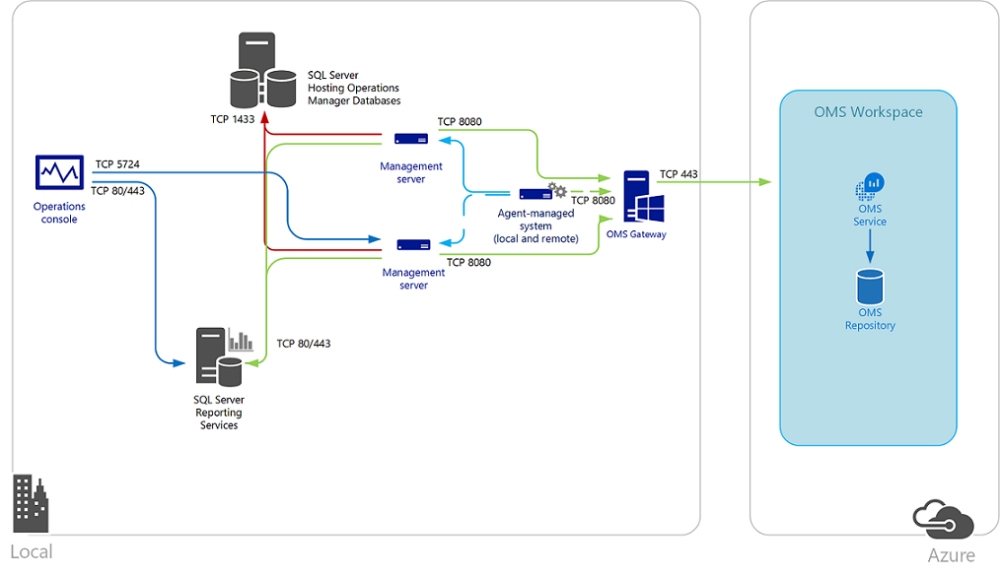

# Connect offline computers to Operations Management Suite by using OMS Gateway

Computers that are managed by Operations Management Suite (OMS) and monitored by System Center Operations Manager (Operations Manager) can send data to the Operations Management Suite service when they do not have Internet access. OMS Gateway is an HTTP forward proxy that supports HTTP tunneling by using the HTTP CONNECT command. OMS Gateway can collect data and send it to the Operations Management Suite service on behalf of offline computers.  

You can use OMS Gateway with:

* Azure Automation Hybrid Runbook Worker.  
* Windows computers that have the Microsoft Monitoring Agent, and which are directly connected to an Operations Management Suite workspace.
* System Center Operations Manager 2012 SP1 with Update Rollup (UR) 7, System Center Operations Manager 2012 R2 with UR3, or a System Center Operations Manager 2016 management group that is integrated with Operations Management Suite.  

Some IT security policies do not allow networked computers to connect to the Internet. This might be true for point-of-sale (POS) devices, or for servers that support IT services. But, you need to connect the computers to Operations Management Suite to manage and monitor them. You can set up offline computers to communicate directly with OMS Gateway. The gateway receives configuration and forward data on behalf of the offline computers.  

If you set up computers that have the Operations Management Suite agent to connect directly to an Operations Management Suite workspace, all computers instead communicate by using the OMS gateway. The gateway transfers data from the agents, directly to Operations Management Suite. The gateway does not analyze any data in transit.

When you integrate an Operations Manager management group with Operations Management Suite, you can set up management servers to connect to the OMS gateway. The servers receive configuration information, and then send collected data, depending on the solution you have set up. Operations Manager agents send some data, like Operations Manager alerts, configuration assessment, instance space, and capacity data, to the management server. Other, high-volume data--such as Internet Information Services (IIS) logs, performance, and security events--is sent directly to the OMS gateway. 

An Operations Manager gateway server that is deployed in a perimeter network (also known as *DMZ*, *demilitarized zone*, and *screened subnet*) or other isolated network to monitor untrusted systems cannot communicate with the OMS gateway. Operations Manager gateway servers can report only to a management server. When you set up an Operations Manager management group to communicate with the OMS gateway, proxy configuration information is automatically distributed to every agent-managed computer that is set up to collect data for Azure Log Analytics. Proxy configuration information is automatically distributed even if the setting is empty.    

To provide high availability for directly connected agents or Operations Management groups that communicate with Operations Management Suite through the gateway, you can use network load balancing (NLB). NLB redirects and distributes traffic across multiple gateway servers. If one gateway server goes down, traffic is redirected to another available node.  

We recommend that you install the Operations Management Suite agent on the computer that is running the OMS gateway software. This way, you can monitor the OMS gateway and analyze performance or event data. The agent also helps the OMS gateway identify the service endpoints that it needs to communicate with.

Each agent must have network connectivity to its gateway so that agents can automatically transfer data to and from the gateway. We recommend that you don't install the gateway on a domain controller.

The following diagram shows the data flow from direct agents to Operations Management Suite via the gateway server. Proxy configuration for agents must match the port on which the OMS gateway is set up to communicate with Operations Management Suite.  

The following diagram shows the data flow from an Operations Manager management group to Operations Management Suite.   

## Prerequisites

A computer that you designate to run OMS Gateway must meet these requirements:

* Windows 10, Windows 8.1, Windows 7, Windows Server 2012 R2, Windows Server 2012, Windows Server 2008 R2, or Windows Server 2008 operating system
* Microsoft .NET Framework 4.5
* Minimum 4-core processor
* Minimum 8 GB of memory 

### Language availability

OMS Gateway is available in the following languages:

- Chinese (Simplified)
- Chinese (Traditional)
- Czech
- Dutch
- English
- French
- German
- Hungarian
- Italian
- Japanese
- Korean
- Polish
- Portuguese (Brazil)
- Portuguese (Portugal)
- Russian
- Spanish (International)

## Download OMS Gateway

You have three options for getting the latest version of the OMS gateway:

* Download it from the [Microsoft Download Center](https://www.microsoft.com/download/details.aspx?id=54443).

* Download it from the Operations Management Suite portal. After you sign in to your Operations Management Suite workspace:

    1. Go to **Settings** > **Connected Sources** > **Windows Servers**. 
    2. Select **Download OMS Gateway**.

* Download it from the [Azure portal](https://portal.azure.com). After you sign in:  

   1. In the list of services, select **Log Analytics**.  
   2. Select a workspace.
   3. On your workspace blade, under **General**, select **Quick Start**.
   4. Under **Choose a data source to connect to the workspace**, select **Computers**.
   5. On the **Direct Agent** blade, select **Download OMS Gateway**.   

## Install OMS Gateway

To install the gateway, complete the following steps. 

> [!NOTE]
> If you have an earlier version of the gateway (formerly called Log Analytics Forwarder) installed, the earlier version is upgraded to the current OMS Gateway release.
>

1. In the destination folder, double-click **OMS Gateway.msi**.
2. On the **Welcome** page, select **Next**.     
3. On the **License Agreement** page, to agree to the Microsoft Software License Terms, select **I accept the terms in the License Agreement**. 
4. On the **Port and proxy address** page:

   1. Enter the TCP port number to use for the gateway. Setup configures an inbound rule with this port number in Windows Firewall. The default value is 8080.
      The valid range for the port number is 1 to 65535. If the input does not fall in this range, an error message appears.
   2. Optionally, if the server where the gateway is installed needs to communicate through a proxy, enter the proxy address where the gateway needs to connect. For example, **http://myorgname.corp.contoso.com:80**. If proxy address box is empty, the gateway tries to connect directly to the Internet. If your proxy server requires authentication, enter a username and password.       
5. If Microsoft Update is not enabled on the computer, the **Microsoft Update** page appears. You can choose to enable it on this page. Otherwise, continue to the next step.
6. On the **Destination Folder** page, you can leave the default folder C:\Program Files\OMS Gateway or enter the location where you want to install the gateway.
7. On the **Ready to install** page, select **Install**. A dialog box that requests permission to install might appear. Select **Yes**.
8. Select **Finish**. To verify that the service is running, open the Services.msc snap-in and check that **OMS Gateway** appears in the list of services. Its status should be **Running**.     

## Set up network load balancing 
You can set up the OMS gateway for high availability by using NLB. You can use either the Network Load Balancing feature in Windows Server or hardware-based load balancers. To manage traffic, the load balancer redirects requested connections from Operations Management Suite agents or Operations Manager management servers across its nodes. If one gateway server goes down, traffic is redirected to other nodes.

To learn how to design and deploy a Windows Server 2016 Network Load Balancing cluster, see [Network Load Balancing](https://technet.microsoft.com/windows-server-docs/networking/technologies/network-load-balancing).  

To set up a Windows Server Network Load Balancing cluster, complete the following steps:  

1. Using an administrator account, sign in to the Windows server that is a member of the Network Load Balancing cluster.  
2. In Server Manager, open Network Load Balancing Manager.
3. Select **Tools**, and then select **Network Load Balancing Manager**.
4. To connect an OMS gateway server to the installed Microsoft Monitoring Agent, right-click the cluster's IP address, and then select **Add Host To Cluster**.     
5. Enter the IP address of the gateway server that you want to connect.    
    
## Set up the Operations Management Suite agent and an Operations Manager management group
In this section, we describe how to set up directly connected Operations Management Suite agents and an Operations Manager management group. You also can set up Azure Automation Hybrid Runbook Worker to use the OMS gateway to communicate with Operations Management Suite.  

To learn about requirements and steps to install the Operations Management Suite agent on Windows computers that are directly connected to Operations Management Suite, see [Connect Windows computers to Operations Management Suite](log-analytics-windows-agents.md). For Linux computers, see [Connect Linux computers to Operations Management Suite](log-analytics-linux-agents.md). 

### Set up the Operations Management Suite agent and Operations Manager to use the OMS gateway as a proxy server

### Set up a standalone Operations Management Suite agent
For information about setting up an agent to use a proxy server, see [Configure proxy and firewall settings with Microsoft Monitoring Agent](log-analytics-proxy-firewall.md). In this case, the proxy server is the gateway. If you have deployed multiple gateway servers behind a network load balancer, the Operations Management Suite agent proxy configuration is the virtual IP address of the network load balancer:   

### Set up Operations Manager (all agents use the same proxy server)
Set up Operations Manager to add the gateway server. The Operations Manager proxy configuration is automatically applied to all agents that report to Operations Manager, even if the setting is empty.

To use the OMS gateway with Operations Manager, you must meet the following requirements:

* Microsoft Monitoring Agent (agent version **8.0.10900.0** and later versions) must be installed on the gateway server. It must be set up for the Operations Management Suite agent workspaces that you want to communicate with.
* The gateway must have Internet connectivity or be connected to a proxy server that does.

> [!NOTE]
> If you do not specify a value for the gateway, blank values are pushed to all agents.

To connect your Operations Manager server to your Operations Management Suite agent workspace:

1. In the Operations Manager console, go to **Operations Management Suite** > **Connection** > **Configure Proxy Server**.     
2. Select **Use a proxy server to access the Operations Management Suite**. Enter the IP address of the OMS gateway server, or the virtual IP address of the network load balancer. Be sure that you start with the **http://** prefix.     
3. Select **Finish**. 

### Set up Operations Manager (specific agents use the proxy server)
For large or complex environments, you might want only specific servers (or groups) to use the OMS gateway server. For these servers, you cannot update the Operations Manager agent directly. The value is overwritten by the global value for the management group. Instead, override the rule that is used to push these values.

> [!NOTE] 
> You can use the same configuration technique to run multiple OMS gateway servers in your environment. For example, you can require specific OMS gateway servers to be specified on a per-region basis.

1. In the System Center Operations Manager console, select the **Authoring** workspace.  
2. Select **Rules**, and on the System Center Operations Manage toolbar, select the **Scope** button. If this button is not available, check to make sure that you have an object, and not a folder, selected in the **Monitoring** pane. The **Scope Management Pack Objects** dialog box displays a list of common targeted classes, groups, or objects. 
3. In the **Look for** box, enter **Health Service**. Select it from the list. Select **OK**.  
4. On the Operations Manager console toolbar, search for the rule **Advisor Proxy Setting Rule**. Select **Overrides**, and then point to **Override the Rule\For a specific object of class: Health Service**. Select a specific object from the list. Optionally, you can create a custom group that has the health service object of the servers you want to apply this override to. Then, apply the override to that group.
5. In the **Override Properties** dialog box, next to the **WebProxyAddress** parameter, select the **Override** column. In the **Override Value** box, enter the URL of the OMS gateway server. Be sure that you start with the **http://** prefix.

   >[!NOTE]
   > You don't need to enable the rule. The rule is managed automatically with an override in the System Center Advisor Secure Reference Override management pack. The management pack targets the System Center Advisor Monitoring Server Group.
   > 

6. To specify a management pack, do one of the following:
    * In the **Select destination management pack** list, select a management pack.
    * To create a new, unsealed management pack, select **New**. 
7. Select **OK**. 

### Set up automation hybrid workers
If you have Azure Automation hybrid runbook workers in your environment, you can create a manual, temporary workaround so that the gateway supports them.

For the following steps, you need to know the Azure region where the Automation account resides. To find the location:

1. Sign in to the [Azure portal](https://portal.azure.com/).
2. Select the Azure Automation service.
3. Select the relevant Azure Automation account.
4. Under **Location**, see the region.     

Use the following tables to identify the URL for each location:

**Job runtime data service URLs**

| Location | URL |
| --- | --- |
| North Central US |ncus-jobruntimedata-prod-su1.azure-automation.net |
| West Europe |we-jobruntimedata-prod-su1.azure-automation.net |
| South Central US |scus-jobruntimedata-prod-su1.azure-automation.net |
| East US 2 |eus2-jobruntimedata-prod-su1.azure-automation.net |
| Central Canada |cc-jobruntimedata-prod-su1.azure-automation.net |
| North Europe |ne-jobruntimedata-prod-su1.azure-automation.net |
| South East Asia |sea-jobruntimedata-prod-su1.azure-automation.net |
| Central India |cid-jobruntimedata-prod-su1.azure-automation.net |
| Japan |jpe-jobruntimedata-prod-su1.azure-automation.net |
| Australia |ase-jobruntimedata-prod-su1.azure-automation.net |

**Agent service URLs**

| Location | URL |
| --- | --- |
| North Central US |ncus-agentservice-prod-1.azure-automation.net |
| West Europe |we-agentservice-prod-1.azure-automation.net |
| South Central US |scus-agentservice-prod-1.azure-automation.net |
| East US 2 |eus2-agentservice-prod-1.azure-automation.net |
| Central Canada |cc-agentservice-prod-1.azure-automation.net |
| North Europe |ne-agentservice-prod-1.azure-automation.net |
| South East Asia |sea-agentservice-prod-1.azure-automation.net |
| Central India |cid-agentservice-prod-1.azure-automation.net |
| Japan |jpe-agentservice-prod-1.azure-automation.net |
| Australia |ase-agentservice-prod-1.azure-automation.net |

If your computer is automatically registered as a hybrid runbook worker for patching by using the Update Management solution, complete these steps:

1. Add the Job Runtime Data service URLs to the **Allowed Host** list on the OMS gateway. For example:
    `Add-OMSGatewayAllowedHost we-jobruntimedata-prod-su1.azure-automation.net`
2. Restart the OMS gateway service by using the following Azure PowerShell cmdlet:
   `Restart-Service OMSGatewayService`

If your computer is onboarded to Azure Automation by using the Hybrid Runbook Worker registration cmdlet, complete these steps:

1. Add the agent service registration URL to the **Allowed Host** list on the OMS gateway. For example:
   `Add-OMSGatewayAllowedHost ncus-agentservice-prod-1.azure-automation.net`
2. Add the Job Runtime Data service URLs to the **Allowed Host** list on the OMS gateway. For example:
    `Add-OMSGatewayAllowedHost we-jobruntimedata-prod-su1.azure-automation.net`
3. Restart the OMS gateway service:
    `Restart-Service OMSGatewayService`

## Useful PowerShell cmdlets
Cmdlets can help you update OMS gateway settings. Before you use PowerShell cmdlets, be sure to:

1. Install OMS Gateway (MSI).
2. Open a PowerShell console window.
3. To import the module, enter this command: `Import-Module OMSGateway`. If no error occurs, the module was successfully imported and you can use the cmdlets. 
4. Enter `Get-Module OMSGateway`.
5. After you make changes by using the cmdlets, restart the OMS gateway service.

If you get an error in step 3, the module wasn't imported. This error might occur if PowerShell can't find the module. The module is listed in the gateway's installation path: C:\Program Files\Microsoft OMS Gateway\PowerShell.

| Cmdlet | Parameters | Description | Examples |
| --- | --- | --- | --- |
| `Set-OMSGatewayConfig` |Key (required)   Value |Changes the service configuration |`Set-OMSGatewayConfig -Name ListenPort -Value 8080` |
| `Get-OMSGatewayConfig` |Key |Gets the service configuration |`Get-OMSGatewayConfig`     `Get-OMSGatewayConfig -Name ListenPort` |
| `Set-OMSGatewayRelayProxy` |Address   Username   Password |Sets the address (and credentials) of the relay (upstream) proxy |1. Set a reply proxy and the credential: `Set-OMSGatewayRelayProxy -Address http://www.myproxy.com:8080 -Username user1 -Password 123`     2. Set a reply proxy that doesn't need authentication: `Set-OMSGatewayRelayProxy -Address http://www.myproxy.com:8080`     3. Clear the reply proxy setting, that is, you do not need a reply proxy: `Set-OMSGatewayRelayProxy -Address ""` |
| `Get-OMSGatewayRelayProxy` | |Gets the address of the relay (upstream) proxy |`Get-OMSGatewayRelayProxy` |
| `Add-OMSGatewayAllowedHost` |Host (required) |Adds the host to the allowed list |`Add-OMSGatewayAllowedHost -Host www.test.com` |
| `Remove-OMSGatewayAllowedHost` |Host (required) |Removes the host from the allowed list |`Remove-OMSGatewayAllowedHost -Host www.test.com` |
| `Get-OMSGatewayAllowedHost` | |Gets the currently allowed host (only the locally configured allowed host; does not include automatically downloaded allowed hosts) |`Get-OMSGatewayAllowedHost` |
| `Add-OMSGatewayAllowedClientCertificate` |Subject (required) |Adds the client certificate subject to the allowed list |`Add-OMSGatewayAllowedClientCertificate -Subject mycert` |
| `Remove-OMSGatewayAllowedClientCertificate` |Subject (required) |Removes the client certificate subject from the allowed list |`Remove- OMSGatewayAllowedClientCertificate -Subject mycert` |
| `Get-OMSGatewayAllowedClientCertificate` | |Gets the currently allowed client certificate subjects (only the locally configured allowed subjects; does not include automatically downloaded allowed subjects) |`Get-OMSGatewayAllowedClientCertificate` |

## Troubleshooting
To collect events logged by the gateway, you need to have the Operations Management Suite agent installed.   

**OMS gateway event IDs and descriptions**

The following table lists the event IDs and descriptions of OMS gateway log events:

| ID | Description |
| --- | --- |
| 400 |Any application error that does not have a specific ID |
| 401 |Wrong configuration. For example: listenPort = "\<text\>" instead of an integer |
| 402 |Exception in parsing Transport Layer Security (TLS) handshake messages |
| 403 |Networking error. For example: Cannot connect to target server |
| 100 |General information |
| 101 |Service has started |
| 102 |Service has stopped |
| 103 |Received an HTTP CONNECT command from client |
| 104 |Not an HTTP CONNECT command |
| 105 |Destination server is not in allowed list, or the destination port is not a secure port (443)     Ensure that the Microsoft Monitoring Agent agent on your gateway server and the agents communicating with the gateway are connected to the same Log Analytics workspace. |
| 105 |ERROR TcpConnection – Invalid Client certificate: CN=Gateway    Ensure that:        &#149; You are using OSM Gateway version 1.0.395.0 or a later version.   &#149; The Microsoft Monitoring Agent agent on your gateway server and the agents communicating with the gateway are connected to the same Log Analytics workspace. |
| 106 |Any reason that the TLS session is suspicious and rejected |
| 107 |The TLS session has been verified |

**Performance counters to collect**

The following table lists performance counters that are available for the OMS gateway. You can add the counters by using Windows Performance Monitor.

| Name | Description |
| --- | --- |
| OMS Gateway/Active Client Connection |Number of active client network (TCP) connections |
| OMS Gateway/Error Count |Number of errors |
| OMS Gateway/Connected Client |Number of connected clients |
| OMS Gateway/Rejection Count |Number of rejections due to any TLS validation error |

## Get assistance
In the Azure portal, when you're signed in, you can create a request for assistance with the OMS gateway or any other Azure service or service feature.
To request assistance, select the question mark symbol in the top right corner of the portal, and then select **New support request**. Complete the new support request form.

You also can leave feedback about Operations Management Suite or Log Analytics in the [Microsoft Azure feedback forum](https://feedback.azure.com/forums/267889).

## Next steps
To collect data from the connected sources in your Operations Management Suite workspace, you can [add data sources](log-analytics-data-sources.md). You can store the date in the Operations Management Suite repository.
