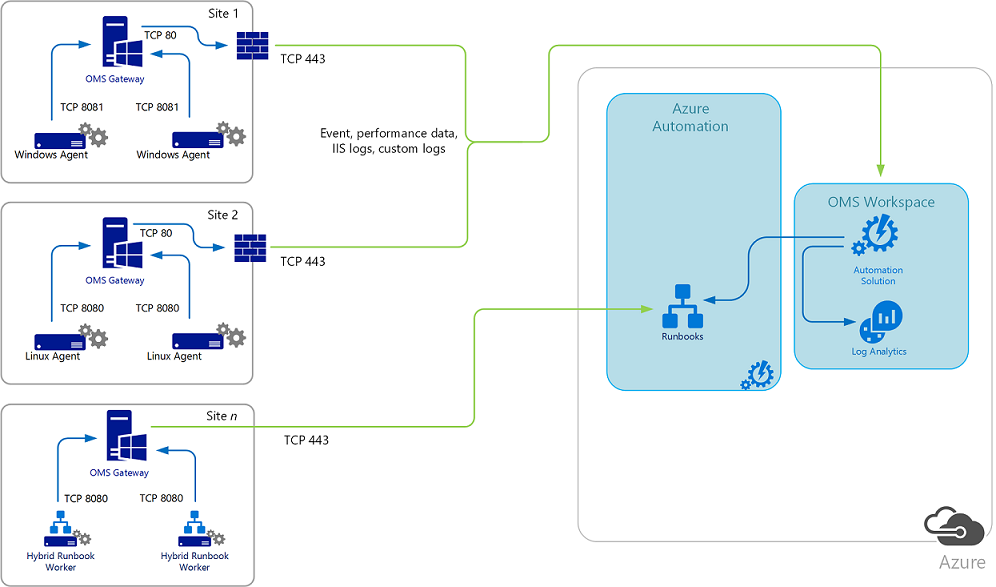
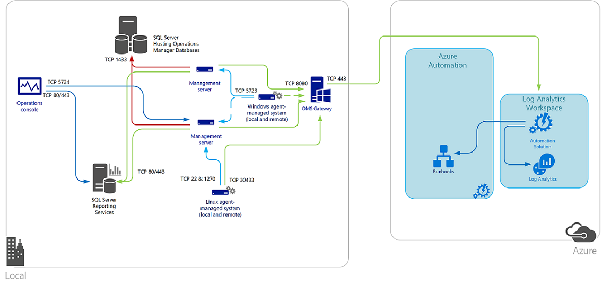
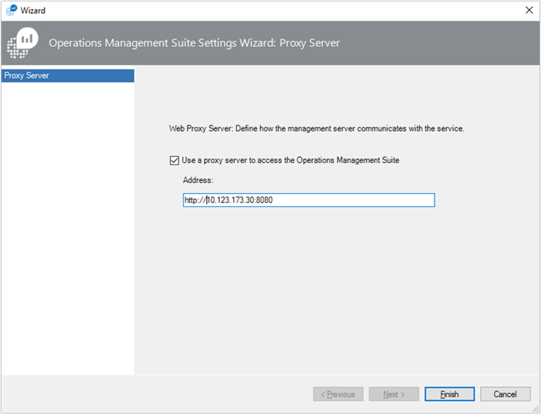

# Connect computers without Internet access using the OMS Gateway
This document describes how to configure communication with Azure Automation and Log Analytics using the OMS Gateway when direct connected or Operations Manager monitored computers do not have Internet access.  The OMS Gateway, which is an HTTP forward proxy that supports HTTP tunneling using the HTTP CONNECT command, can collect data and send it to Azure Automation and Log Analytics on their behalf.  

The OMS Gateway supports:

* Azure Automation Hybrid Runbook Workers  
* Windows computers with the Microsoft Monitoring Agent directly connected to a Log Analytics workspace
* Linux computers with the OMS Agent for Linux directly connected to a Log Analytics workspace  
* System Center Operations Manager 2012 SP1 with UR7, Operations Manager 2012 R2 with UR3, Operations Manager 2016, and Operations Manager version 1801 management group integrated with Log Analytics.  

If your IT security policies do not allow computers on your network to connect to the Internet, such as point of sale (POS) devices, or servers supporting IT services, but you need to connect them to Azure Automation or Log Analytics to manage and monitor them, they can be configured to communicate directly with the OMS Gateway to receive configuration and forward data on their behalf.  If these computers are configured with the OMS agent to directly connect to a Log Analytics workspace, all computers will instead communicate with the OMS Gateway.  The gateway transfers data from the agents to the service directly, it does not analyze any of the data in transit.

When an Operations Manager management group is integrated with Log Analytics, the management servers can be configured to connect to the OMS Gateway to receive configuration information and send collected data depending on the solution you have enabled.  Operations Manager agents send some data such as Operations Manager alerts, configuration assessment, instance space, and capacity data to the management server. Other high-volume data, such as IIS logs, performance, and security events are sent directly to the OMS Gateway.  If you have one or more Operations Manager Gateway servers deployed in a DMZ or other isolated network to monitor untrusted systems, it cannot communicate with an OMS Gateway.  Operations Manager Gateway servers can only report to a management server.  When an Operations Manager management group is configured to communicate with the OMS Gateway, the proxy configuration information is automatically distributed to every agent-managed computer that is configured to collect data for Log Analytics, even if the setting is empty.    

To provide high availability for direct connected or Operations Management groups that communicate with Log Analytics through the gateway, you can use network load balancing to redirect and distribute the traffic across multiple gateway servers.  If one gateway server goes down, the traffic is redirected to another available node.  

The OMS agent is required on the computer running the OMS Gateway in order for it to identify the service end points that it needs to communicate with, and monitor the OMS Gateway to analyze its performance or event data.

Each agent must have network connectivity to its gateway so that agents can automatically transfer data to and from the gateway. Installing the gateway on a domain controller is not recommended.

The following diagram shows data flow from direct agents to Azure Automation and Log Analytics using the gateway server.  Agents must have their proxy configuration match the same port the OMS Gateway is configured to communicate to the service.  

The following diagram shows data flow from an Operations Manager management group to Log Analytics.   

## Prerequisites

When designating a computer to run the OMS Gateway, this computer must have the following:

* Windows 10, Windows 8.1, Windows 7
* Windows Server 2016, Windows Server 2012 R2, Windows Server 2012, Windows Server 2008 R2,  Windows Server 2008
* .Net Framework 4.5
* Minimum of a 4-core processor and 8 GB of memory 
* OMS Agent for Windows 

### Language availability

The OMS Gateway is available in the following languages:

- Chinese (Simplified)
- Chinese (Traditional)
- Czech
- Dutch
- English
- French
- German
- Hungarian
- Italian
- Japanese
- Korean
- Polish
- Portuguese (Brazil)
- Portuguese (Portugal)
- Russian
- Spanish (International)

### Supported encryption protocols
The OMS Gateway only supports Transport Layer Security (TLS) 1.0, 1.1 and 1.2.  It does not support Secure Sockets Layer (SSL).  To insure the security of data in transit to Log Analytics, we strongly encourage you to configure the gateway to use at least Transport Layer Security (TLS) 1.2. Older versions of TLS/Secure Sockets Layer (SSL) have been found to be vulnerable and while they still currently work to allow backwards compatibility, they are **not recommended**.  For additional information, review [Sending data securely using TLS 1.2](log-analytics-data-security.md#sending-data-securely-using-tls-12). 

### Supported number of agent connections
The following table highlights the supported number of agents communicating with a gateway server.  This support is based on agents uploading ~200KB of data every 6 seconds. The data volume per agent tested is about 2.7GB per day.

|Gateway |Approx. Number of agents supported|  
|--------|----------------------------------|  
|- CPU: Intel XEON CPU E5-2660 v3 \@ 2.6GHz 2 Cores  - Memory: 4 GB  - Network Bandwidth: 1 Gbps| 600|  
|- CPU: Intel XEON CPU E5-2660 v3 \@ 2.6GHz 4 Cores  - Memory: 8 GB  - Network Bandwidth: 1 Gbps| 1000|  

## Download the OMS Gateway

There are two ways to get the latest version of the OMS Gateway Setup file.

1. Download from the [Microsoft Download Center](https://www.microsoft.com/download/details.aspx?id=54443).

1. Download from the Azure portal.  After you sign in to the Azure portal:  

   1. Browse the list of services, and then select **Log Analytics**.  
   1. Select a workspace.
   1. In your workspace blade under **General**, click **Quick Start**.
   1. Under **Choose a data source to connect to the workspace**, click **Computers**.
   1. In the **Direct Agent** blade, click **Download OMS Gateway**.   

or 

   1. In your workspace blade under **Settings**, click **Advanced settings**.
   1. Navigate to **Connected Sources** > **Windows Servers** and click **Download OMS Gateway**.

## Install the OMS Gateway

To install a gateway, perform the following steps.  If you installed a previous version, formerly called *Log Analytics Forwarder*, it will be upgraded to this release.  

1. From the destination folder, double-click **OMS Gateway.msi**.
1. On the **Welcome** page, click **Next**.     
1. On the **License Agreement** page, select **I accept the terms in the License Agreement** to agree to the EULA and then click **Next**.
1. On the **Port and proxy address** page:
   1. Type the TCP port number to be used for the gateway. Setup configures an inbound rule with this port number on Windows firewall.  The default value is 8080.
      The valid range of the port number is 1 - 65535. If the input does not fall into this range, an error message appears.
   1. Optionally, if the server where the gateway is installed needs to communicate through a proxy, type the proxy address where the gateway needs to connect. For example, `http://myorgname.corp.contoso.com:80`.  If blank, the gateway will try to connect to the Internet directly.  If your proxy server requires authentication, enter a username and password.       
   1. Click **Next**.
1. If you do not have Microsoft Update enabled, the Microsoft Update page appears where you can choose to enable it. Make a selection and then click **Next**. Otherwise, continue to the next step.
1. On the **Destination Folder** page, either leave the default folder C:\Program Files\OMS Gateway or type the location where you want to install gateway and then click **Next**.
1. On the **Ready to install** page, click **Install**. User Account Control might appear requesting permission to install. If so, click **Yes**.
1. After Setup completes, click **Finish**. You can verify that the service is running by opening the services.msc snap-in and verify that **OMS Gateway** appears in the list of services and it status is **Running**.     

## Configure network load balancing 
You can configure the gateway for high availability using network load balancing (NLB) using either Microsoft Network Load Balancing (NLB) or hardware-based load balancers.  The load balancer manages traffic by redirecting the requested connections from the OMS agents or Operations Manager management servers across its nodes. If one Gateway server goes down, the traffic gets redirected to other nodes.

To learn how to design and deploy a Windows Server 2016 network load balancing cluster, see [Network load balancing](https://technet.microsoft.com/windows-server-docs/networking/technologies/network-load-balancing).  The following steps describe how to configure a  Microsoft network load balancing cluster.  

1. Sign onto the Windows server that is a member of the NLB cluster with an administrative account.  
1. Open Network Load Balancing Manager in Server Manager, click **Tools**, and then click **Network Load Balancing Manager**.
1. To connect an OMS Gateway server with the Microsoft Monitoring Agent installed, right-click the cluster's IP address, and then click **Add Host to Cluster**.     
1. Enter the IP address of the gateway server that you want to connect.    
    
## Configure OMS agent and Operations Manager management group
The following section includes steps on how to configure directly connected OMS agents, an Operations Manager management group, or Azure Automation Hybrid Runbook Workers with the OMS Gateway to communicate with Azure Automation or Log Analytics.  

### Configure standalone OMS agent
To understand requirements and steps on how to install the OMS agent on Windows computers directly connecting to Log Analytics, see [Connect Windows computers to Log Analytics](log-analytics-windows-agents.md) or for Linux computers see [Connect Linux computers to Log Analytics](log-analytics-quick-collect-linux-computer.md). In the place of specifying a proxy server while configuring the agent, you replace that value with the IP address of the OMS Gateway server and its port number.  If you have deployed multiple gateway servers behind a network load balancer, the OMS agent proxy configuration is the virtual IP address of the NLB.  

For information related to the Automation Hybrid Runbook Worker, see [Deploy Hybrid Runbook Worker](../automation/automation-hybrid-runbook-worker.md).

### Configure Operations Manager - all agents use the same proxy server
You configure Operations Manager to add the gateway server.  The Operations Manager proxy configuration is automatically applied to all agents reporting to Operations Manager, even if the setting is empty.  

To use the Gateway to support Operations Manager, you must have:

* Microsoft Monitoring Agent (agent version – **8.0.10900.0** or later) installed on the Gateway server and configured for a Log Analytics workspaces with which you want to communicate.
* The gateway must have Internet connectivity or be connected to a proxy server that does.

> [!NOTE]
> If you do not specify a value for the gateway, blank values are pushed to all agents.
> 

If this is the first time your Operations Manager management group is registering with a Log Analytics workspace, the option to specify the proxy configuration for the management group is not available in the Operations console.  The management group has to be successfully registered with the service before this option is available.  You need to update the system proxy configuration using Netsh on the system your running the Operations console from to configure integration, and all management servers in the management group.  

1. Open an elevated command-prompt.
   a. Go to **Start** and type **cmd**.
   b. Right-click **Command prompt** and select Run as administrator**.
1. Enter the following command and press **Enter**:

    `netsh winhttp set proxy <proxy>:<port>`

After completing the integration with Log Analytics, you can remove the change by running `netsh winhttp reset proxy` and then use the **Configure proxy server** option in the Operations console to specify the OMS Gateway server. 

1. Open the Operations Manager console and under **Operations Management Suite**, click **Connection** and then click **Configure Proxy Server**.     
1. Select **Use a proxy server to access the Operations Management Suite** and then type the IP address of the OMS Gateway server or virtual IP address of the NLB. Ensure that you start with the `http://` prefix.     
1. Click **Finish**. Your Operations Manager management group is now configured to communicate through the gateway server to the Log Analytics service.

### Configure Operations Manager - specific agents use proxy server
For large or complex environments, you may only want specific servers (or groups) to use the OMS Gateway server.  For these servers, you cannot update the Operations Manager agent directly as this value is overwritten by the global value for the management group.  Instead you need to override the rule used to push these values.  

> [!NOTE] 
> This same configuration technique can be used to allow the use of multiple OMS Gateway servers in your environment.  For example, you may require specific OMS Gateway servers to be specified on a per-region basis.
>  

1. Open the Operations Manager console and select the **Authoring** workspace.  
1. In the Authoring workspace, select **Rules** and click the **Scope** button on the Operations Manager toolbar. If this button is not available, check to make sure that you have an object, not a folder, selected in the Monitoring pane. The **Scope Management Pack Objects** dialog box displays a list of common targeted classes, groups, or objects. 
1. Type **Health Service** in the **Look for** field and select it from the list.  Click **OK**.  
1. Search for the rule **Advisor Proxy Setting Rule** and in the Operations console toolbar, click **Overrides** and then point to **Override the Rule\For a specific object of class: Health Service** and select a specific object from the list.  Optionally, you can create a custom group containing the health service object of the servers you wish to apply this override to and then apply the override to that group.
1. In the **Override Properties** dialog box, click to place a check mark in the **Override** column next to the **WebProxyAddress** parameter.  In the **Override Value** field, enter the URL of the OMS Gateway server ensuring that you start with the `http://` prefix.  

    >[!NOTE]
    > You do not need to enable the rule as it is already managed automatically with an override contained in the Microsoft System Center Advisor Secure Reference Override management pack targeting the Microsoft System Center Advisor Monitoring Server Group.
    >   

1. Either select a management pack from the **Select destination management pack** list or create a new unsealed management pack by clicking **New**. 
1. When you complete your changes, click **OK**. 

### Configure for automation hybrid workers
If you have Automation Hybrid Runbook Workers in your environment, the following steps provide manual, temporary workarounds to configure the Gateway to support them.

In the following steps, you need to know the Azure region where the Automation account resides. To locate the location:

1. Sign in to the [Azure portal](https://portal.azure.com/).
1. Select the Azure Automation service.
1. Select the appropriate Azure Automation account.
1. View its region under **Location**.     

Use the following tables to identify the URL for each location:

**Job runtime data service URLs**

| **location** | **URL** |
| --- | --- |
| North Central US |ncus-jobruntimedata-prod-su1.azure-automation.net |
| West Europe |we-jobruntimedata-prod-su1.azure-automation.net |
| South Central US |scus-jobruntimedata-prod-su1.azure-automation.net |
| East US 2 |eus2-jobruntimedata-prod-su1.azure-automation.net |
| Central Canada |cc-jobruntimedata-prod-su1.azure-automation.net |
| North Europe |ne-jobruntimedata-prod-su1.azure-automation.net |
| South East Asia |sea-jobruntimedata-prod-su1.azure-automation.net |
| Central India |cid-jobruntimedata-prod-su1.azure-automation.net |
| Japan |jpe-jobruntimedata-prod-su1.azure-automation.net |
| Australia |ase-jobruntimedata-prod-su1.azure-automation.net |

**Agent service URLs**

| **location** | **URL** |
| --- | --- |
| North Central US |ncus-agentservice-prod-1.azure-automation.net |
| West Europe |we-agentservice-prod-1.azure-automation.net |
| South Central US |scus-agentservice-prod-1.azure-automation.net |
| East US 2 |eus2-agentservice-prod-1.azure-automation.net |
| Central Canada |cc-agentservice-prod-1.azure-automation.net |
| North Europe |ne-agentservice-prod-1.azure-automation.net |
| South East Asia |sea-agentservice-prod-1.azure-automation.net |
| Central India |cid-agentservice-prod-1.azure-automation.net |
| Japan |jpe-agentservice-prod-1.azure-automation.net |
| Australia |ase-agentservice-prod-1.azure-automation.net |

If your computer is registered as a Hybrid Runbook Worker automatically for patching using the Update Management solution, follow these steps:

1. Add the Job Runtime Data service URLs to the Allowed Host list on the OMS Gateway. For example:
    `Add-OMSGatewayAllowedHost we-jobruntimedata-prod-su1.azure-automation.net`
1. Restart the OMS Gateway service by using the following PowerShell cmdlet:
   `Restart-Service OMSGatewayService`

If your computer is on-boarded to Azure Automation by using the Hybrid Runbook Worker registration cmdlet, follow these steps:

1. Add the agent service registration URL to the Allowed Host list on the OMS Gateway. For example:
   `Add-OMSGatewayAllowedHost ncus-agentservice-prod-1.azure-automation.net`
1. Add the Job Runtime Data service URLs to the Allowed Host list on the OMS Gateway. For example:
    `Add-OMSGatewayAllowedHost we-jobruntimedata-prod-su1.azure-automation.net`
1. Restart the OMS Gateway service.
    `Restart-Service OMSGatewayService`

## Useful PowerShell cmdlets
Cmdlets can help you complete tasks that are needed to update the OMS Gateway's configuration settings. Before you use them, be sure to:

1. Install the OMS Gateway (MSI).
1. Open a PowerShell console window.
1. To import the module, type this command: `Import-Module OMSGateway`
1. If no error occurred in the previous step, the module was successfully imported and the cmdlets can be used. Type `Get-Module OMSGateway`
1. After you make changes by using the cmdlets, ensure that you restart the Gateway service.

If you get an error in step 3, the module wasn't imported. The error might occur when PowerShell is unable to find the module. You can find it in the Gateway's installation path: *C:\Program Files\Microsoft OMS Gateway\PowerShell\OmsGateway*.

| **Cmdlet** | **Parameters** | **Description** | **Example** |
| --- | --- | --- | --- |  
| `Get-OMSGatewayConfig` |Key |Gets the configuration of the service |`Get-OMSGatewayConfig` |  
| `Set-OMSGatewayConfig` |Key (required)   Value |Changes the configuration of the service |`Set-OMSGatewayConfig -Name ListenPort -Value 8080` |  
| `Get-OMSGatewayRelayProxy` | |Gets the address of relay (upstream) proxy |`Get-OMSGatewayRelayProxy` |  
| `Set-OMSGatewayRelayProxy` |Address  Username  Password |Sets the address (and credential) of relay (upstream) proxy |1. Set a relay proxy and credential:  `Set-OMSGatewayRelayProxy` `-Address http://www.myproxy.com:8080` `-Username user1 -Password 123`    2. Set a relay proxy that doesn't need authentication: `Set-OMSGatewayRelayProxy`  `-Address http://www.myproxy.com:8080`    3. Clear the relay proxy setting:  `Set-OMSGatewayRelayProxy`   `-Address ""` |  
| `Get-OMSGatewayAllowedHost` | |Gets the currently allowed host (only the locally configured allowed host, does not include automatically downloaded allowed hosts) |`Get-OMSGatewayAllowedHost` | 
| `Add-OMSGatewayAllowedHost` |Host (required) |Adds the host to the allowed list |`Add-OMSGatewayAllowedHost -Host www.test.com` |  
| `Remove-OMSGatewayAllowedHost` |Host (required) |Removes the host from the allowed list |`Remove-OMSGatewayAllowedHost`  `-Host www.test.com` |  
| `Add-OMSGatewayAllowedClientCertificate` |Subject (required) |Adds the client certificate subject to the allowed list |`Add-OMSGatewayAllowed` `ClientCertificate`   `-Subject mycert` |  
| `Remove-OMSGatewayAllowedClientCertificate` |Subject (required) |Removes the client certificate subject from the allowed list |`Remove-OMSGatewayAllowed`   `ClientCertificate`   `-Subject mycert` |  
| `Get-OMSGatewayAllowedClientCertificate` | |Gets the currently allowed client certificate subjects (only the locally configured allowed subjects, does not include automatically downloaded allowed subjects) |`Get-` `OMSGatewayAllowed` `ClientCertificate` |  

## Troubleshooting
To collect events logged by the gateway, you need to also have the OMS agent installed.   

**OMS Gateway Event IDs and descriptions**

The following table shows the event IDs and descriptions for OMS Gateway Log events.

| **ID** | **Description** |
| --- | --- |
| 400 |Any application error that does not have a specific ID |
| 401 |Wrong configuration. For example: listenPort = "text" instead of an integer |
| 402 |Exception in parsing TLS handshake messages |
| 403 |Networking error. For example: cannot connect to target server |
| 100 |General information |
| 101 |Service has started |
| 102 |Service has stopped |
| 103 |Received an HTTP CONNECT command from client |
| 104 |Not an HTTP CONNECT command |
| 105 |Destination server is not in allowed list or the destination port is not secure port (443)     Ensure that the MMA agent on your Gateway server and the agents communicating with the Gateway are connected to the same Log Analytics workspace. |
| 105 |ERROR TcpConnection – Invalid Client certificate: CN=Gateway    Ensure that:        &#149; You are using a Gateway with version number 1.0.395.0 or greater.   &#149; The MMA agent on your Gateway server and the agents communicating with the Gateway are connected to the same Log Analytics workspace. |
| 106 |The OMS Gateway only supports TLS 1.0, TLS 1.1 and 1.2.  It does not support SSL. For any unsupported TLS/SSL protocol version, OMS Gateway generates event ID 106.|
| 107 |The TLS session has been verified |

**Performance counters to collect**

The following table shows the performance counters available for the OMS Gateway. You can add the counters using Performance Monitor.

| **Name** | **Description** |
| --- | --- |
| OMS Gateway/Active Client Connection |Number of active client network (TCP) connections |
| OMS Gateway/Error Count |Number of errors |
| OMS Gateway/Connected Client |Number of connected clients |
| OMS Gateway/Rejection Count |Number of rejections due to any TLS validation error |

## Get assistance
When you are signed in to the Azure portal, you can create a request for assistance with the OMS Gateway or any other Azure service or feature of a service.
To request assistance, click the question mark symbol in the top right corner of the portal and then click **New support request**. Then, complete the new support request form.

## Next steps
[Add data sources](log-analytics-data-sources.md) to collect data from your Connected Sources and store it in your Log Analytics workspace.
