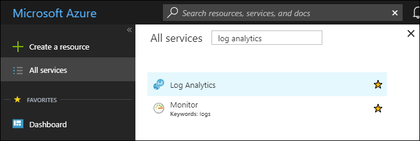
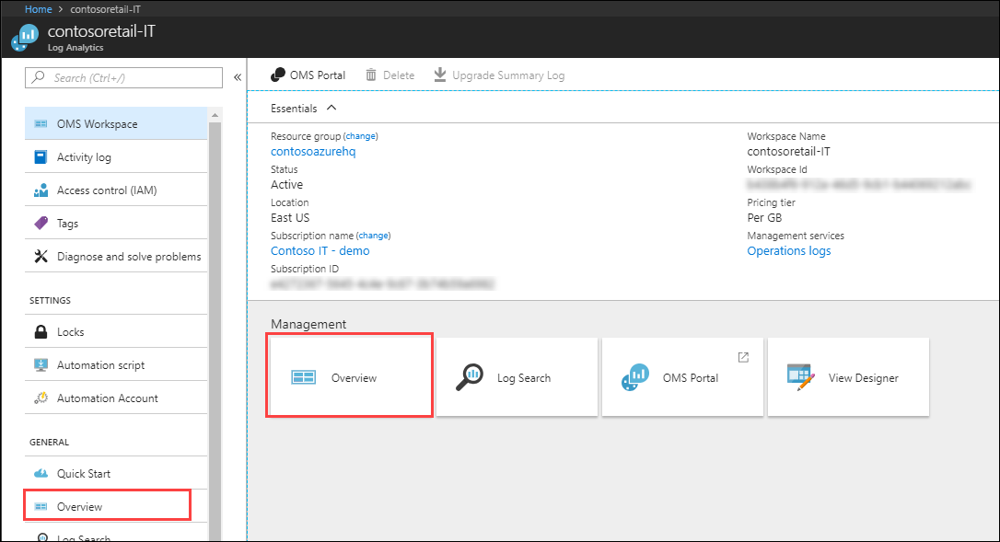
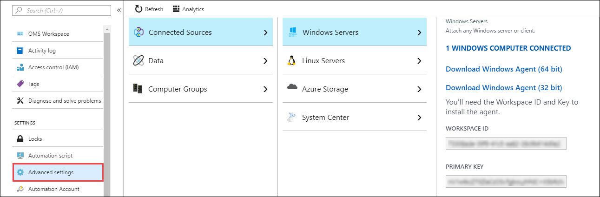
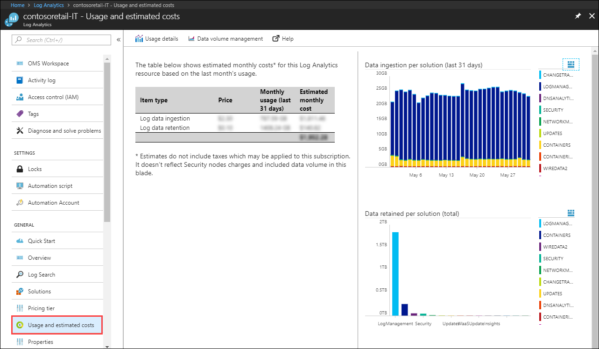

# Common questions for transition from OMS portal to Azure portal for Log Analytics users
Log Analytics initially used its own portal called the OMS portal to manage its configuration and analyze collected data.  All functionality from this portal has been moved to the Azure portal where it will continue to be developed.

This article answers common questions for users making this transition.  If you used Log Analytics in the OMS portal, then you can find answers here for how you can perform the same tasks in the Azure portal.

## Do I need to migrate anything?
No. There are no changes being made to Log Analytics itself, so there is nothing that needs to be migrated. The only thing that's changing is the interface that you use to access it. In fact, you can use the Azure portal now to access the same workspaces, solutions, views, and log searches that you use in the OMS portal today.

## Where do I find Log Analytics in Azure?
Log in to the Azure portal at [https://portal.azure.com](https://portal.azure.com).  Click **All services**, and in the list of resources, type **Log Analytics**. Select **Log Analytics** and then select your workspace. The summary page for the workspace is displayed.

## How do I manage permissions?
If you don't have access to your Log Analytics workspace in the Azure portal, you need to configure your permissions using [Azure role-based access](../active-directory/role-based-access-control-configure.md). For details on managing workspace permissions, see [Manage workspaces](../log-analytics/log-analytics-manage-access.md#manage-accounts-and-users). For information on managing permissions for alerts, see [Get started with roles, permissions, and security with Azure Monitor](../monitoring-and-diagnostics/monitoring-roles-permissions-security.md).

## How do I create a new workspace? 
From the list of workspaces in the Azure portal, click **Add** in the list of workspaces.  For complete details, see [Create a Log Analytics workspace in the Azure portal](../log-analytics/log-analytics-quick-create-workspace.md).

## Where is my overview page?
The main screen in the OMS portal displays the tiles for all the management solutions installed in your workspace and any custom views that you've created. This same view is available in the Azure portal. From your workspace, select **Workspace Summary**.

## How do I open Log Search and View Designer?
Both **Log Search** and **View Designer** are available on the main page and in the left menu of your workspace in the Azure portal, right next to **Overview**.

## Where do I find settings?
Many of the settings in the **Settings** section of the OMS portal are available in the **Advanced settings** menu in the Azure portal for the workspace.

The following sections provide a complete list of how you can access settings that were previously available in the **Settings** section of the OMS portal.

### Accounts 
Accounts settings are managed in different places in the Azure portal as described in the following table.

| Setting in the OMS portal | Equivalent in the Azure portal |
|:---|:---|
| Automation Account | **Automation Account** menu for the workspace. |
| Azure Subscription & Data Plan | **Pricing tier** menu for the workspace. |
| Manage users | Use Azure role-based access to [manage permissions for your workspace](#how-do-i-manage-permissions). |
| Workspace Information | Information available on **OMS Workspace** menu for the workspace. |

### Alerts
Alert rules based on Log Analytics queries are now managed in the [unified alerting experience](#how-do-i-create-and-manage-alerts). 

### Computer Groups
Manage Computer Groups in the **Advanced settings** menu for the workspace. 

### Connected Sources
Manage most Connected Source settings the  in the **Advanced settings** menu for the workspace. The following table provides details for each section of this menu.

| Setting in the OMS portal | Equivalent in the Azure portal |
|:---|:---|
| Windows Servers   | **Advanced settings** menu for the workspace. |
| Linux   Servers   | **Advanced settings** menu for the workspace. |
| Azure Storage     | **Advanced settings** menu for the workspace. |
| System Center     | **Advanced settings** menu for the workspace. |
| Office 365        | See the [documentation for Office 365 management solution](../operations-management-suite/oms-solution-office-365.md) for configuration details. |
| Windows Telemetry | Settings menu for the solution. See [Windows Analytics in the Azure portal](/windows/deployment/update/windows-analytics-azure-portal) for configuration details. |
| ITSM Connector    | See  [Connect ITSM products/services with IT Service Management Connector](../log-analytics/log-analytics-itsmc-connections.md) for instructions on connecting your ITSM service with Log Analytics. |

### Data
Manage most Data settings the  in the **Advanced settings** menu for the workspace. The following table provides details for each section of this menu.

| Setting in the OMS portal | Equivalent in the Azure portal |
|:---|:---|
| Windows Event Logs           | **Advanced settings** menu for the workspace. |
| Windows Performance Counters | **Advanced settings** menu for the workspace. |
| Linux Performance Counters   | **Advanced settings** menu for the workspace. |
| IIS Logs                     | **Advanced settings** menu for the workspace. |
| Custom Fields                | **Advanced settings** menu for the workspace. |
| Custom Logs                  | **Advanced settings** menu for the workspace. |
| Syslog                       | **Advanced settings** menu for the workspace. |
| Application Insights         | This solution has been deprecated now that Log Analytics and Application Insights share the same data engine.  |
| Windows File Tracking        | **Change Tracking** menu in Azure Automation. See [Track changes in your environment with the Change Tracking solution](../automation/automation-change-tracking.md) for details. |
| Windows Registry Tracking        | **Change Tracking** menu in Azure Automation. See [Track changes in your environment with the Change Tracking solution](../automation/automation-change-tracking.md) for details. |
| Linux File Tracking          | **Change Tracking** menu in Azure Automation. See [Track changes in your environment with the Change Tracking solution](../automation/automation-change-tracking.md) for details. |

### Solutions
Manage Solutions in the **Solutions** menu for the workspace. 

## How do I install and remove management solutions?
In the OMS portal, you install management solutions from the Solutions Gallery and removed them from **Settings**. In the Azure portal, [install management solutions](../monitoring/monitoring-solutions.md#install-a-management-solution) from the Azure Marketplace. [Remove solutions](../monitoring/monitoring-solutions.md#remove-a-management-solution) from the list of installed solutions.

## How do I create and manage alerts?
Alert rules based on Log Analytics queries are now managed in the [unified alerting experience](../monitoring-and-diagnostics/monitor-alerts-unified-usage.md). See [How to extend alerts from Log Analytics into Azure Alerts](../monitoring-and-diagnostics/monitoring-alerts-extend-tool.md) for details on configuring and using alerts in the Azure portal.

## How do I access my dashboards?
[Dashboards](../log-analytics/log-analytics-dashboards.md) in Log Analytics have been deprecated.  You can visualize data in Log Analytics using [View Designer](../log-analytics/log-analytics-view-designer.md) which has additional functionality and pin query and views to Azure dashboards.

## How do I check my usage?
You can now easily view and manage your usage and cost of Log Analytics by selecting **Usage and estimated costs** in your workspace.

## Can I still use the classic portal?
For a limited time, you can still access the portal through this URL, with your own workspace name:
https://\<your workspace name\>.portal.mms.microsoft.com. We recommend using Azure portal though and provide us with the feedback at LAUpgradeFeedback@microsoft.com on any blocking issues.

## Next steps

- [Find and install management solutions](../monitoring/monitoring-solutions.md) using the Azure portal.
- Learn about [Log Search in the Azure portal](log-analytics-log-search-portals.md).