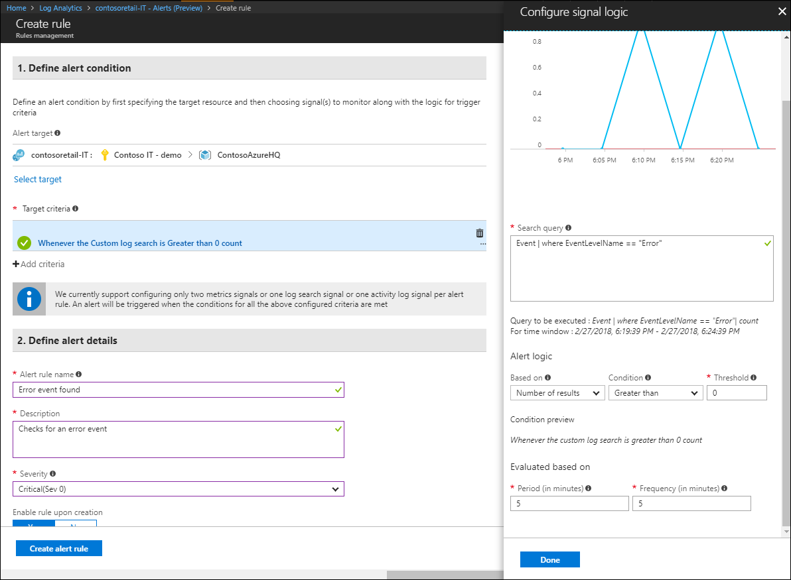

# What is Log Analytics?
Log Analytics plays a central role in Azure management by collecting data from a variety of sources and  providing a query language and analytics engine that gives you insights into the operation of your applications and resources.  This allows you to perform analysis across different kinds of data from multiple services.  You can either interact directly with Log Analytics data through log searches and views, or you may use other Azure services such as Application Insights or Azure Security Center that store their data in Log Analytics.  

## Is Log Analytics for you?

The different monitoring services in Azure are described in [Monitoring Azure applications and resources](../monitoring-and-diagnostics/monitoring-overview.md).  If you have no current monitoring in place for your Azure environment, you should start with [Azure Monitor](../monitoring-and-diagnostics/monitoring-overview.md), which collects and analyzes monitoring data for your Azure resources.  Log Analytics can [collect data from Azure Monitor](log-analytics-azure-storage.md) to correlate it with other data and provide additional analysis.

If you want to monitor your on-premises environment or you have existing monitoring using services such as Azure Monitor or System Center Operations Manager, then Log Analytics can add significant value.  It collects data directly from your agents and also from these other tools into a single repository.  Analysis tools in Log Analytics such as log searches, views, and solutions work against all collected data providing you with centralized analysis of your entire environment.

## Collecting data into Log Analytics
Log Analytics collects data from a variety of sources.  Once collected, all data can be analyzed together regardless of its original source.  This allows you to analyze data across your entire environment.

Methods for collecting data into Log Analytics include the following:

- Azure services such as [Application Insights]() and [Azure Security Center]() store their data directly in Log Analytics.  You don't need to do any configuration for this.
- You configure Azure Monitor to copy metrics and logs that it collects from Azure resources into Log Analytics.
- Agents on [Windows](log-analytics-windows-agent.md) and [Linux](log-analytics-linux-agents.md) virtual machines send data to Log Analytics according to [Date Sources]() that you configure.  
- You can connect a [System Center Operations Manager management group](log-analytics-om-agents.md) to Log Analytics to collect data from its agents.
- If you have custom requirements, then you can use the [HTTP Data Collector API](log-analytics-data-collector-api.md) to write data to Log Analytics from any REST API client.

## Query language

Log Analytics includes a rich query language to quickly retrieve and consolidate its data, and you can use [log search in the Azure portal](log-analytics-log-search-portals.md) to create and test queries.  You can either directly work with the data or save queries for use with visualizations, alerts, or export to analysis tools such as Power BI or Excel.

****

## Visualizations

You can visualize data stored in Log Analytics using either [Log Analytics views](log-analytics-view-designer.md) or [Azure dashboards](../azure-portal/azure-portal-dashboards.md).  These are based on log searches so they dynamically visualize specific sets of data.  

## Alerts

You can create alerts from Log Analytics data to proactively notify you of critical conditions using [Azure Alerts]().  A query is automatically run at regular intervals and an alert created if the results match specific criteria.  This allows you combine alerting from Log Analytics with other sources such as [Azure Monitor]() and [Application Insights](), sharing [Action groups]() for response to alert conditions.

## Export

In order to analyze data outside of Log Analytics, you can export the data into tools such as [Power BI](log-analytics-powerbi.md) or Excel.  You can also leverage the [Log Search API](log-analytics-log-search-api.md) to build custom solutions that leverage Log Analytics data or to integrate with other systems.

## Add functionality with management solutions
[Management solutions](log-analytics-add-solutions.md) add functionality to Log Analytics, providing additional data and analysis tools to Log Analytics.  They may also define new record types to be collected that can be analyzed with Log Searches or by additional user interface provided by the solution in the dashboard.  The example image below shows the [Change Tracking solution](log-analytics-change-tracking.md)

Solutions are available for a variety of functions, and additional solutions are consistently being added.  You can easily browse available solutions and [add them to your workspace](log-analytics-add-solutions.md) from the Azure Marketplace.  Many will be automatically deployed and start working immediately while others may require moderate configuration.

## Next steps
* [Sign up for a free Log Analytics account](log-analytics-get-started.md) to test in your own environment.
* View the different [Data Sources](log-analytics-data-sources.md) available to collect data into Log Analytics.
* [Browse the available solutions in the Solutions Gallery](log-analytics-add-solutions.md) to add functionality to Log Analytics.

