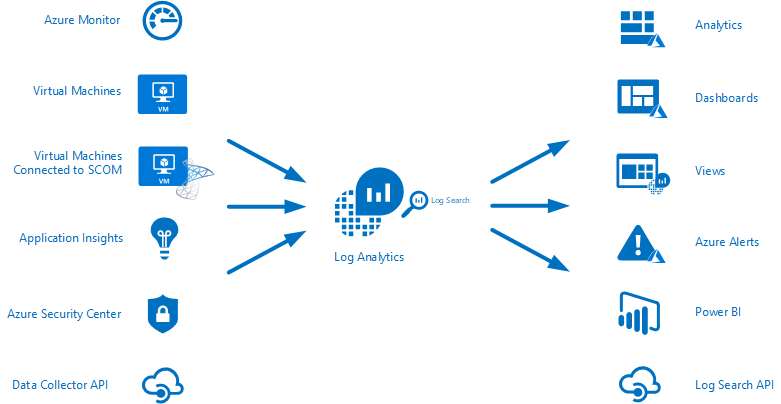
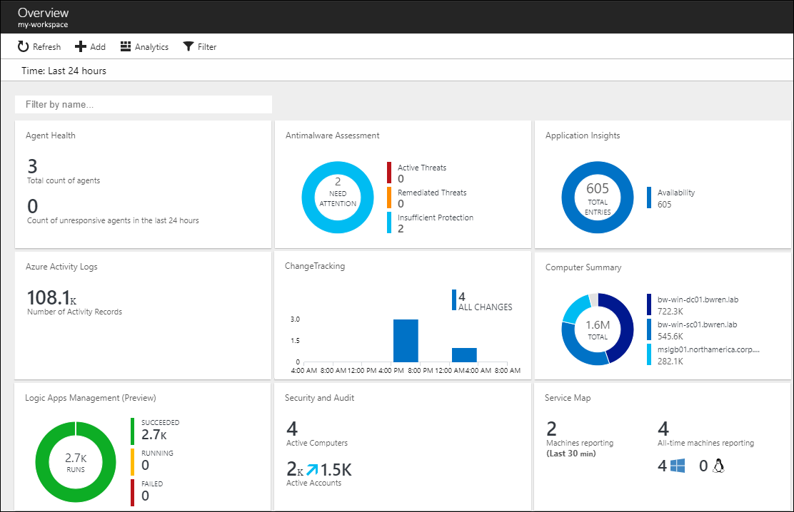
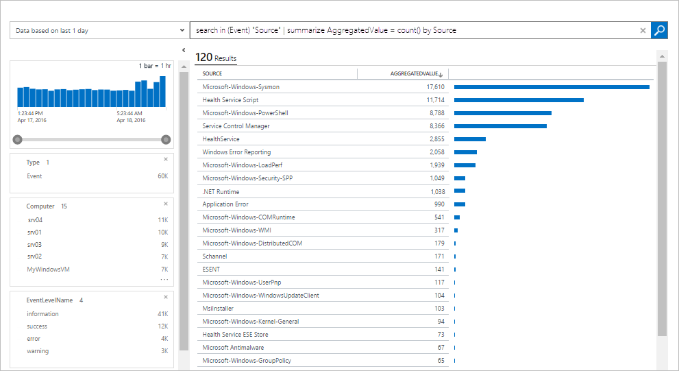
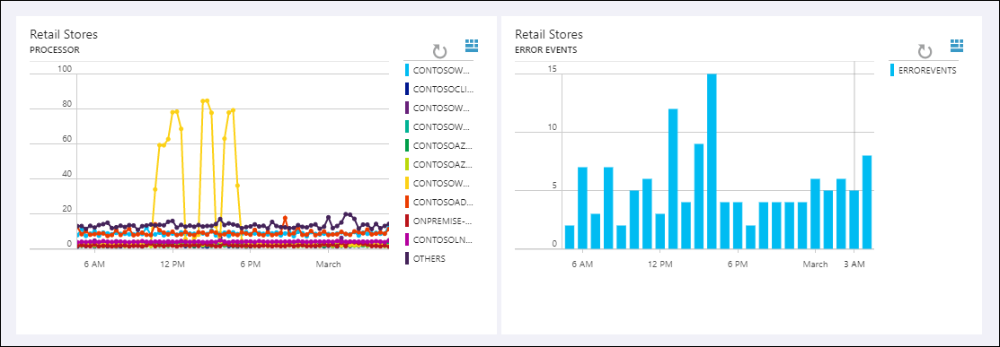
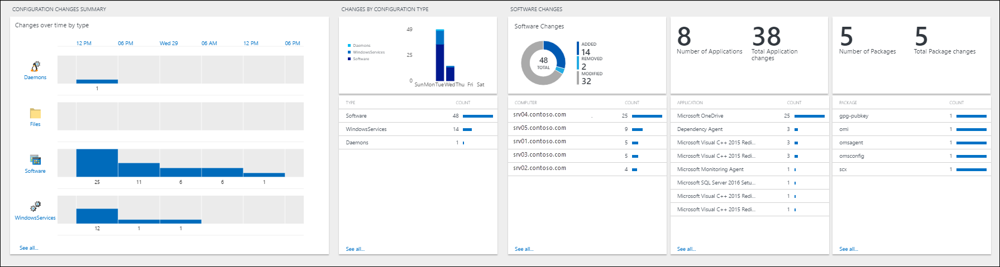
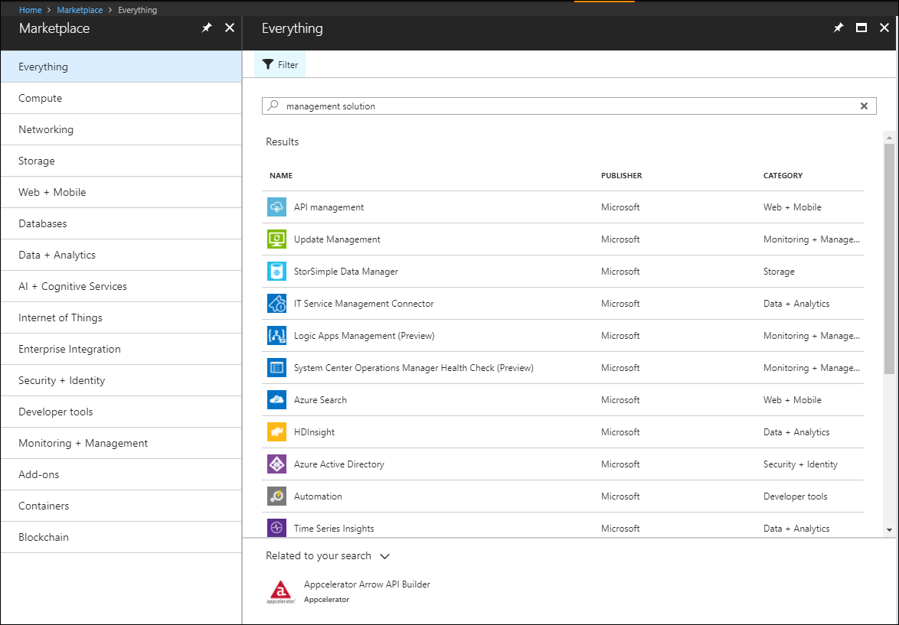
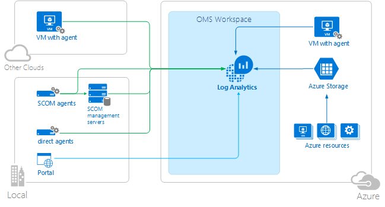

<properties
   pageTitle="What is Log Analytics? | Microsoft Azure"
   description="Log Analytics is a service in Operations Management Suite (OMS) that helps you collect and analyze operational data generated by resources in your cloud and on-premises environment.  This article provides a brief overview of the different components of Log Analytics and links to detailed content."
   services="log-analytics"
   documentationCenter=""
   authors="bwren"
   manager="jwhit"
   editor="tysonn" />
<tags
   ms.service="log-analytics"
   ms.devlang="na"
   ms.topic="hero-article"
   ms.tgt_pltfrm="na"
   ms.workload="infrastructure-services"
   ms.date="06/13/2016"
   ms.author="bwren" />

# What is Log Analytics?
Log Analytics is a service in [Operations Management Suite \(OMS\)](http://azure.microsoft.com/documentation/suites/operations-management-suite/) that helps you collect and analyze data generated by resources in your cloud and on-premises environments. It gives you real-time insights using integrated search and custom dashboards to readily analyze millions of records across all of your workloads and servers regardless of their physical location.


## Log Analytics components
At the center of Log Analytics is the OMS repository which is hosted in the Azure cloud.  Data is collected into the repository from connected sources by configuring data sources and adding solutions to your subscription.  Data sources and solutions will each create different record types that have their own set of properties but may still be analyzed together in queries to the repository.  This allows you to use the same tools and methods to work with different kinds of data collected by different sources.





Connected sources are the computers and other resources that generate data collected by Log Analytics.  This can include agents installed on [Windows](log-analytics-windows-agents.md) and [Linux](log-analytics-linux-agents.md) computers that connect directly or agents in a [connected System Center Operations Manager management group](log-analytics-om-agents.md).  Log Analytics can also collect data from [Azure storage](log-analytics-azure-storage.md).

[Data sources](log-analytics-data-sources.md) are the different kinds of data collected from each connected source.  This includes events and [performance data](log-analytics-data-sources-performance-counters.md) from [Windows](log-analytics-data-sources-windows-events.md) and Linux agents in addition to sources such as [IIS logs](log-analytics-data-sources-iis-logs.md), and [custom text logs](log-analytics-data-sources-custom-logs.md).  You configure each data source that you want to collect, and the configuration is automatically delivered to each connected source.


## Analyzing Log Analytics data
Most of your interaction with Log Analytics will be through the OMS portal which runs in any browser and provides you with access to configuration settings and multiple tools to analyze and act on collected data.  From the portal you can leverage [log searches](log-analytics-log-searches.md) where you construct queries to analyze collected data, [dashboards](log-analytics-dashboards.md) which you can customize with graphical views of your most valuable searches, and [solutions](log-analytics-add-solutions.md) which provide additional functionality and analysis tools.




Log Analytics provides a query syntax to quickly retrieve and consolidate data in the repository.  You can create and save [Log Searches](log-analytics-log-searches.md) to directly analyze data in the OMS portal or have log searches run automatically to create an alert if the results of the query indicate an important condition.



To give a quick graphical view of the health of your overall environment, you can add visualizations for saved log searches to your [dashboard](log-analytics-dashboards.md).   



In order to analyze data outside of Log Analytics, you can export the data from the OMS repository into tools such as [Power BI](log-analytics-powerbi.md) or Excel.  You can also leverage the [Log Search API](log-analytics-log-search-api.md) to build custom solutions that leverage Log Analytics data or to integrate with other systems.

## Solutions
Solutions add functionality to Log Analytics.  They primarily run in the cloud and provide analysis of data collected in the OMS repository. They may also define new record types to be collected that can be analyzed with Log Searches or by additional user interface provided by the solution in the OMS dashboard.  




Solutions are available for a variety of functions, and you can easily browse available solutions and [add them to your OMS workspace](log-analytics-add-solutions.md) from the Solutions Gallery.  Many will be automatically deployed and start working immediately while others may require some configuration.



## Log Analytics architecture
The deployment requirements of Log Analytics are minimal since the central components are hosted in the Azure cloud.  This includes the repository in addition to the services that allow you to correlate and analyze collected data.  The portal can be accessed from any browser so there is no requirement for client software.

You must install agents on [Windows](log-analytics-windows-agents.md) and [Linux](log-analytics-linux-agents.md) computers, but there is no additional agent required for computers that are already members of a [connected SCOM management group](log-analytics-om-agents.md).  SCOM agents will continue to communicate with management servers which will forward their data to Log Analytics.  Some solutions though will require agents to communicate directly with Log Analytics.  The documentation for each solution will specify its communication requirements.

When you [sign up for Log Analytics](log-analytics-get-started.md), you will create an OMS workspace.  You can think of the workspace as a unique OMS environment with its own data repository, data sources, and solutions. You may create multiple workspaces in your subscription to support multiple environments such as production and test.




## Next steps

- [Sign up for a free Log Analytics account](log-analytics-get-started.md) to test in your own environment.
- View the different [Data Sources](log-analytics-data-sources.md) available to collect data into the OMS repository.
- [Browse the available solutions in the Solutions Gallery](log-analytics-add-solutions.md) to add functionality to Log Analytics.
