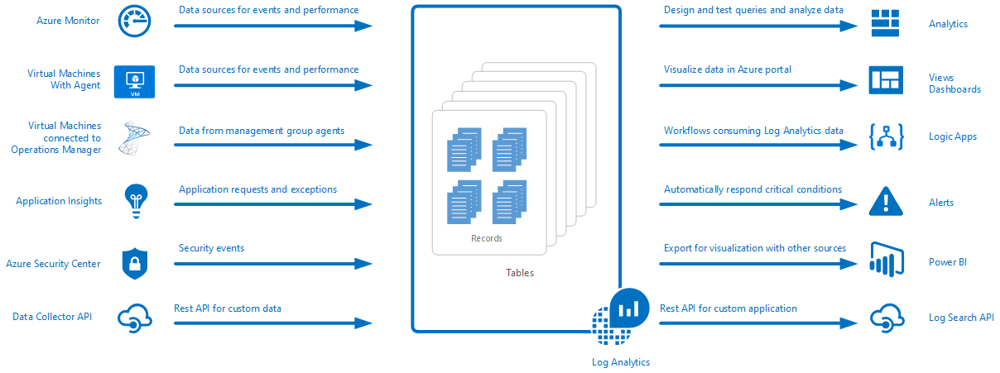
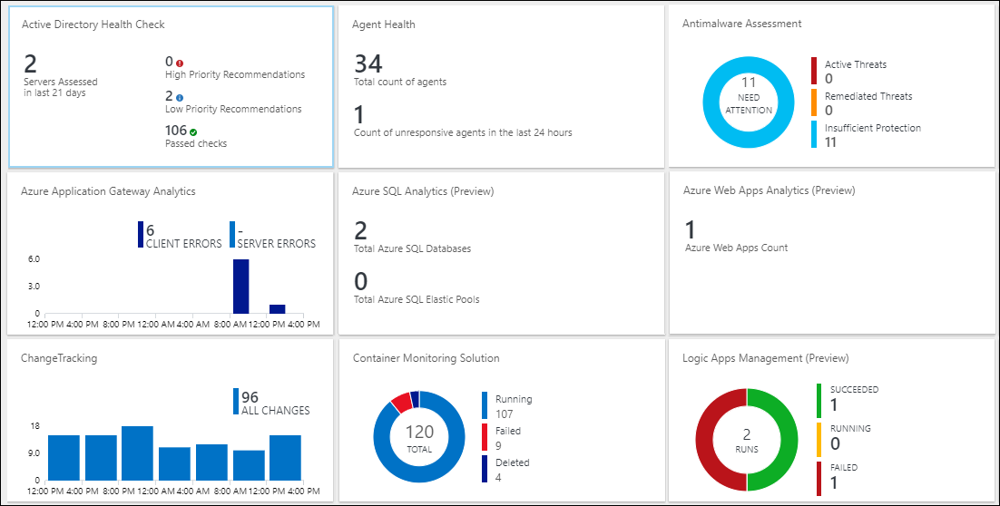
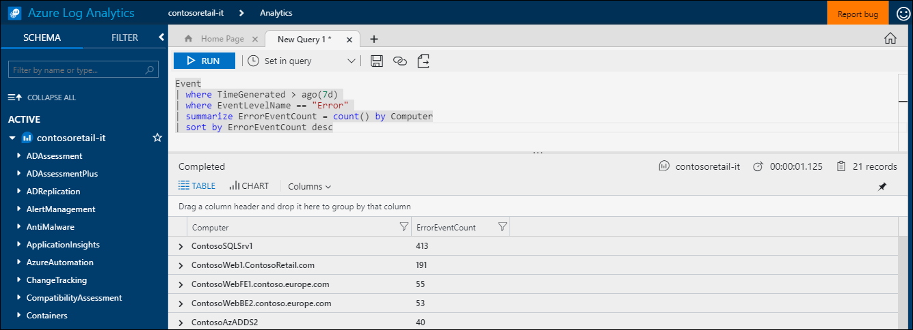
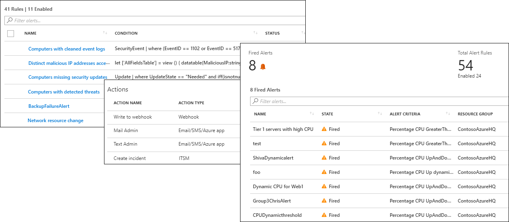
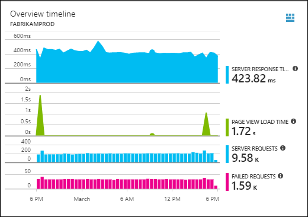

# What is Azure Log Analytics?
Log Analytics plays a central role in Azure management by collecting telemetry and other data from a variety of sources and  providing a query language and analytics engine that gives you insights into the operation of your applications and resources.  You can either interact directly with Log Analytics data through log searches and views, or you may use analysis tools in other Azure services that store their data in Log Analytics such as Application Insights or Azure Security Center.  

Log Analytics requires minimal configuration and is already integrated with other Azure services.  You just need to create a workspace to enable collection.  You can then install agents on virtual machines to include them in the workspace and enable management solutions which include logic to provide additional insights into different applications.  Behind the scenes, data types are either predefined or automatically created as data is collected.

## Role in monitoring

The different monitoring services in Azure are described in [Monitoring Azure applications and resources](../monitoring-and-diagnostics/monitoring-overview.md).  Log Analytics plays a central role by consolidating monitoring data from different sources and providing a powerful query language for consolidation and analysis.  

Log Analytics isn't limited to monitoring Azure resources though.  It can collect data from resources that are on-premises or in other clouds to create a hybrid monitoring environment and can directly connect to System Center Operations Manager to collect telemetry from existing agents.  Analysis tools in Log Analytics such as log searches, views, and management solutions work against all collected data providing you with the capability to centrally analyze your entire environment.

## Data collection
Log Analytics collects data from a variety of sources.  Once collected, the data is organized into separate tables for each data type, which allows all data to be analyzed together regardless of its original source.

Methods for collecting data into Log Analytics include the following:

- Configure Azure Monitor to copy [metrics and logs](../monitoring/monitoring-data-collection.md#types-of-monitoring-data) that it collects from Azure resources.
- Collect telemetry written to [Azure Storage](log-analytics-azure-storage-iis-table.md).
- Agents on [Windows](log-analytics-windows-agent.md) and [Linux](log-analytics-linux-agents.md) virtual machines send telemetry from the guest operating system and applications to Log Analytics according to [Data Sources](log-analytics-data-sources.md) that you configure. Agents can be directly connected, connect through an [OMS Gateway](log-analytics-oms-gateway.md) when they don't have firewall access, or connect through a [System Center Operations Manager management group](log-analytics-om-agents.md).
- Azure services such as [Application Insights](https://docs.microsoft.com/azure/application-insights/) and [Azure Security Center](https://docs.microsoft.com/azure/security-center/) store their data directly in Log Analytics without any configuration.
- Write data from PowerShell command line or [Azure Automation runbook](../automation/automation-runbook-types.md) using Log Analytics cmdlets.
- If you have custom requirements, then you can use the [HTTP Data Collector API](log-analytics-data-collector-api.md) to write data to Log Analytics from any REST API client or an [Azure Logic App](https://docs.microsoft.com/azure/logic-apps/) to write data from a custom workflow.

## Add functionality with management solutions
[Management solutions](log-analytics-add-solutions.md) provide prepackaged logic for a particular product or scenario.  They may gather extra data into Log Analytics or process data that's already been collected.  They'll typically include a view to help you analyze this additional data.  Solutions are available for a variety of functions, and additional solutions are consistently being added.  You can easily browse available solutions and [add them to your workspace](log-analytics-add-solutions.md) from the Azure Marketplace.  

## Query language

Log Analytics includes a [rich query language](http://docs.loganalytics.io) to quickly retrieve, consolidate, and analyze collected data.  You can create and test queries using the [Log Search or Advanced Analytics portals](log-analytics-log-search-portals.md) and then either directly analyze the data using these tools or save queries for use with visualizations, alerts, or export to other tools such as Power BI or Excel.

The Log Analytics query language is suitable for simple log searches but also includes advanced functionality such as aggregations, joins, and smart analytics. You can quickly learn the query language using [multiple tutorials](https://docs.loganalytics.io/docs/Learn/Tutorials) that are available.  Particular guidance is provided to users who are already familiar with [SQL](https://docs.loganalytics.io/docs/Learn/References/SQL-to-Azure-Log-Analytics) and [Splunk](https://docs.loganalytics.io/docs/Learn/References/Splunk-to-Azure-Log-Analytics).

## Visualize Log Analytics data

[Views in Log Analytics](log-analytics-view-designer.md) visually present data from log searches.  Each view includes a combination of visualizations such as bar and line charts in addition to lists summarizing critical data.  [Management solutions](#add-functionality-with-management-solutions) include views that summarize data for a particular application, and you can create your own views to present data from any Log Analytics log search.

You can also pin the results of a Log Analytics query to an [Azure dashboard](../azure-portal/azure-portal-dashboards.md), which allows you to combine tiles from different Azure services.  You can even pin a Log Analytics view to a dashboard.

## Creating alerts from Log Analytics data

Use [Azure Alerts](../monitoring-and-diagnostics/monitoring-overview-unified-alerts.md) to proactively notify you of conditions in Log Analytics data that are important to you.  A query is automatically run at scheduled intervals and an alert created if the results match specific criteria.  This allows you combine alerting from Log Analytics with other sources such as near real time alerts [Azure Monitor](../monitoring-and-diagnostics/monitoring-near-real-time-metric-alerts.md) and application exceptions [Application Insights](../application-insights/app-insights-alerts.md), sharing [Action groups](../monitoring-and-diagnostics/monitoring-action-groups.md) for response to alert conditions.

## Using Log Analytics data in other services
Services such as Application Insights and Azure Security Center store their data in Log Analytics.  You'll typically interact with the rich analysis tools provided by these services, but you can also use Log Analytics queries to access their data and potentially combine it with data from other services.  

For example, the following view is from Application Insights.  If you click the icon in the top right, it launches the Log Analytics analytics console with the queries used by the graph.

## Exporting Log Analytics data

Log Analytics also makes its data available outside of Azure.  You can configure [Power BI](log-analytics-powerbi.md) to import the results of a query at scheduled intervals allowing you to take advantage of its features such as combing data from different sources and sharing reports on the web and mobile devices.  You can also leverage the [Log Search API](log-analytics-log-search-api.md) to build custom solutions that leverage Log Analytics data or to integrate with other systems.

You can use [Logic Apps](../logic-apps/logic-apps-overview.md) in Azure to create custom workflows based on Log Analytics data.  For more complex logic based on PowerShell, you can use [runbooks in Azure Automation](../automation/automation-runbook-types.md).

## Next steps
- Get started by [collecting data from Azure VMs](log-analytics-quick-collect-azurevm.md).
- Walk through a [tutorial on analyzing Log Analytics data with a simple query](log-analytics-tutorial-viewdata.md).
* [Browse the available solutions](log-analytics-add-solutions.md) to add functionality to Log Analytics.

