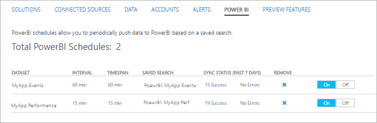
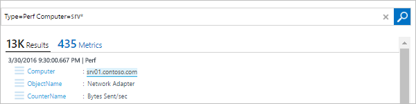
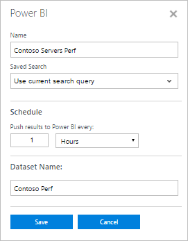
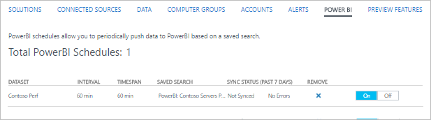
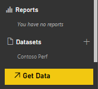
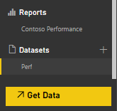

<properties
   pageTitle="Export Log Analytics data to Power BI | Microsoft Azure"
   description="Power BI is a cloud based business analytics service from Microsoft that provides rich visualizations and reports for analysis of different sets of data.  Log Analytics can continuously export data from the OMS repository into Power BI so you can leverage its visualizations and analysis tools.  This article describes how to configure queries in Log Analytics that automatically export to Power BI at regular intervals."
   services="log-analytics"
   documentationCenter=""
   authors="bwren"
   manager="jwhit"
   editor="tysonn" />
<tags
   ms.service="log-analytics"
   ms.devlang="na"
   ms.topic="article"
   ms.tgt_pltfrm="na"
   ms.workload="infrastructure-services"
   ms.date="08/03/2016"
   ms.author="bwren" />

# Export Log Analytics data to Power BI

[Power BI](https://powerbi.microsoft.com/documentation/powerbi-service-get-started/) is a cloud based business analytics service from Microsoft that provides rich visualizations and reports for analysis of different sets of data.  Log Analytics can automatically export data from the OMS repository into Power BI so you can leverage its visualizations and analysis tools.

When you configure Power BI with Log Analytics, you create log queries that export their results to corresponding datasets in Power BI.  The query and export continues to automatically run on a schedule that you define to keep the dataset up to date with the latest data collected by Log Analytics.

## Power BI Schedules

A *Power BI Schedule* includes a log search that exports a set of data from the OMS repository to a corresponding dataset in Power BI and a schedule that defines how often this search is run to keep the dataset current.

The fields in the dataset will match the properties of the records returned by the log search.  If the search returns records of different types then the dataset will include all of the properties from each of the included record types.  

> [AZURE.NOTE] It is a best practice to use a log search query that returns raw data as opposed to performing any consolidation using commands such as [Measure](log-analytics-search-reference.md#measure).  You can perform any aggregation and calculations in Power BI from the raw data.

## Connecting OMS workspace to Power BI

Before you can export from Log Analytics to Power BI, you must connect your OMS workspace to your Power BI account using the following procedure.  

1. In the OMS console click the **Settings** tile.
2. Select **Accounts**.
3. In the **Workspace Information** section click **Connect to Power BI Account**.
4. Enter the credentials for your Power BI account.

## Create a Power BI Schedule

Create a Power BI Schedule for each dataset using the following procedure.

1. In the OMS console click the **Log Search** tile.
2. Type in a new query or select a saved search that returns the data that you want to export to **Power BI**.  
3. Click the **Power BI** button at the top of the page to open the **Power BI** dialog.
4. Provide the information in the following table and click **Save**.

| Property | Description |
|:--|:--|
| Name | Name to identify the schedule when you view the list of Power BI schedules. |
| Saved Search | The log search to run.  You can either select the current query or select an existing saved search from the dropdown box. |
| Schedule | How often to run the saved search and export to the Power BI dataset.  The value must be between 15 minutes and 24 hours. |
| Dataset Name | The name of the dataset in Power BI.  It will be created if it doesn’t exist and updated if it does exist. |

## Viewing and Removing Power BI Schedules

View the list of existing Power BI Schedules with the following procedure.

1. In the OMS console click the **Settings** tile.
2. Select **Power BI**.

In addition to the details of the schedule, the number of times that the schedule has run in the past week and the status of the last sync are displayed.  If the sync encountered errors, you can click the link to run a log search for records with details of the error.

You can remove a schedule by clicking on the **X** in the **Remove column**.  You can disable a schedule by selecting **Off**.  To modify a schedule you must remove it and recreate it with the new settings.

## Sample walkthrough
The following section walks through an example of creating a Power BI Schedule and using its dataset to create a simple report.  In this example, all performance data for a set of computers is exported to Power BI and then a line graph is created to display processor utilization.

### Create log search
We start by creating a log search for the data that we want to send to the dataset.  In this example, we’ll use a query that returns all performance data for computers with a name that starts with *srv*.  

### Create Power BI Search
We click the **Power BI** button to open the Power BI dialog and provide the required information.  We want this search to run once per hour and create a dataset called *Contoso Perf*.  Since we already have the search open that creates the data we want, we keep the default of *Use current search query* for **Saved Search**.

### Verify Power BI Search
To verify that we created the schedule correctly, we view the list of Power BI Searches under the **Settings** tile in the OMS dashboard.  We wait several minutes and refresh this view until it reports that the sync has been run.

### Verify the dataset in Power BI
We log into our account at [powerbi.microsoft.com](http://powerbi.microsoft.com/) and scroll to **Datasets** at the bottom of the left pane.  We can see that the *Contoso Perf* dataset is listed indicating that our export has run successfully.

### Create report based on dataset
We select the **Contoso Perf** dataset and then click on **Results** in the **Fields** pane on the right to view the fields that are part of this dataset.  To create a line graph showing processor utilization for each computer, we perform the following actions.

1. Select the Line chart visualization.
2. Drag **ObjectName** to **Report level filter** and check **Processor**.
3. Drag **CounterName** to **Report level filter** and check **% Processor Time**.
4. Drag **CounterValue** to **Values**.
5. Drag **Computer** to **Legend**.
6. Drag **TimeGenerated** to **Axis**.

We can see that the resulting line graph is displayed with the data from our dataset.

### Save the report
We save the report by clicking on the Save button at the top of the screen and validate that it is now listed in the Reports section in the left pane.

## Next steps

- Learn about [log searches](log-analytics-log-searches.md) to build queries that can be exported to Power BI.
- Learn more about [Power BI](http://powerbi.microsoft.com) to build visualizations based on Log Analytics exports.
